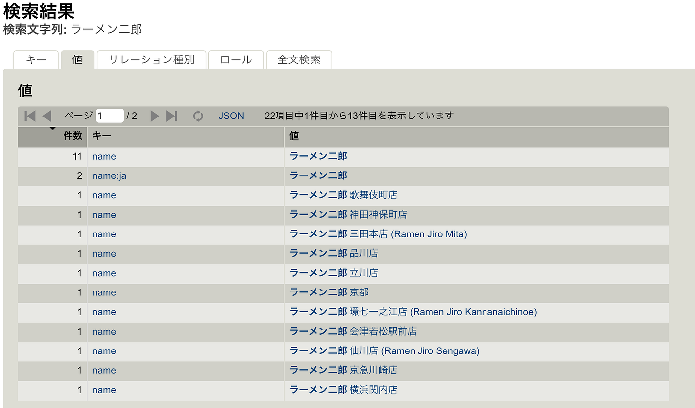
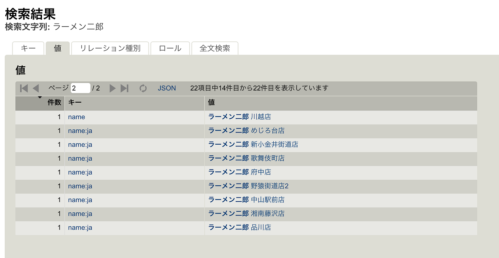
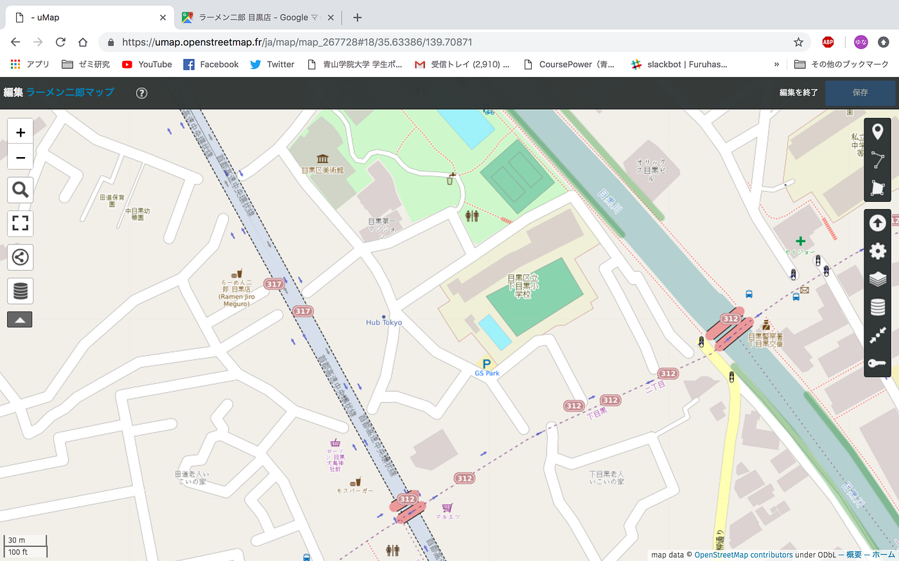
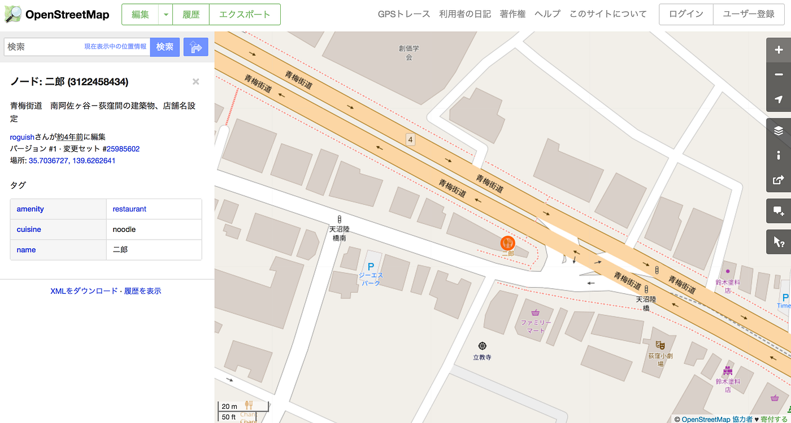
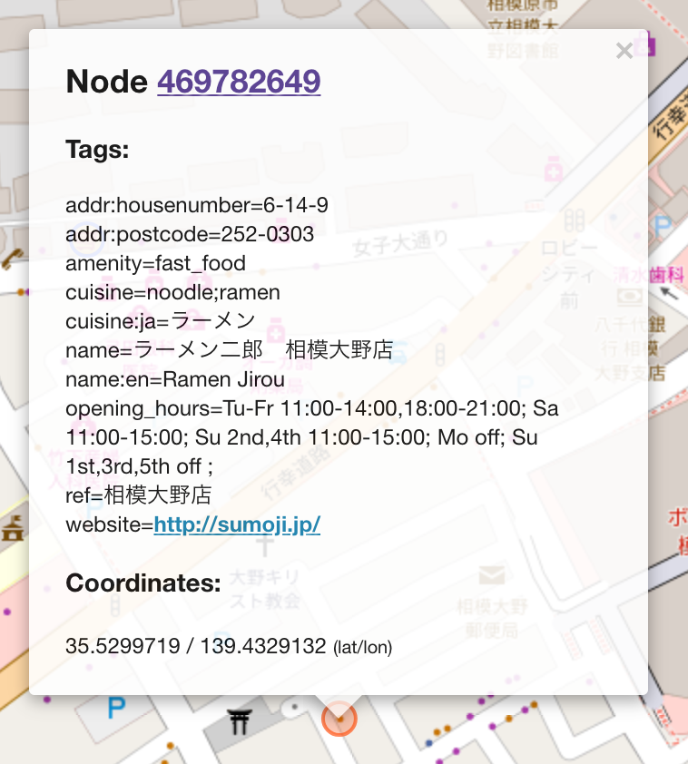
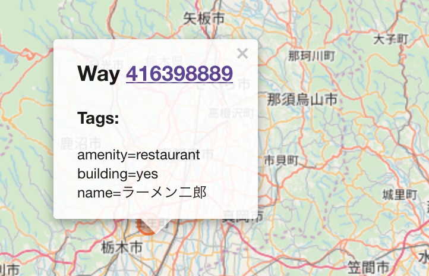
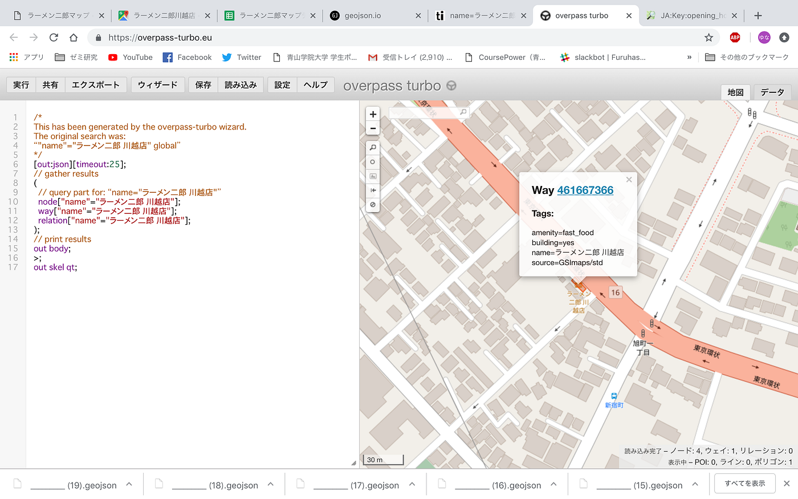
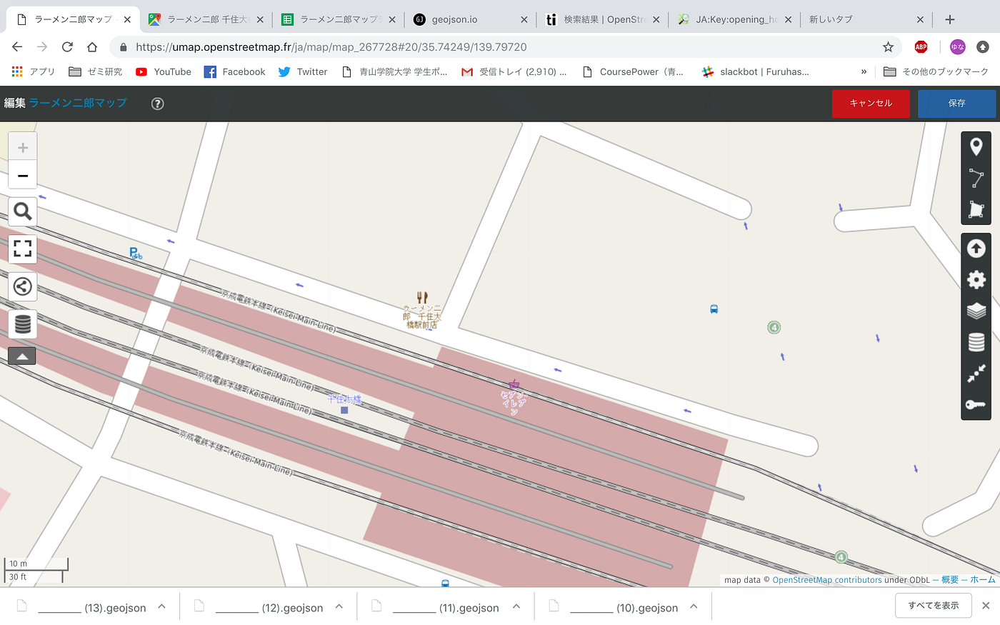

### 卒研：統一されていないOSM上のデータ

OSM上の「ラーメン二郎」のデータを調べている際に、名称、形式の統一のなさを発見した。

まず、OSM上で「ラーメン二郎」で検索をかけてみると出てくるのがこちら。

「ラーメン二郎 ○○店」となっているのが理想だが、ここでもムラがあるのがわかる。

そして、ここには出てこないが、すでにOSM上にデータとして登録されていた二郎が存在した。

「ラーメン二郎目黒店」は、ラーメンがひらがなで表記されていたため、検索してもひっかからなかった。

荻窪店は「二郎」とだけ書かれていた。

相模大野店は、refとして登録されていた。

川越店、栃木街道店はway として登録されていた。

千住大橋駅前店はなぜひっかからなかったのか不明。

これらのデータを統一する必要がある。
