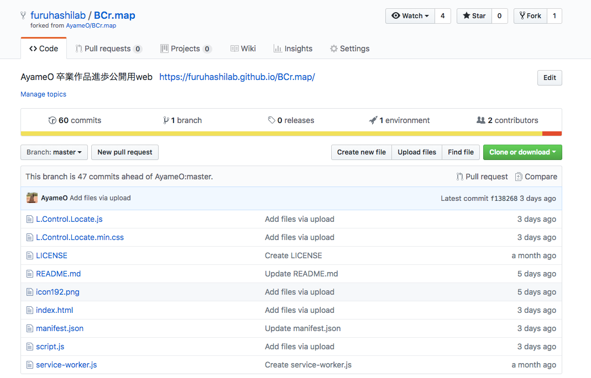
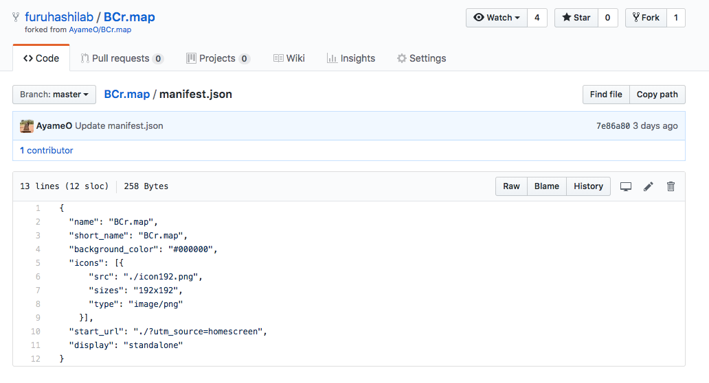
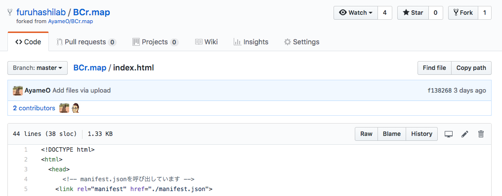
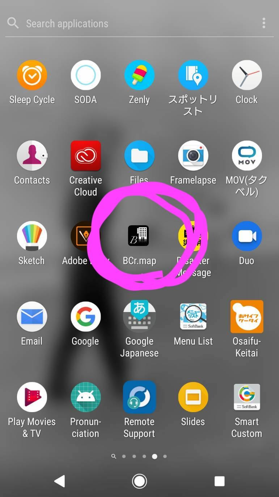
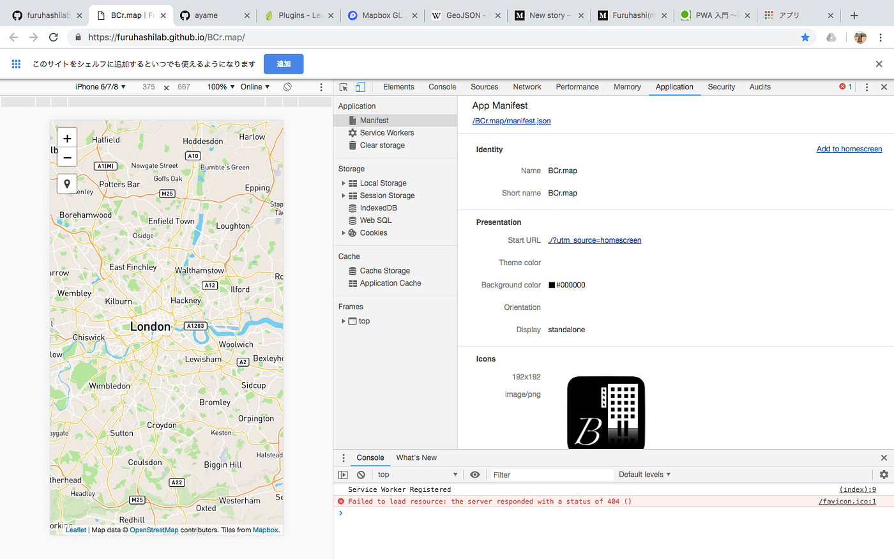
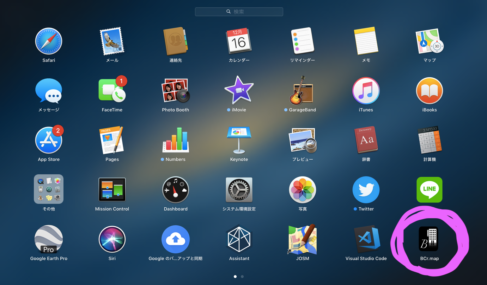

### PWAでアプリのアイコン表示

卒業研究のために開発中のPWAにおいて、アプリとしてのアイコン表示の実装と実証実験のお話。PWAのアイコン表示はiPhoneの iOSではまだ対応していないため、今回はAndroidOSのスマートフォンと、Macbook Airにおいてアイコン表示を確認した。

まずはPWAにおけるアイコン表示のためのコードから紹介しよう。

- アイコンに設定したい画像をPNGファイルで、index.html、manifest.json、service-worker.jsと同じ階層に設定する。

- 続いてmanifest.jsonフィアルの中で、”icons”を指定する。ここでの注意点は、アイコンとして表示するための画像のファイルサイズを「192×192」にすることだ。このサイズはGoogleがPWAをサービスとしてリリースするために決めたサイズなので合わせないといけない。

- 最後にindex.htmlでmanifest.jsonを呼び出す。

AndroidOSのスマートフォンにおいては、ブラウザがAndroid Chrome 42以上であることが条件だ。アプリとしてのアイコン表示させるのは非常に簡単で、ChromeでPWAのURLを開き、そのサイトを「ホーム画面に表示」という設定をするだけ。

このようにアイコンが表示できた。自分のスマートフォンはiPhone8のため、なかなかスマートフォンで実装を確認できなかったが、今回ようやく友人に協力してもらい確認することができた。

Macbookにおいてはまず、Chrome上でサイトを開き、ディベロッパーツールを起動する。そして「Application」の「Manifest」欄で、「Add to homescreen」を選択する。そうすると「このサイトをシェルフに追加するといつでも使えるようになります」と出てくるので、「追加」を押せばOK

以上、今回はPWAのアプリとしてのアイコンを実際に表示させてみた話。
次回をお楽しみに〜。そろそろ地物データの編集機能の実装に入るのでアドバイスお待ちしております！！よろしくお願いします！！！
