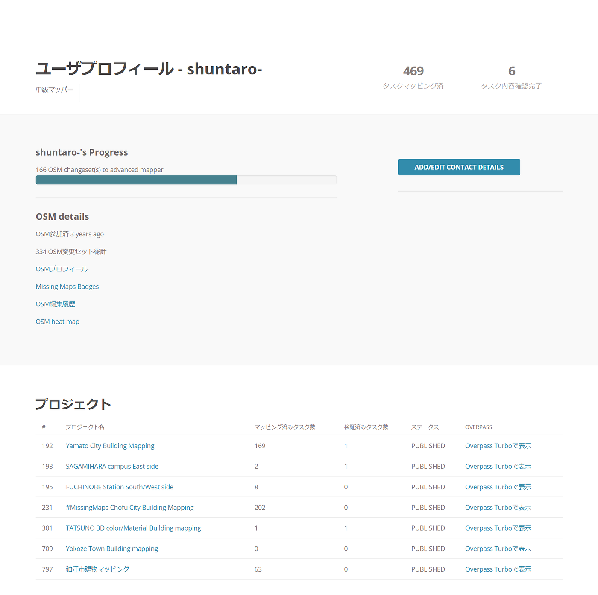
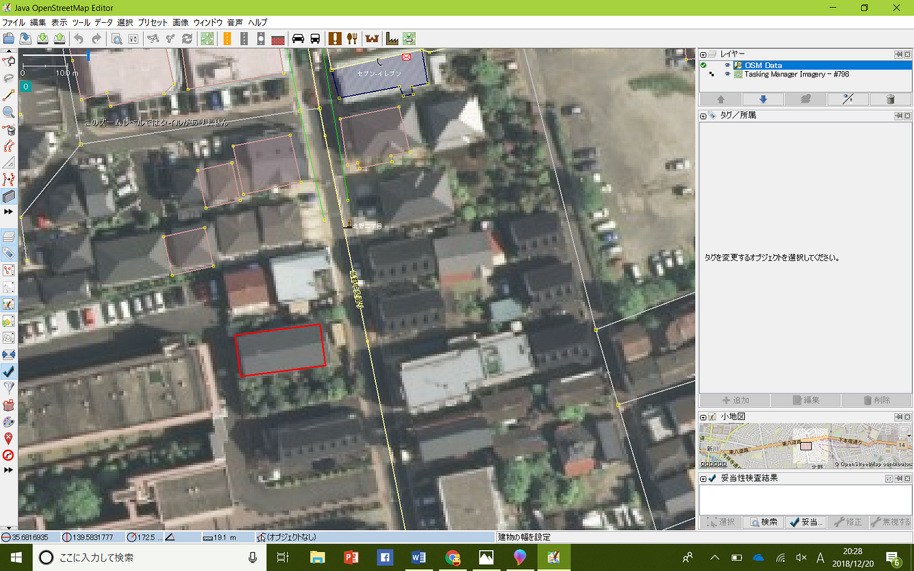
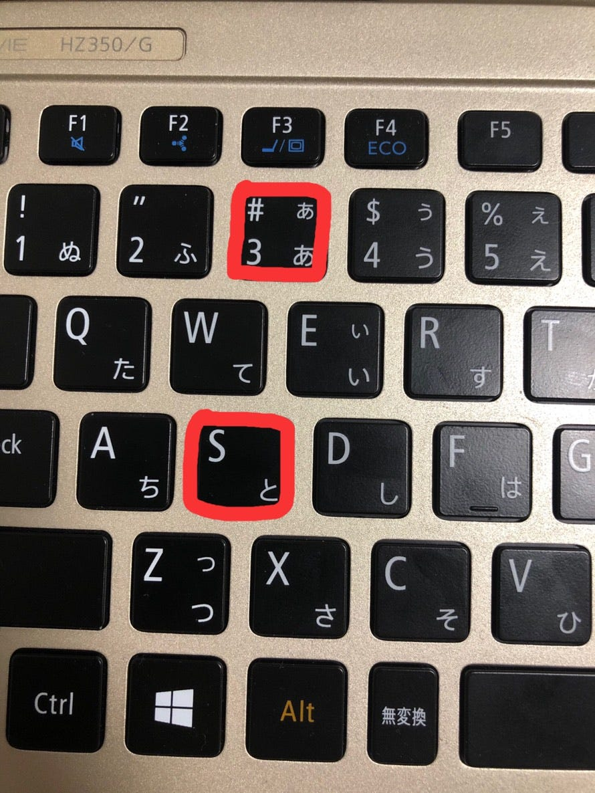
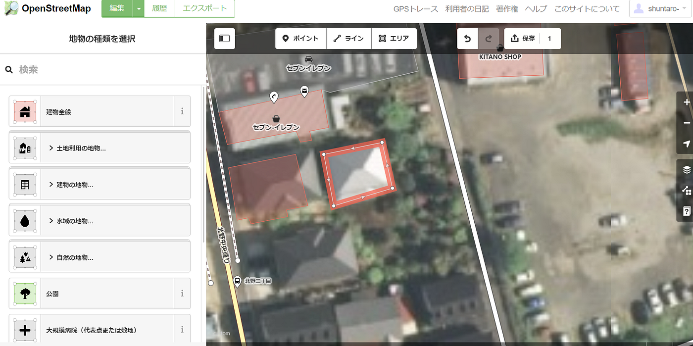

### 434タスクの建物マッピングを終えて

イオンモール奈良登美ヶ丘店でのリモートワークの追加課題として、横瀬町、狛江市、大和市、調布市、世田谷区のマッピングが課されました。しかし、結果から言うと世田谷区のタスクを終わらせることが出来ませんでした。

風邪をひいてしまった自分の体調の管理不足と計画性のなさが原因で同じく課題を行った渡辺君には迷惑を掛けました。

成果はこちらになります。[プロフィール](https://tasks.teachosm.org/user/shuntaro-?task=223)

### マッピングの際に使用したツール

JOSMとid editorを使いました。

JOSMはbuidingspluginを導入することにより本来id editorでは1つのマッピングをするのに5クリック必要とされるのが、このプラグインを使う事により2クリックでマッピングすることができるため単調な四角形の家や建物をマッピングする際は効率的に行うことが出来る。

しかし、様々なツールが並んでおり、全体的にゴチャゴチャとしているためなれるまでに時間がかかりそうな印象であった。もっと使い方を熟知して様々なプラグインを駆使出来ていればもっと効率的に出来たかもしれない。

大和市、調布市のマッピングにはid editorを使用した。id editorで371タスクほどをマッピングしたので以前とは比べ物にならないほどid editorにおいては効率的にマッピングできるようになったと自負している。

その方法は**ショートカットを使いこなす **です。使いこなすといっても使うキーは2つしかないですが…汗

#### このショートカットを使って、３（エリア選択）⇒建物の四隅を選択⇒建物タグを選択⇒S（エリアを直角に成型）⇒３（エリア選択）…….

とショートカットを使うことで、通常であればマウスのみで行う作業がキーボードのショートカットを使うことでid editorであってもより効率的に作業を進めることが出来るようになります。

### 結論

今回は使いやすさを優先してid editorをしようしてマッピングを行ったが、JOSMの使い方をもっと理解しようとしていれば世田谷区も終わらせることが出来たかもしれない。

分からないことでも挑戦する心がより大事であると感じた追加課題であった。

### 自己分析

**【今回世田谷区のマッピングがなぜ終わらなかったのか】**

・完了できなかった要因の一つは、時間の使い方が計画的じゃなかったこと。3週間もの長い時間があったにも関わらず取り組み始めたのは約一週間前で、後半に追い込みをかけるように徹夜でマッピングをしました。3週間をもっと有用に使いマッピングを効率的に行うべきでした。

・エディタを使いこなすことが出来なかったことも要因の一つです。JOSMという便利なツールがありながらも、難しいと決めつけてしまい、また一度のトラブルから解決法が分からずに、ろくに調べもせず諦めてしまったことが自分の至らない点でした。

・体調の管理不足も要因であると考えていますが序盤に記したためここでは省かせていただきます。
