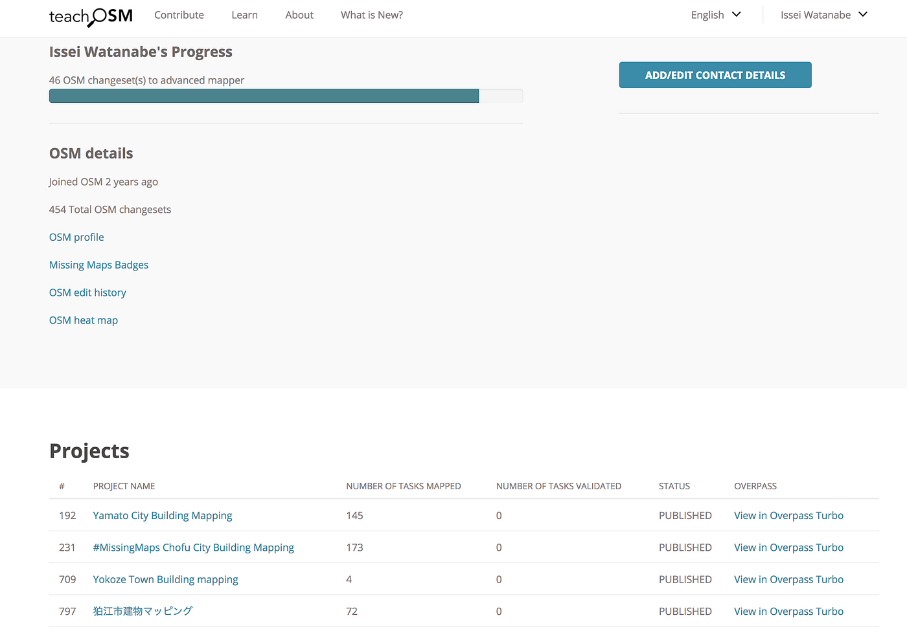
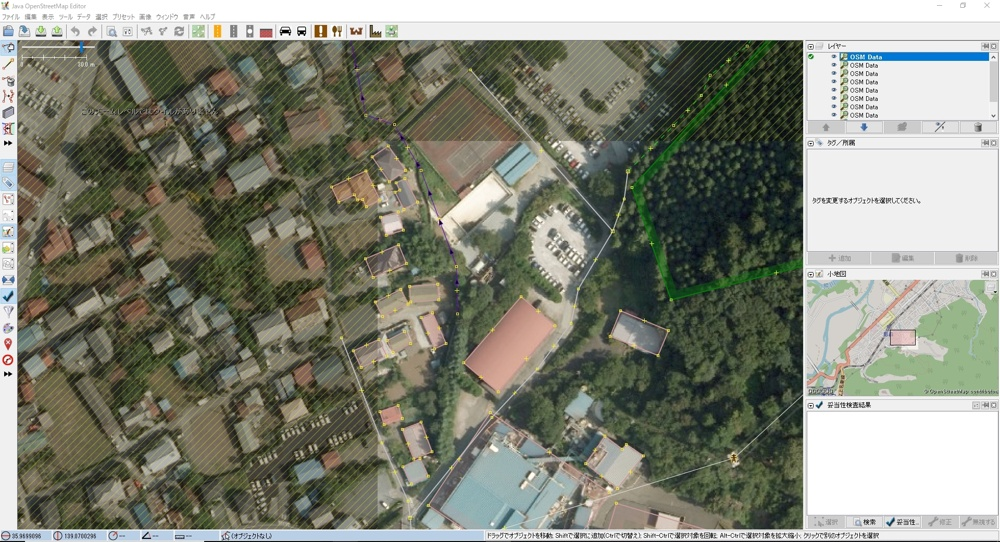
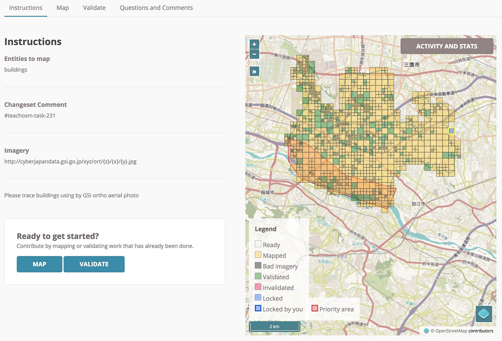

### JOSM・iDeditorでマッピングして感じたこと

[先週のイベント](https://medium.com/furuhashilab/%E8%87%AA%E8%A6%9A%E3%82%92%E6%8C%81%E3%81%A3%E3%81%A6%E3%82%A4%E3%83%99%E3%83%B3%E3%83%88%E3%81%AB%E5%8F%96%E3%82%8A%E7%B5%84%E3%82%80%E3%81%A8%E3%81%84%E3%81%86%E3%81%93%E3%81%A8-%E3%82%A4%E3%82%AA%E3%83%B3%E3%83%A2%E3%83%BC%E3%83%AB%E5%AD%A6%E7%A0%94%E5%A5%88%E8%89%AF%E7%99%BB%E7%BE%8E%E3%83%B6%E4%B8%98-11-4-2a1009df650d)の追加課題として、横瀬、狛江市、大和市、調布市の四つの建物をJOSM・iDeditorを使ってマッピングしたのでその感想を記します。

**まずは成果から。**

**四つの市の合計で400タスク近い量をこなした。**全体的に建物が多く大変であった。またタスクが細かく分けられすぎていた部分が多く、タスクを無闇に分けることはかえって非効率だと感じた。_**[プロフィールはこちら_**](https://www.openstreetmap.org/user/Issei%20Watanabe)

### JOSMを利用した際の感想

> **JOSM**（正式名称：**[Java](https://ja.wikipedia.org/wiki/Java) OpenStreetMap Editor**）は[OpenStreetMap](https://ja.wikipedia.org/wiki/OpenStreetMap)のデータ編集用[エディタ](https://ja.wikipedia.org/wiki/%E3%82%A8%E3%83%87%E3%82%A3%E3%82%BF)である。

OSMで作業する際に、より効率的に行うことができるエディタである。
このエディタにbuildingsPluginを導入することで、素早く建物をマッピングすることが可能。

作業の途中で問題が生じ、結局はJOSMからブラウザ上のiDeditorに切り替えたのだが、使った感想を述べていく。

UIデザインは多少古くさいが、UXは優れており、比較的使いやすかった。
一つの建物をマッピングするのに、**iDeditorだと4クリック**する必要があるが、**JOSMだと2クリック**で済むため、作業はこちらの方が早い。
しかし、建物の形を調整しづらいといったデメリットもあった。

作業の途中で建物の背景とマッピングの差異があるとマッパーから指摘されたので、JOSMからiDeditorの作業に切り替えて再開。

idEditorは形を柔軟に形成しやすい点で、安定して使いやすいと感じた。

調布市が個人的に一番キツかった。タスクが細かすぎるのと、東京のベッドタウンであるため、住宅の建物が非常に多かった。

あともう一歩で**advanced mapper**になれるので、来年度までにはなりたいところ。

### 結論として

全体の作業を通して、現時点ではiDeditorの方が様々な建物に素早く対応しやすいと感じた。
五角形以上の建物はiDeditorの方が簡単で操作しやすいため。しかし、使い方をマスターすればJOSMの方が素早く応用できることが分かった。追記を参照。

追記： windows版で、上級者モードの投げ縄選択モードでshift+Jで統合することが可能。また、BuildingToolはBでショトカ。上級者モードでショトカを駆使すればiDeditorより優秀なツールとなることが分かった。

今回は期限までに世田谷区のタスクを完了することができませんでしたが、振り返ってみて、マッピングにかかる時間を考えて三週間前から計画すれば、間に合ったなと思いました。次回から計画性を持って行動します。
