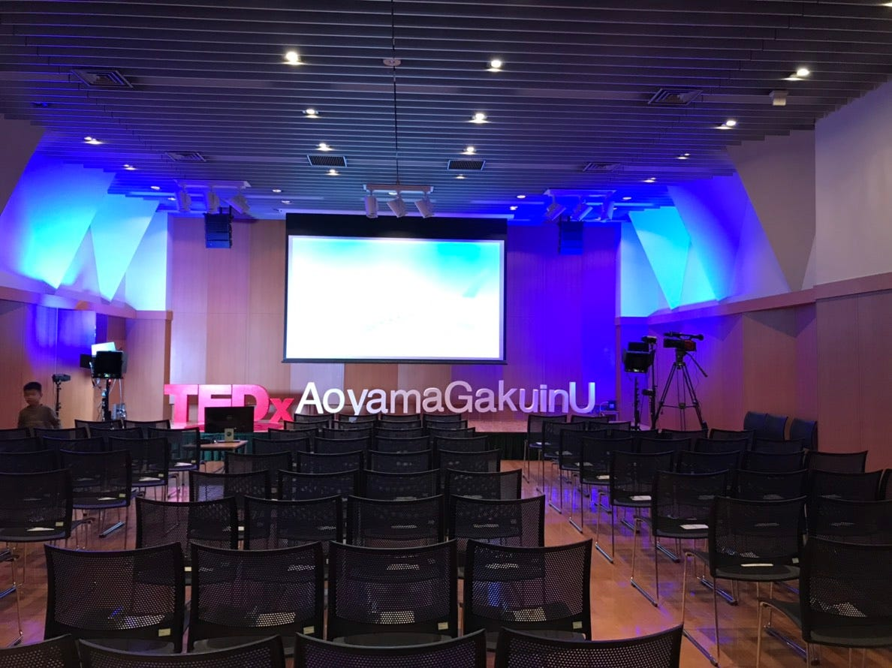
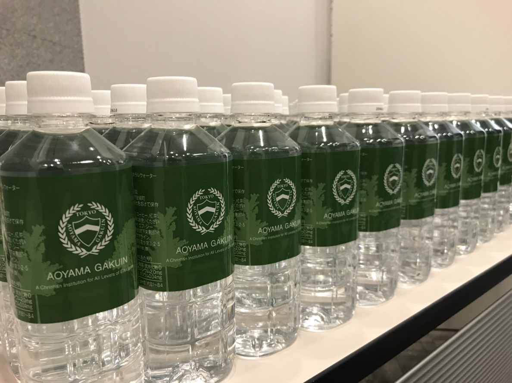
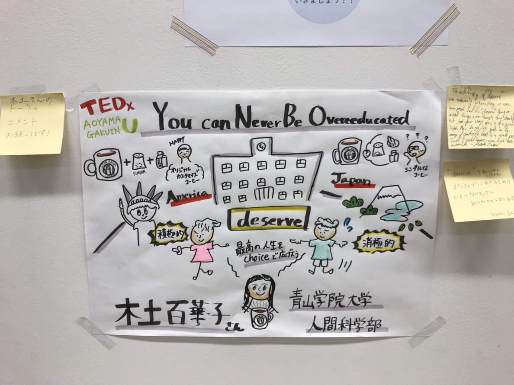
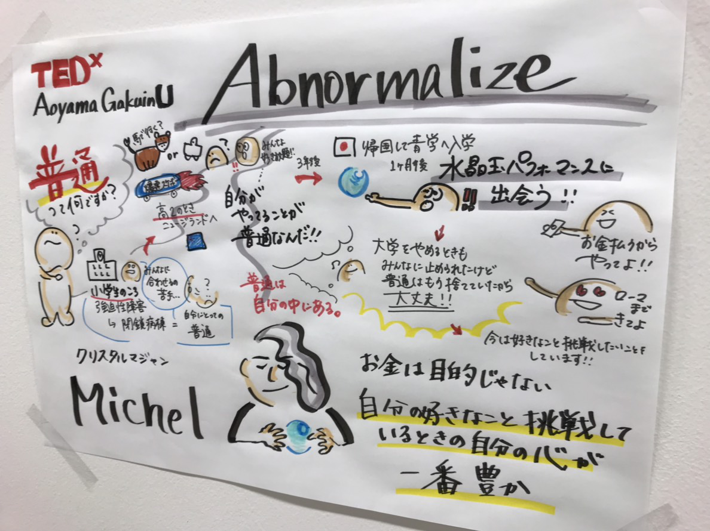
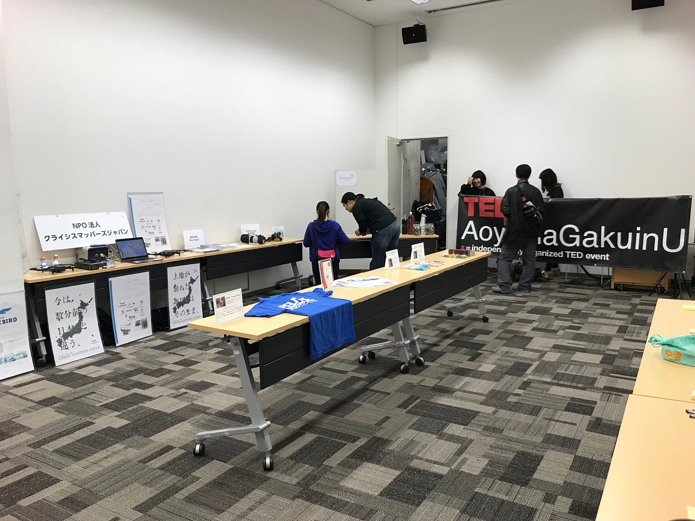

### Dear Diary… TEDxAoyamagakuinU

こんにちは青山学院大学3年古橋研究室の福田紗彩です。

12月16日日曜日に、表参道にある青学の施設Astudioで行われた、TEDxAoyamagakuinUのイベントに参加してきました。今回のイベントは、青学の団体青山学院TEDｘAoyamagakuinUの企画するイベントであり私は、古橋研究室からの当日スタッフとして参加させていただきました。このイベントでは、５人のゲストの方が、自分の分野におけることや、自分の過去から学んだことをスピーチしてくださるというものでした。

私は主に会場のドアを、スケジュール通りに開けたりするドアマンの仕事を任されました。また、会場の開演前の準備などもしました。

ドアマンとことで、仕事の間にスピーチを実際に聞くことができたのですが３人のスピーチを聞き、勉強になることや、こんごに活かせることがたくさん見つかりました。一つは青学の学生である木戸さんのスピーチによるもので、人はだれでも”Deserve”される価値があるということで、実際私も海外へ留学に行ったときに感じた疎外感なども、本当は悲観的にとらえるのではなく、自分に自信を持つことが大切だと学びました。また、マジシャンであるMichealさんのスピーチは、リハーサルから見ることができたのですが、クリスタルを使った実際のパフォーマンスで、リハーサル本番ともに完璧に行っており、本番の緊張感に負けない自信のある姿が見て取れました。

今回のイベントは、古橋ゼミの4年生である加藤さんが総合的に統括していて、同じ学年である末光さんも大きな役割を務めていて、イベントもすべて順調に進んでいたことから、たくさん学ばされて、自分ももっと行動に移さなければならないと感じました。

また、今回のスピーチをグラレコしていて、そこからも自分の今後に活かせるようなアイデアがたくさん学べました。

私はこのイベントに参加するまで、TEDｘAoyamagakuinUという団体を知らなかったのですが、今回のイベントを通して、学生自身でこういったおおきなベントを主催、運営しているところに興味を持ったため、今後こういったイベントにより参加していきたいと感じました。

今回Stravaは、施設内が地下で電波が悪かったため、会場到着後切れてしまったので、渋谷駅から、会場到着後までの記録になってしまいました。そこを改善できるように電波の環境を工夫することが今後の課題です。

4 マイル のウォーキングに出かけました。

[Strava Runner Profile
Saaya Fukuda is a runner using Strava. Join Strava to track your activities, analyze your performance, and follow…www.strava.com](https://www.strava.com/athletes/33429911)

#strava
