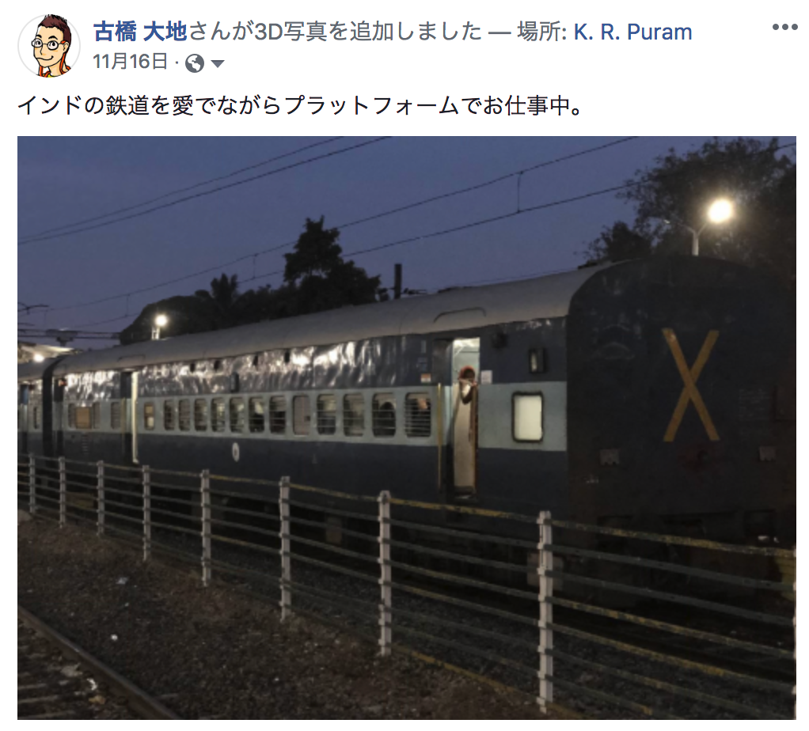
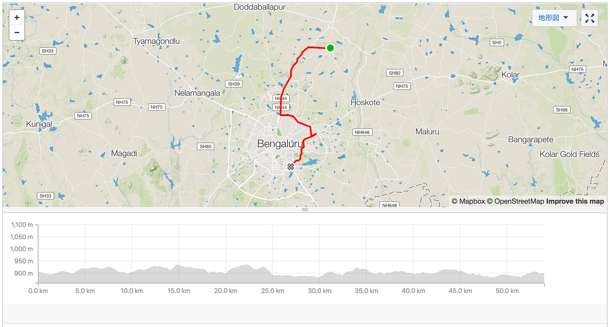
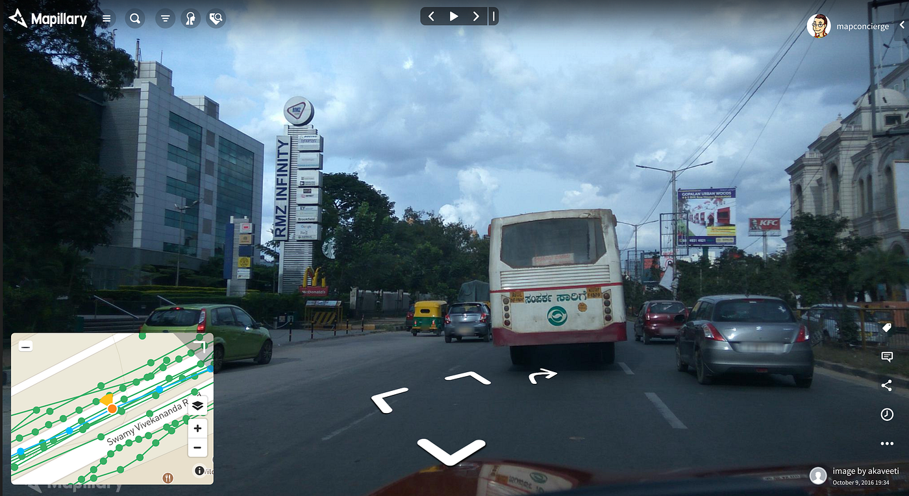
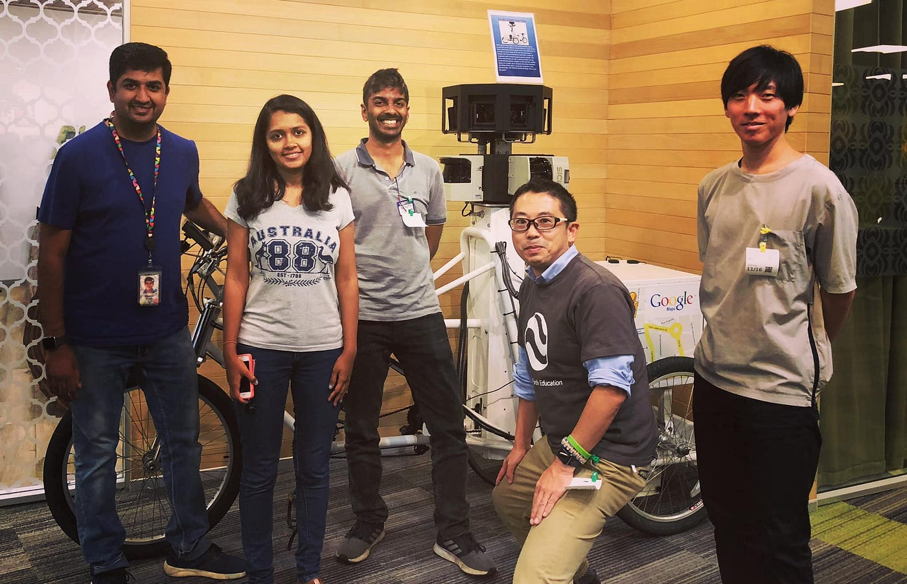
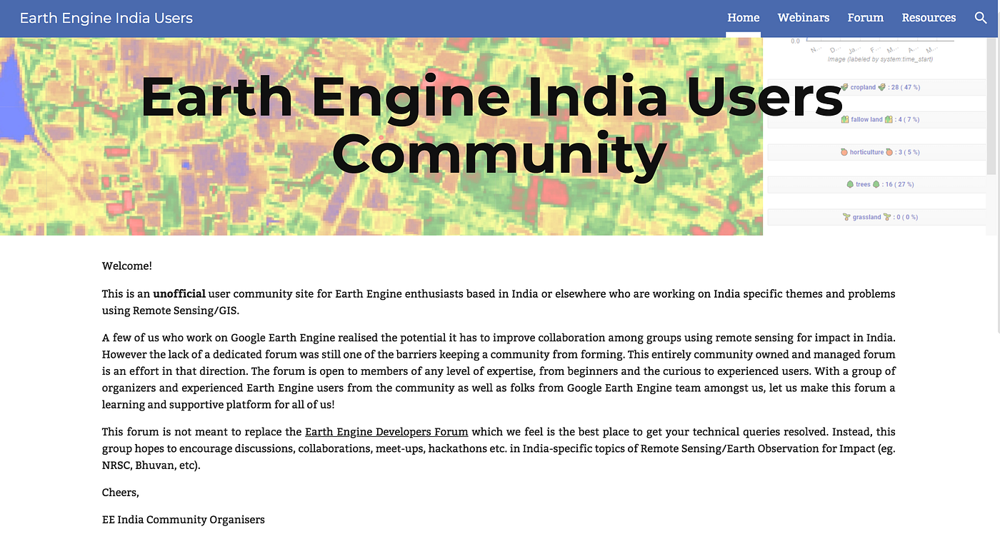

### Google Earth Engine India x Japan 交流

2018年11月、人生はじめて訪れたインドの都市はバンガロールだった。

そして入国した初日に訪問したのがこの都市にある [Google インドオフィス](https://goo.gl/maps/i1k2w682iqq)。バンガロール中心部の東側に位置するKrishnarajapuram駅近く。夜明け前には駅に到着したため、プラットフォームのベンチでインドの鉄道を鑑賞しながら仕事を片付けると同時に、準備してきた [Google Earth Engine 日本語翻訳リポジトリ](https://github.com/googleearthengine/gee-manuals4jp)公開も一気に行う。

[googleearthengine/gee-manuals4jp
Google Earth Engine 翻訳リポジトリ. Contribute to googleearthengine/gee-manuals4jp development by creating an account on…github.com](https://github.com/googleearthengine/gee-manuals4jp)

この Google Earth Engine 翻訳リポジトリは教育現場で Google Earth Engine を活用してる有志が集まり、ボランティア活動として Google Earth Engine のドキュメント等を日本語訳し、再配布しているオープンなリポジトリである。[2018年の9月には実際に Google Japan オフィスにて翻訳ソンも実施](https://medium.com/furuhashilab/google-earth-%E3%82%B5%E3%83%9E%E3%83%BC%E3%82%B9%E3%82%AF%E3%83%BC%E3%83%AB-google%E3%82%AA%E3%83%95%E3%82%A3%E3%82%B9-9f087e7136da)した。

[Follow Taichi on Strava to see this activity. Join for free.
Join Taichi and get inspired for your next workoutwww.strava.com](https://www.strava.com/activities/1970503721)

さて、そんな仕事を終わらせながら、Krishnarajapuram駅からトゥクトゥクに揺られてたどり着いたGoogleオフィスは、歴史的建造物のような古い建物の[Gopalan Signature Mallショッピングモール](https://goo.gl/maps/GFnveiodo8u)向かいに対象的に立ち並ぶモダンな建物「RMZ Infinity」の中にあった。

[India, image by akaveeti
Map data at scale from street-level imagerywww.mapillary.com](https://www.mapillary.com/app/?lat=12.99314264&lng=77.66097101&z=17.943893730898267&pKey=_QYSRV9OMNr2xBJmsTIlAA&x=0.49464151897688224&y=0.4806629941175788&zoom=0&focus=photo)

出迎えてくれたのが、冒頭の写真に登場する３氏。左からSatellite Imagery収集・整理などを担当している Googler の **Ujaval Gandhi**氏 と Google Earth Engine Team の **Devaja Shah**氏、そして Google Earth Engine インドコミュニティの **Craig Dsouza**氏だ。また、この会合には古橋研究室３年の牧(右端)も同席した。

まず、日本の Google Earth Engine コミュニティについて、現状を報告。主に教育の分野で Google Earth Engine がじわじわと浸透してきていることを説明。大学教育の分野では、**[青山学院大学古橋研究室**](https://medium.com/furuhashilab)や**[奈良大学藤本研究室**](https://cis-jp.blogspot.com/p/blog-page_29.html)、そして東京大学、慶應義塾大学、東京海洋大学、事業構想大学院大学と青山学院大学の合同プロジェクトである**[GESTISS/G-SPASE**](http://gestiss.org/)、**[宇宙開発フォーラム実行委員会(SDF)](https://www.sdfec.org/)、JICA有志**といったメンバーで、[Google Earth Engine の勉強会](http://gestiss.org/news/detail?id=111)や[翻訳ソン](https://medium.com/google-earth-engine/google-earth-engine-%E7%BF%BB%E8%A8%B3%E3%82%BD%E3%83%B3-google%E3%82%AA%E3%83%95%E3%82%A3%E3%82%B9-e23380556712)、そしてその情報共有の場として [Medium の活用](https://medium.com/google-earth-engine)の他、[GitHub Organization を用いた各種コンテンツの共有](https://github.com/googleearthengine)、また特に[翻訳ソンで日本語化しているGoogle Earth Engineのマニュアルレポジトリ](https://github.com/googleearthengine/gee-manuals4jp)についても紹介した。

補足すると、日本には他に Google Earth を教育で活用する高校の先生方を中心としたコミュニティ [”SGE Japan” — Sensei with Google Earth Japan](https://www.facebook.com/sgejapan/)も存在し、相互に連携している。

[Google Earth Engine
Google Earth Engine User community blog (Un-official)medium.com](https://medium.com/google-earth-engine)

一方で、Google Earth India コミュニティはアプローチがちょっと違う。

コミュニティ代表のCraig Dsouza氏はデラウェア大学で環境政策の修士号を取得し、現在は[SOPPECOM(Society for Promoting Participative Ecosystem Management)](https://www.soppecom.org/aboutus.htm)で農村エリアの水資源問題に関する研究を行っている実務研究が主軸になっている。例えば、彼の研究には、農業用水の利用、作付パターン、水文データに関連した大量のデータ分析と実地調査が必要で、Google Earth Engine はそのリモートセンシング手法をサポートする強力なツールという位置づけで、幅広く地理空間情報を整理し共有する [DataMeet Pune](https://datameet-pune.github.io/) などの[オープンデータプロジェクト](https://github.com/datameet-pune)も同時に進めている。もちろん、OpenStreetMap もまた彼らにとって重要な基礎地図データとなっている。（Craig Dsouza氏は [SotM Asia](https://stateofthemap.asia/) のLTでも登壇した。）

[Open Projects for DataMeet Pune chapter
Common repo and documentation space for DataMeet Pune chapterdatameet-pune.github.io](https://datameet-pune.github.io/)

[DataMeet, Pune Chapter
Pune chapter of the DataMeet group. DataMeet, Pune Chapter has 13 repositories available. Follow their code on GitHub.github.com](https://github.com/datameet-pune)

このような実務研究を軸としたアカデミックな活動の中で、Google Earth Engine India コミュニティは[ウェブサイト](https://www.earthenginecommunity.in)を中心に Webinar やメーリングリストなどの情報共有が行われている。また、デフォルトのライセンスが 我々日本のコミュニティと同様 CC BY 4.0 を採用していることから、コンテンツ共有の互換性が確保されているのは嬉しい。目指すべき方向が同じということだ。

[Earth Engine India Users
A few of us who work on Google Earth Engine realized the potential it has to improve collaboration among groups using…www.earthenginecommunity.in](https://www.earthenginecommunity.in/)

インドコミュニティの規模だが、彼らのメーリングリストは2018年12月現在約70名ほどの [Google Earth Engine India Users Community ｜ Google Groups](https://groups.google.com/forum/#!members/ee-india-community) が登録。日本はメーリングリストでの運用を行っていないが、勉強会や翻訳ソンなどの参加者数を考えると50名前後と人数規模は似ているのかもしれない。

[Google Groups
Google Groups allows you to create and participate in online forums and email-based groups with a rich experience for…groups.google.com](https://groups.google.com/forum/#!members/ee-india-community)

いずれにしても、2018年、日本とインドで時を同じくして Google Earth Engine コミュニティが誕生し、その情報交換も始まった。

アカデミックなアプローチや、オープンなライセンスへの姿勢も非常によく似ている。引き続き相互に連携しながら、我々日本コミュニティに足りないものは何かを今回考えてみたが、India コミュニティには存在する Folum の要素が我々には足りないことに気づいた。

善は急げと早速 公開 Facebook Group として [Google Earth Engine Japan Community](https://www.facebook.com/groups/earthenginejapan/?ref=group_header) を立ち上げてみた。上手く機能するかどうかはこれからだが、一歩一歩その活動を継続できるようすすめていく。

[Log into Facebook | Facebook
Log into Facebook to start sharing and connecting with your friends, family, and people you know.www.facebook.com](https://www.facebook.com/groups/earthenginejapan/)

最後に、Google India オフィスでのランチはやはりカレーということで、おいしくいただきました。

### फिर मिलेंगे। See you next time !!

