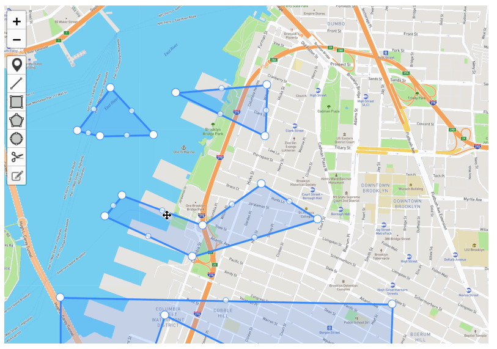
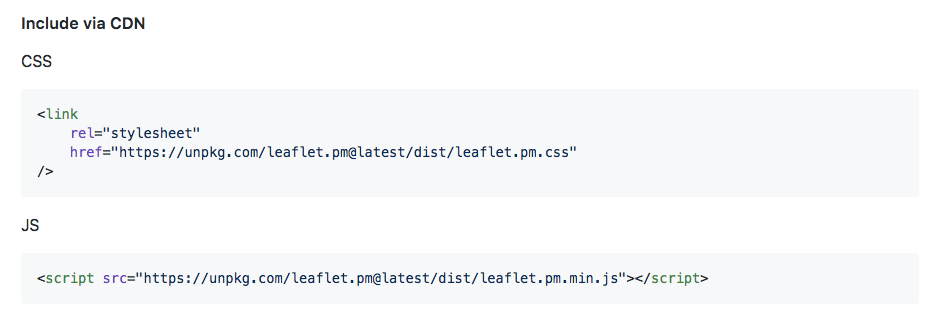
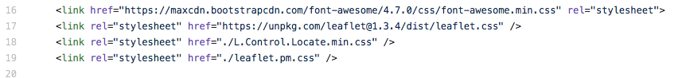
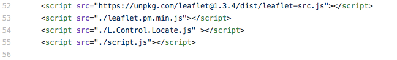
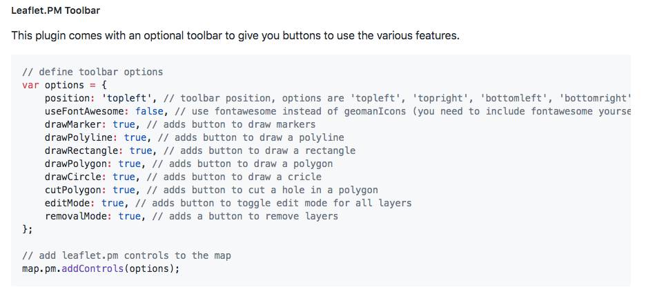
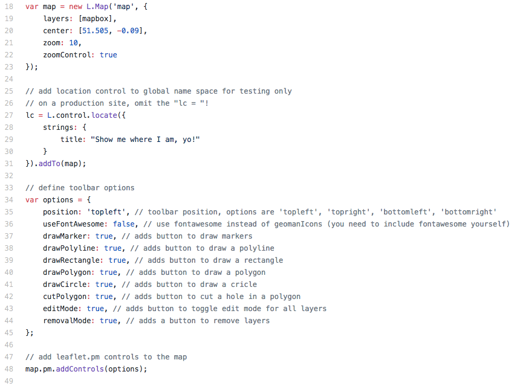
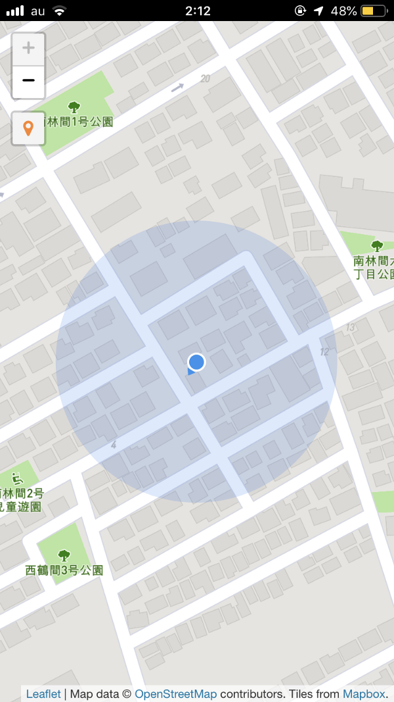
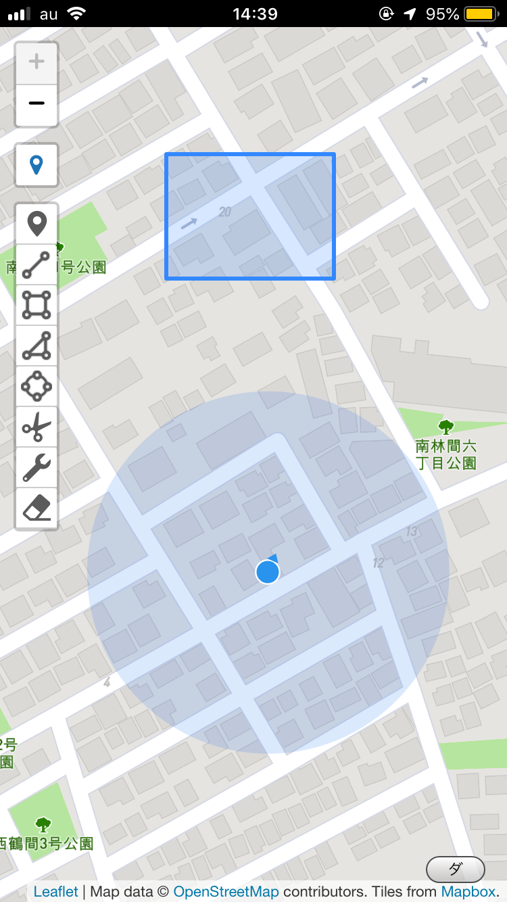

### 地物追加機能実装

今回のブログは卒業制作のPWA(OSM編集ツールの予定)で、LeafletのPlugins機能の中で**[Leaflet.PM**](https://github.com/codeofsumit/leaflet.pm)(地物追加機能)を実装したお話。

PWA？なにそれ？？という方は、以前私が書いた ”[OpenStreetMap×PWA](https://medium.com/furuhashilab/openstreetmap-pwa-cbed8bbe2218)” を参照してもらいたい。

また、Leaflet？なにそれ？？という問いには簡単に**Leaflet** は広く使われているWeb地図のためのJavaScriptライブラリである。と答えておく。

### Leaflet.PMというプラグインを追加したよ

**[Leaflet.PM**](https://github.com/codeofsumit/leaflet.pm)は地図上に点、線、長方形、多角形、GeoJSONなどを、追加、編集、カットなど様々な編集機能がある。しかしここで注意したいのは、あくまで自分で描いた形をカットなどの編集ができるということであり、背景地図の元データを編集できるわけではない。

私はこのたくさんある機能の中で、「Building」属性の地物データの追加に特化する編集ツールを作るために、長方形のみの追加機能と、拡大・縮尺、タテヨコ比の変更、追加したデータのカット、移動のみを採用する予定だ。

機能の削除はコードを消すのではなく、いつでもまたすぐに追加できるようにコメント化を私はすることにする。

#### それではいってみよう！実装方法について！！

まずは上記のサイトから「leaflet.pm」のCSSファイルとJSファイルを自分の「index.html」に参照ファイルとして記述する。実際に「leaflet.pm」のCSSファイルとJSファイルをダウンロードしなくても、上の画像のように絶対パスでリンク付けしても良いのだが、私はローカルに保存して「index.html」と同じ階層にファイルを入れ、相対パスでぶちこんだ。

> ここではこのJSファイル(Javascriptファイル)をいれる順番が非常に重要である。

この順番を私は一度間違えて描いてしまったために、実装できなくてつまずき、デルシオさんに助けを求めた。

最後に「script.js」をいれること！全てのスクリプトが反映されてからでないと、もちろん今回入れたプラグインは機能しない！あたりまえのことに私はつまずいていたのだ。。

続きまして、このツールバーに関する記述を、「script.js」に追加する。

私はこのように new L.map の下に普通に追加した。しかと実装もできた。

次回はこの地物追加機能を使って描いた形をGeoJSONファイルでダウンロード機能を実装させるお話。

それではまた来週〜。
