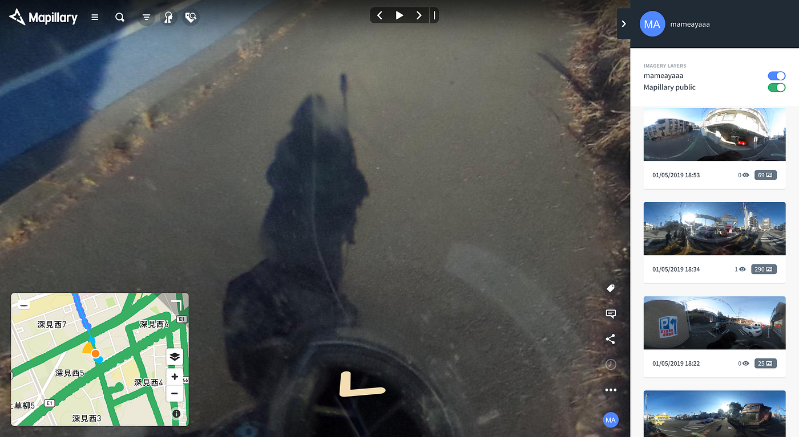

### ストリートビュー撮影ールート作成編ー

続いて、撮影において重要な役割を担うルート作成について書いていきたいと思います。

まず前提として今回は大和市市内にある全防火水槽とスタンドパイプを網羅するルートを撮影するということです。

大和市内にある防火水槽は３１６、スタンドパイプは７７個です。

これらの位置情報は、大和消防局の藤田さんとミーティングをさせていただいた際、

大和市の防災情報として掲載されていた情報を使用しました。

大和市の防災情報については次の記事で書いていきます。

いただいた防火水槽とスタンドパイプの位置情報をGoogle earth proを使って地図に落とし込み、それぞれ違うアイコンを配置します。Google earth pro上ではマーカで線を引くことが可能なのでここでアイコンを網羅するように線引きをすることも可能なのですが、最短ルートや自転車で通れる道なのかといった不明点が多く、非効率的だと判断してここでは行いませんでした。このデータをKML化し、PCのウェブプラウザ上でgoogle mapを開き、マイマップのところにKMLデータをアップロードすると、google map上にKMLデータのアイコンが表示されます。

ここで防火水槽とスタンドパイプの判別をつけるため１つ１つに番号を振り分けました。こr４えが後に名前へと変化する前の仮名です。

Google mapはiPhoneで開くことができるので、PC上のマイマップデータを共有し、iPhoneでも開くことができます。

PCのマイマップ上で機能としてあるレイヤ機能やライン描画などはなぜか使用できず（KMLデータを使用しているからでしょうか？）わかる方教えてください。

とりあえず自分の現在地と防火水槽スタンドパイプの位置はiPhoneで把握できるので、通過点機能を使って何個かにルートを分けて走行しました。

次回は撮影データのアップロード方法について書いていきます。
