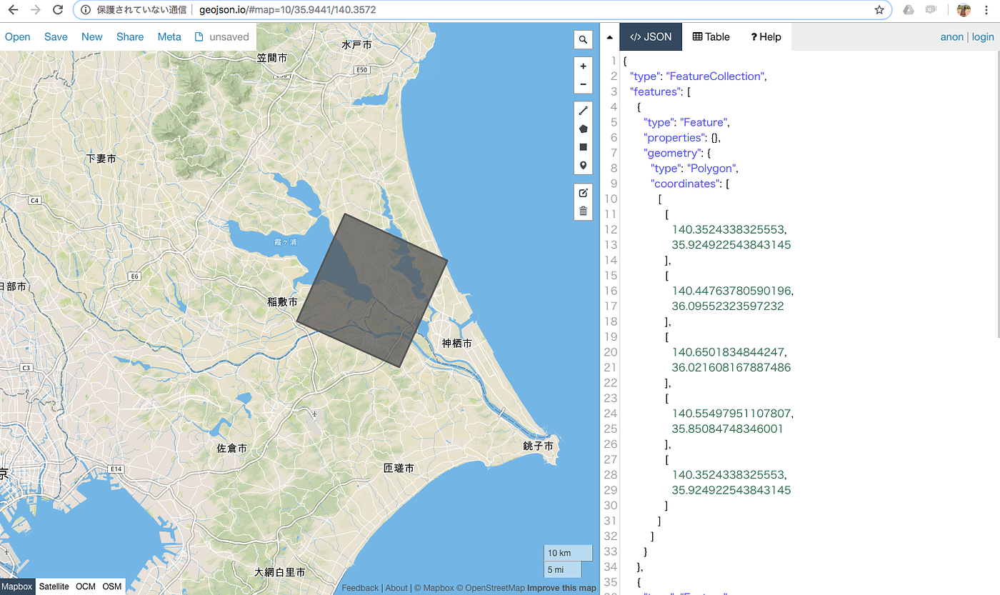
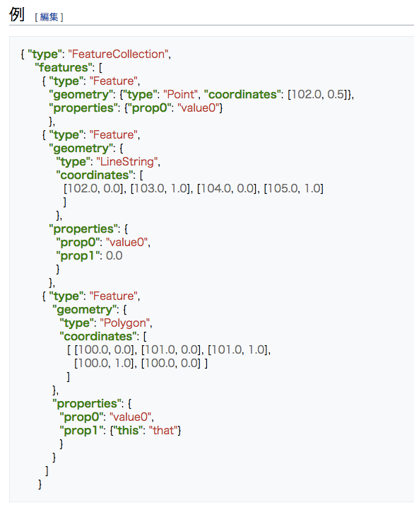
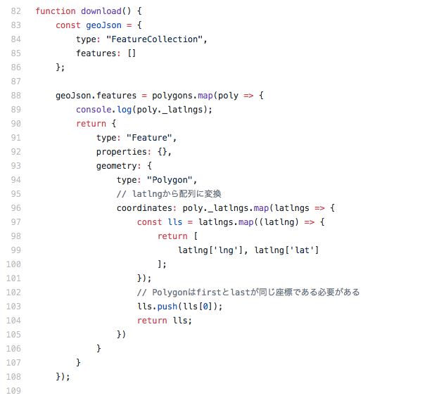
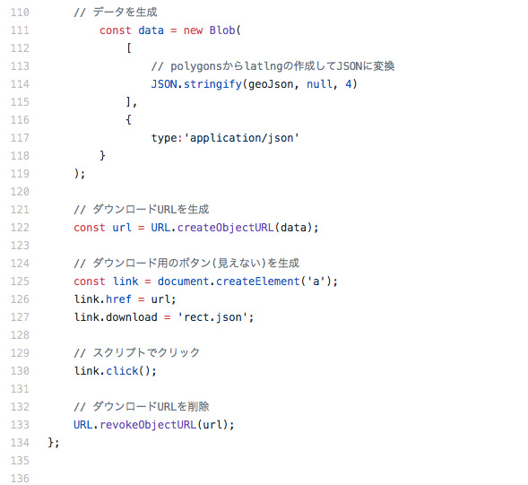

### ポリゴンをGeoJSONで所得する方法

今回のブログは卒業制作のPWAにおいて、地図上に書き込んだポリゴン(面)を、GeoJSONという空間データを持つJSONファイルで取得し、ローカルにダウンロードできる機能を加えたお話。

#### そもそもGeoJSONってなんだ？

**GeoJSON**とは[JavaScript Object Notation](https://ja.wikipedia.org/wiki/JavaScript_Object_Notation)(JSON) を用いて空間データをエンコードし非空間属性を関連付けるファイルフォーマットである。 属性にはポイント（住所や座標）、ライン（各種道路や境界線）、 ポリゴン（国や地域）などが含まれる。 他のGISファイル形式との違いとして、[Open Geospatial Consortium](https://ja.wikipedia.org/w/index.php?title=Open_Geospatial_Consortium&action=edit&redlink=1)ではなく世界各地の開発者達が開発し管理している点で異なる。（By Wikipedia）

こちらのGeoJSONというファイルフォーマットは非常に便利で、Githubでもはき出せたりなにかとよい。

GeoJSONのフォーマット仕様は上記の写真にような感じで、今回私はこの「type: Polygon」つまりポリゴンのみを実装した。

今回ダウンロード機能に、先輩のデルシオさんに教えてもらいながらJavaScriptで書いてるのだが、「new Blog」を使った〜。
中のjsはこんな感じ↓

つまずいた箇所でゆうと、まずは ”cordinate” の中に「lat, lng」という文字列が抜き取れてしまったので、数字だけの配列にするところと、緯度と経度が反対の順番に抜き出していてうまく展開できない？と焦ったり。結果として return [ latlng[‘lng’], latlng[‘lat’] ]; を加えたり。

あと、四角形のポリゴンでも緯度経度の座標は５つ必要で、最初と最後の座標は同じにする必要があった。ここは要注意！

ちなみにfunction download() のところは index.htmlにdownloadって名前でボタンをいれている。

以上、今回はconst(定数)つかってGeoJSONを抜き出したお話〜。

次回はポリゴンの形を回転させるためにくんだjsのお話。
それではまた来週〜。
