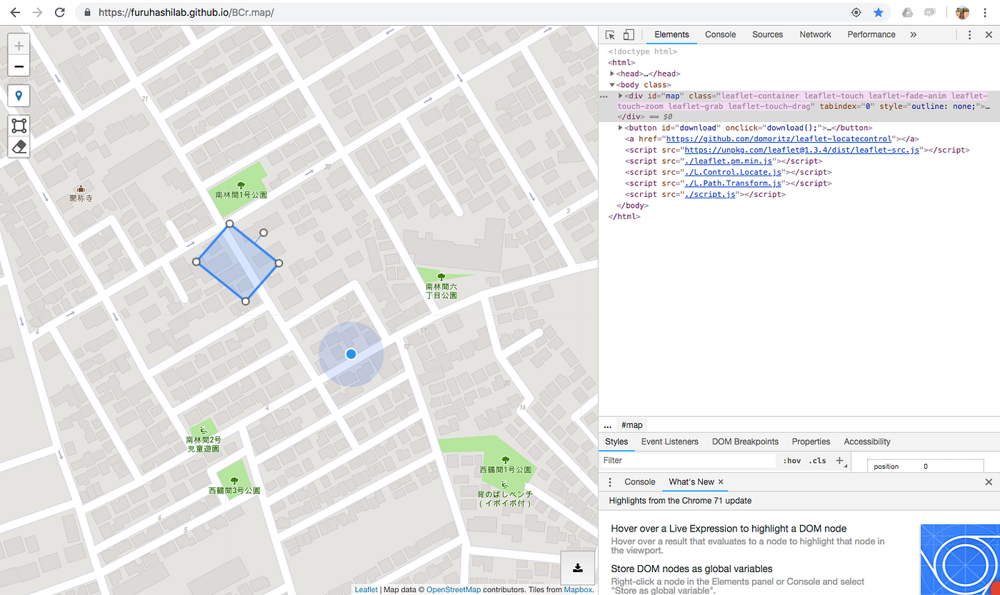
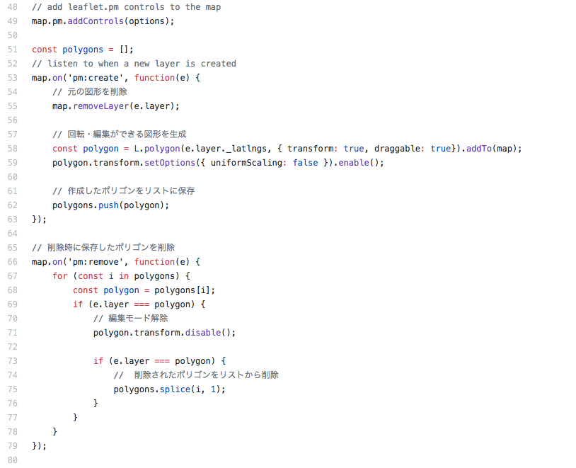
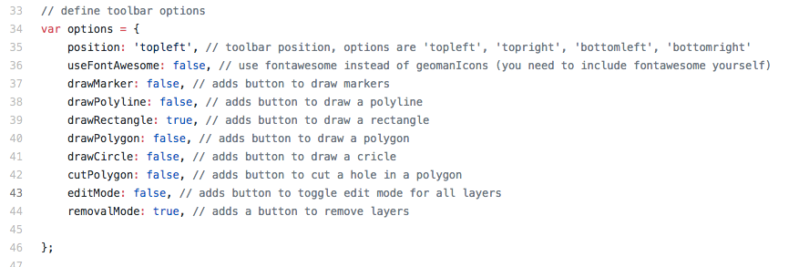
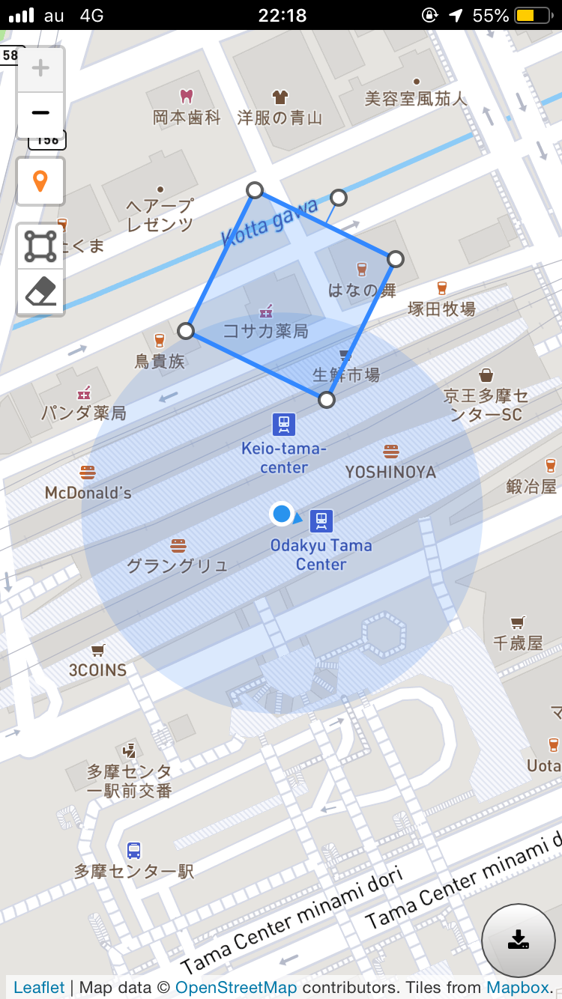
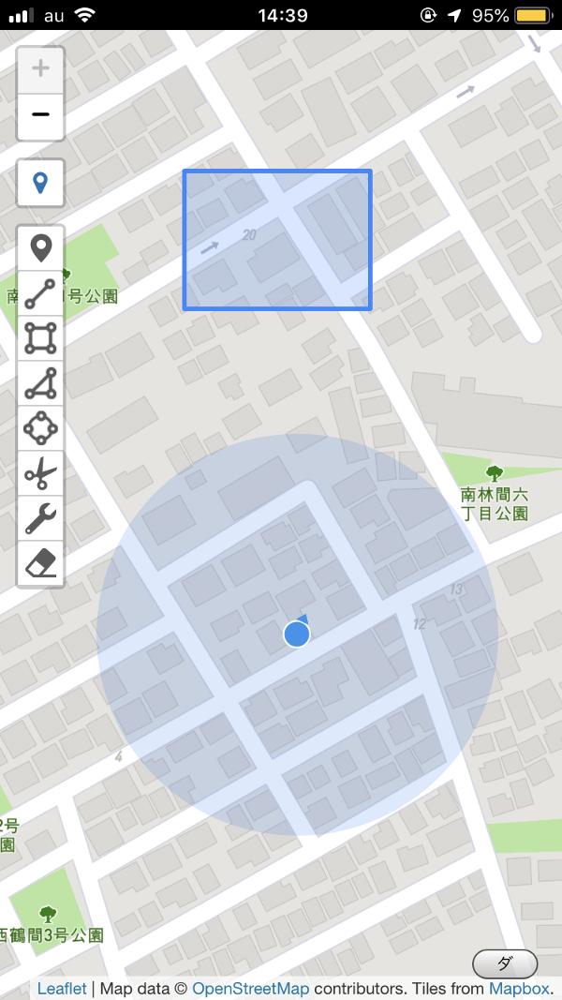

### 効率の良い建物データの追加とは

今回のブログは卒業制作のPWAにおいて、効率よく地図上に建物を追加するためにどのような入力方法が良いかを検討し、ポリゴンの回転機能を追加したお話。

実際にポリゴンを入れて動かしている様子。

私はこの卒業制作で作ろうと試みたPWAは、OpenStreetMap(以下OSM)のスマートフォン用編集ツールである。実際にOSMにデータをアップロードさせるところまで完成はできなかったが、エディタとして、編集ツールとして、建物データを追加するときの効率の良い入力方法を考えた。

JOSMはPC用のエディタだが、建物追加のプラグインがある。JOSMの建物追加プラグインでは、建物は４角形に表示され、道路に平行に建物を追加することはできるが、回転はできない仕様である。

私はこれと、建物の多くは四角形なことが多いという点に着目して、２クリックで４角形のポリゴンを追加し、ドラックでそのポリゴンを移動、また角の端っこの丸い点をドラックすれば拡大・縮小、辺の真ん中からとび出てる丸い点には回転機能を加えた。

**建物は全て四角形とは限らない！**と反論する方もいるだろう。
しかし今回の私の目的としては、データの精度を向上させるものではなく。現場にいながらスマホを片手で持ちながら、自分の現在地と比較して簡単に建物を追加できるエディタの開発を試みた。

回転を加えるためにまたしても他者が開発した良いものを発見できたので、せっかく三角関数を勉強しなおしたのだが、[Leaflet.Path.Transform](https://github.com/w8r/Leaflet.Path.Transform)を使わせてもらった。どうやって組むんだ〜ってネットで調べていたらこれにであった。

実装方法はこのjs ([https://github.com/w8r/Leaflet.Path.Transform/blob/master/src/Path.Transform.js](https://github.com/w8r/Leaflet.Path.Transform/blob/master/src/Path.Transform.js))を自分のindex.htmlの自分のscript.js の前にいれて、script.jsに下記を追加。

> const polygon = L.polygon(e.layer._latlngs, { transform: true, draggable: true}).addTo(map); polygon.transform.setOptions({ uniformScaling: false }).enable();

私はこの[Leaflet.Path.Transform](https://github.com/w8r/Leaflet.Path.Transform)というプラグインの前に、他のプラグインを入れていたので、ポリゴンを動かすと、ポリゴンが二重になってしまうトラブルが発生し、元の図形を削除する作業に苦戦した。

またこのとき↓いれたプラグインではいろんな地物の追加編集機能があったが、私は建物の追加のみに特化し、より簡易なエディタを目指していたので、長方形(Rectangle)以外の追加機能はfalseにした。

[地物追加機能実装
今回のブログは卒業制作のPWA(OSM編集ツールの予定)で、LeafletのPlugins機能の中でLeaflet.PM(地物追加機能)を実装したお話。medium.com](https://medium.com/furuhashilab/%E5%9C%B0%E7%89%A9%E8%BF%BD%E5%8A%A0%E6%A9%9F%E8%83%BD%E5%AE%9F%E8%A3%85-c69f24f2b7cf)

以上、今回は建物データの追加に特化した効率の良い追加と編集方法を考える回。次回はこのPWAのめざす先のお話。

それではまた来週〜。
