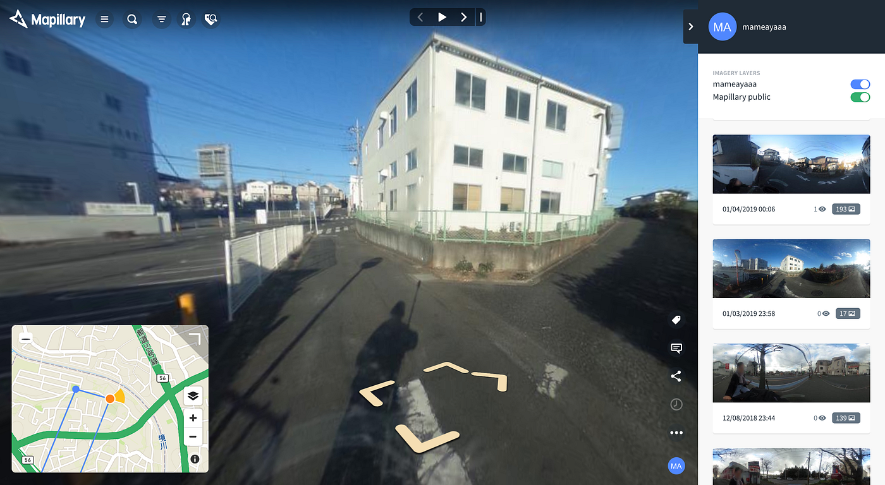

### ストリートビュー撮影ーアップロード編ー

今回はRICOH THETA Sで撮影したデータをPCのウェブプラウザ上でMapillaryにアップロードする方法を書いていきます。

まずは撮影する時と同様iPhoneとTHETAをWi-fiで接続し、THETAの専用アプリを開きます。

アプリ内のカメラ内映像のところにある撮影したデータを選択し、iPhoneのカメラロールへ転送を行います。この作業、本当に時間がかかりますし、ストリートビュー撮影の場合、一度に大量のデータを転送することになるので転送中に接続が切れてしまい初めからになってしまったり、iPhone,THETA両方の充電も容量も多く使います。（わたしのiPhoneの場合、２００個のデータを一回転送するのに充電の半分以上は使ってしまいます。）十分に準備が必要です。また、転送するデータを選択する際、iPhoneのカメラロールやPCのように一度に多くのデータを選択することが出来ません。大量のデータを１つ１つ選択しなければならないのも時間がかかる要因です。

そしてカメラロールへの転送ですが、だいたい１分間で５つのデータが完了するくらいのペースです。そうです、とても時間がかかります。寝る前に多くのデータを一度に選択しても、起きたら基本的に接続かTHETAの充電が切れて初めからの状態になっています。なんせTHETAはiPhoneと違い充電しながら使うことが出来ません。何か別の作業をしながらおよそ200~300程度のデータを分けて転送して行くのがリスクも少なくある程度の効率もよくするところだと思います。

時間をかけてカメラロールへの転送が完了したら、（iPhoneのカメラロールは360度対応していないので180度表示になってしまう、問題はないようです）今度をそれらのデータをPCへ移していきます。iPhoneとMacなら、Airdropが一番早く、効率の良い手段かと思います。ここの移動は時間がかからず、ストレスもなくスムーズに行えます。さすがAppleですね、素晴らしいです。

PCに移したデータたちを、ウェブプラウザ上でMapillaryを開き、アップロードしていきます。左の上から二番目にあるアップロードボタンを押し、データを選択すれば簡単にアップロードしてくれますが、こちらも少々時間がかかりますので良いネットワーク環境で行うことをお勧めします。

ここまでがアップロードが完了するまでの流れです。

次回は今回撮影を行った大和市について書いていきたいと思います。
