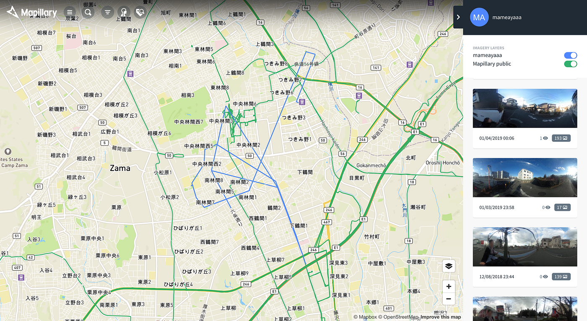
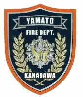

### ストリートビュー撮影ー大和市編ー

今日は、今回撮影させてもらった大和市について書いていきたいと思います。

まず、なぜ大和市の撮影を行うことになったのかと言いますと、

古橋研究室は以前から大和市の消防防災本部の方々と連携してDRONEBIRD活動をしており、

消防、防災に一層力を入れている大和市でお力になれるような活動をしてきました。

そこで今回わたしが卒論を行うにあたって、

普段人々が当たり前のように通り過ぎ、気にかけない消火栓やAED、防火水槽やスタンドパイプの存在とその位置を市民の方に把握してもらいたい、という大和市の藤田さんをはじめとする防災本部の方々の思いを実際に聞き、ではまずその位置情報と周辺の情報を把握し、それぞれに名前をつけて唯一無二のものにしていこうというミーティングをさせていただいたことが始まりです。

今回は特に認知されていないとされる防火水槽とスタンドパイプに焦点を当てて活動することになりました。

わたしは大和市民でもなく、大和市に足を踏み入れたこともありませんでした。

何の知識も経験もないところから始まり、不安だった私に藤田さんは大和市の防災状況について簡単に説明してくださり、防火水槽とスタンドパイプの位置情報もくださいました。

大和市では今、アプリを使って防災活動を呼びかけており、

これらの位置情報やイベント情報、災害時のお知らせも今はアプリが一番効率がいいのではないかとお話しされていました。

大和市以外にも市区町村ベースの災害防災アプリなどはありますが、ここまでコンテンツも多く、見易さ使いやすさが重視されているものはあまり見受けられません。

このお話を聞いて、大和市がどれだけ防災活動に力を入れているのか知ることが出来ました。

実際に撮影を行うにあたり、消防本部から自転車をお借りすることになり、

消防本部に何度も足を踏み入れました。

一度藤田さんが本部の中を簡単に案内してくださり、事務局や出動場所だけでなく、食堂や休憩室、寝床まで実際に見させていただきました。どの瞬間を取っても何かあった時に一刻も早く出動できるようにと、市の安全を第一に考える姿勢が伺えて感動しました。

最も興味深かったのは、乾燥室が多くあり、しかもその中は広くてブーツがすぐに乾くようにとブーツを引っ掛ける専用の鉄棒がいくつもあったことです。

藤田さんによると、消防士は乾燥が命だ、水分があってはならないから乾燥は入念に行うんだよ。とおっしゃっており、とても納得したのを覚えています。

実際に消防本部に何度も立ち寄ると、私が想像していたよりも遥かに多くのペースで出動しており、自転車で市内を回っている際も何度も大和消防車や救急車を見かけました。

そのくらい実際には多くの事故が発生しており、それを大和消防の方々が救っているのだと気づきました。

また、大和市は想像以上に広く、中には大きな高速道路や公園や、険しい道が続く山道のようなところもありました。自転車で行く道じゃないような道も苦しいながらにたくさん通りました。都内に比べると人はもちろん少ないですが、だからこそ地元の繋がりを大切にしていたり、ご近所さんで集まっていたりご近所さん家族で遊んでいる微笑ましい瞬間を何度も目にしました。

私が大変そうに自転車を漕いでいると、「何してるの？大変だね、頑張ってね」と声をかけてくださる心優しい方もたくさんいらっしゃいました。

これまでは足を踏み入れたこともない市でしたが、今回の研究を通して自分の住んでいる地元よりもよく観察し、よく知ることが出来ました。今までどこかの地域についてここまで時間をかけてフィールドワークを行ったことがなかったので、今回このような形で素敵な大和市に関わることが出来て良かったです。

それでは次回は、最後に今回の研究の成果をまとめていきたいと思います。
