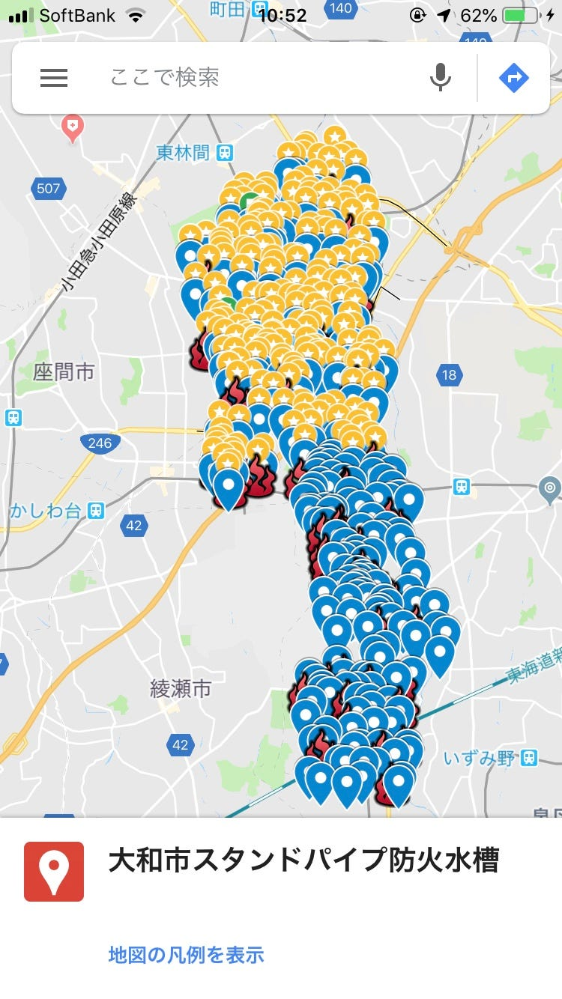
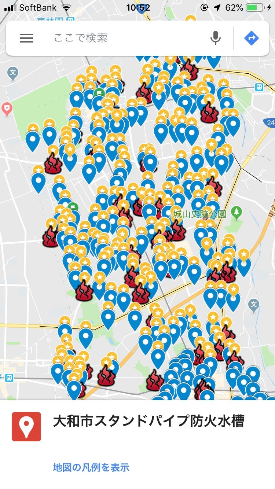
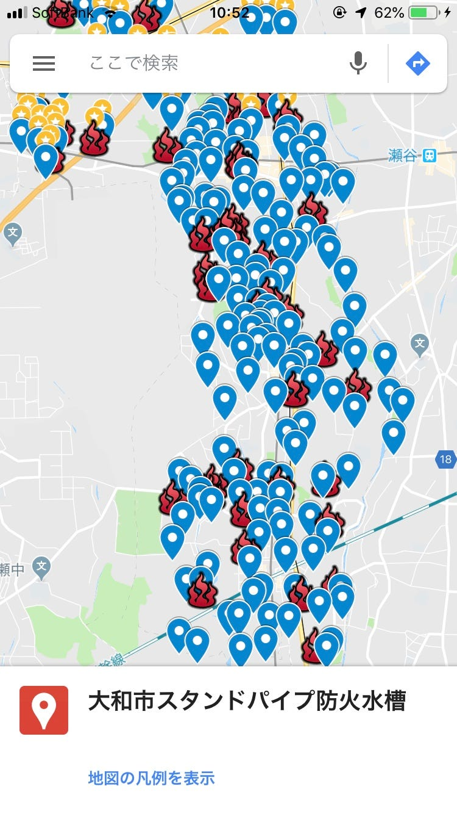

### ストリートビュー撮影ー成果報告編ー

今回は研究の成果報告についてまとめを書きたいと思います。

それぞれの過程の結果や反省などはこれまでのブログでアップしているので、

私が今回回ることのできた防火水槽、スタンドパイプのみになりますが、、

位置の話をすると、相模鉄道本線から北側になります。

駅で言うと、中央林間、南林間、相模大塚、鶴間あたりは網羅できましたが、

南側は回ることが出来ませんでした。

ストリートビューの話でいうと、ミーティングの前のAEDを回っていた時や

それぞれの行き帰りのデータも含まれているのでそれよりは多くの

道を撮影できたと思います。
