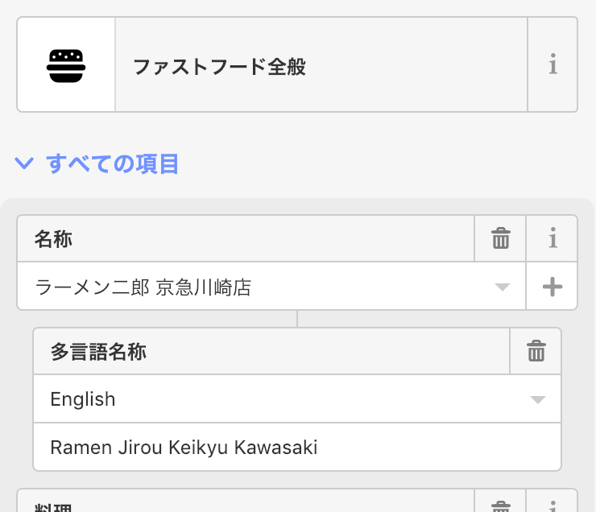

### 卒研：OSM上の多言語化について

OSM上で地物のタグ編集をする際に、「多言語名称」を登録することができる。

そこでの表記方法をどのように統一するか。

“海外の人はどのようにラーメン二郎」を検索するのか” という観点から考えてみた。

Cuisineのタグについて論じた時のように、「ラーメン」という言葉は世界中に広まっているということを仮定すると

「ラーメン二郎」という日本語名称は、そのままローマ字に訳し

「Ramen Jiro」で伝わる。

（ “Ramen noodle Jiro” も考えたが、RamenとはNoodleの一種と

それにプラスして、その店舗名の地名のローマ字表記を記述する。

これにより、「ラーメン」「二郎」「○○店」を調べたい海外の人も、OSM上で調べることができるようになる。
