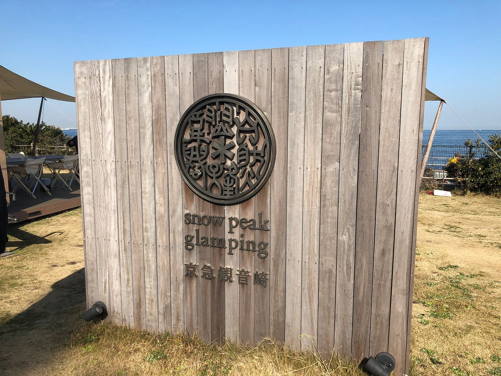
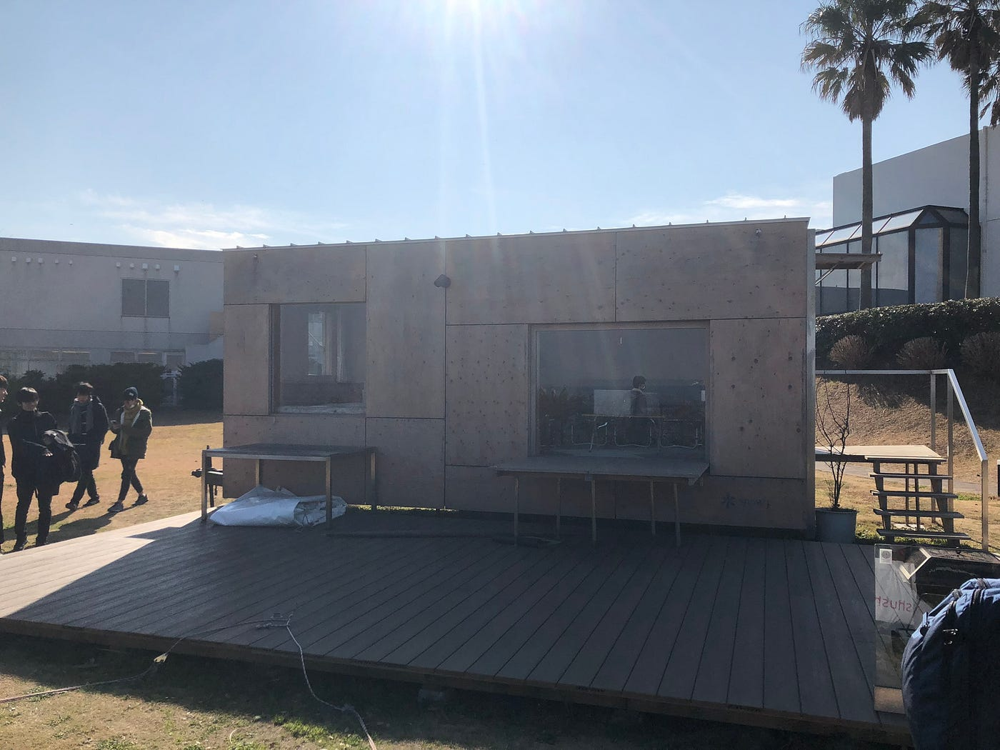
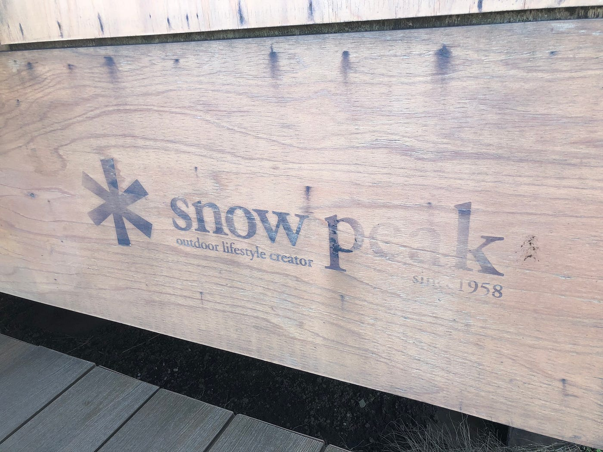
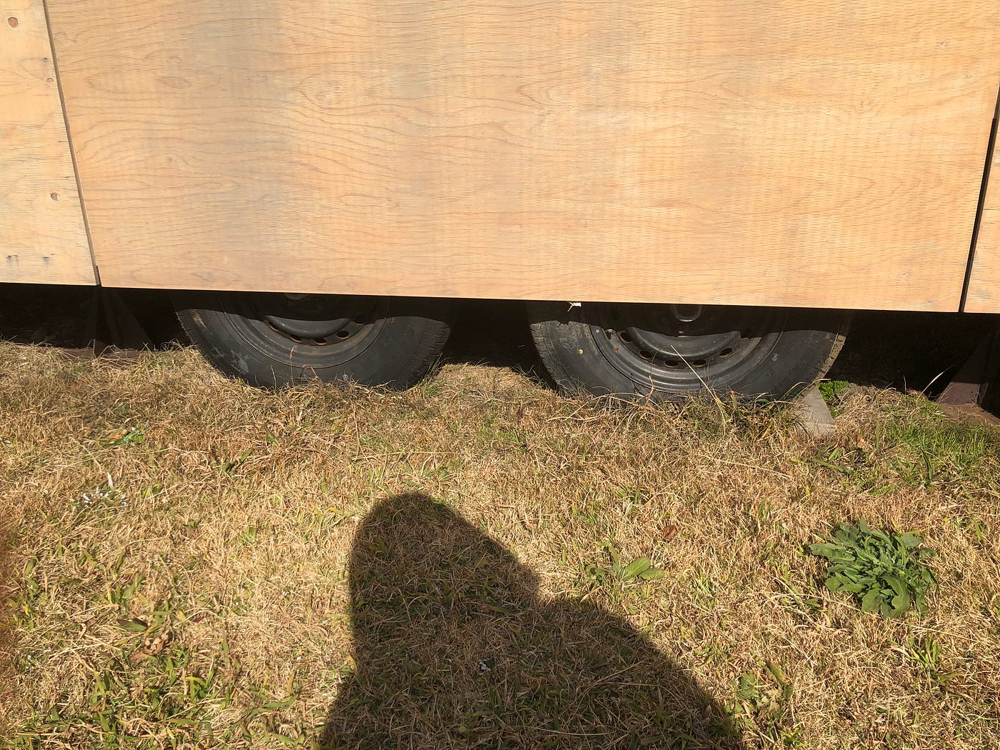
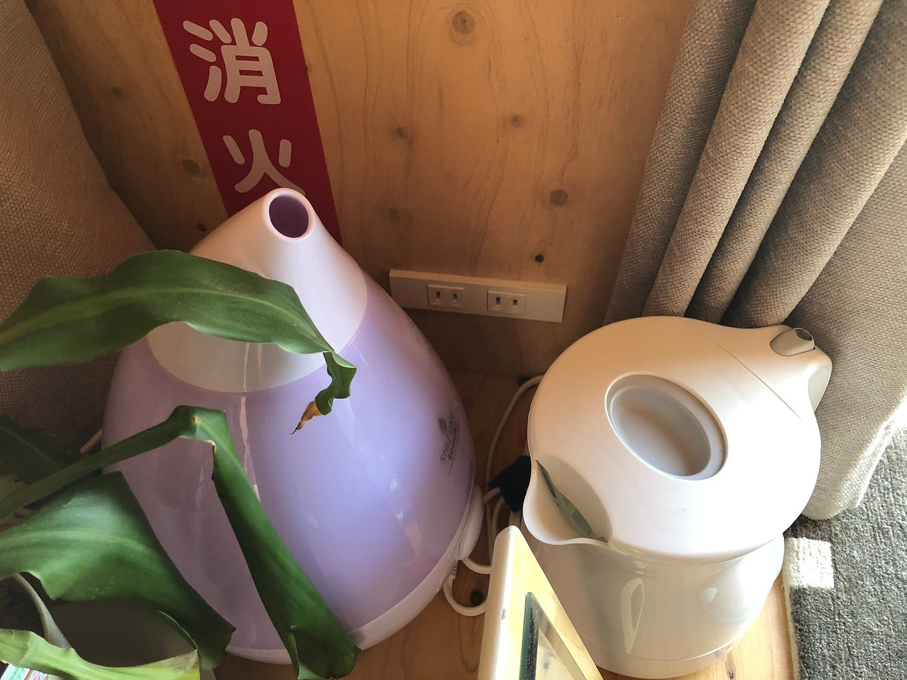
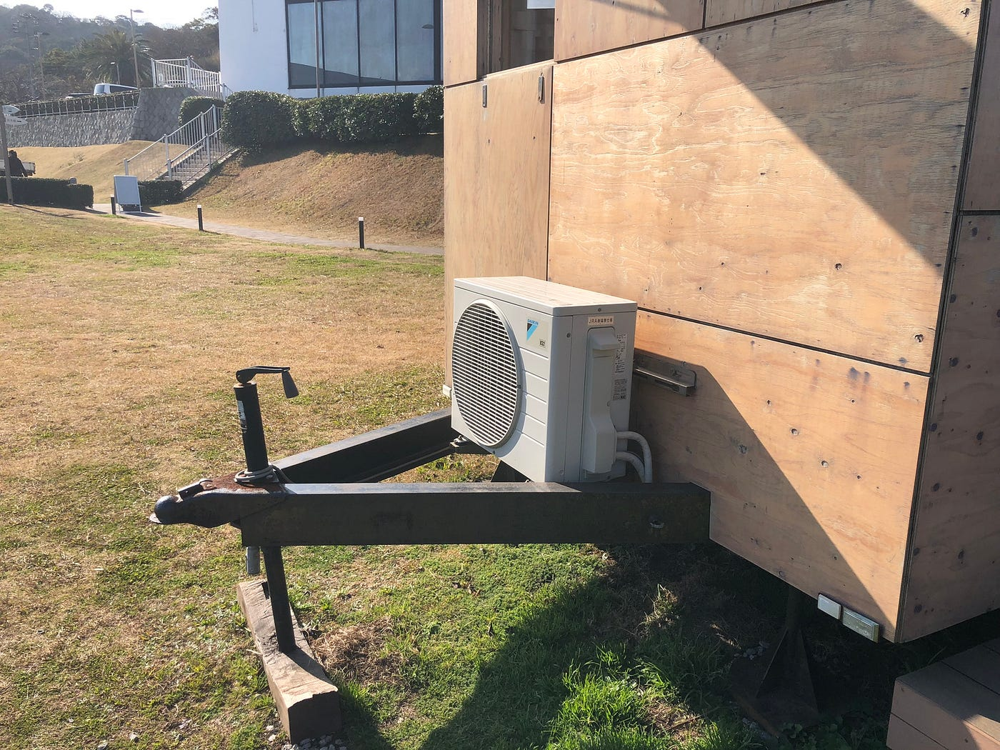
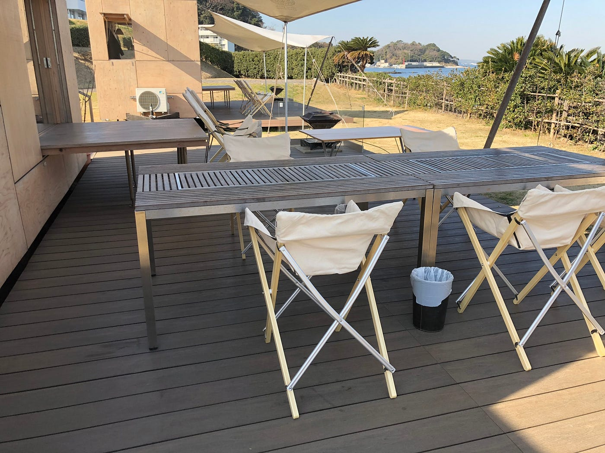
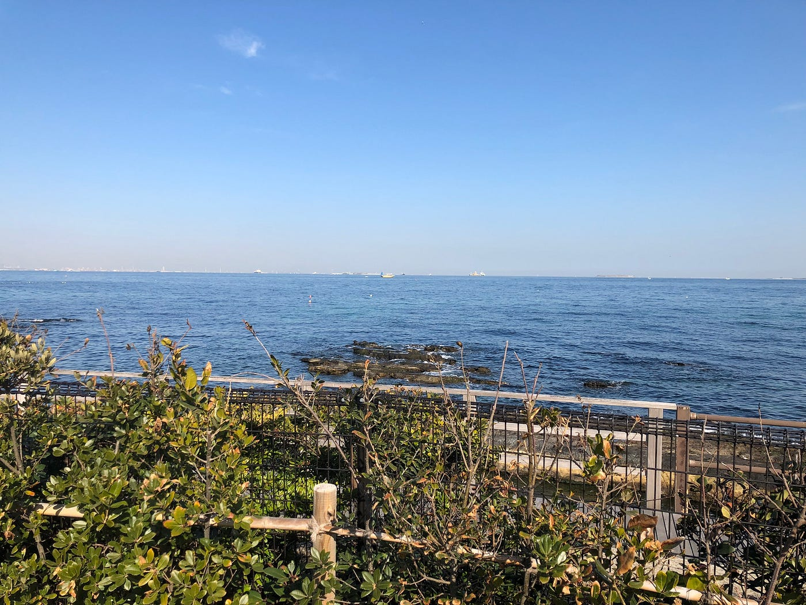

### 「箱」に「住」むということ

> 約6.6畳の空間で感じる、自然に生きる楽しさ。

### #1 はじめに

本ブログ投稿も6回目となりました。武末です。年も明け、学期末のテストも近づく中、就活と趣味の時間調整に手間取っております。

さて、1月17日に開催された**古橋研究室BBQ×Snow peak**のイベントに参加して来ました。その際見学させて頂いたモバイルハウス「**住箱**」について非常に面白い知識を得ることができましたので共有したいと思います。

### #2 恒例の位置情報軌跡の投稿

[古橋研究室BBQ - Kouki Takesue's 12.2 mi walk
Kouki T. completed 12.2 mi on Jan 17, 2019.www.strava.com](https://www.strava.com/activities/2084329845)

[Japan, image by kouki_t
Map data at scale from street-level imagerywww.mapillary.com](https://www.mapillary.com/map/im/DxjfhB0Wyp-V4W8KQoHudA)

### #3 住箱とはなにか？

> 旅をする建築。
住むを自由にする箱「住箱」

> -公式サイトより-

[～スノーピークのモバイルハウス【住箱 JYUBAKO】～ ｜ スノーピーク ＊ snowpeak
～スノーピークのモバイルハウス【住箱 JYUBAKO】～ 隈 研吾がずっとつくりたかった、旅を売る建築。住む を自由にする箱 " 住箱 " 完成。www.snowpeak.co.jp](https://www.snowpeak.co.jp/sp/jyubako/)

住箱とは、**株式会社スノーピーク**の商品であるトレーラーハウスの名称で文字通り、車両として運搬可能な家です。家、と言うにはこの**約6.6畳**のスペース、いささか狭いかもしれません。しかしこのスペースだからこそ感じられるパーソナリティさ、まるで秘密基地のような感覚は、一度足を踏み入れれば日常を忘れ、快適なひとときを約束してくれます。

設計は2020年東京オリンピックが開催される新国立競技場の設計を担当した**隈研吾**氏。「和の大家」と称される彼がモバイルハウスに選んだ素材は意外にも、**ヒノキ合板**でした。

実際、ヒノキ合板を外に張り付けているので耐久的に問題がありそうな感じですが、木材には**保護材**を塗布しているので雨風が入ることもなく、定期的なメンテナンスによって維持することが可能とのことです（公式FAQより）触った感じは木材そのもので、ログハウスの良ささえも感じます。屋根は**ガルバリウム鋼材**を使用しており、住居としての強度は問題ないようです。

車両なのできちんとタイヤも付いています。支えも地面に刺さっているので雨風程度ではこの地質でも沈み込んだり傾いたりする心配は無いようです。しかし、台風21号の際には流石に傾いてしまったようで、クレーン車を使用しての修復になったと従業員の方からお聞きしました。

> （内部全体の写真を撮影し忘れてしまって非常に残念）

住箱はバッテリーが内蔵されており、そこから電源を引くことができるのでこのように家電を設置もできます。公式サイトでは、

[グラスサウンドスピーカー キャリングケース付 | フィールドギア | キャンプ | スノーピーク(Snow Peak)
グラスサウンドスピーカー キャリングケース付(MHG-020)の商品ページです。【公式】スノーピーク(Snow Peak)の公式サイトです。…ec.snowpeak.co.jp](https://ec.snowpeak.co.jp/snowpeak/ja/%E3%82%AD%E3%83%A3%E3%83%B3%E3%83%97/%E3%83%95%E3%82%A3%E3%83%BC%E3%83%AB%E3%83%89%E3%82%AE%E3%82%A2/%E3%82%B0%E3%83%A9%E3%82%B9%E3%82%B5%E3%82%A6%E3%83%B3%E3%83%89%E3%82%B9%E3%83%94%E3%83%BC%E3%82%AB%E3%83%BC-%E3%82%AD%E3%83%A3%E3%83%AA%E3%83%B3%E3%82%B0%E3%82%B1%E3%83%BC%E3%82%B9%E4%BB%98/p/36109)

このようなサウンドスピーカーを推奨してたりします。

[モバイルソーラーチャージャー | スノーピーク(Snow Peak)
［本体（バッテリーユニット）］● 定格入力:DC19.5V（ACアダプター）/DC17.7V（ソーラーパネル） ● DC出力端子:DC12V.2.0A（3端子合計） ● USB-A型ポート出力:DC5V,1.0A ●…ec.snowpeak.co.jp](https://ec.snowpeak.co.jp/snowpeak/ja/c/%E3%83%A2%E3%83%90%E3%82%A4%E3%83%AB%E3%82%BD%E3%83%BC%E3%83%A9%E3%83%BC%E3%83%81%E3%83%A3%E3%83%BC%E3%82%B8%E3%83%A3%E3%83%BC/p/36027)

snow peakからこのようなソーラーバッテリーも販売しており昼間はこのような形での電源供給も可能です。

### #4 従業員の方から伺った住箱について

宿泊の準備をなさっていた従業員の方にいくつか住箱の情報を伺うことができたので簡単に共有。

> ・住箱のスタートが約二年前。そこから観音崎ホテルでは約一年半ほど運営しているとのこと。

> ・シーズンは4月から11月。主な利用層はファミリーや30代40代の子供のいないカップル層。この時期はほとんど予約が埋まるそう。

> ・海風が寒い冬は逆に20代の利用が多く、たまに卒業旅行としてこの住箱を予約してきた団体がいた。

> ・海に面しているこの場所だが、夜はランドマークタワーや東京タワーが綺麗に見える。双眼鏡などで楽しんで欲しい、とのこと。

> ・地盤は押し固めたりしていない土だが、通常の雨や風程度では揺れたり沈んだりすることはない。しかし、以前の台風21号の際には雨の後に強い風が吹いたため、傾いてしまった。その時はsnow peakからクレーンが派遣され吊りながら修復したそう。

### #5 フィールドワークを終えて

お恥ずかしながら僕自身、横須賀に住んでいて観音崎にもよく遊びに来たりするのですが、このようなサービスがあったとは知りませんでした。しかもこの住箱の設計者があの新国立競技場をデザインした **隈研吾**氏だったとは、非常に驚きです。確かに昔から横須賀は自然に溢れていて、もっとこの自然の魅力を県外の人にも伝えることはできないかな、と考えたことはありました。しかし、横須賀は自然に溢れていてもそれを楽しめるようなレジャーや宿泊サービスに弱い一面があったと思います。そんな中観音崎ホテル様は「住箱」という新しいサービスを導入することでこの問題に一つ新しい解決策を見いだしたのではないかと私は考えています。

この住箱は単にレジャーキャンプ（グランピング）として楽しむだけでなく公式サイトではカフェやレストランとしての利用実績が既にあるようです。

[トレイラー (神楽坂/ステーキ)
トレイラー/TRAILER (神楽坂/ステーキ)の店舗情報は食べログでチェック！ 【禁煙】口コミや評価、写真など、ユーザーによるリアルな情報が満載です！地図や料理メニューなどの詳細情報も充実。tabelog.com](https://tabelog.com/tokyo/A1309/A130905/13200929/)

このように単なる住居スペースとしてだけではない、様々な利用方法が考えつく新しい居住の形、住箱。観音崎ホテルで体験できますので興味を持った方ぜひ足を運んでみてはいかがでしょう？

[グランピング｜観音崎京急ホテル×Snow Peak
三浦半島の最東端で、シーサイドグランピングを楽しむことができます。東京湾を臨む絶好のロケーションで、三浦半島の食材をふんだんに使った料理をご堪能ください。www.kannon-kqh.co.jp](http://www.kannon-kqh.co.jp/lp/glamping/)
