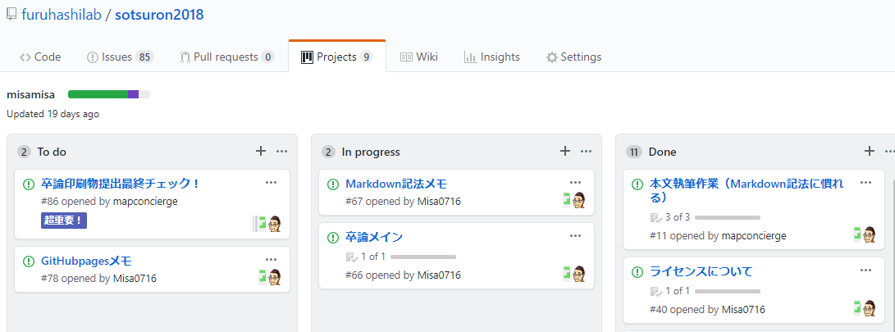
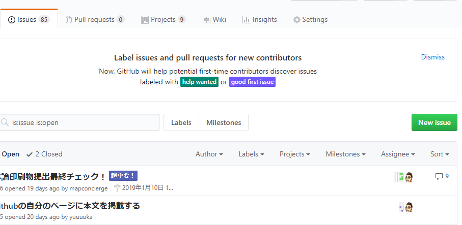
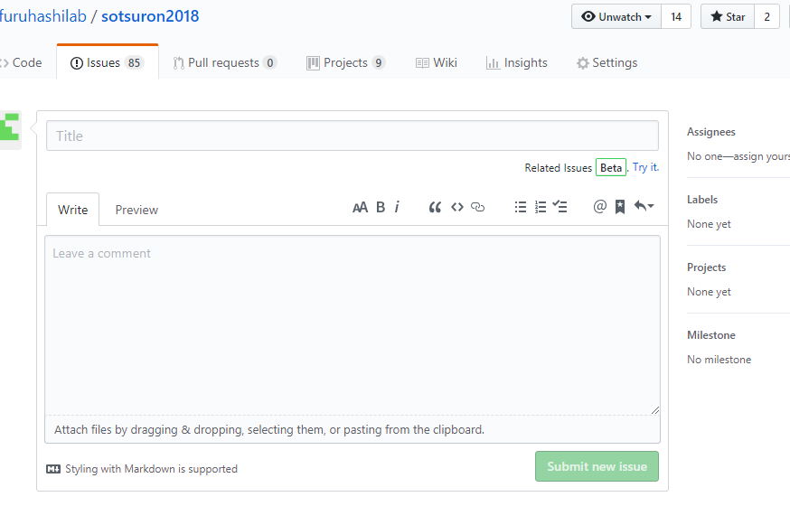
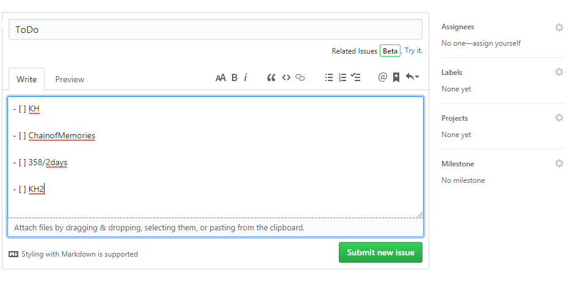
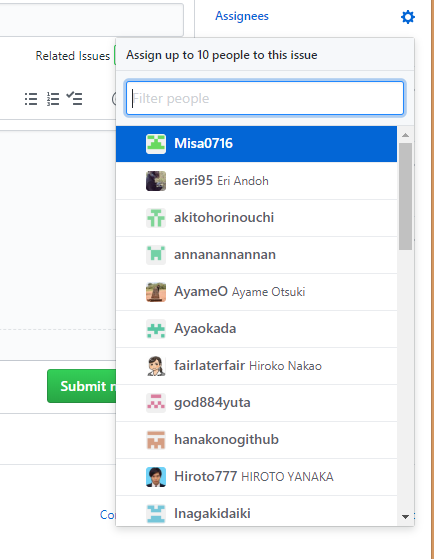
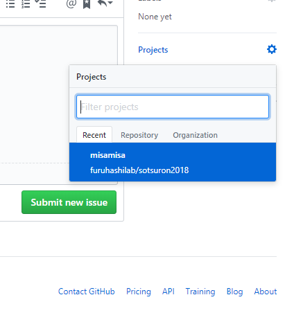
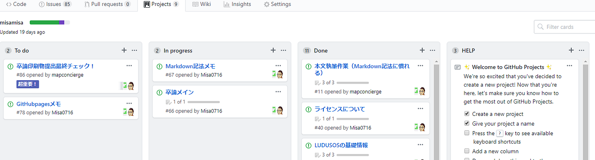
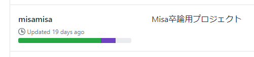
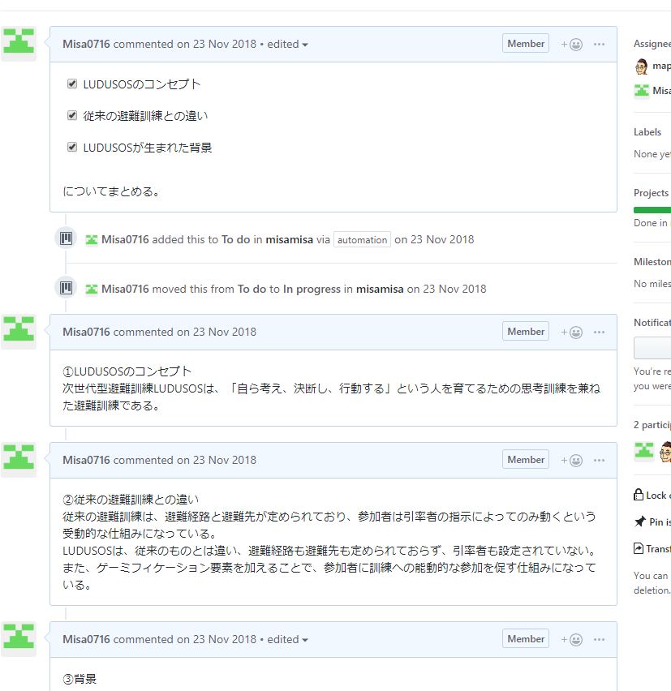

### GitHubプロジェクト現る

ある日、GitHubからメールが届きました。

いつもは無視しますが気まぐれで開くと見覚えのない画面が…

そして今後は[GitHubプロジェクトでタスク管理](https://github.com/furuhashilab/sotsuron2018/projects)をするというメッセージが…

GitHubプロジェクトってなに？

というのが素直な感想でした。

よくわからないままにいろいろ弄ってみてなんとなく使い方がわかったところで利用開始！

慣れると便利でした。

まずは「New issue」

するとこの画面に

こんな感じでTODOを書きます。

マークダウン方式でこのように記述するとチェックボックスに設定することができます。

Assignerに自分と先生のアカウントを追加します。

追加されたアカウントは編集することができるようになります。

そして自分のプロジェクトに追加

「Submit new issue」をクリックすると自分のプロジェクトに追加されます。

それぞれのissueはドラッグ＆ドロップで移動させることが来ます。

To doからIn progressへ、In progressからDoneへ。

タスクの進捗はこんな感じに可視化されるので管理にはもってこいですね！

ちなみに私はこんな感じに活用しました。

チェックボックスに書いた事項を上から順にコメント機能を使って書き込み、書き終えたTODOはチェックをする。すべて書き終えたらこのIssue自体をDoneへ追加する。

GitHubプロジェクトを使い始めて何を今やるべきなのかが可視化されたことで一気に進んだ…気がします。

[furuhashilab/sotsuron2018
卒論2018年度. Contribute to furuhashilab/sotsuron2018 development by creating an account on GitHub.github.com](https://github.com/furuhashilab/sotsuron2018/projects)

それでは次回。

早くも疲れてきたので閑話を入れます。
