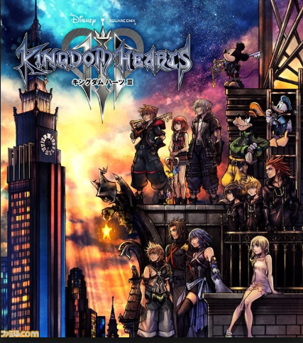

### テーマを決めよう

ついにKH3が発売されましたね！諸事情により買えないのですがYouTubeをみていたら早くもエンディングが公開されていてなんとも言えない気持ちになっています。とりあえず実況プレイを見始めました。

さて、本題に入りましょう。

卒論を書き始めるためには、まずはテーマを決めなければいけません。

私たちの時はいつだったか忘れましたが「何がやりたい？」から始まった気がします。

私ははじめ位置情報ゲームを作りたくて卒論のテーマを位置情報ゲームに設定しました。しかし、いろいろなゲームをプレイして週報を書いているうちにストレスを感じるようになりました。

びっくりするほどおもしろくない。

The Walking Deadのゲームを例に話しましょう。

こちらが位置情報を使ったゲーム

こちらがそうでないゲーム

位置情報ゲームの方はすぐに飽きてアンインストールしましたが、普通のゲームの方は楽しくてしばらくはまっていました。

なんでこんなに没頭できないのかわかりませんが、楽しくないゲームをしているのが苦痛になり、やる気も出ないままずるずる後期へ突入。

先生と話し合い、サクッとテーマを変えました。

新しいテーマは防災ガール発案の「次世代版避難訓練LUDUSOSオープンソース化」です。

次回「卒論にとりかかろう」をお送りします！
