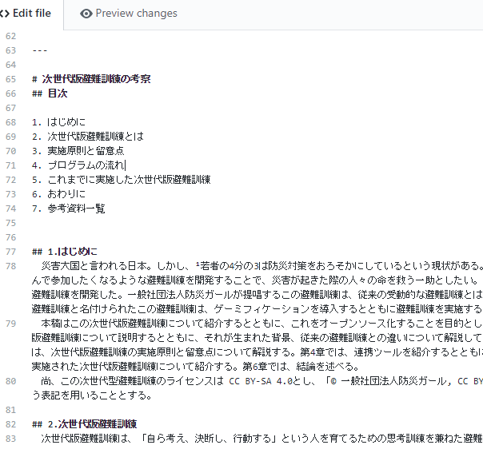

### 次世代版避難訓練LUDUSOS①

今回から８回に分けて私の卒論の中身を一部公開していこうと思います！

GitHubに全部載っていますけどね！

さてイントロ部分いきましょー

「 災害大国と言われる日本。しかし、¹若者の4分の3は防災対策をおろそかにしているという現状がある。これから起こるであろう災害に向けて、実践的かつ若者が進んで参加したくなるような避難訓練を開発することで、災害が起きた際の人々の命を救う一助としたい。そんな思いを持つ一般社団法人防災ガールは、次世代に必要な避難訓練を開発した。一般社団法人防災ガールが提唱するこの避難訓練は、従来の受動的な避難訓練とは違い、参加者が主体的に行動することが求められる。次世代版避難訓練と名付けられたこの避難訓練は、ゲーミフィケーションを導入するとともに避難訓練を実施する地域に合わせてさまざまなツールと連携して実施される。 本稿はこの次世代版避難訓練について紹介するとともに、これをオープンソース化することを目的としている。本稿の構成は以下の通りである。第2章では、次世代版避難訓練について説明するとともに、それが生まれた背景、従来の避難訓練との違いについて解説していく。また、類似した避難訓練について言及する。第3章では、次世代版避難訓練の実施原則と留意点について解説する。第4章では、連携ツールを紹介するとともに、プログラムの流れについて説明する。第5章では、過去に実施された次世代版避難訓練について紹介する。第6章では、結論を述べる。 尚、この次世代型避難訓練のライセンスは CC BY-SA 4.0とし、「© 一般社団法人防災ガール, CC BY-SA 4.0」もしくは「© Bosai Girl, CC BY-SA 4.0」という表記を用いることとする。」

ここまでがイントロ。

イントロ部分では、この文書の目的とそれぞれの章でどんなことを言わんとしているか、それからライセンスについてを明示しています。

「若者の4分の3は～」の箇所に数字が振ってありますよね、これは最後に記述している参考文献リストの数字と対応しています。

この箇所で参照したのは「内閣府広報室、『防災に関する世論調査』の概要」平成29年度版です。

[防災に関する世論調査 ２ 調査結果の概要 ４ - 内閣府
内閣府では，政府の施策に関する皆様の意識を把握するため，世論調査を実施し，その結果を掲載しております。survey.gov-online.go.jp](https://survey.gov-online.go.jp/h29/h29-bousai/2-4.html)

参考文献には信頼できるサイトを選びましょう。

ちなみに卒業論文ってどんな風に書けばいいのか全く分からなかったので、Google Scholarで適当に検索して出てきた卒論をイントロ形式を参考にしました。

続いて2章いきます！次回！
