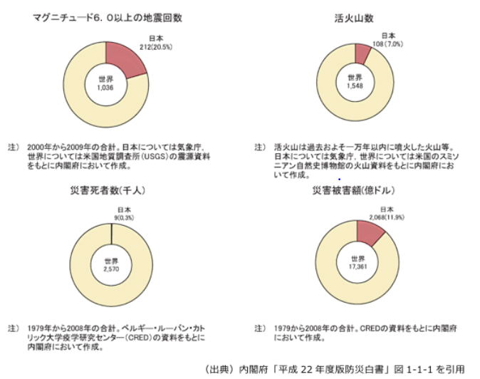
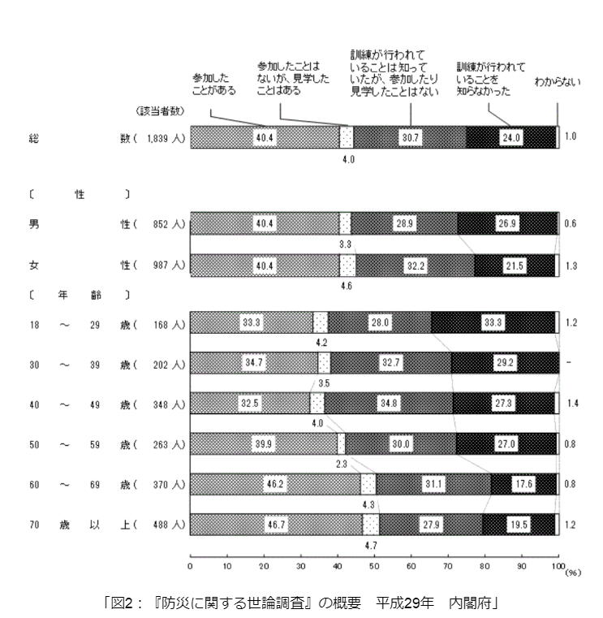
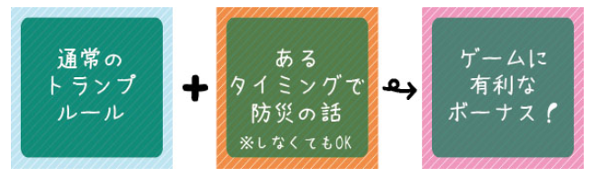
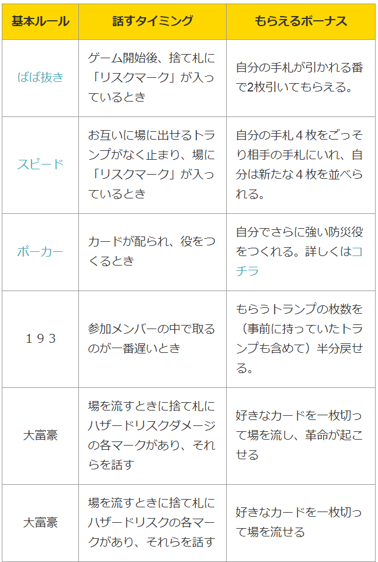
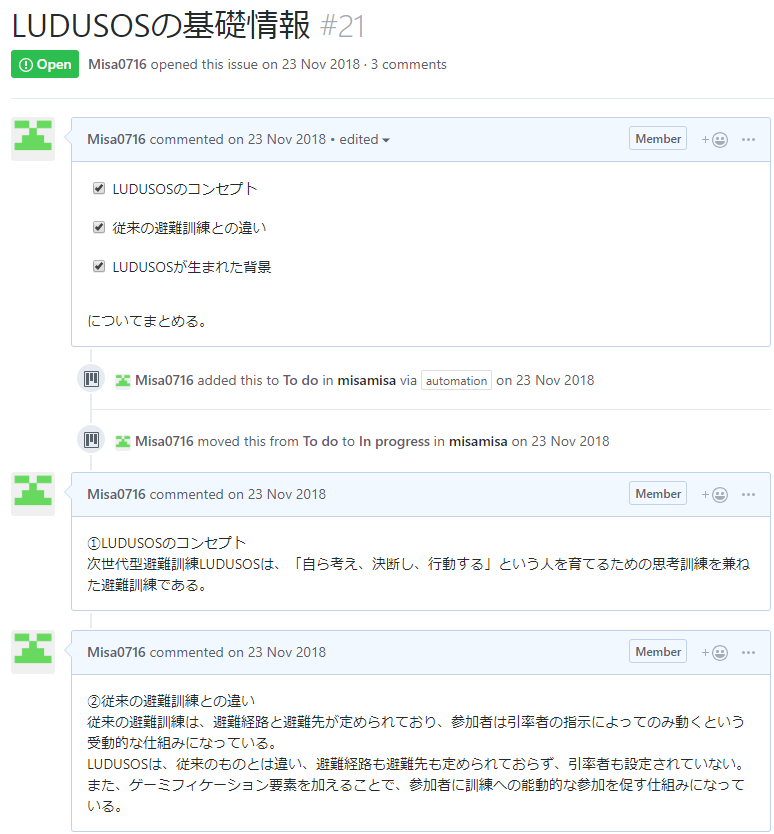
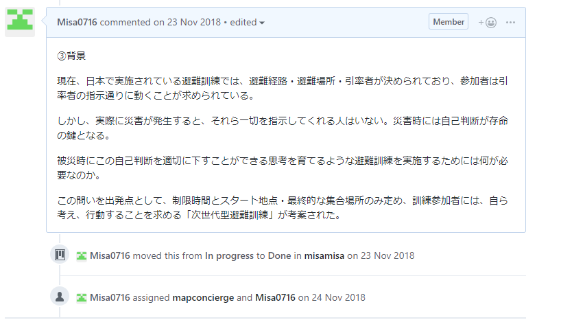
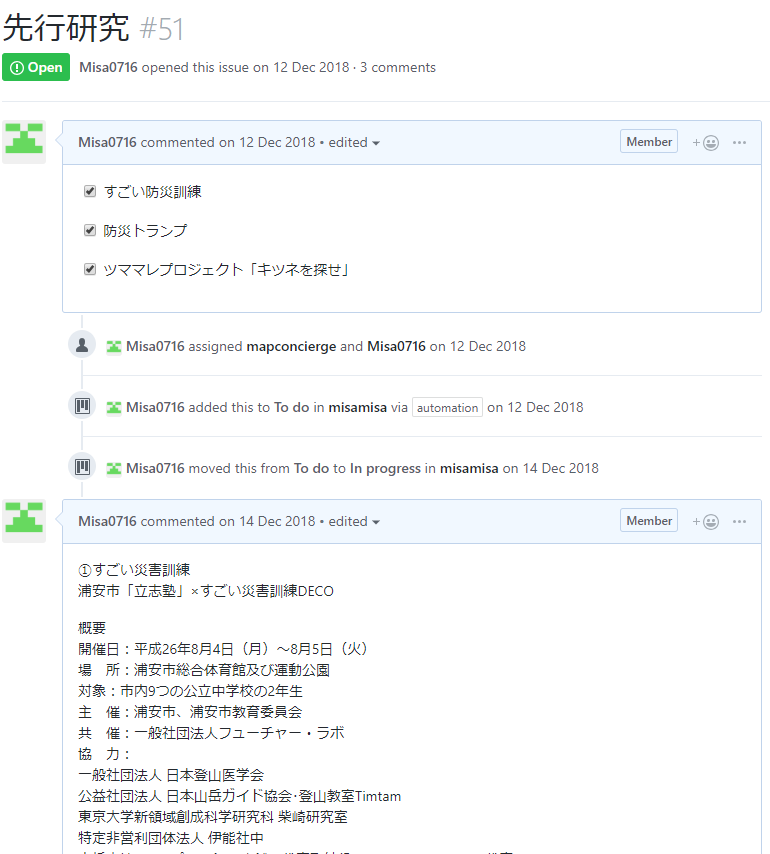
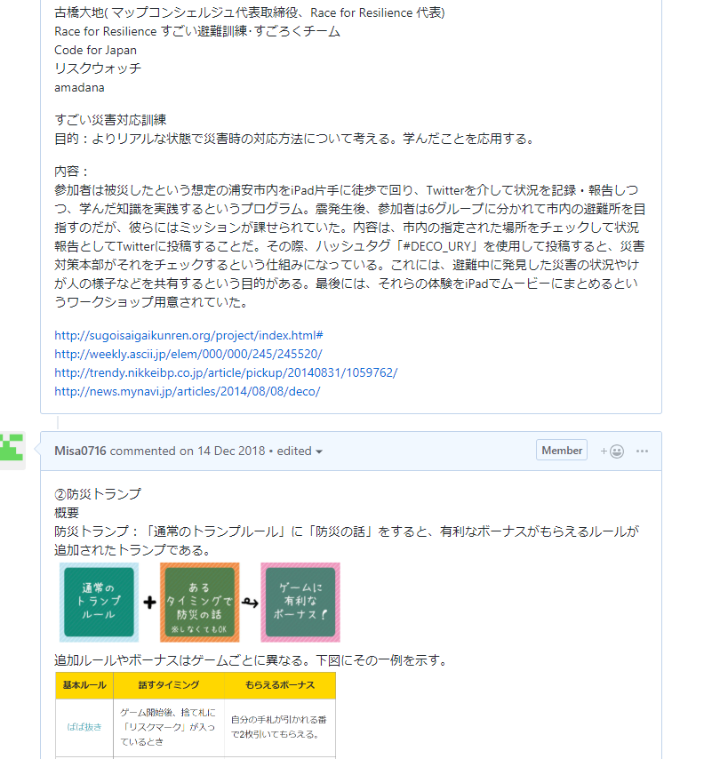
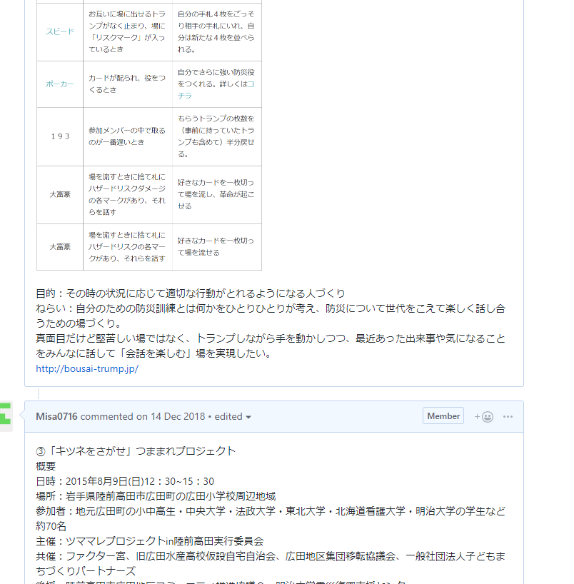
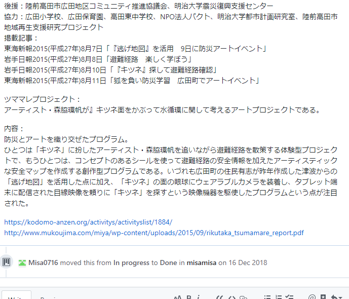

### 次世代版避難訓練LUDUSOS②

はい、今回は2章を公開します。

1章では「第2章では、次世代版避難訓練について説明するとともに、それが生まれた背景、従来の避難訓練との違いについて解説していく。また、類似した避難訓練について言及する。」と書きましたので、その通りに書いていきますよ～

次世代版避難訓練は、「自ら考え、決断し、行動する」という人を育てるための思考訓練を兼ねた避難訓練である。

ここまでが次世代版避難訓練の定義

次世代避難訓練が生まれた背景
日本は、他国に比べて気候・地形・造山運動等の地理的条件によって台風、大雨、洪水、土砂災害、地震、津波、火山噴火などの自然災害が発生しやすい国である。²日本の国土面積は全世界の0.28%であるのに対し、全世界で起こったマグニチュード6以上の地震のうち20.5%は日本で発生し、全世界の活火山のうち7.0%が日本に存在する。また、全世界で災害によって死亡する人の0.3%が日本人であり、全世界の災害で受けた被害金額の11.9%が日本のものである。このように、日本は世界でも災害の発生する割合が高い国となっている。

そうした事例を踏まえ国や自治体が国民を対象に防災訓練・避難訓練を実施してきたにも関わらず、²若者の3分の2は防災訓練に参加したことがないという統計結果が明らかになっている。

ここまでが次世代版避難訓練が生まれた背景で、以降は従来の避難訓練との違いと類似している新しい避難訓練の紹介です。

従来の避難訓練との違い
従来の避難訓練は、避難経路と避難先が定められており、参加者は引率者の指示によってのみ動くという受動的な仕組みになっている。 次世代版避難訓練は、従来のものとは違い、避難経路も避難先も定められておらず、引率者も設定されていない。また、ゲーミフィケーション要素を加えることで、参加者に訓練への能動的な参加を促す仕組みになっている。 このような新しい避難訓練はいくつか登場している。具体的には、「すごい災害訓練」「防災トランプ」「ツママレプロジェクト『キツネを探せ』」が挙げられる。

新しい避難訓練
先述した新しい避難訓練について概要を記していく。まず、「すごい避難訓練」、次に「防災トランプ」、最後に「ツママレプロジェクト『キツネを探せ』」の順に言及する。

「すごい避難訓練」
今回は、2014年8月4日から5日にかけて浦安市「立志塾」と共同で行った³「すごい避難訓練」ついて簡単に記述する。浦安市、浦安市教育委員会が主催のこの避難訓練は、浦安市総合体育館及び運動公園で実施された。対象は、市内9つの公立中学校の2年生である。総勢27名が参加した。被災したという想定の浦安市内を、参加者はiPad片手に徒歩で回り、Twitterを介して状況を記録・報告しつつ、学んだ知識を実践するというプログラムである。震発生後、参加者は6グループに分かれて市内の避難所を目指すのだが、彼らにはミッションが課せられていた。ミッションの内容は、市内の指定された場所をチェックして状況報告としてTwitterに投稿することである。その際、ハッシュタグ「#DECO_URY」を使用して投稿すると、災害対策本部がそれをチェックするという仕組みになっている。これには、避難中に発見した災害の状況やけが人の様子などを共有するという目的がある。訓練の最後には、参加者がそれらの体験をiPadでムービーにまとめ、発表した。 災害対策本部は防災無線を利用して市全体や地域ごとに情報や指示を伝達することは難しかった。しかし、Twitterを利用することでそれが極めて容易になる。そして、地域にいる人から現地の状況が寄せられることで、災害対策本部も被害の状況をいち早く把握できるメリットがあると、日経トレンディネットは報じた。今後、さらなるブラッシュアップが図られ、浦安市の先進的な取り組みが全国で実用化されることが期待されている。

「防災トランプ」
⁴「防災トランプ」とは、「通常のトランプルール」に「防災の話」をすると、有利なボーナスがもらえるルールが追加されたトランプである。

追加ルールやボーナスはゲームごとに異なる。下図にその一例を示す。

この防災トランプはその時の状況に応じて適切な行動がとれるようになる人づくりを目的に作成された。防災トランプを使用して遊ぶことで、自分のための防災訓練とは何かをひとりひとりが考え、防災について世代をこえて楽しく話し合うための場づくりの一助となることが期待されている。

ツママレプロジェクト「キツネをさがせ」
今回は、2015年8月9日に行われた⁵「ツママレプロジェクト『キツネをさがせ』」について簡単に記していく。ツママレプロジェクトin陸前高田実行委員会が主催し、岩手県陸前高田市広田町の広田小学校周辺地域で行われたこのイベントには、地元広田町の小中高生・中央大学・法政大学・東北大学・北海道看護大学・明治大学の学生など約70名が参加した。このイベントは、防災とアートを織り交ぜた二段階構成のプログラムとなっている。ひとつは「キツネ」に扮したアーティスト・森脇環帆を追いながら避難経路を散策する体験型プロジェクト、もうひとつは、シールを使って避難経路の安全情報を加えたアーティスティックな安全マップを作成する創作型プログラムだ。いづれも、昨年広田町の住民有志が作成した津波からの「逃げ地図」を活用した点に加え、「キツネ」の面の眼球にウェアラブルカメラを装着し、タブレット端末に配信された目線映像を頼りに「キツネ」を探すという映像機器を駆使したプログラムという点が注目された。 終了後のアンケートによると、参加者のほとんどがこのプログラムは子どもの安全や地域の理解に役立つと回答している。このような体験型プログラムは「理解しやすく、楽しめる、親しみやすい」「アートを用いることで興味をひき防災へとつなげることは良い」等の肯定的な意見が数多く寄せられた。その一方で、被災地における地元住民、特に子どもの参加が少なく、アーティスティックな安全マップは「おしゃれだけど字が小さいので万人受けではない」など、機能とアートのバランスが指摘された。

からの2章締めの言葉

このように新しい防災訓練については、様々な団体が考案・実行している。これらの試み中の次世代版避難訓練との類似点を挙げると、街歩き型であること・ipad等のテクノロジ連携ツールを使用していること・楽しく学ぶことのできる工夫がされていることである。防災トランプはこの中で唯一「まち歩き型」ではないが、低コストで場所を選ばず、手軽に楽しく防災を学べるという点で、防災訓練のひとつとして有用であることがわかる。

という感じに2章が終わりました。

GitHub上にまとめた

の部分をコピペしてちょちょっと言い回しを変えたり言葉付け足したりで2章完成です！

煮詰まったら先生や専門の人に何でも聞きましょう！

悩んでいる時間無駄ですよ～でも煮詰まるまではちゃんと考えましょうね～

あんまり人のこといえないんですけど()

次回は3章です！
