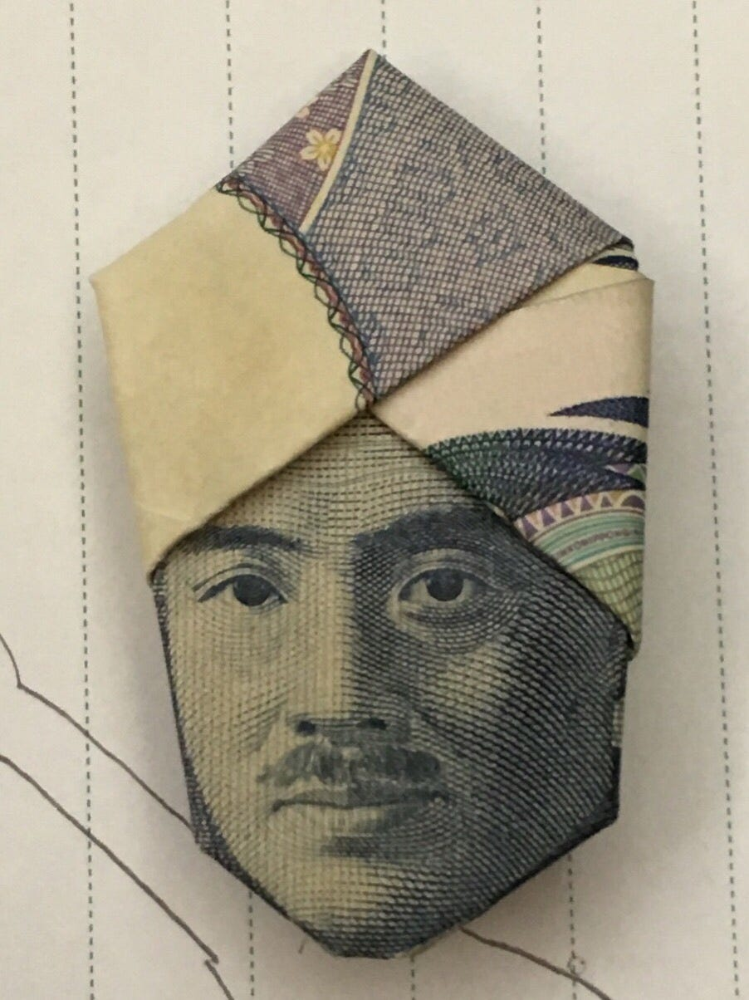

### 次世代版避難訓練③

前回に続き3章をお送りします！

「第3章では、次世代版避難訓練の実施原則と留意点について解説する。」

ということで、解説します。

全く面白みのない内容なので友達が折ったターバン野口を貼っておきますね。

さて本文行きましょー！

実施原則
次世代型避難訓練の実施原則は4つ設定されている。

1. 実際に街を歩き、街を観察するフィールドワーク型であること この避難訓練をフィールドワーク型にするのは、実際にその場で災害が起きたときにどのような危険が潜んでいるのかということを参加者に考えさせるためである。また、実際に街に繰り出すことで、災害時にどんな行動をとるべきか、何に注意しなければならないかを現実に即して考えることができる。このように、フィールドワーク型にすることで、参加者の災害時の状況を想像する力を高め、緊急時の冷静な対応につなげる。

1. 参加者を少人数のグループに分けること 参加者を少人数のグループに分けるのは、参加者1人に対する裁量権を高め、企画への関与度を高めるためである。この避難訓練は、実際の災害が起きた状況を想像し、取るべき最適な行動を参加者自身が決断する思考訓練である。思考訓練を実施するためには、周囲の人と意見を交換しながらも自身の頭で考え、判断することができる環境を作り出す必要がある。そのため、全員が意見交換をしやすい少人数グループで行うことが望ましい。

1. 訓練への制約 訓練への制約は2つある。ひとつは、避難経路と避難場所を参加者自身に決めさせること。なぜ避難経路と避難場所を参加者自身に決めさせるのかというと、想定外の事態における判断力の獲得と習熟を促すためである。実際に災害が起きた場合、公的に定められた避難場所が本当に安全かどうかはわからない。そのため、この避難訓練では、あらかじめ決められた避難場所や避難経路を利用するのではなく、災害時の様々な起こりうる状況を考慮して、参加者自身にどのような経路をたどり、どのような場所に避難するのが適切かを考えさせる。 もうひとつの制約は、時間の経過に伴い状況を変化させることである。状況を変化させる理由は、刻々と変化する災害時の状況を参加者に疑似体験させるためである。実際に災害が起きた場合、時の経過に伴い、二次災害が起きたり被災地域や被災状況に関する情報が氾濫したりすることが予測される。このとき、被災者は限られた時間で得られる情報をもとに、自身の行動を考えなければならない。そのような現実に起きうるハプニングや状況変化を訓練に付加することで、参加者が実際に被災したときの適切な判断の一助となり得る。

1. ゲーミフィケーションの付加 ⁶ゲーミフィケーションとは、遊びや競争など、人を楽しませて熱中させるゲームの要素や考え方を、ゲーム以外の分野でユーザーとのコミュニケーションに応用していこうという取り組みである。ゲーム独特の発想・仕組みによりユーザーを引き付けて、その行動を活性化させたり、適切な使い方を気づかせたりするための手法だ。本稿においてのゲーミフィケーションとは、人を楽しませて熱中させるゲーム要素という意味で用いる。 ゲーミフィケーションを訓練に取り入れる理由は、3つ挙げられる。 まず、自発的な学びの促進に効果的なためである。課題(この場合、防災ミッション)を達成して得られる報酬やフィードバックが参加者の意欲を掻き立て、自発的な学びを促す。また、楽しみながら取り組める点も理由のひとつである。最後の理由としては、実践力が身につくことが挙げられる。ゲームを通じて被災状況を疑似体験することで、より実践的な知識・対処法を身に付けることができる。

留意点
この防災訓練では、参加者自身が意欲的に訓練へ参加するという高い主体性が求められる。よって、参加者の主体性を高めるような設計が必要となる。その手法として、世界観の構設定・参加者間の仲間意識の構築が挙げられる 世界観を生み出すためには、会場の装飾・チケット・パンフレット等のデザインを統一させる必要がある。また、参加者をよりその世界観に入り込ませるために、スタッフ側の備品は参加者側から見えないように会場設計を行い、裏側を見せないことに留意する必要がある。 ゲーミフィケーションの導入もまた効果的である。参加者全員が高揚感を持って防災訓練に参加し、参加者の主体性を高める一助とする。 仲間意識の構築については、参加者に視覚的要素を指定することが有効である。例えば、参加者に赤色のアイテムを身に付けるよう指示することによって、赤色のアイテムというその日限りの所属を意識させる共通アイテムを生み出す。共通アイテムが存在することで、参加者間に仲間意識が芽生える。 また、仲間意識を構築する上でグループ編成にも留意点がある。それは、4~5人で1グループとすること・年齢や性別に偏りがないように編成することである。少人数にすることで主体性が高まり、参加者間でのコミュニケーションが円滑に行われる。同時に、年齢や性別に偏りがないようにグループ編成することで多様な視点を考慮したよりよい学びが得ることができる。 情報記録の手法についても留意しておきたい点がある。それは、イベント中に動画撮影・写真撮影をすること・オンタイムの議事録を作成すること・イベント終了後の行動変化を調査することである。これらを通して、企画全体を通した情報のストック、また、災害時における個人・集団の行動予測データとしての活用が可能となる。 最後に留意しておきたいのが、話題性の創出である。視覚的要素の徹底、自撮りスポットの設置によって、参加者がSNS上に防災訓練の情報を発信することを促す。参加者の口コミやSNSへの投稿によって発信された情報は、防災訓練の宣伝・記録に役立つ。

これらの内容は防災ガール代表からいただいた資料を参考に、逐一不明点をインタビューしながらまとめたものです。

わかりやすく簡潔にを目指しました！

実際資料と同じところもありますが、削った部分や付け加えた部分などなどあります。

こんな感じで3章を終え、次回は4章です。

いよいよプログラムの流れについてみていきます！

3章4章が肝ですよ～
