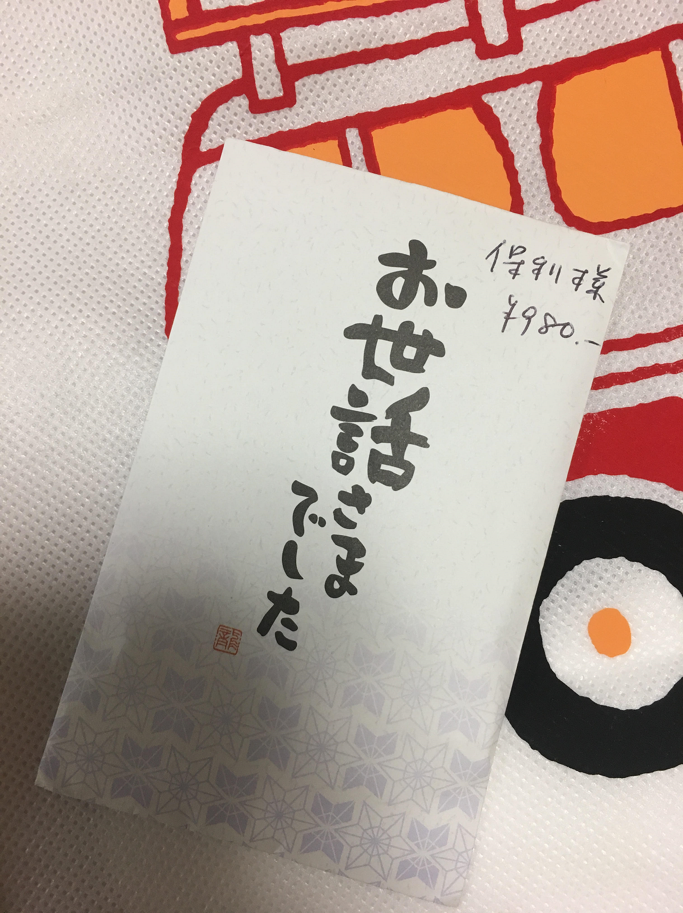

### 国境なき医師団のボランティアに参加してきました。

明けましておめでとうございます。

わたしは１月１５日に国境なき医師団主催のMSFスカウトキャラバンというイベントにボランティアとして参加してきました。

場所は鎌倉市立今泉小学校。鎌倉市民のわたしからするとthe 地元！な場所なのでアクセスもよくありがたかったです。

今回のイベントは小学６年生約６０人を対象に、ビデオやパンフレット、グループワークを通じて国境なき医師団の活動や移民問題について知ってもらうことを目的としています。人道問題に目を向け、人道の原則（独立、中立、公平）や、命の尊厳について考えるきっかけにしてもらおうというコンセプトです。

授業は前半後半合わせて９０分程度で、子供たちの集中力が切れないようプログラムが組まれていました。

前半は事前に学校の先生方から配布していただいたパンフレットを通して世界で貧困に苦しむ人たちの存在や、国境なき医師団に所属する医師の方や、看護師の方のインタビュービデオを通じ医師団の活動を知ってもらおうというものでした。今回医師団側の担当を務めてくださった三崎さんが中心となり授業をしてくださり、私たちボランティアは一緒に授業を受け、資料配布や貧困問題や難民問題に関するクイズのアシストをしました。

休憩を挟み、後半では２つのグループに分かれてもらい、難民を抱える国と難民を受け入れる側の国の立場にたって、どのような政策を行えばみなが幸せになれるのかというワークショップを行いました。わたしは受入国側のサポートをしました。子供たちは「戦争や貧しさで困っている国の人たちを助けてあげるか」という問いから始まり、助けるならどうやって助けるのか、自分たちもお金や食べ物をたくさん持っているわけではないけどそれでも助けてあげるのか、などさまざまな意見が飛び交いました。「住む場所と薬だけあげる」「ご飯の３分の１だけ分けてあげる」などど子供ならでは（？）の柔軟な発想が次々と出てきました。

グループディスカッションが終了し、三崎さんの「今日学んだ世界の現状に対してみなさんができることは必ずあります。その考えるきっかけに今日の授業を役立ててくれるとうれしいです」という言葉をもって授業は終了。

ボランティアに参加して思ったことは、年齢からして仕方のないことなのかもしれないが、悲惨な紛争地域や痩せ細った子供の映像を見ても、あまり身近に感じられず、真剣に考えていられていなさそうだな、ということです。

わたしは塾講師のアルバイトをしていて小学生の子たちと接する機会が普段からありますが、その子たちにも共通して言えるのは日本という豊かな国で生まれ育ち、衣食住に何不自由していない環境だと、どうしても貧困や紛争というものに対してのイメージが軽い、ということです。

勿論わたしもさほど変わらない世代で人のことを言えるような経験はしてきていませんが、たとえば生徒ととあるゲームの話になったとき、そのゲームは動植物を狩猟採取するサバイバルゲームで、経験値を稼ぐためには道端で草を食べているだけの草食動物を殺すそうです。わたしはその話を聞いたとき「どうしてこちらに危害を加えてこない動物まで殺すの？」と聞いたら、「殺したらポイントがもらえてゲームが進むんだよ！」という回答がかえってきました。たしかにその通りですが、あまりにも命が軽んじられているように感じ、複雑な気持ちになりました。

このような子どもの手の届く範囲で、生死を簡単に操れるツールがあるのは、子供たちの倫理観や道徳観を育むうえで、危険なのではないでしょうか。ゲームと現実の境はついているとはおもいますが、今回のような授業も、自分にメリットがないなら関係ない、などといった考えが根底にありそうだなという印象を受けました。

このような考えを払拭することはなかなか一筋縄ではいかないと思いますが、そういう考えを持つ人が一人でも減り、世界規模の問題なんだと考えられる人材を育てていくきっかけのひとつが今回の授業であればいいなと思いました。

プライバシーの問題から校内は撮影禁止で、資料も撮影できなかったため写真がほとんどないのですが、いただいた国境なき医師団のバッグをあげておきます…本当に写真がないんです…

ボランティアに参加したこと自体がほとんどなかったので貴重な経験をさせていただきました。国境なき医師団さんありがとうございました！
