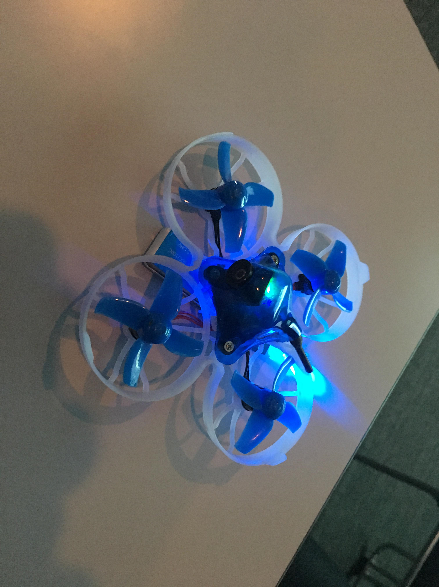
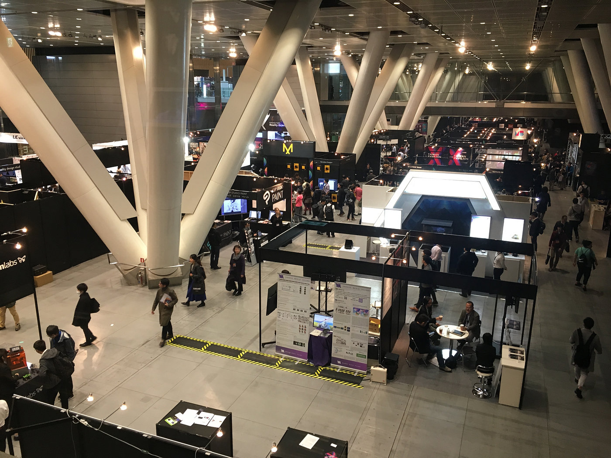
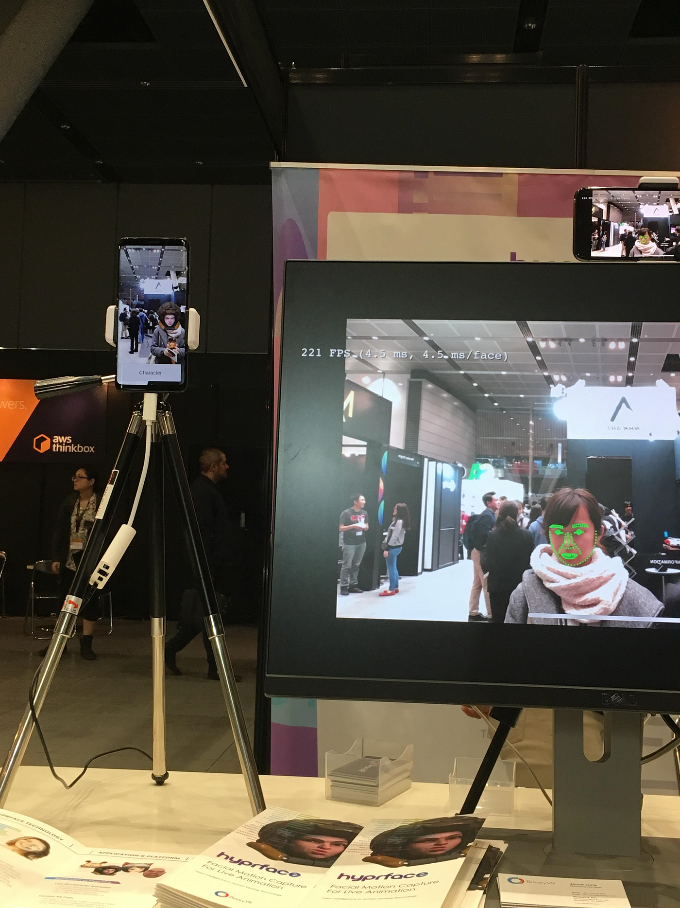
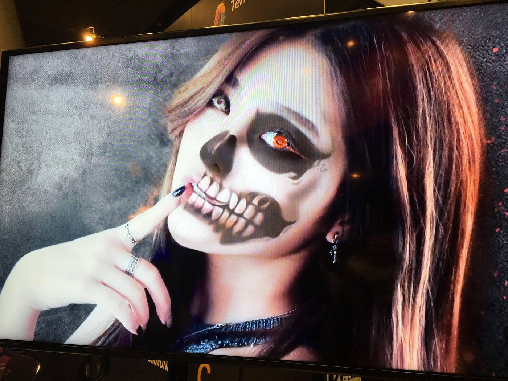
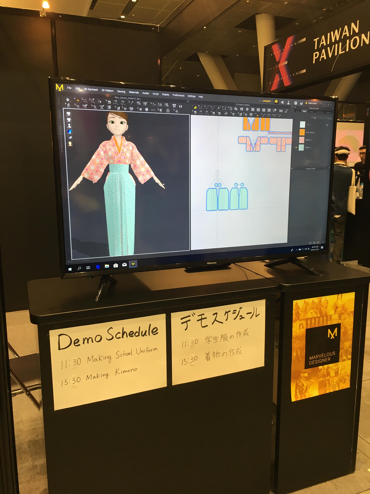
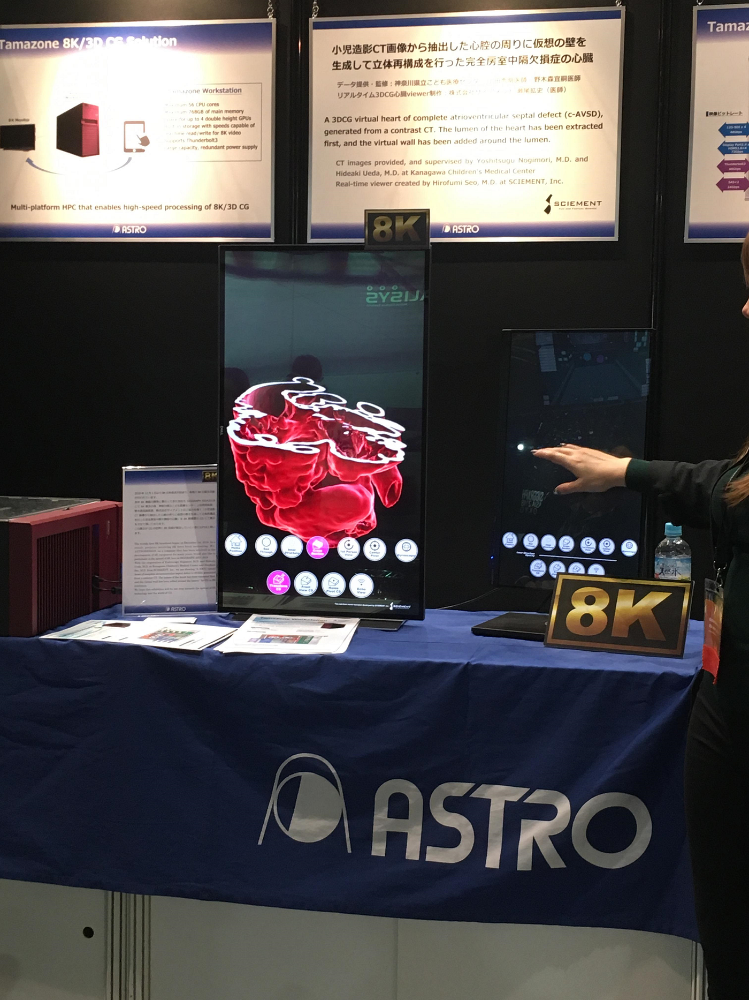
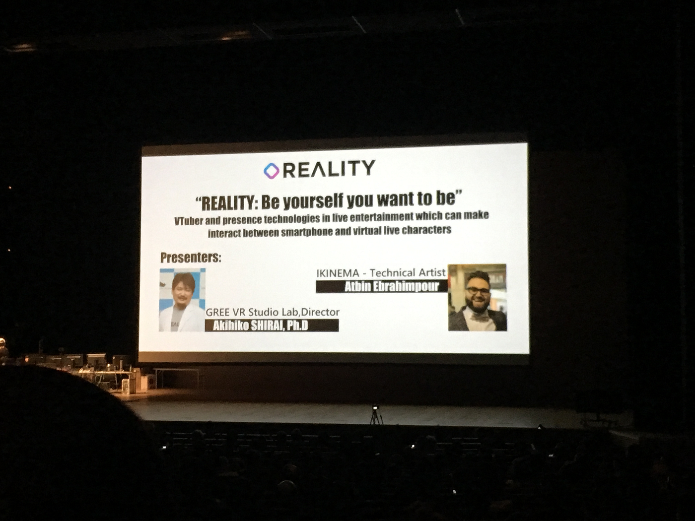
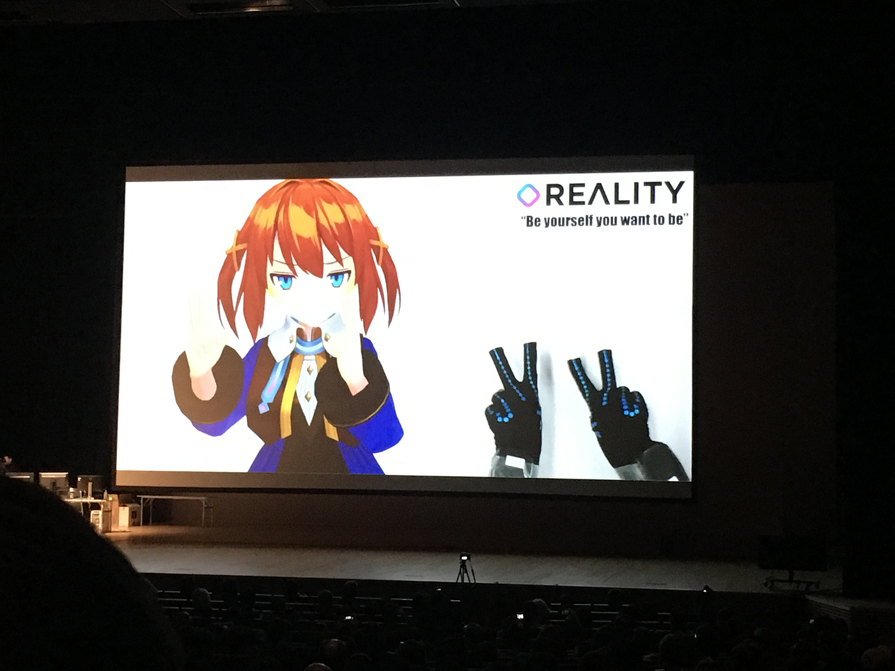

### シーグラフアジア２０１８

12月7日、有楽町にある東京国際フォーラムで開かれた国際会議、シーグラフアジア2018に参加してきました。
シーグラフとはSpecial Interest Group on Computer GRAPHicsの略であり、アメリカのコンピュータ学会における、コンピュータグラフィック、いわゆるCGを扱う部門であり、毎年冬にアジア地域で国際会議、展覧会が開催されています。
国際会議が最低一回参加必須なので、こちらに足を運んでみることになりましたが、チケットが驚きのプライス。70,000円。学生チケット12000円もありましたがそちらだと参加できるプログラムが限られてくるので両親に頭を下げ70000円の一般チケットを購入…。感謝です。
有楽町駅から道に迷いながらもなんとか到着。
とにかく会場が広い。あと外国人の方が多い。そこら中に英語が飛び交っていました。
受付を済ませ、事前にピックアップしていたプログラムへ。同時進行で色々なプログラムがあるためその中から興味のあるものを選んで行ってみることにしました。

まず午前はIntroduction of augmented FPV Drone Racingというプログラムへ。
受付が長蛇の列でそこに時間を取られてしまったのと、会議室がものすごく分かりにくい場所にあったため残念ながら最初からは見れず途中入室しましたが、入ってみると薄暗い部屋なの中でなにやらドローンの羽音が。薄いカーテン？のようなもので覆われたステージの中でドローン飛行が始まっていました。カーテンにはプロジェクターから文字が映し出されていました。
ステージにはドローン用の障害物があり、輪っかをくぐったり棒が立てられていたりと、その障害物の間をかいくぐりながら操縦するというものでした。
室内のため高さは1メートル程度でしたが、普段ゼミ活動で使っているものより小さめで、その代わり様々な色に光る機種で暗闇でも目立っていました。

午後はまずComputer Animation Festivalの上映会へ。めちゃくちゃ大きなホールで5分程度のショートショートのアニメーションを鑑賞しました。残念ながらこちらは撮影禁止でしたので本編の映像はありませんが、世界各国のアニメーション映像が上映されていました。
映像面からいうとモノクロとカラーの二種類があり、音声も無声と有声の二種類でした。
その中でも私が1番印象に残ったのはフランスのアニメーション”Virmine”です。

[Presentation
Edit descriptionsa2018.conference-program.com](https://sa2018.conference-program.com/presentation/?id=caf_281&sess=sess234)

見ていただければわかるのですが、終始暗い雰囲気の、とても楽しげなアニメーションとは言い難いのですが、心に訴えかけてくるものがあります。言葉で説明してしまうのは趣がないので、是非上のリンクからご覧ください。

そのあとはExperience Hallで様々な企業・団体の展示ブースを見学。

わかりにくいですが、こんな感じで顔にアニメーションを合成するモニターがあったり。

わたしも普段から愛用していますが、最近流行りの自撮り加工アプリなんかでこんなこともできたり。

こんな感じでその場でCGを使ってイラストに服をつけていったり。

個人的に一番すごいと思ったのはこちら。CTの画像からCGを作成、心臓病を患う心臓のモデルを作成したそうです。これを用いて手術のシュミレーションや研究をするそう。

最後のプログラムとして、古橋先生のお知り合いである、GREEの白井先生の参加するプレゼンを拝聴してきました。

こちらのプレゼンでは最近話題のバーチャルユーチューバーを取り上げ、その場でVRを使ったダンスやアニメーションを作成したりと見ていて楽しい内容になっていました。

プログラムは午後六時に終了。

朝から満員電車に揺られ東京へ向かうのはなかなかストレスでしたがそれ以上に普段目にすることのない面白いものをたくさん見学できました。このゼミに入っていなかったら絶対に参加していなかったことでしょう。

また、日本にいながら英語のプレゼンを聞く機会もなかなかないので、久しぶりに英語に囲まれた環境で留学時代を思い出しました。

[https://www.strava.com/activities/2004159650](https://www.strava.com/activities/2004159650)
