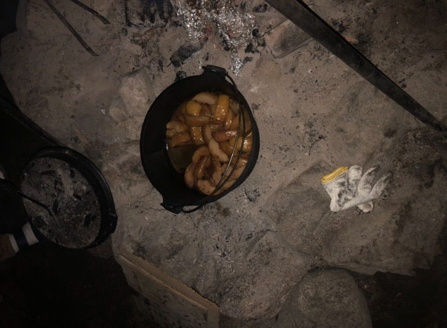
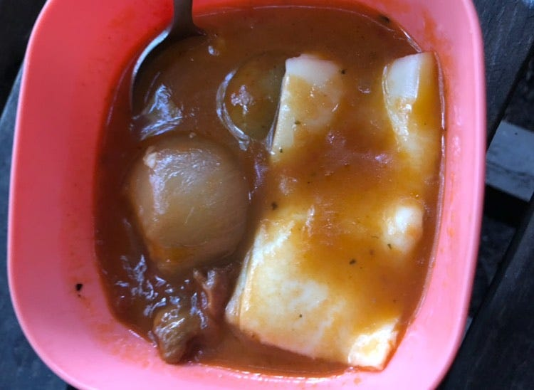
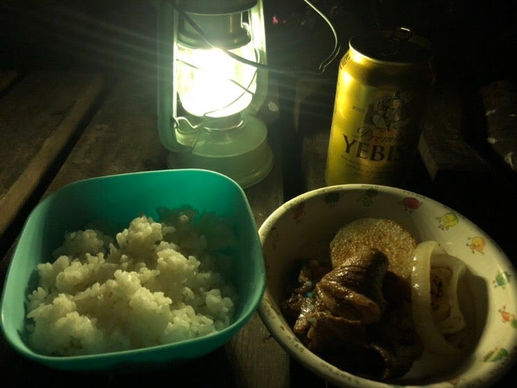
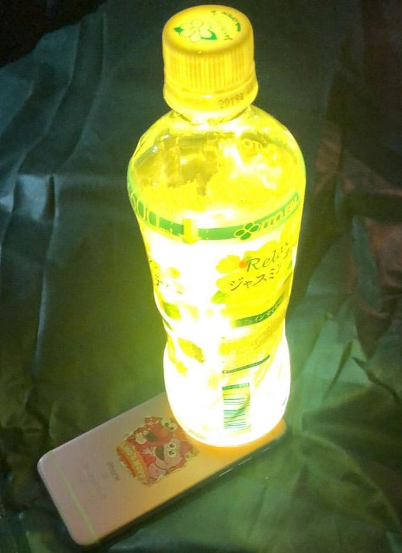
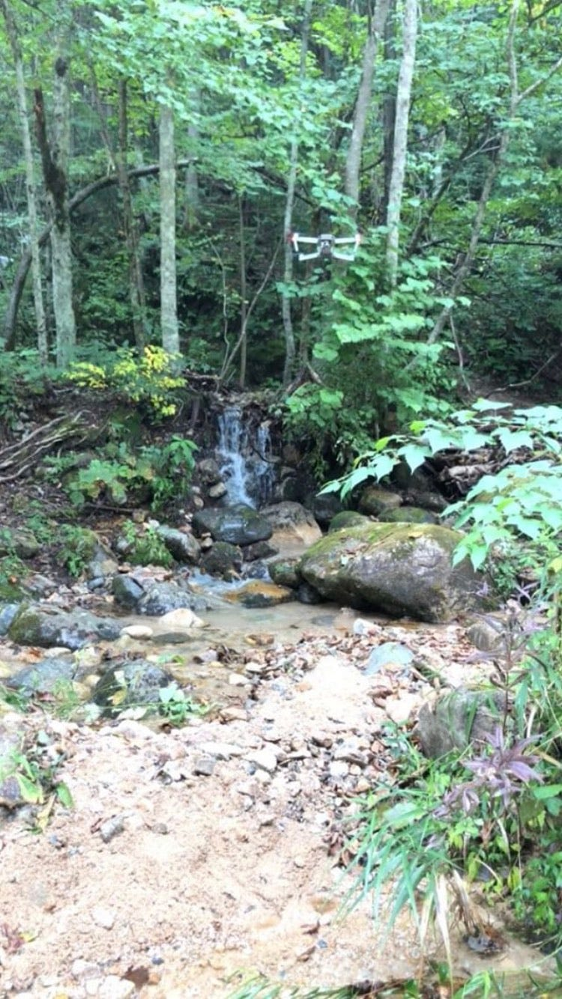

### ゼミ合宿＠森くら

9/22~9/24 、1泊２日で、長野県信濃大町にある千年の森自然学校にフィールドワークに聞きました。人生初のキャンプで、テントの設置の仕方や食事の準備など多くのことに戸惑いまくりでした。

**【一日目】**

道に迷い到着したのは午後４時過ぎ…森くらの方々用意していただいた食事を食べ、そのまま人生初のテント設営。

ゼミの先輩方からすでに暗くなっていた森でどうやってテントを立てるかのノウハウを学びました！地面が驚くほど硬くて、なかなかテントを支える棒を立てることができずに苦戦しました。あっという間に一日目が終わりました。

森くらに来ていた、自分よりも年下の高校生や大学生の子が手際よく作業する姿に驚きました。

[https://www.strava.com/activities/1857871265?utm_content=22923852&utm_medium=referral&utm_source=twitter](https://www.strava.com/activities/1857871265?utm_content=22923852&utm_medium=referral&utm_source=twitter)

**【二日目】**

朝５時に起きてそのまま朝食づくりへ。火をおこし鉄板でパンを焼き卵焼きを作り…まさにキャンプ！という感じの朝食でした。

自分たちで作ったものとは別に、スープを用意していただきました！玉ねぎやじゃがいもが丸ごと入っていて、チーズをトッピングしていただきました本当に本当に本当においしくて、あの味は忘れられません(´;ω;｀)

朝食で元気をつけたら、そのまま薪を運ぶお手伝いに行きました！冬に備えて薪をたっぷり準備しておく必要があるそう。インドア派を22年間貫いてきたので、薪を運ぶのはもちろん、山に登るのもほぼほぼ初めて…覚悟していってみると、もうすでに木が伐採されてある状態で、私たちはそれを転がして運ぶだけでした。だけ、といってもなかなか工夫がいるもので。どうやったら重たい木を山の下にあるトラックまで安全に早く運べるか。森くらの方にアドバイスをいただきゼミの先輩方と考えた結果…木を転がしていっきに山から下ろし、それをトラックに運ぶという作業の流れになりました。そして、おろした薪をさらに細かく切り、所定の位置に設置して、終了！

さて、それから買い出しに行き、夕飯！BBQ、さんまの塩焼き、やきりんご、きのこ汁etc…

超豪華で本当においしかったです。特にラム肉が絶品でした。留学先のマレーシアでラムを食べたとき、ちょっと苦手かもとおもっていたのですが…焼肉のたれがたっぷりしみ込んだラム肉！臭みもなくて感動しました。ずっとおかわりしてました笑

そして片づけをしてテントへ

北海道胆振東部地震でのブラックアウトのニュースを見たとき、スマホとペットボトルで簡単に作れるランタンが紹介されていたのを思い出し実践。普通のランタンよりも明るくなりました。

[https://www.strava.com/activities/1859975424?utm_content=22923852&utm_medium=referral&utm_source=twitter](https://www.strava.com/activities/1859975424?utm_content=22923852&utm_medium=referral&utm_source=twitter)

**【三日目】**

山を下り川のふもとでドローンを飛ばして帰宅しました。

ドローンから見る山の景色はすごくきれいでした！私この時がドローンを組み立てるの初めてでした。手順を間違えればドローンを壊してしまうことになるので、慎重に組み立てました…！

人生初のことだらけの３日間、古橋先生、森くらの方々、ゼミの先輩から多くのことをことを学び、充実した時間でした。

最後に、ブログの提出が大変遅くなり申し訳ございません。
