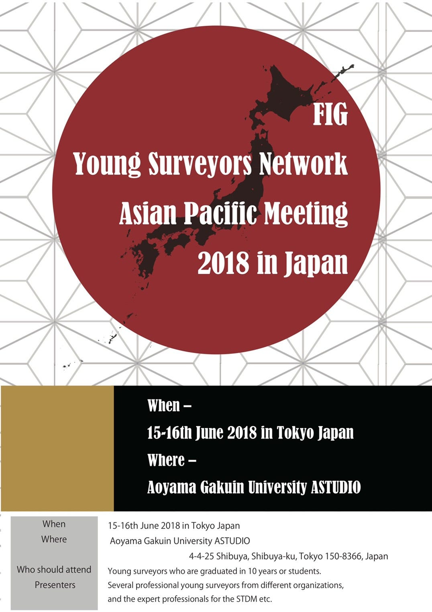
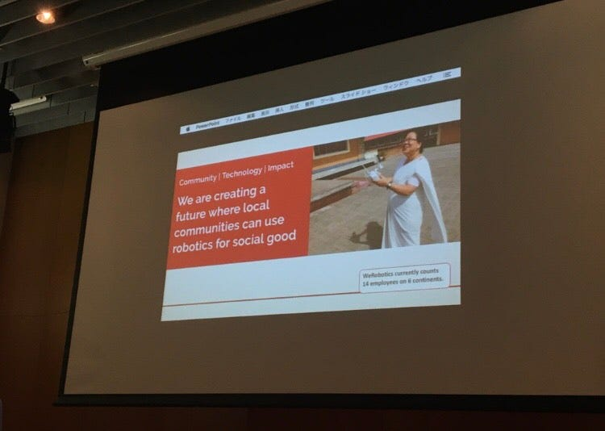
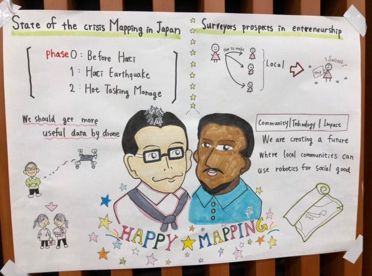

### 初の国際カンファレンス

今回は国連×古橋研究室young Surveyors Network 2018 in Japan に参加しました。

場所は青山キャンパスから300ｍほどの場所にあるAstudioというところでした。友人から、授業などよく行っているという話は聞いていたのですが、すごくきれいな場所でした！ゼミ生で、国際会議の準備と、来られた方の受付を担当しました。午後からは受付も落ち着いたため、会議に参加してグラレコを作成しました。

【準備】

まず、国際会議に来られた方の名札を作成しました。ですが、名札ケースが足りないというハプニング。3年生の福田さんと一緒に名札ケースの買い出しに行きました。しかし時刻は午前９時前だったため、どこのお店も営業前…なんとかドン・キホーテにたどり着き追加で100個購入。(スタジオに戻っている最中土砂降りの雨に見舞われ、戻った時には服を絞ったら水が滴るほどでした汗)

追加の名刺ケースに、来られる方の名前が印刷されている紙を一つづつ差し込み完成！

時間を割り振りして受付の業務に入ります。

【受付】

最初は人が少ないのですが、開始直前になると多くの方が来られました。日本人がメインだと思っていたら、大半が外国の方！世界中からこれだけの方がお越しになるんだということに驚きました。

役割を分担して３人で担当。一人は来られた方に名前を聞きリストにチェックを入れる係、もう一人は大量にある名札からその方の名前が書いてあるものを探す係、そして最後の一人は会議の部屋へ案内するという形でした。名前を聞くだけなのでここでは英語で話す機会があまりありませんでした。

【会議参加！】

さて、ドキドキの会議参加。私はこの時が古橋ゼミの課外活動にきちんと関わるのが初めてだったので少し緊張しました。

ＷE ARE CREATING A FUTURE WHERE LOCAL COMMUNITIES CAN USE ROBOTIC FOR SOCIAL GOOD

個人的にとても大切だと感じたワードだったので写真におさめました。

マップの可能性が感じられました。

人生初のグラレコです。先輩方にコピックなどを借りて作成しました。今考えると内容が薄い…精進してまいります。

会議も終わり、解散。最後に、会議に来られた外国人の方に日本はどうです？ときくと「せっかくだから寿司が食べたい」とおっしゃっていました。ほかにも色々と話していただいたのですが英語力が足りず…マレーシア留学から帰国して４か月経っていたため、英語力の衰えを感じた瞬間でした泣

会議に参加した日は「こんな風に地図が活躍することがあるんだ」としか感じていなかったのですが、ゼミの中で授業を受けてから思い返すと、地図にかける方の想いの熱さ、地図が必要性を感じます。世界中で地図によって救われる人や豊になる人がいるんだとうなと思います。

最後に、こちらの投稿も大変遅れて申し訳ございませんでした。
