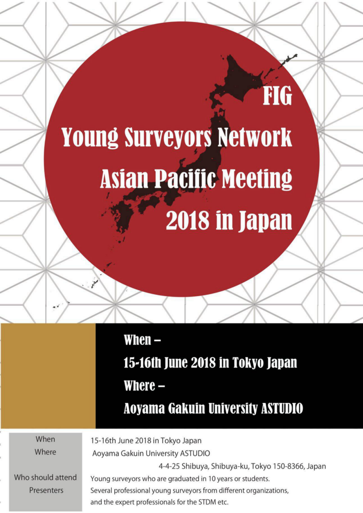
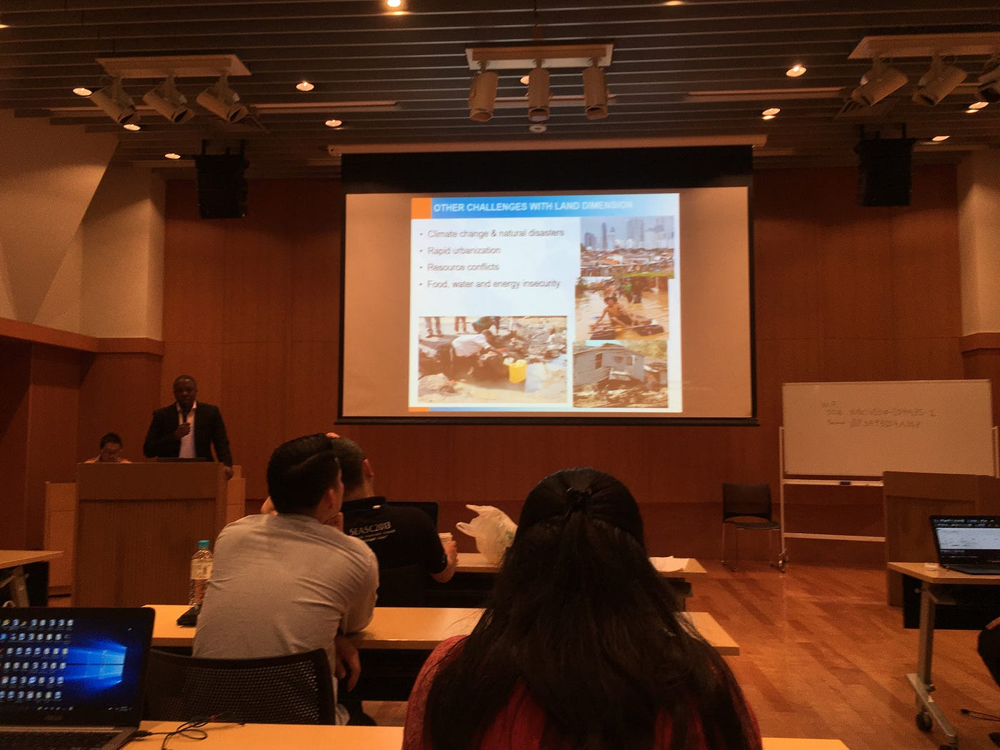
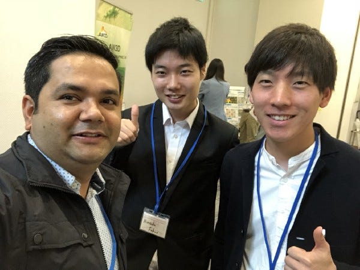

### FIG 2018 Day2 ~Opening Session~

久しぶりの投稿になります、3年の福王です。遅ればせながら、2018年6月に 青山学院大学アスタジオ で行われた、FIG Young Surveyors Network Asian Pacific Meeting in Japan Day2 の Opening Session についてのブログを投稿します...。

> FIGについて

FIGは国際測量者連盟であり、非政府組織として測量の進歩のためにあらゆる分野において国際的な協力を支援するのが目的の組織です。現在では、少なくとも110ヶ国以上の人々がFIGに参加しています。

（詳細は、[http://www.jsurvey.jp/jfs/fig.html](http://www.jsurvey.jp/jfs/fig.html)）

> 今回のカンファレンスの概要と目的

今回のカンファレンスでは、発展途上国において約70%の土地が土地登記簿に記載されていないという現状を踏まえ、これからの地籍制度の発展のために、アジア太平洋の**若手調査員の育成**と**協力関係の構築**を目的に、FIGの活動報告と今後の活動方針について情報共有を行いました。

> Opening Session の内容

Opening Session では、発展途上国を中心とする土地整備の課題を解決するために、**The Global Land Tool Network (GLTN)** が提供している **Social Tenure Domain Model (STDM) **という土地情報ツールについての紹介されていました。Opening Session は長いので、簡単にまとめさせていただきます。

土地整備に関して、発展途上国を中心に地籍制度が発展しておらず、誰がどの範囲で土地を所有しているのか把握できていない現状があります。地籍制度の未発達な地域では、地主による**経済的搾取**・行政機関による**土地開発への阻害**・災害後の**土地所有管理への弊害**などが生じています。このような課題を解決するためには、誰もが扱えるような世界基準での土地管理ツールが必要であり、そのツールとして**STDM**が開発されました。STDMは、**Free** かつ **Open Source** で**簡単な操作**が特徴であり、土地を**誰が**(個人or組織)**どのような土地権利で**(所有権or使用権or独占...)**何に利用しているか**(建物or農耕地...)を管理できるツールです。GLTNは、STDMを活用してグローバルな土地管理システムを構築し、**土地所有の明確化・平等化**を実現し、**持続可能な社会構築**を目指しています。

もっと知りたい方は、以下のURLを利用してください。

GLTN <[https://gltn.net/about-gltn/](https://gltn.net/about-gltn/)>

STDM <[https://stdm.gltn.net/](https://stdm.gltn.net/)>

FIGReport<[https://www.fig.net/resources/publications/figpub/pub52/Figpub52_japanese.pdf#search='FIG+STDM'](https://www.fig.net/resources/publications/figpub/pub52/Figpub52_japanese.pdf#search='FIG+STDM')>

> 最後に

今回のカンファレンスでは、オークランド在住で GEO-IT Lab CEO の Nabin Paudel さんと少しだけお話しさせていただきました。Nabin さんから、若手調査員の育成と国際協力の重要性について再度教えていただきました。今回のカンファレンスを通して、グローバルな視点では、土地管理が不十分であり、その課題を解決する新しい管理システムには当然ながらシステムを扱える人が必要であると身にしみました。
