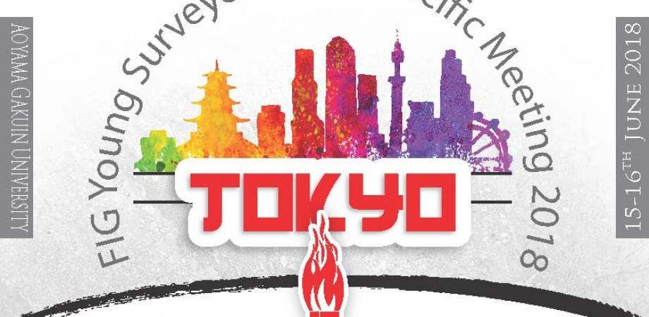
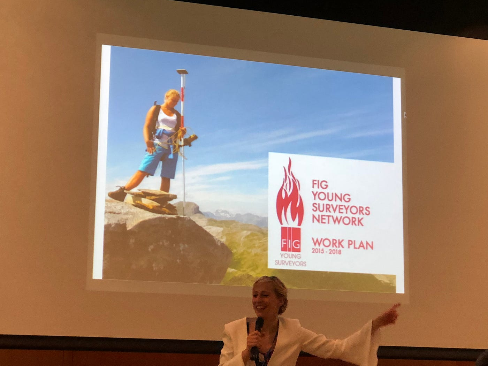
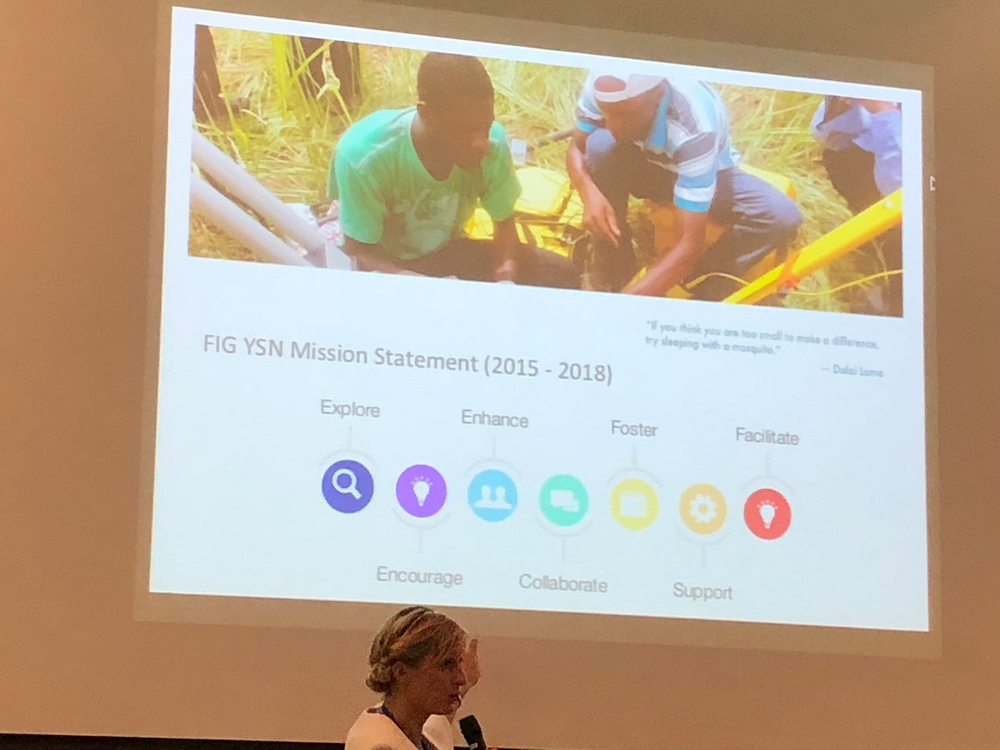
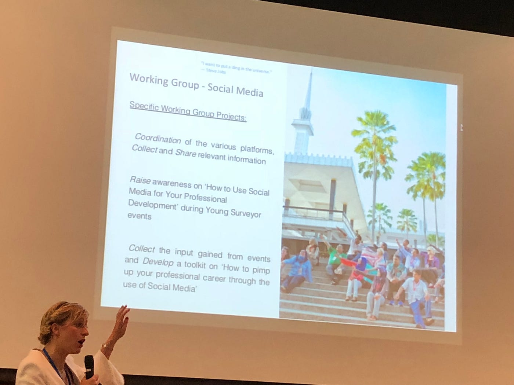
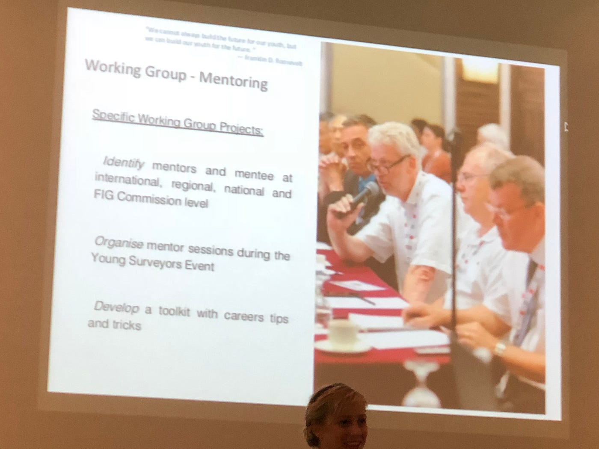
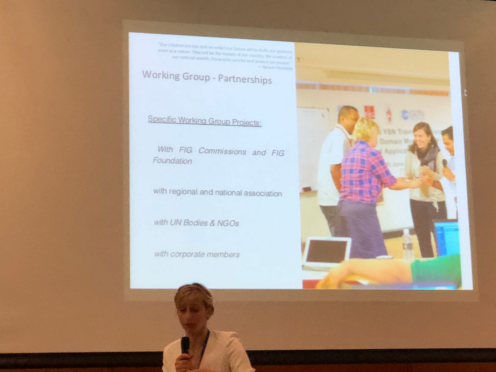
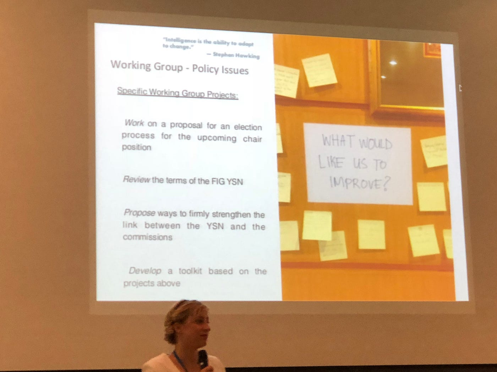
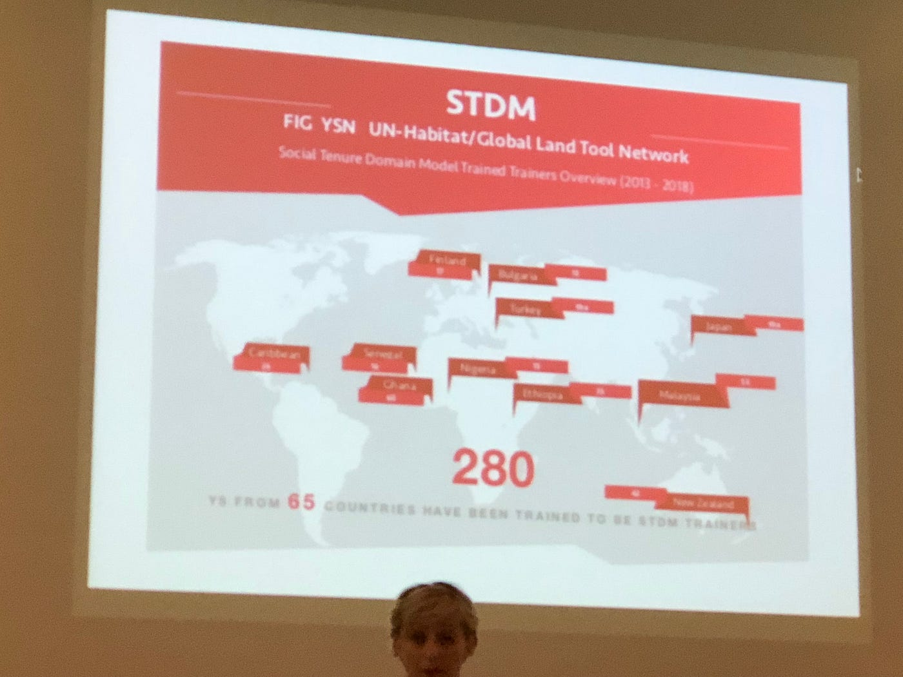
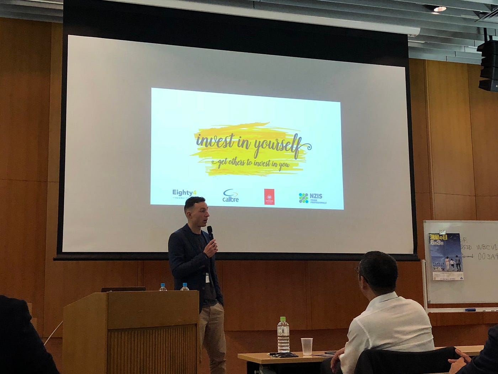
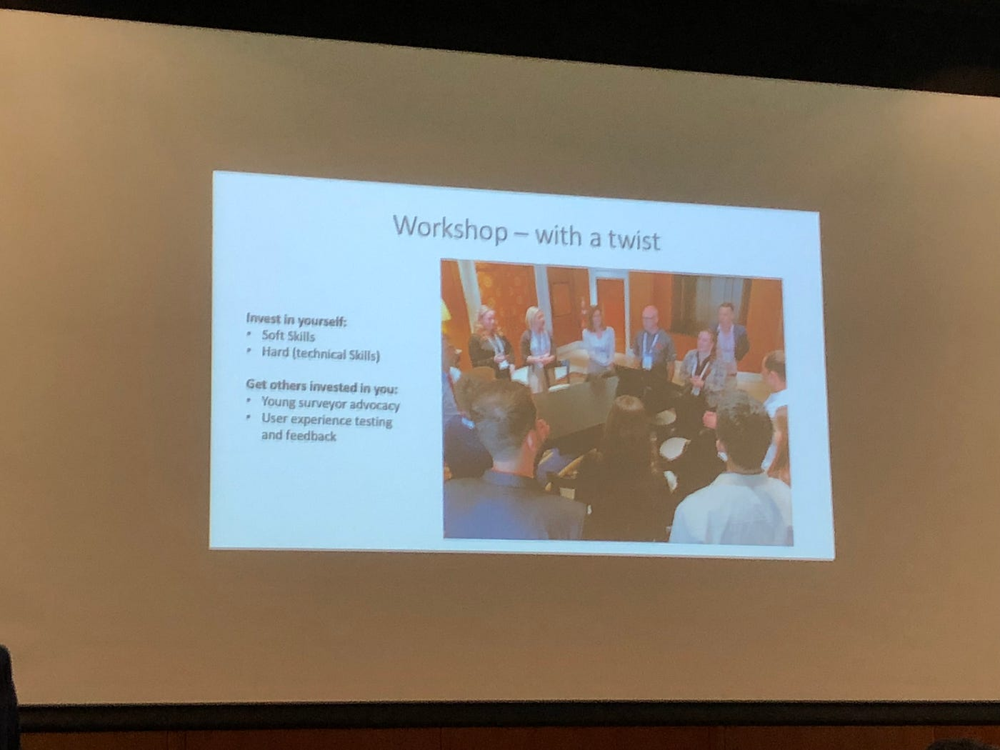

### FIG Young Surveyors Asian Pacific Meeting 2018 感想

初めまして。青山学院大学地球社会共生学部地球社会共生学科３年生の増田将馬です。今回のブログは6/15に行われたFIG Young Surveyors Asian Pacific Meeting の１日目について書きます。

開催場所は表参道駅から徒歩５分程度の青山アスタジオで行われました

> _**このカンファレンスの目的と概要説明_**

今回行われたカンファレンスの主な目的は、FIGに参加する若手専門家の数を増やすため、そしてその若手専門家がこのカンファレンスで他の専門家と知り合いキャリアをスタートする手助けをすることです。さらに委員会と学生と若手専門家ネットワークとの協力関係を強化することが目的として掲げられていました。

> _**セッションの内容解説_**

僕が拝聴させていただいたのはFIGについての説明でした。

FIGでは以下の７つのミッションを掲げているとおっしゃっていました。

Explore：探求すること、Encourage：促進する、Enhance：高める、Collaborate：力をあわせる、Foster：育てる、Support：助ける、Facilitate：円滑にする

これらのミッションを掲げ、様々な活動を行なっているそうです

FIGは地域的ではなく世界的に活動しているそうです

２０１３年から２０１８年までの間に、なんと６５カ国の国とネットワークが繋がっており、世界中にFIGの専門家がいるそうです。

自分自身に投資させるためには大きく二つのスキルが必要と言っていました。Soft SkillsとHard(technical Skills)です。両スキルとも働くにあたってリーダーになること、楽しい職場にするために必要なスキルだそうです。

> _**会場にいる外国人とどんな会話をしたか_**

僕は午前中会場への案内をしました。そこで外国人に会場について聞かれたので少し英語で会話をさせていただきました。急な英語でびっくりはしましたが、留学から帰って来て少し英語の実力が上がっていると実感できた瞬間でした。
