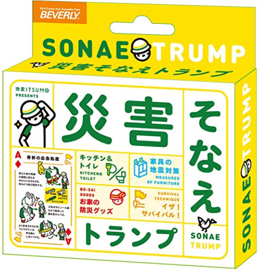

次世代版避難訓練④

前回の投稿からかなり間が空きましたね。
このまま更新やめようか迷いましたが乗りかかった船なのでちゃんと卒論内容だけでも公開させてからやめます。

というわけで、4章いきまーす！

長いので三回に分けます。

さて、「第4章では、連携ツールを紹介するとともに、プログラムの流れについて説明する。」

というわけで、紹介&説明します！

次世代型避難訓練は、「自ら考え、決断し、行動する」という人を育てるための思考訓練を兼ねた避難訓練である。このプログラムは避難訓練実施地域により適性のあるツールと連携して行うことができるため、どのような環境・要望にも柔軟性に対応することができる.

次世代版避難訓練イメージ(©️防災ガールCC BY 4.0)

[user-images.githubusercontent.com](https://user-images.githubusercontent.com/13146549/50547322-328b2000-0c7b-11e9-9372-0b5be00d598d.PNG)

上の図中にあるTOLAF、カードゲーム、テクノロジ連携の順にプログラムの流れについて説明する。

まずは概要を述べて、以下で説明していきます。

### 1.TOLAF

TOLAFとは、Think Our Life and Futureの略で、防災ガール独自の用語である。LUDUSOSとして選択可能な訓練手法の一つで、大きな特徴は特別な道具やITツールを必要としない街歩き型の体験型訓練手法である。予測されている南海トラフをはじめとする様々な災害に関し、自分たちの生活や未来、大切な人のことを考えて行動するという意味が込められている。この避難訓練は、事前情報なく、携帯電話も使用せず、チームで協力し、同行スタッフの問いかけのもと、制限時間内にたどり着ける最も安全な場所を見つけ出す街歩き型訓練である。訓練の流れは以下の通りである。

#### 流れ

1. 集合

1. ルール説明

1. チーム別街歩き

1. フィードバック

#### ルール

- ４~５人で１チームとなり制限時間以内に避難する

- 制限時間以内に安全な経路を選択し、安全な場所まで避難する。

- 参加者は注意・予測・行動を自ら考える。

- 訓練終了後は個々の考えを共有する。

TORAFについては実施例があったので、インタビューに加えてネット上に散らばっている情報を引っ張ってきてまとめました。

### 2.カードゲーム

LUDUSOSのひとつとしてカードゲームが検討された。しかし、現時点で実装可能段階にまで至っていない。一般社団法人防災ガール代表田中美咲氏によると、アイデア次第でカードタイプへの応用も可能であると考え考案したに留まっている。今後、LUDUSOSのプログラムのひとつとしての有用性の有無は再検討の余地がある。

カードゲームについての実施例はなく、インタビューでも得られた情報は「考案段階であること」「使用するカードゲームは何でもいいこと」のみで記述に困りました。なので上記のように記しました。

### 3.Ingress

⁷IngressとはNiantic(リリース当時はNiantic Labs)が開発したスマートフォン向けのゲームアプリだ。地図(2018年12月現在はOpenStreetMapを使用)上の位置情報と連動した世界規模の陣取りゲームで、緑色の「エンライテンド（覚醒者）」と青色の「レジスタンス（抵抗勢力）」の2つの陣営に分かれ、それぞれの陣地やポータルと呼ばれるPOI要素を奪い合う。プレイヤーは現実世界の名所や駅、モニュメントなどに割り当てられたポータルを自分の陣営のものにし、そのポータル3カ所をつないで描いた三角形の陣地を獲得することで得点が得られる仕組みとなっている。ポータルを獲得するためにはその場所を訪れる必要があることから、ゲームを楽しみながら街歩きができるアプリとしても人気が高い。Ingressは実際の街を歩くという特性を活かし、世界各地で大規模なイベントも開催されている。アプリはiOSとAndroidの両方に対応しており、2014年には「文化庁メディア芸術祭」のエンターテインメント部門で大賞を受賞、2015年には「ゲームデザイナーズ大賞」を受賞するなど、多方面から評価されている。 このゲームを活用した防災訓練の流れは以下のように想定されている。

#### 流れ

1. 集合

1. ルール説明

1. 防災ミッション

1. ワークショップ(学びの共有・公共情報の共有)

1. フィードバック(獲得ポイント数・勝利陣営の発表、アンケート実施)

#### 内容

２つの陣営に分かれ、制限時間内に防災施設を巡るゲーム中のミッションをクリアしミッションメダルを獲得することを目標とする。メダルごとにポイントを振り分け、獲得ポイント数が多い陣営が勝利となる。訓練前後での街の見え方や自身の考えかたの変化を共有することで、防災について学びを深めるプログラムとなっている。

#### 備考

Ingressを利用したLUDUSOSを実施する場合、参加者はIngressを自身のスマートフォンにインストールしておく必要がある。Ingress初心者にとって、Ingressのルールを直感的に理解するのは容易いことではないため、訓練をスムーズに実施するにあたって、丁寧な説明が要される。

Ingressは古橋ゼミ生ならご存じかと思います。
Ingressについての実施例は比較的多かったのでさほど苦労せずまとめられました。

[次世代版避難訓練×ingress『LUDUSOS』速報レポート！！
8月31日(月)、朝7時15分から渋谷ヒカリエにて、次世代版避難訓練×ingress『LUDUSOS』を行いました。bosai-girl.com](http://bosai-girl.com/2015/08/31/ludusos0831/)

こんな感じの記事が複数アップされているので眺めてまとめて書き起こしました。

長くなってきたのでこの辺で終わります。
次回、第4章パート2です。
