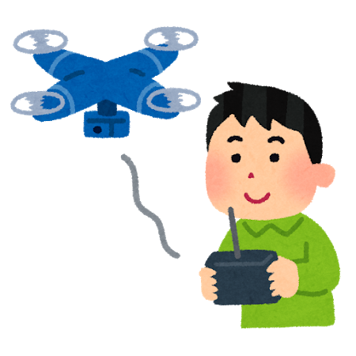

### 次世代版避難訓練④‐２

次世代版避難訓練第４章パート2です。
区切る理由は、ざっと見直す時に長すぎると読むのが面倒だからです。

それでは前回の続きといきましょう。

### 4.Uber

⁸Uberとは、2010年米国サンフランシスコにてスタートしたハイヤーやタクシーを配車するアプリである。現在58カ国・300都市以上で利用でき、日本では東京で2014年3月に正式にサービスをスタートした。スマートフォンで2タップで車を呼べ、支払いも登録したクレジットカードで行うことが可能なため、財布いらずで乗車が可能となっている。 LUDUSOSのひとつとしてUberとの連携が検討された。しかし、現時点では試作段階である。今後の改善、改良が期待される。 このアプリを利用した防災訓練の流れは以下のように想定されている。

#### 流れ

1. スタッフ練習

1. 集合

1. ルール説明

1. 防災ミッション

1. ワークショップ

1. フィードバック

#### 内容

観光地、建物・モニュメントが多くある地域が実施に適していると考えられる。具体的な内容としては、参加者が指定した地域内に広がり、Uberを活用しガイドとなる人を現在位置まで呼ぶ。そこから避難場所まで災害時にどのようなことが起こると想定されるか考える。

正直Uberについては理解が及んでいません。想定されていた訓練の流れについて何度も読みましたが大まかにしか理解できず、せめてわかりやすくまとめなおそうとした結果が上記のものです。

### 5.ドローン

ドローンとは、無人飛行機の総称である。ドローンの機械内部にプログラムを書き込むことで、自動で操作できるようになっている。ドローンにはGPS機能が搭載されており、どの場所にドローンがいるのかわかるようになっている。また、カメラ機能もあるドローンの場合は映像を見ながら、自分の目線で動いているかのように操作することもできる。 LUDUSOSのひとつとしてドローンとの連携を検討されている。しかし、現時点では試作段階である。今後の改善、改良が期待される。 ドローンを活用した防災訓練の流れは以下のように想定されている。

#### 流れ

1. 対象地域で起こりうる津波や竜巻の高さや速度を調査、ドローン設定

1. ルール説明

1. 防災ミッション

1. ワークショップ

1. フィードバック

#### 内容

対象地域に起きうる津波や竜巻の高さ・スピードを調査し、それと同じように動くようにドローンを設定する。津波や竜巻を模したドローンに追い越されないように逃げる訓練である。沿岸部、竜巻やハリケーンが発生しやすい地域との相性がいいと想定されている。津波や竜巻がどのくらいの速度で襲ってくるのかを体感することで、参加者は指定された避難経路や対策で間に合うのかを確認することができると期待されている。

こちらも未実施のものです。Uberと同様に、すでに記述されていた想定された流れをわかりやすくまとめなおした結果が上記のものとなっています。

次にUTMグリッドについて書いているのですが、記述が長いので次回に回します。

それでは次回、次世代版避難訓練第４章パート３をお送りします。
