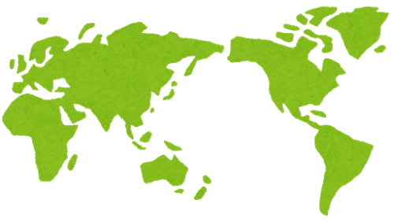
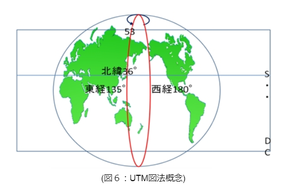
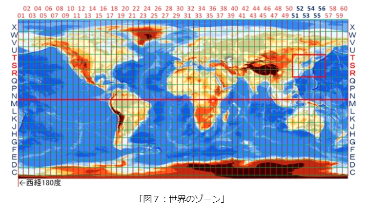
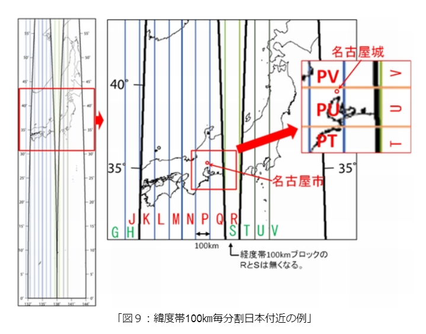
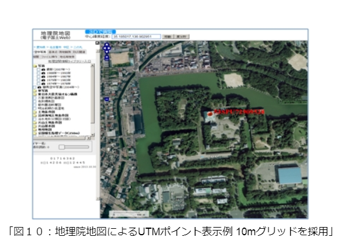
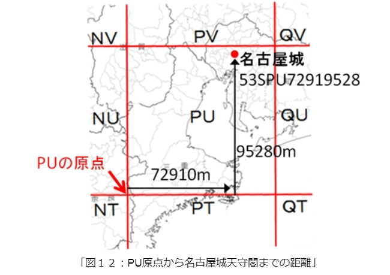

### 次世代版避難訓練④‐３

次世代版避難訓練第４章パート３です。

今回はUTMグリッドの回です。
UTMグリッドとはなんぞやから訓練の流れまでを記述します。

### 6.UTMグリッド

まず、UTMとは、ユニバーサル横メルカトル(Universal Transverse Mercator)の略語である。球体である地球を平面に表す投影法のひとつだ。地球の赤道面を中心に横にした円柱である地球を投影したもの。球体を平面に投影する際、ひずみが生じる。UTM図法では、ひずみが少ない範囲にある経度6度の幅を用いる。

⁹UTMグリッド地図とは、ある場所を特定するための仕組みである。定められたルールに従って等間隔の格子線(以下グリッド)を引いて区画を分け、個々の区画に番号付けを行い、その番号を使って位置情報をやり取りすることができる。以下、ルールを解説する。

国際的にも用いられているMGRS(Military Grid Referense System)という規則に従い、緯度経度方向のグリッドで分割する。経度については、地球を西経180度より左回りに6度毎に60個の経度帯に分割する。緯度については、南緯80度より8度毎に、北緯84度(北緯72度～北緯84度だけは12度の範囲)までを20個の緯度帯に分割する。こうして分割された各ブロックは、3文字の英数字を用いて命名する。 経度帯は、西経180度より東周りに、01、02、……60の数字で表す。緯度帯は、南緯80度より、C、D、……X(最後のXは12度幅；A、B、I、O、Y、Zは欠番)の20個のアルファベットで表す。こうして各分画は、2桁の数字とアルファベットで表せることになる。(例：53S)

日本は、東経122度～153度、北緯24度～46度の範囲に位置している。よって、経度帯51～56、緯度帯はR、S、Tに位置することになる。

UTMグリッドでは西経180度と赤道を基準として、上記の方法で分割された範囲をさらに100㎞四方のブロックに分割し、各ブロックをアルファベット2文字で表す。100㎞毎のブロックを表すアルファベット1文字目は東西方向の位置を表し、赤道上の西経180度を西端とする領域より東条項の100㎞毎に、A、B、C……Z(I、Oは欠番)の24文字を付与する。 各経度帯は100㎞毎のブロックに分けられないため、東端と西端は隣の経度帯の両端とブロックに重複が生じる。6度幅の経度帯はおよそ8つのブロックに分けられ、24個の文字で3つの経度帯に文字が付与されることになる。そのため、4つ目の経度帯は再びAからつけられることになる。なお、赤道面を基準とした100㎞ブロックは、経度1度の長さが高緯度になるほど短くなるため、隣り合うゾーンで重複したブロックを表す記号が連続しない場所がある。(図９)

アルファベットの2文字目は緯度方向の位置を表す。北半球では、奇数の経度帯(01、02、03……、59)について、赤道より北へ100㎞毎にA、B、C……、V(I、Oは欠番)のアルファベット20文字を繰り返し付与する。偶数の経度帯(02、04、……、60)では、赤道より北へ100㎞毎に奇数の緯度帯の場合と同じアルファベット20文字をFから始めて、G、H、……、C、D、Eの順に繰り返し付与する。このルールに従って名古屋市中心部を表すと、経度帯緯度帯のブロックが53S、100㎞のブロックがPUに属していることがわかる。

次に、名古屋城天守閣の位置を例として、UTMグリッドポイントの命名規則と使い方を解説する。地理院地図を使用して名古屋城天守閣を右クリックし、UTMポイントを表示を選択すると、「53PU72919528」と表示される。

このUTMポイントのうち、左からの英数字3文字”53S”は6度×8度のブロック(経度帯が53、経度がS)を示し、次のアルファベット”PU”で100㎞ブロックを示す。残りの数字8文字”72919528”は、100㎞ブロックの原点(PUの南西隅)からの位置を表し、はじめの4桁が原点から東に測った距離を次の4桁は原点から北に測った距離を10mの単位(原点から東に72910m、北に95280m)で表している(図11)。

UTMグリッドのルールに則りUTMポイントを使うことで、名古屋城天守閣の位置を地名や住所を使うことなく特定することができた。 また、同じブロック内においてUTMポイントは共通する原点からの距離を表しているので、2つのUTMポイントの比較からそれらの間のおおよその距離を求めることができる。例として、名古屋市役所のUTMポイント「53PU73609480」と名古屋城天守閣のUTMポイント「53PU72919528」を比較する。名古屋市役所は名古屋城天守閣より、およそ東に690m(7360–7291=69)、南に480m(9480–9528=-48)の位置にあることがわかる。 UTMポイントにおいて、原点からの位置を示す文字数は、もくてきに応じてより詳細なグリッドに対応させて増大させることができる。例えば、1m単位を伝えたい場合には、10文字を用いればいい。こうして地上の任意の場所をより細かく特定することが可能なのがUTMグリッドの特徴である。このように、災害発生時において救助隊として広域から派遣されたり、自身が救助隊として広域に派遣されたときに、地名を使わずに正確な場所を伝え合うツールとして、UTMグリッドは有用である。 UTMグリッド地図を活用した防災訓練の流れは以下のように想定されている。

#### 流れ

1. オープニング

1. ルール説明

1. 使用アイテムの確認

1. 避難訓練

1. ワークショップ(調査員と司令員の視点の違いを共有)

1. 結果発表

#### 内容

野外で調査を行う「現地調査員」と屋内で複数の情報を整理・分析し、遠隔で指示を行う「司令員」に分かれ、ミッションを通してポイントを競う。調査員は指定された場所の危険個所の調査と指定場所からの避難経路上の気づきを報告する。司令員は防災知識を記したカードを利用して現地調査員の避難経路を作成・指示する。ミッション後はチームごとにそれぞれの気づきを共有し、調査報告書を作成する。

UTMグリッドとは何ぞやに関して国土地理院の公式サイトを参照しました。コピペはしてません。ちゃんと読んで考えて書き換えました。ただ、国土地理院の公式サイトがあまりに綺麗に上手くUTMグリッドについて記述していたので、そこまで手は加える必要がありませんでした。

一般の人はこれでは理解できないのではと指摘をいただきましたが、こういった訓練を実施するならば

訓練の流れに関しては実施例があったので以下のような記事を参考に記述しました。

[「LUDUSOS」秋葉原 実施しました！
9/5(月)、秋葉原UDXにて次世代版避難訓練LUDUSOSを実施しました。 「防災をすることが当たり前の世の中にする」をミッションに掲げている防災ガール。とことんやりたくなる避難訓練、を目指して３回目の実施となります。bosai-girl.com](http://bosai-girl.com/2016/09/15/ludusos_akihabara/)

UTMグリッドは使えると便利ですよね。ゲーム感覚で楽しく使い方を覚えられるところがミソです。

さて、以降は過去の実施例のまとめになります。

では次回、過去のLUDUSOS実施例を書いていきます。
