### 次世代版避難訓練⑤

第１章で「第５章では、過去に実施された次世代版避難訓練について紹介する。」と記述した通り、今回は過去に実施された次世代版避難訓練について概要を述べていきます。

この章の中身はネット上にある情報をまとめたに過ぎないので、今回は長めですが分けずにそのまま載せます。

### 5.これまでに実施した次世代版避難訓練について

この章では、過去に実施された次世代版避難訓練のうち、熊本県長洲町・世田谷区・渋谷区で行われたTOLAF、渋谷・二子玉川・秋葉原で行われたLUDUSOS×について概要と参加者のフィードバックを記述する。

### 次世代版避難訓練TOLAF×熊本県長洲町

#### 概要

日時：2015年1月17日 10:00～12:00 場所：長洲町立腹栄中学校体育館 参加費：アイテム代 100円 参加資格：特になし 持ち物：ペンとメモ、防寒対策

#### スケジュール

10:00 受付 10:15 企画説明・チーム分け・アイテム付与 10:30 避難訓練 11:30 振り返り 12:00 解散

#### 内容

1時間ウォーキング その後気づいたことを共有する

#### フィードバック

ベビーカーを押して避難するのは困難 子供と一緒に避難するときのイメージができた

### 次世代版避難訓練TOLAF×渋谷区

#### 概要

日時：2015年1月17日9：00‐12：00 場所： 東京都渋谷区道玄坂2丁目10番12号 新大宗ビル3号館 9階 MOVIDA JAPAN 株式会社（モビーダジャパン株式会社） 参加費：1,000円持ち物：ペンとメモ、防寒対策、動きやすい服 参加資格：特になし

#### スケジュール

8:45集合 9:00企画説明 11:30 避難訓練 12:00 結果発表と集合写真

#### 内容

首都直下地震がおきたと仮定する。事務局からのミッションを達成し、渡される情報が正しいかどうかを見極めながら歩くチーム戦である。

#### フィードバック

それぞれのチームでの考えや結論は異なり、避難先も全く違った いろんなひとの考え方や見方が新鮮で学びになった

### 次世代版避難訓練TOLAF×世田谷区

#### 概要

日時：2015年3月25日13:00～16:00 ※12時30分より受付開始 場所：目黒星美学園中学高等学校（大蔵2－8－1）ラウラ・メモリアルホール2階多目的室 対象：妊産婦の方または乳幼児連れの人（区内在住） 費用：無料

#### スケジュール

13:00 吉田医師・助産師会による講演、目黒星美学園生徒による発表 13:30 避難訓練 14:30 避難所ＨＵＧ訓練

#### 内容

母子の避難訓練を通じて避難者、運営者それぞれの立場から災害発生時をイメージし、課題等について考える。 ①次世代版避難訓練TOLAF ②避難所HUG訓練(ボードゲーム) ③講師や協力団体の講演

### 次世代版避難訓練LUDUSOS×Ingress×渋谷

#### 概要

日時：2015年8月31日(月) 7時~9時 場所：渋谷ヒカリエ8階及び渋谷駅周辺 テーマ：避難ルートや指示するひとも決まっていない避難訓練・自分の想像力を働かせ、災害時に起きうることを考える・自分や周りの人を助けるために何をすればいいかを考える

#### スケジュール

1. オープニングムービー

1. ルール説明

1. 強化アイテムの確認

1. 次世代版避難訓練本番(40分間) 街にでて防災関係の施設の近くにあるポイント(portal)を巡りMISSIONをクリアする。 MISSIONクリアした際にもらえるメダルは色によってポイントの加算が異なる。

1. 制限時間以内に帰ってきた人のみポイントを集計

1. 訓練前後での街で被災した際の行動変化のワークショップ

1. MISSION紹介、防災まめ知識共有

1. 結果発表

#### 内容

次世代型避難訓練×Ingress 『次世代版避難訓練×LUDUSOSは、「より効果的で実践的な内容でありながら、楽しんで防災を学ぶことができるように」と、一般社団法人防災ガールが生み出した新しい形の避難訓練プログラム。 通勤、通学する人で混雑している平日朝7時から9時の渋谷の街を実際に歩き、参加者に肌で災害時の危険性を感じながら、防災を学んでもらう。 渋谷ヒカリエにて、事前応募の中から抽選で選ばれた100名が参加。 ナイアンティックラボが開発したINGRESSという位置情報ゲームを活用し、レジスタンスとエンライテンドという二つのチームに分かれて、ミッション型の避難訓練を行った。 (例)ミッション内クイズ「地球の上にあそぶこどもたち」ポータル「もしここで大きな揺れを感じたら何に気を付けて避難すべきでしょうか」答え→暴行 人が多い渋谷駅周辺だからこその問題を取り上げた。 優勝チームへの景品：防災ポーチ 振り返り 参加者は避難訓練後、揺れを感じたときにとる行動がより具体的にかけるように変化 例：「できるだけ開けた場所へ逃げたい」「建物の影に隠れる」「近くの小学校に行く」→「群衆に巻き込まれてしまわないよう人の流れに気を付ける」「身近な一時避難拠点へ行く」「安全な場所にとどまり、帰宅するか避難するか確認する」「水などを補給できるポイントをおさえる」「上からの落下に気を付ける」

#### 防災ミッション一覧

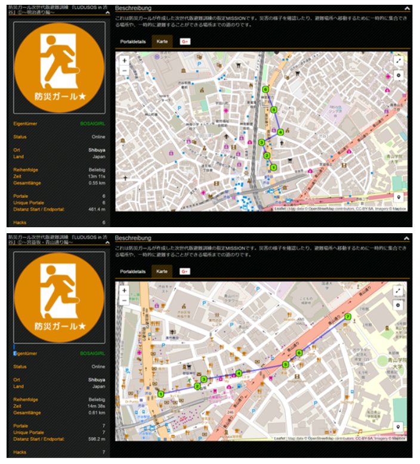

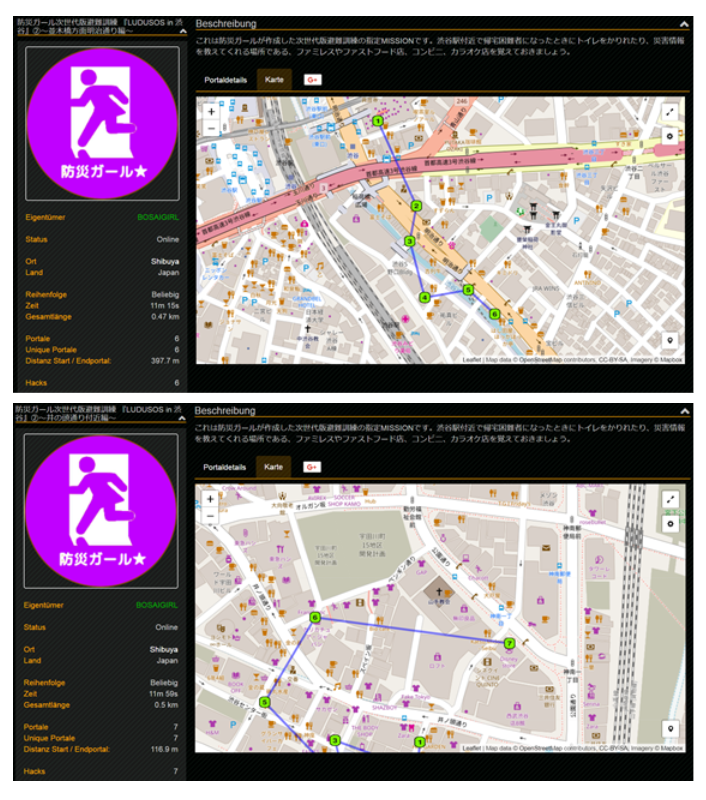

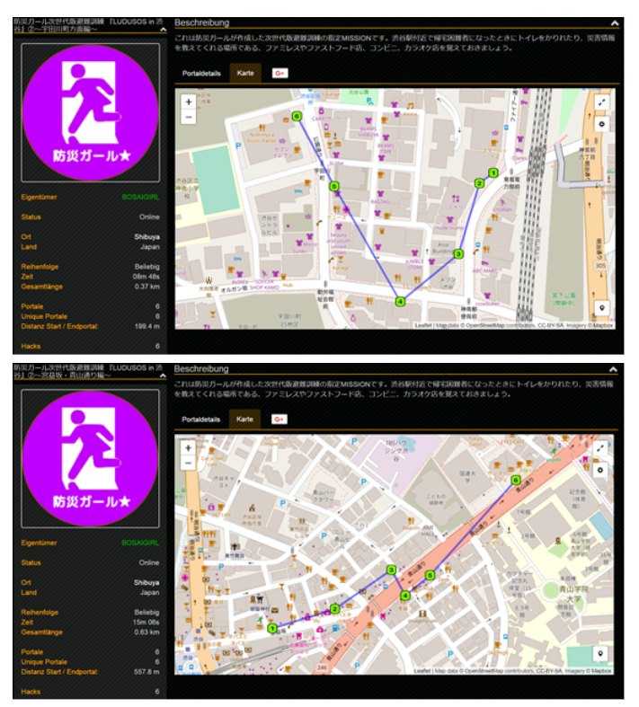

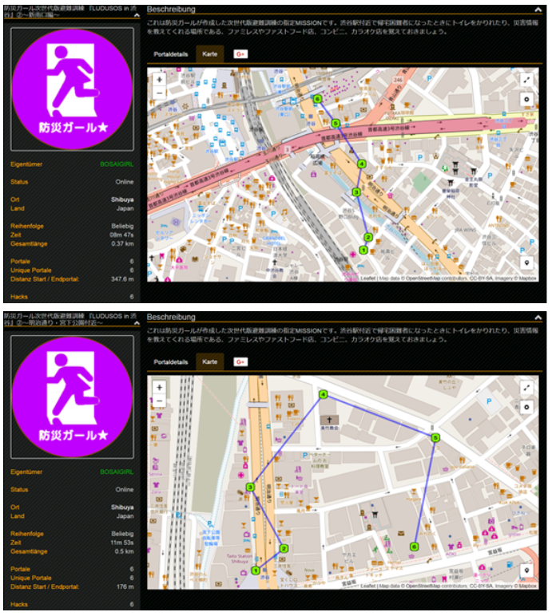

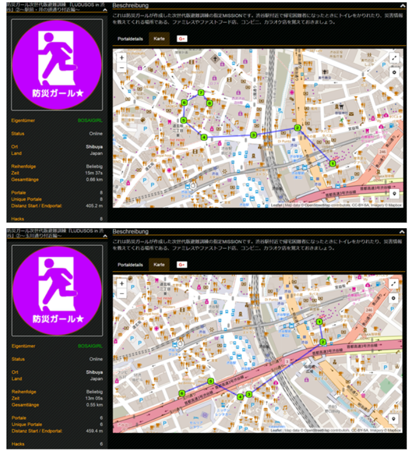

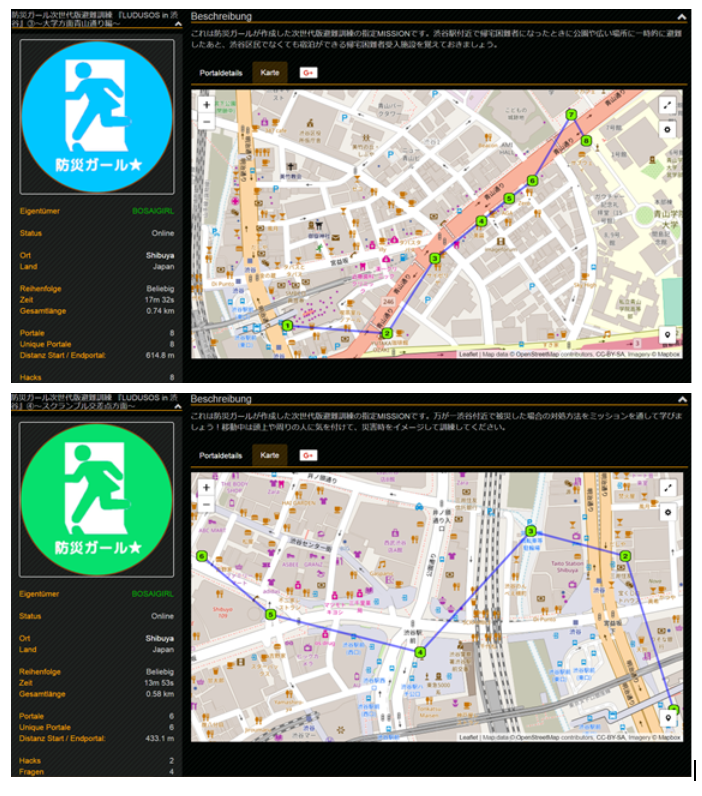

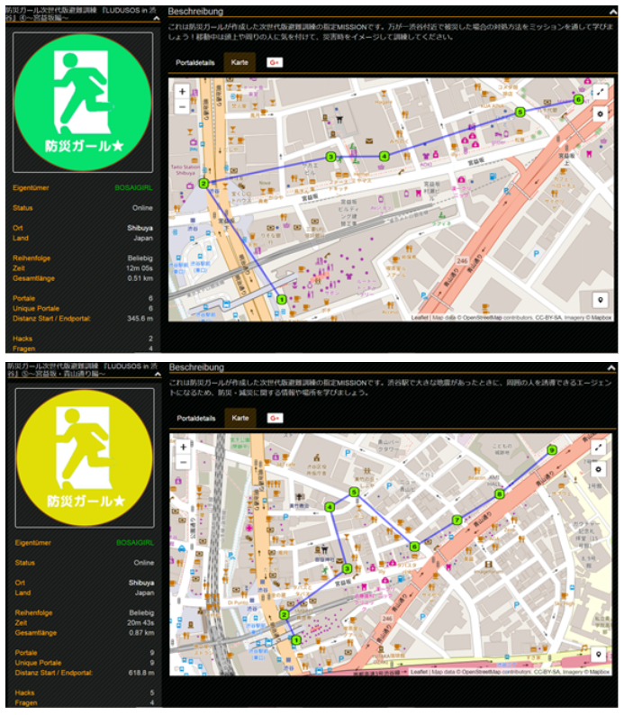

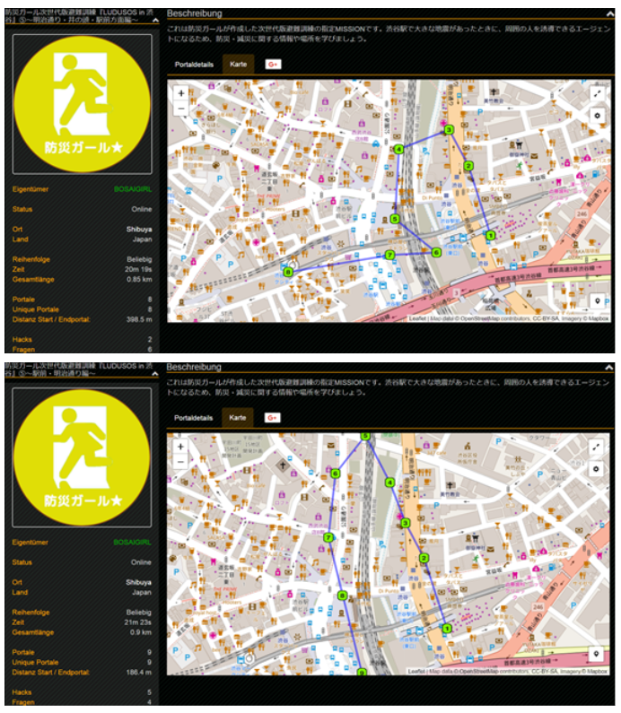

#### フィードバック

- 実際に災害時に大きな人災が起こり得るであろう場所で行われてよかった

- 知っているつもりでも、知らない防災知識を得られた

- 109やパルコ・宮益坂といったところは道が広い分、たくさんの人が集まることで人々のパニックに巻き込まれやすい危険性を覚えた

- 裏道を知っていれば人混みに流されることなく避難場所へ行けるとわかったが、宮下公園と線路の間に小道は火災発生時には使えない。その時に状況判断が必要。それでも裏道をできるだけ多く知った方がいい。

- 会社付近の避難場所を確認するというアクションをこれから起こそうという方が大勢いた

#### 課題

- 時間が足りない

- ミッションが上手くつなげられなかった

- Ingressの操作に不慣れ

- Ingressのレベルが高い参加者が多くおり、参加者が助け合うことを意識した

- Ingressのシステムについては丁寧なケアが必要

### アンケート結果

NPS（ネットプロモータスコア） どの程度知人に薦めたいかを10段階で尋ねた結果

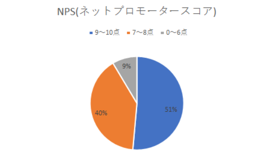

防災に対する意識の変化

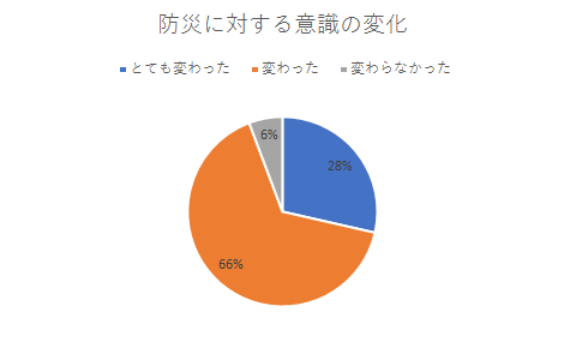

### 次世代版避難訓練LUDUSOS×Ingress×二子玉川

#### 概要

日時：2016年3月13日(日) 11:00～14:00 初心者向け練習訓練10:10～10:40 本番 10:40開場 11:00開始 場所：二子玉川ライズ・オフィス8F 後援：世田谷区 特別協賛：NTTタウンページ株式会社 特別協力：大塚製菓株式会社、東京都市大学夢キャンパス 協力：東京急行電鉄株式会社、アルファフーズ株式会社、高進商事株式会社 チケット： ①先着30名レジスタンスノーマルチケット 1500円 ②先着30名レジスタンスノーマルチケット 1500円 ③ノーマルチケット 2000円 ④LUDUSOS限定シャツ付きチケット 5000円 参加条件：Ingressをダウンロードしていること

#### スケジュール

10:00–10:10 受付 10:10–10:40 初心者講座 10:40–11:00 本受付 11:00–11:10 オープニングムービー 11:10–11:20 チェックイン 11:20–11:30 ルール説明 11:30–12:30 避難訓練 12:30–13:10 アウトプットダイアログ 13:10–13:20 訓練の種明かし 13:20–13:30 最終テスト 13:30–13:40 結果発表 13:40–13:50 終了証・アイテム授与・写真撮影

#### 内容

買い物客で賑わう二子玉川の街を歩きながら、参加者に肌で防災を感じ、学ぶ。関係者や子供を含め約70名へ向けて開催した。ナイアンティックラボが開発したIngressという位置情報ゲームを活用し、2つの陣営に分かれてミッション型の避難訓練を行う。 参加者は各陣営5人1組のチーム戦で行われた。 ミッションクリアのポイントを競いつつ、二子玉川の防災ポイントを見つける。制限時間終了後、訓練を経て気づいた二子玉川エリアの危険個所を挙げていく。チームごとに気づきを共有し、一番多くアイデアを出せたチームに100ポイント追加した。 勝利チームには非常食が配られた。

#### 防災ミッション一覧

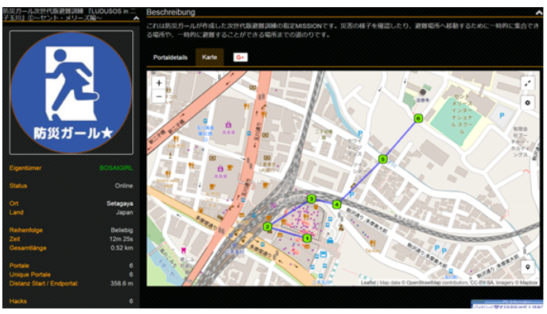

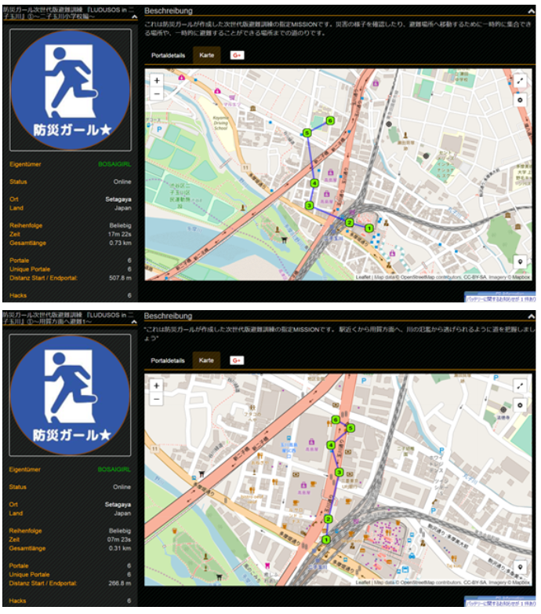

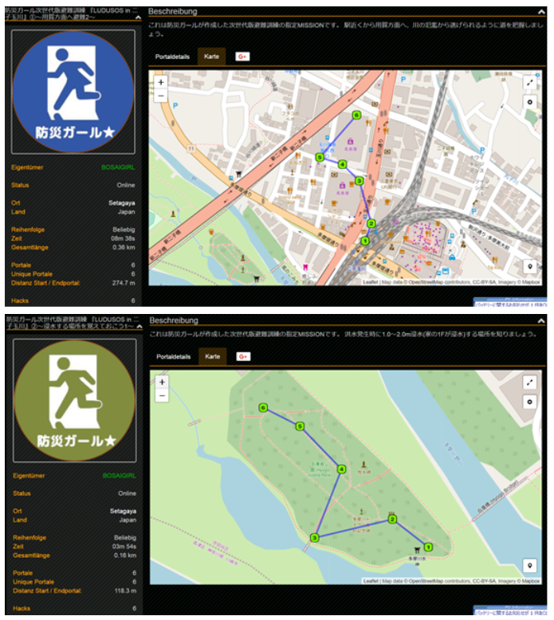

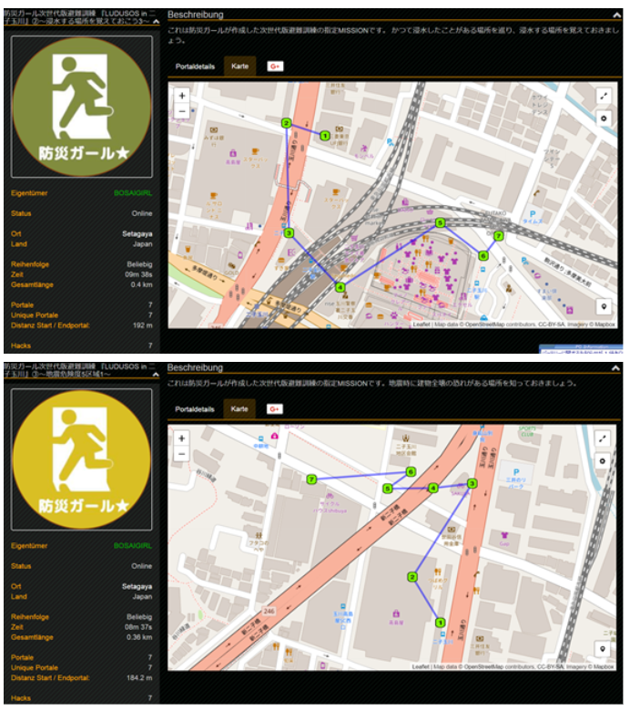

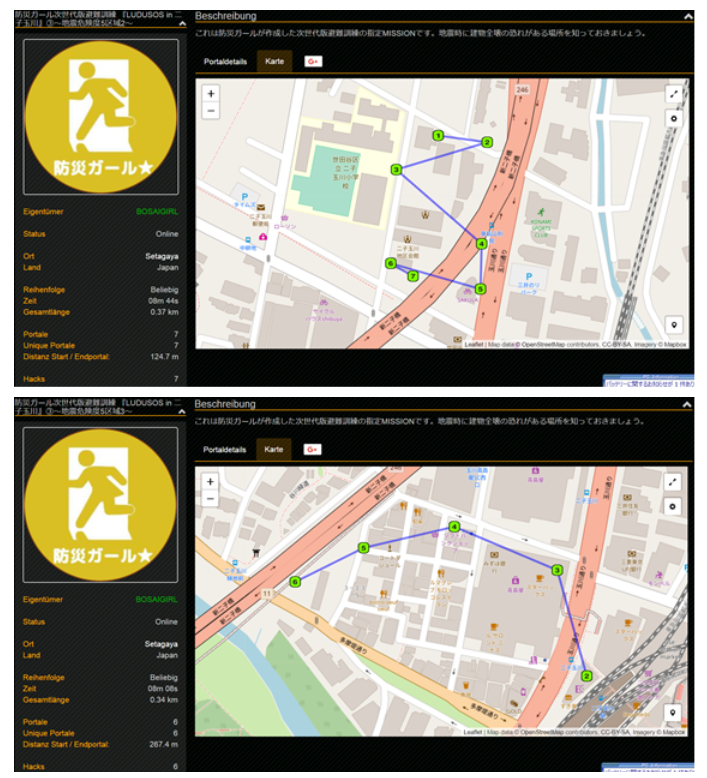

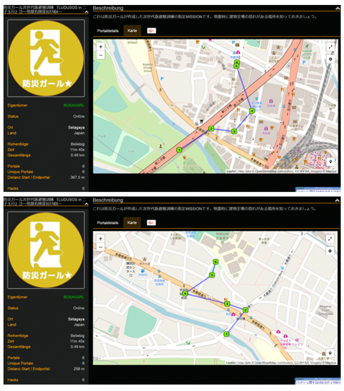

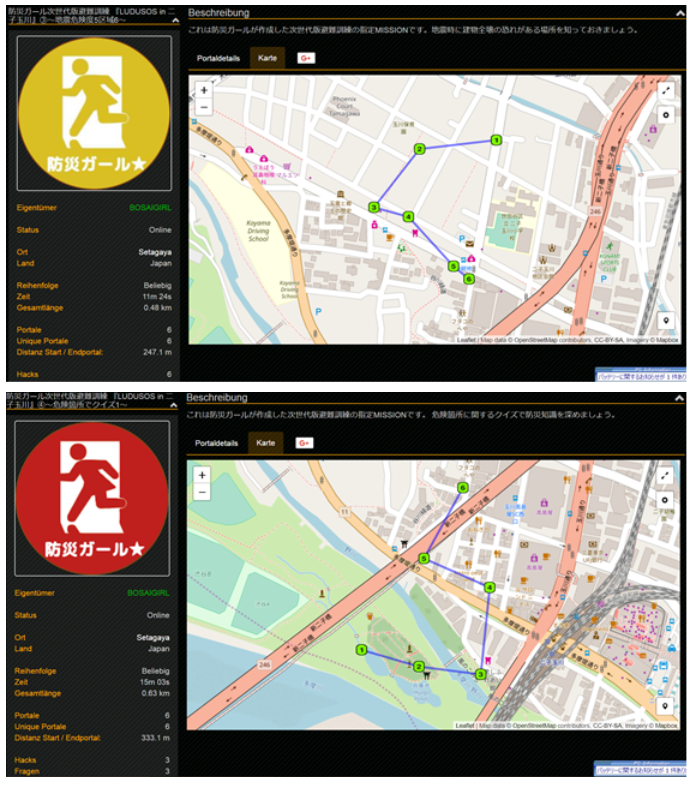

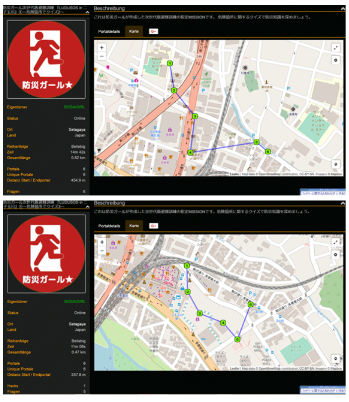

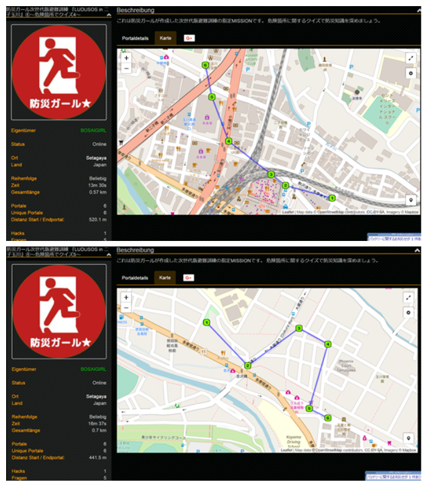

#### フィードバック

オープニング： 初心者向けの講習があってよかった イングレスが実際にやるまでよくわからなかった ルールが難しかった チェックイン： チームで協力体制ができてよかった 様々な年齢層の人と出会えてよかった

訓練： アトラクション感覚で参加できて、とてもわくわくした。 ゲーム性があると小さい子でも楽しめながら学べるのがいいと思いました。 もっと長い時間やりたかった。 意外と知らない地域の地形や構造がわかった。 イングレスがわからなかった、戸惑った。 歩きスマホになってしまいがちだった。

全体： 東京以外の場所でもやってほしい。 チームワークで楽しみながら防災の知識を得られるのでとてもいいイベントだと思った。 想定がいな災害に備えるためにも今日のような実践的な訓練は必要。 今の時代にあったやり方だ これまでの防災とは違い、年齢や性別関係なく楽しめる。 防災だけでなく、健康・コミュニティの活性にもつながりそう。 ゲーム感覚でやるのは良いがわかりづらい。 防災にお金をかける意義が不明。

#### アンケート

NPS（ネットプロモータースコア） どの程度知人に薦めたいかを10段階で尋ねた結果

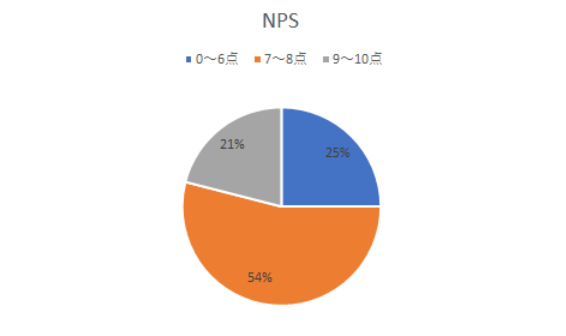

防災に対する意識の変化

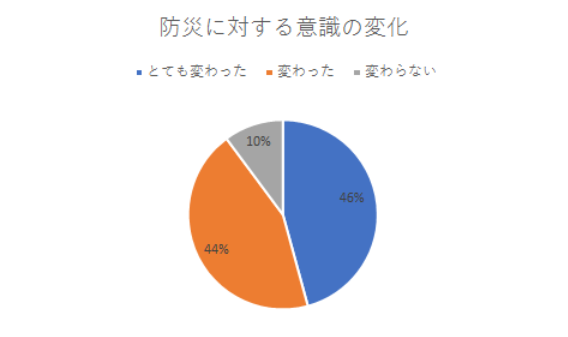

### 次世代版避難訓練LUDUSOS×Ingress×UTMグリッド

#### 概要

日時：2016年9月5日(月)13:00~16:00 場所：秋葉原UDX 4F ギャラリーネクスト 主催：エヌ・ティ・ティ都市開発株式会社 特別協賛：一般社団法人防災ガール 協力：NTTタウンページ株式会社、セイコーエプソン株式会社、エプソンサービス株式会社、NTT空間情報株式会社、株式会社ファルコン

#### スケジュール

1. オープニングムービー

1. ルール説明

1. 協賛企業からのアイテムや使用アイテムの確認

1. 避難訓練(50分間)

1. ワークショップ調査員と司令員の視点の違いを共有

1. ミッション紹介、防災豆知識

1. 結果発表

#### 内容

平日のオフィスアワーに秋葉原UDXに入るテナント向けに実施。毎日通勤する秋葉原の街を実際に歩きながら建物の災害対策について学ぶ。 今回は災害時の位置特定に役立つUTMグリッド地図を使用。野外で調査を行う「現地調査員」と秋葉原UDX内で複数の情報を整理・分析し、遠隔で指示を行う「司令員」に分かれ、ミッションを通してポイントを競う。 調査員は指定された場所の危険個所の調査をする。指定場所からの避難経路上の気づきを報告する。 司令員は防災知識を記したカードを利用して現地調査員の避難経路を作成・指示し、UDX内のAEDを探す。 ミッション後はチームごとにそれぞれの気づきを共有し、調査報告書を作成する。

#### フィードバック

訓練：

- 地図を見ながら考えてとても楽しかった

- 通信が上手くいかずに指示できないことがあった

- 建物の外に出る際に避難経路を使用する等の指示があった方がよかった

- 実際に街に出ると地図上ではわからない危険箇所が発見できたと思う

- 実際の避難時の役に立ちたい

アウトプット：

- 他のチームのレビューを聞けて勉強になりました

- アウトプットイメージを冒頭に伝えてあるとより有意義になると思います

全体：

- 実際にどう動けばいいのかシュミレーションができた

- 防災に興味がない人にはいいと思う

- ミッションを行う時間が短かった

さらに知りたいこと：

- 日常生活で備えて得おきたいもの

- 災害時における情報収集・連絡手段

- 災害発生時の社員への配慮

- 建物の安全性、周囲の危険地域

- 災害時にオフィスから帰宅する際の情報や方法

先述した通り、ネット上にある下記のような記事・FaceBookページ・Ingressの公式ページ（ミッション例）を参照しまとめた章です。

[「LUDUSOS」秋葉原 実施しました！
9/5(月)、秋葉原UDXにて次世代版避難訓練LUDUSOSを実施しました。 「防災をすることが当たり前の世の中にする」をミッションに掲げている防災ガール。とことんやりたくなる避難訓練、を目指して３回目の実施となります。bosai-girl.com](http://bosai-girl.com/2016/09/15/ludusos_akihabara/)

LUDUSOSに関わる記事を探してくるのに時間がかかり、それをまとめるのにも時間がかかり、ただただ時間がかかりました。

実験をするわけでもなく、考察をするわけでもなく、調べてまとめるだけなのになって思ったことを覚えています。

折角資料作成したので今後に活用されることを祈るばかりです。

次回が最後、まとめの章になります。
