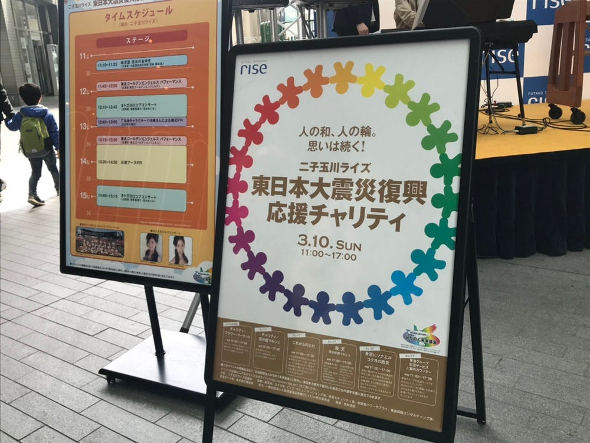
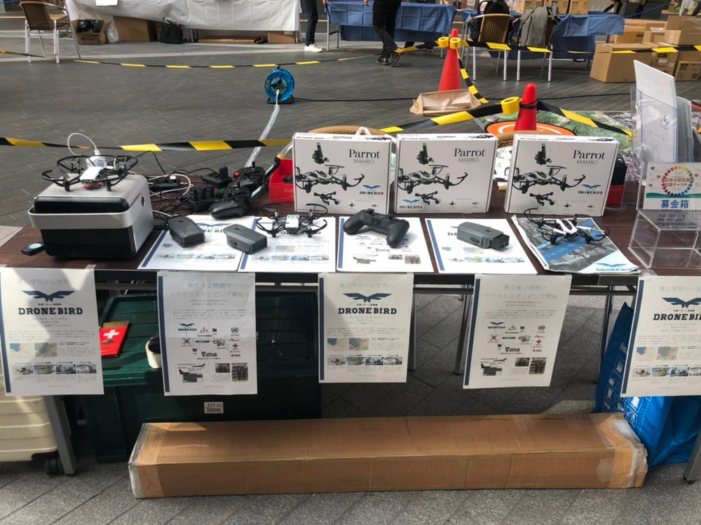
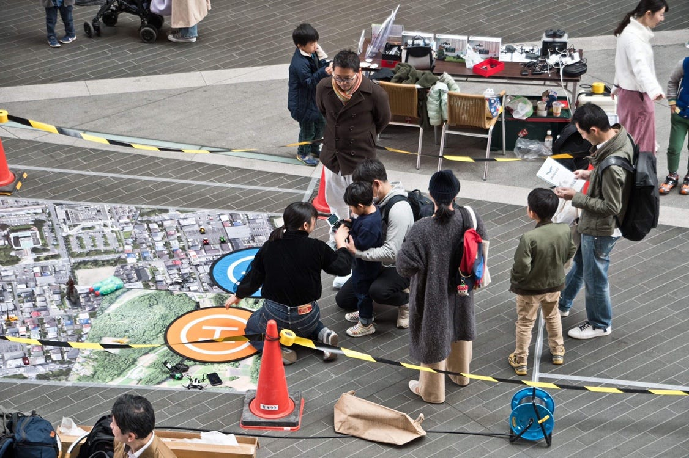
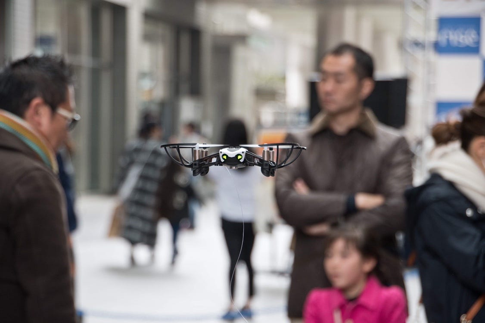
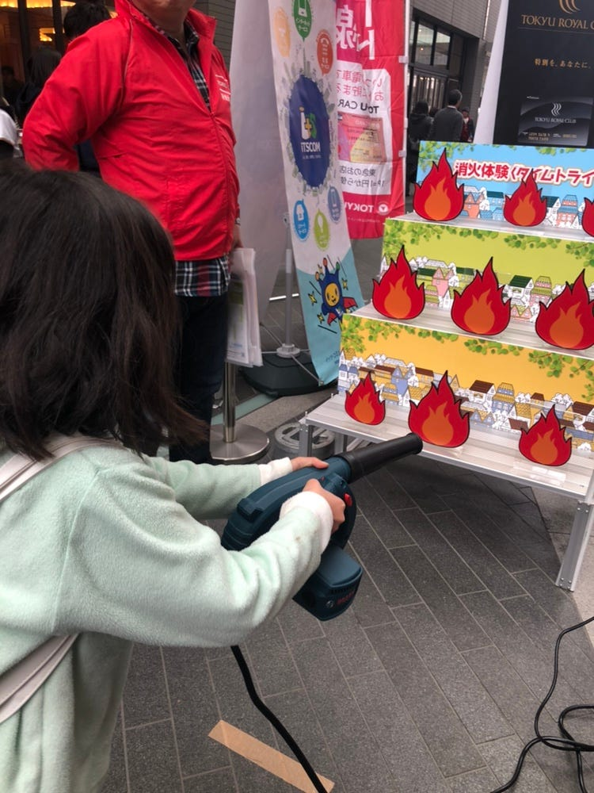

### 3.11を忘れない

みなさんこんにちは！古橋研究室3年生多賀谷美里です！

本日は3/10(日)に二子玉川にて行われましたチャリティイベントに参加してきましたので、そちらの報告をさせていただきます！

- 今回のイベントを通して

- ドローン設定の追記

ブースの外観はこんな感じでおなじみのイオンモールとほとんど変わりません。

しかし、外での開催の為、風が強く操作は少し大変でした。

### 当日意識したこと

私は今回のイベントでは教える側ではなくブースに立って活動の紹介をしたり、誘導する側に回っていました。

まずは元気よく笑顔で「こんにちは」と挨拶することを心がけました。外での開催だったためイオンと違い、多くの人との触れ合いがありました。声をかけることで振り返ってくださったり、参加してくれる方を獲得でき、募金に協力してくださいました。

もちろん、教える担当もしました！

かおりや古橋先生の教え方を参考に、「褒める」ことをすることで沢山の笑顔を見ることができ、私も嬉しかったです😆

### NEWドローン設定

フリップ規制があれば、、、なんて思った人、おおいですよね、絶対

私たちもそうでした。そ！こ！で！

この度、そんな願いを叶えるフリップ規制の設定の仕方を入手いたしましたので報告いたします！！

まず、フリップには四種類ありますよね！

①フロントフリップ

②レアフリップ

③レフトフリップ

④ライトフリップ

です！これらに割り振られる番号をダブらせて割り振ると機能を規制することができます！

[Log In or Sign Up to View
See posts, photos and more on Facebook.www.facebook.com](https://www.facebook.com/mapconcierge/videos/2512971092065180/)

先生が動画でわかりやすく説明してあるので、そちらを参照してください！

### 全体を通しての感想

3.11からまる8年

日本は地震が多いので、まだまだ対策が必要です。他のブースを見学すると中高生が、石巻の被害について勉強している様子を見ました。正直、私も知らないことだったので、反省とともに、もっともっと命を守るために考え、行動、発信していく必要を感じました。

古橋先生の子供たちも今回は参加してくれてたので一緒に色々なブースを回りましたが、上の写真のように体験するだけで少しでも災害に対する意識を小さい時から教えていくことはとても重要なのだと感じました。

かおりコンビでイベント開催は3回目！四年生になってからもたくさんフィールドワークしたいと思います😆

[朝のウォーキング - Misato Tagaya's 7.3 mi walk
Misato T. completed 7.3 mi on Mar 9, 2019.www.strava.com](https://www.strava.com/activities/2218748930?share_sig=A5B0C1401552812031&utm_medium=social&utm_source=ios_share)
