### 歩く、撃つ、守る。世界へ

> Darsana Prime Tokyoという体験

### **１．はじめに**

2019年3月23日に行われました、Ingress Darsana Prime Tokyoに参加して来ました。もうすぐ大学４年になります、武末です。

[Darsana Prime Tokyo
Explorer Hank Johnson has discovered the existence of the "Darsana Point", a theoretical point where humanity's…events.ingress.com](https://events.ingress.com/xmanomalies/darsanaprime/tokyo)

Ingressと出会ってかれこれ三年となるのでしょうか、はじめは大学周辺で細々とドンパチしていた程度でしたが、去年は秩父での合宿でのfield artを経験し、ついに今回は世界規模の大会へ参加となりました。

今回はそんなDarsana Prime Tokyoへの参加レポートを書いていきたいと思います。

### **２．とりあえずStrava報告**

[Ingress Anomaly - Kouki Takesue's 33.8 mi run
Kouki T. ran 33.8 mi on Mar 23, 2019.www.strava.com](https://www.strava.com/activities/2233085066)

### **３．参加するまで・・・**

朝チケットを印刷するのを忘れ、しかも受付終了時間を一時間見誤ってしまい、駅についてからはかなりドタバタしてしまいました。QRコードが送られてきているのに何故印刷なんだ！？と思っていましたが、受付で用紙が回収されているあたり読み込み数とオンサイトの数が一致しているかを後程ダブルチェックするのでは？と思いました。（職員の人に聞けばよかったけど後が詰まってたので断念）

前日からGoogleがゼンリンと契約を終了し、地図データが大きく書き変わってしまったこともあり、会場までの道順大丈夫かなと心配でしたが、有志の方がマップを用意してくださったのでスムーズに向かうことができました。この場ではありますが感謝申し上げます。

ルール等は事前に攻略サイト等で勉強していたものの、陣営登録をしないソロ参加だったのでオーナメントポータルの詳細確認に凄く苦労しました。今回はこちらの **[@**DPTResistance](https://twitter.com/DPTResistance) さまの虎の巻にすごく助けられました！こちらも同様にこの場で感謝申し上げます。

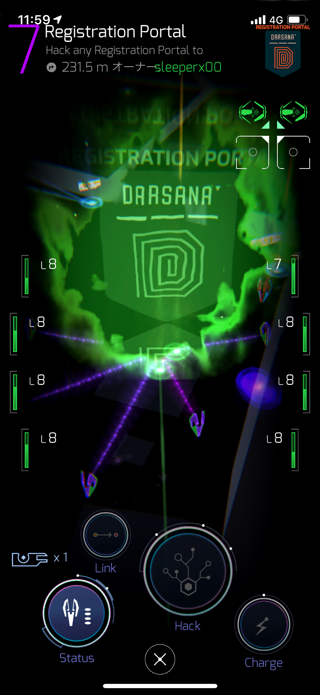

会場近くにあるこのRegistration Portalをハックするのも事前にわかっていたためスムーズに。ハックできたか？と疑心暗鬼になりオーバフローの画面が出るまでやるのはあるあるのはず・・・。

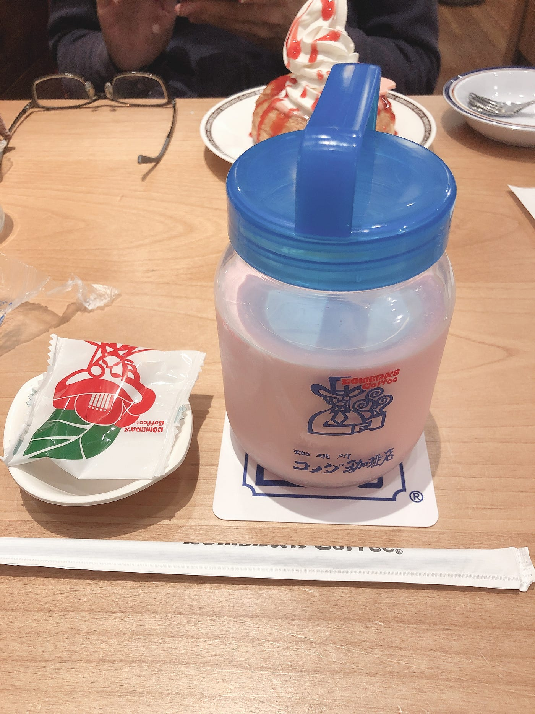

### **４．開始！オーナメントポータルレポ**

[【Ingress】ダルサナプライムのアノマリールール概要
こんにちはKitokito(@kitokitoworld) です。 リカージョンプライムの次のシリーズのアノマリー、ダルサナプライムが2月23日と3月23日に開催されます。3月23日は東京でもアノマリーが開催！…kitokito.world](https://kitokito.world/ingress-event/223323)

オーナメントポータルの説明はこちらのサイト様を参考にしました。今回は先ほど紹介した虎の巻のAからEの順にどんなポータルなのか、現場でなにが起きていたのかをレポートしていきたいと思います。

#### A. Anomaly Zone

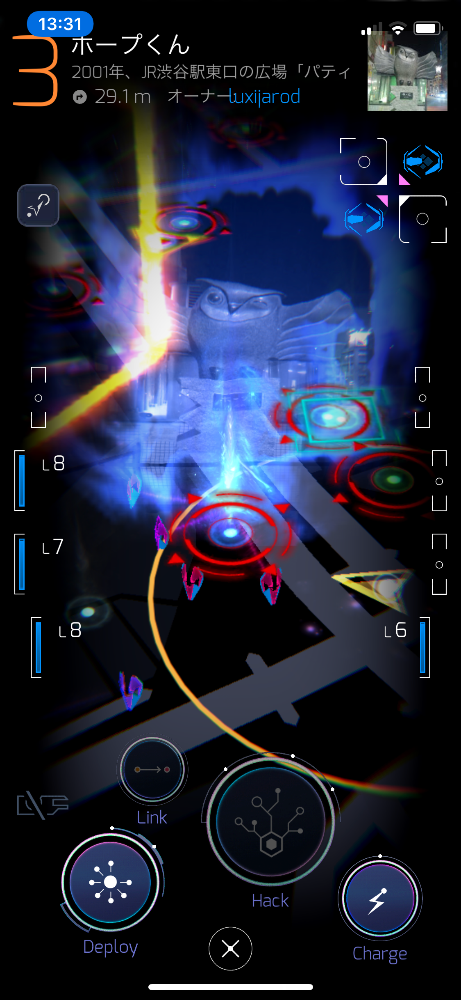

一番最初に見つけたのがこのポータルでした。これはキャプチャーバトルのポータルでキャプチャーすると自軍に1点が追加されます。スクショからも確認できますがかなりの数が存在し、密集しているので熾烈な戦闘地区と化しています。

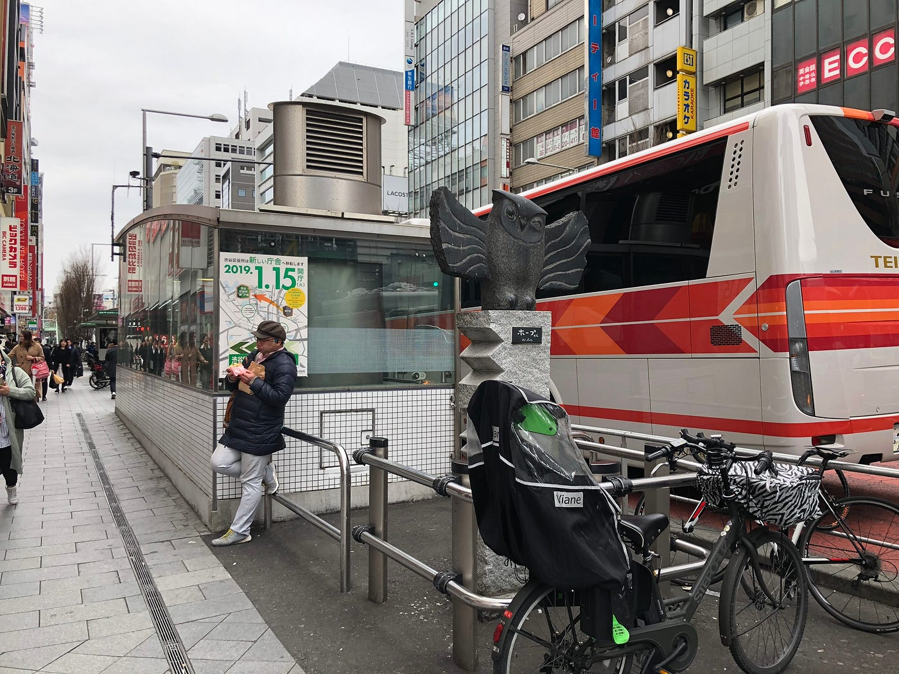

現実世界的には人が集まったり、立ち止まっている印象はありませんでした。かなりの数でしたしポイント的にも薄味なのでそこまで固執したフィールドではないのかもしれません。

#### **B. Volatile**

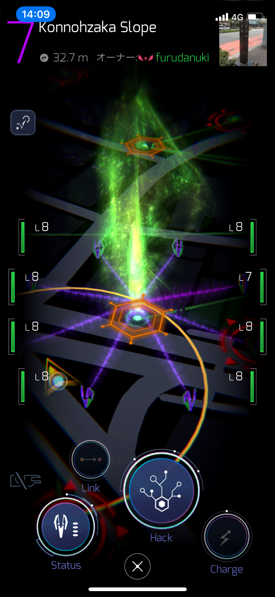

これは先ほど説明したキャプチャーバトルのポータルで、Anomaly Potalより高得点が入手できます。その分絶対数が少なく、Anomaly Potalの密集していた地域でなければそれほど戦闘が起きているという状況はありません。

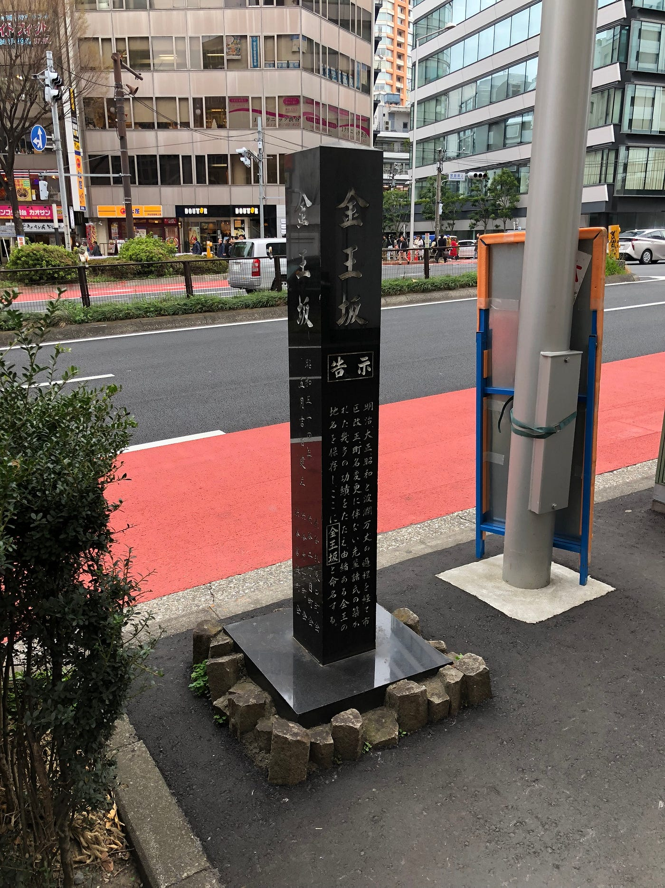

戦闘地域はやはり高密度なフィールドでしている感覚がありました。ここではありませんが渋谷駅東口の方にある宮益坂ではAnomaly Portalが密集していて保持しやすいためかぽんぽんと色が変わっていました。

#### **C. Artifact Drop**

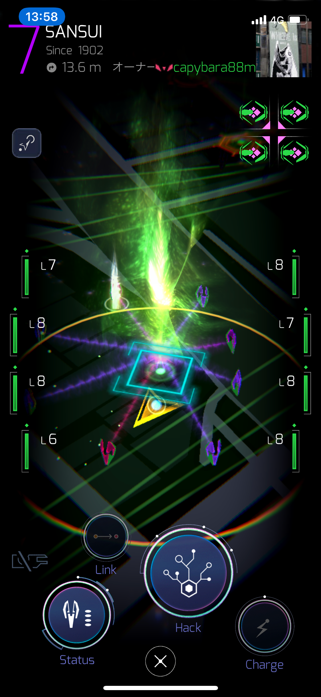

このポータルをハックすると特殊なメディアが出現します。そのメディアを集めることでポイントとなる、アーティファクトコレクションの要素です。こちらは本当に数が少なく、みんな右往左往しながら探していました。留まっている人たちはメディアの確認をしていたのだと思います。チームの方ぽかったですね。ここでAGの方から声をかけられるなど皆さん本気のようです。

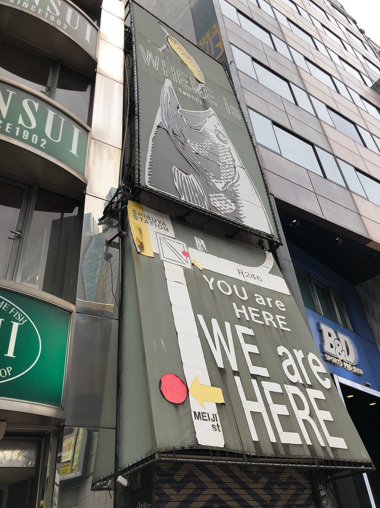

#### **D. Start(RES)**

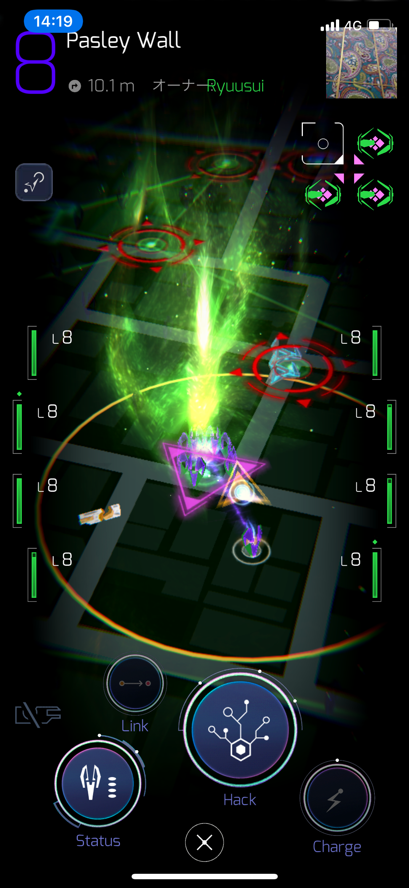

このポータルは 指数関数的ロンゲストパスゲームの要素で青のResistance側のスタート地点です。指数関数的ロンゲストパスとは簡単に言うとこのポータルを起点に順々に他のポータルへリンクを繋ぐことでその距離分点数が入ります。しかも2倍、3倍と増えていくので言葉通り指数関数的に伸びていくことになります。

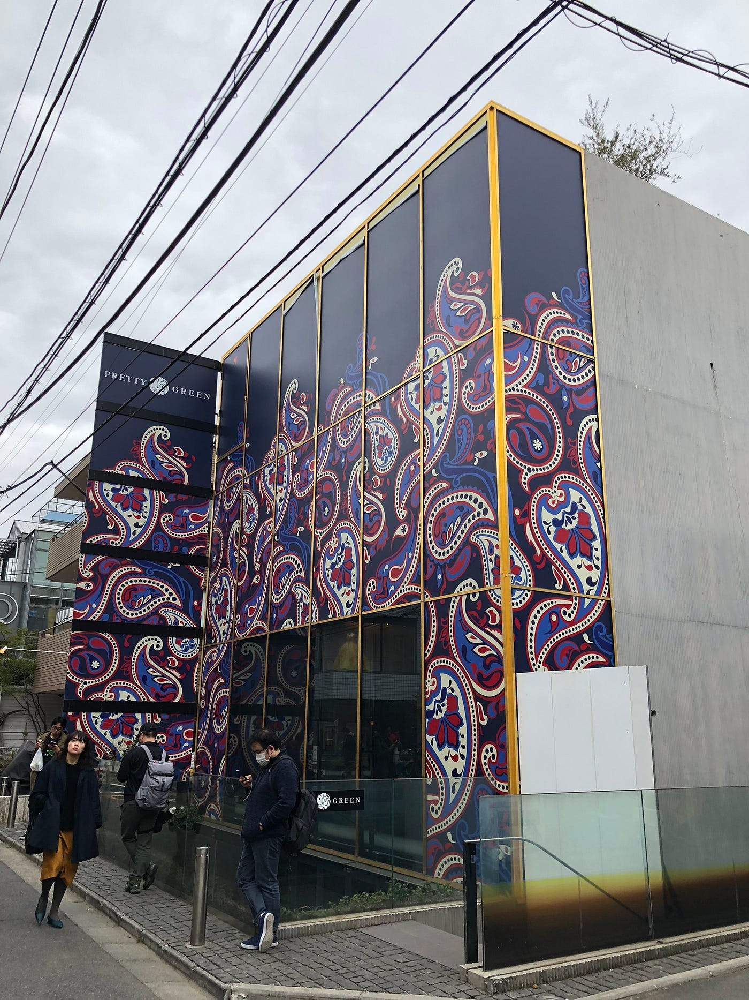

文字通りここはロンゲストパスの始点であり、ここが破壊されてしまえば点数になりません。逆に言えば敵側に取られると痛手になります。私たちが到着したときは計測時間切り替えギリギリだったので多くの人が保守していました。破壊を試みましたが人数差が大きく、取り返せませんでしたね。お強いです。

#### **E. Start(ENL)**

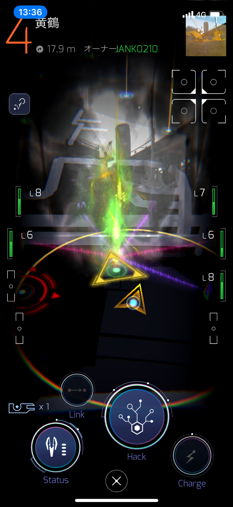

最後にこちらが Enlightened側の指数関数的ロンゲストパスのスタート地点です。Res同様ここが計測地点となるため激しい攻防が繰り広げられていました。駅近くでAnomaly PortalとVolatileが密集していたため人も多く留まっていて、一目であ、やってるなという感じがしました。

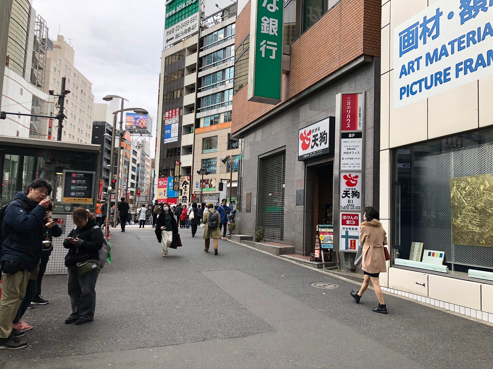

リンクを組んでもすぐポータルが破壊されてしまうのでぱっとポータルキーを取って走り去る人もいれば、留まって攻撃を続ける人など陣営の中である程度の統率がとれているように感じました。Chatもかなり賑わっていてここが一番イベントの空気を味わえた場所だと思います。

### **５．概算参加人数**

これはすごく難しいですね、朝10時頃からTwitterは確認していて、受付の長蛇の列を見ている分にはかなりの人数が参加しているように思います。前日チェックインも相当数いましたし..。ただ、実際渋谷を回っている感じではそこまで？という感じでした。フィールドの範囲がすごく広いので日比谷公園辺りまで激戦区となっている状況を考えると1000人辺りは余裕で超えているのでは、と思います。

[数字で見るingress。
東京経済ONLINEにingressの記事が掲載されていました。 その中にingressの近況を伝える数字がたくさんあったので引用してまとめます。 エージェントがいる国の数。 アプリ「ingress」のダウンロード数。…charingress.tokyo](https://charingress.tokyo/1156)

上記のサイト様を確認すると過去の京都でのイベントでは5600人（！）が参加しているそうです。そう考えると同じくらい、もしくは少し多めの人数が参加されていてもおかしくないのでしょうか？

上記の要素から、私は｢6000人｣という数字を提示させていただきます。コミケの来場者数が1日目とかで16万人なのでそう考えると少なく見積もり過ぎたかも..。

### **６．感想**

Ingressは世界規模で楽しまれている位置情報ゲームであり、AGの統率力と行動力はかなり特出したものがあります。世界の各都市で世界大会開いて、海を渡って参加する方がいるゲームというのはなかなか無いと思います。イベントの運営も内容自体もすごく洗練されていて、未来のゲームといった感じが凄かったです。今後も機会があれば参加していきたいと思います。

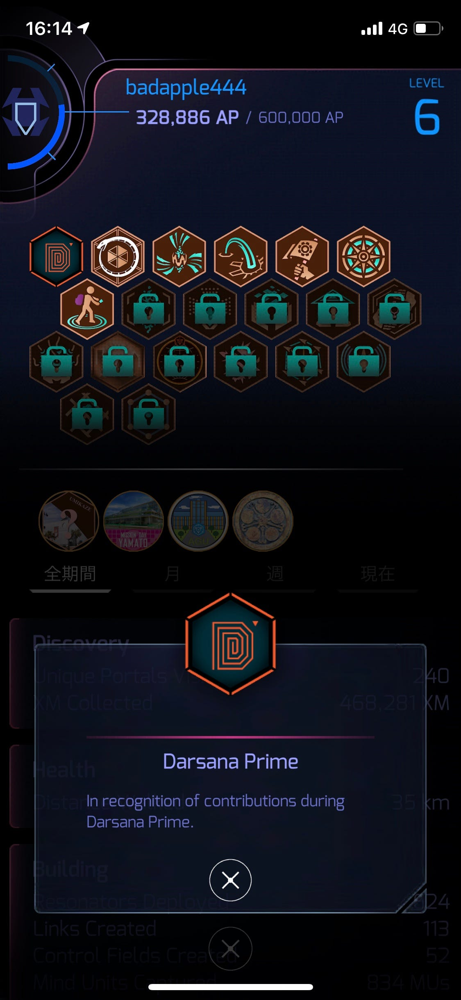

お疲れ様でした！
