### Darsana Prime Tokyoって？

こんにちは！北野です。今回はスマートフォン向け位置情報ゲームアプリのIngressのイベントである Darsana Prime Tokyo（3月23日）に参加してきました！

[Darsana Prime Tokyo
Explorer Hank Johnson has discovered the existence of the "Darsana Point", a theoretical point where humanity's…events.ingress.com](https://events.ingress.com/xmanomalies/darsanaprime/tokyo)

詳しい情報などはこちらの公式サイトに掲載されているのですが簡単に説明すると 期間内（当日の13時～16時）にオーナメント(赤く囲まれたポータル)を緑（ENLIGHTEND）と青（RESISTANCE）の陣営に分かれて取り合うというものです。僕は青の方で団体ではなく個人の方で参加しました

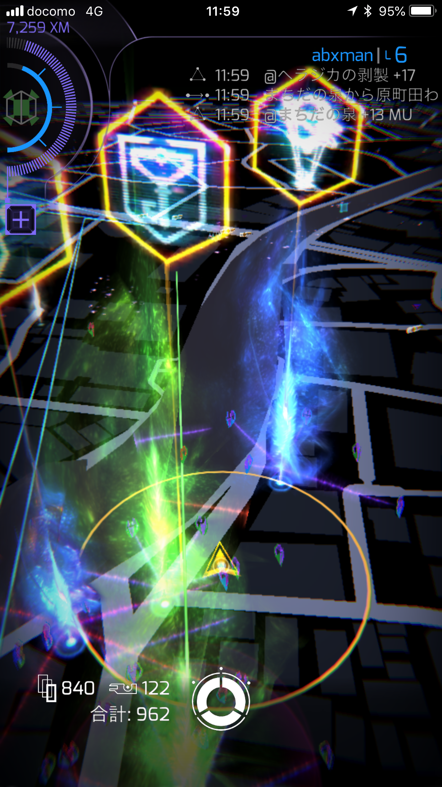

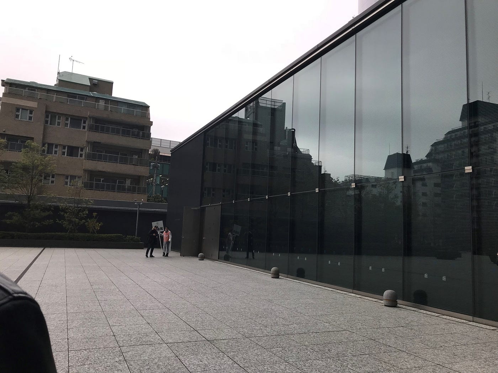

会場へ行きチケットを提出してアプリを開いて図の鍵のようなポータルにアクセスすることで参加登録完了です。会場にたどり着く前にバタバタしていたのもあり受付終了時間10分間に到着したせいか人はほとんどおらず、スムーズに済ませられました。その後昼食をとり13時から行動を開始しました。

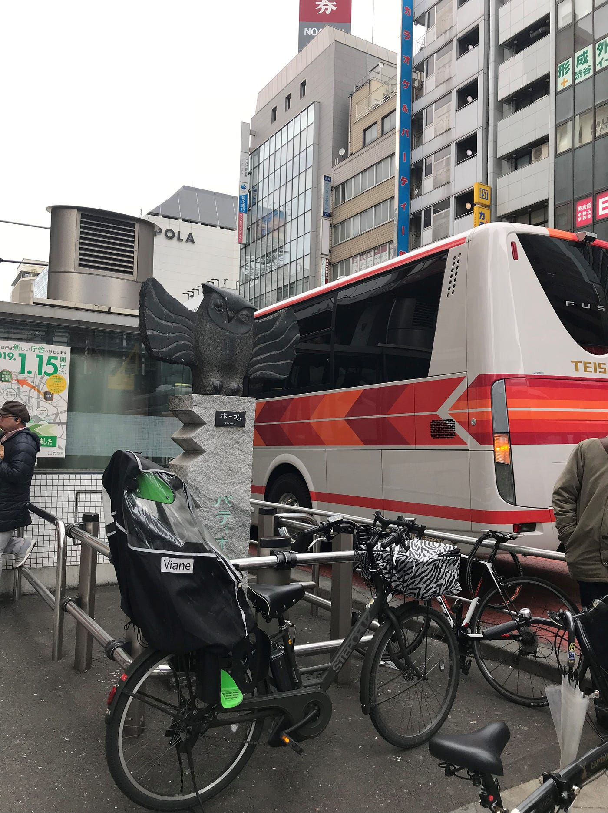

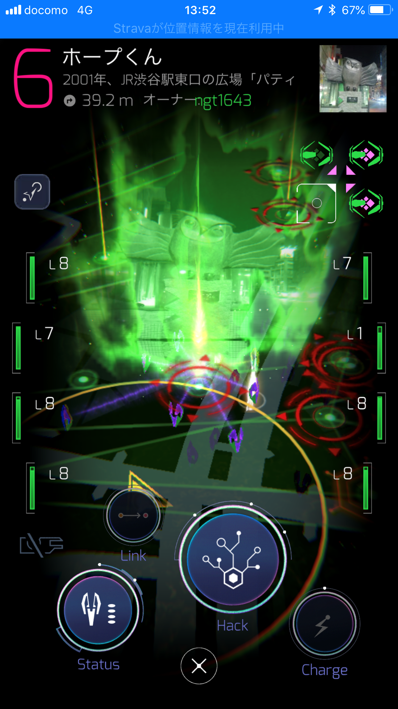

まず最初に見つけたのはこのホープ君と呼ばれる場所のポータルです。赤い円のようなものが見えると思います。これはAnomaly Zoneと呼ばれるポータルでこの画像からも察せられる通り、今回のイベントで最も配置されいるものだと考えられる。

観察した限りでは、ほとんど参加者は確認できなかった。ポータル自体の数が多く希少性が少ないため参加者が分散しているのではないかと考えられる。

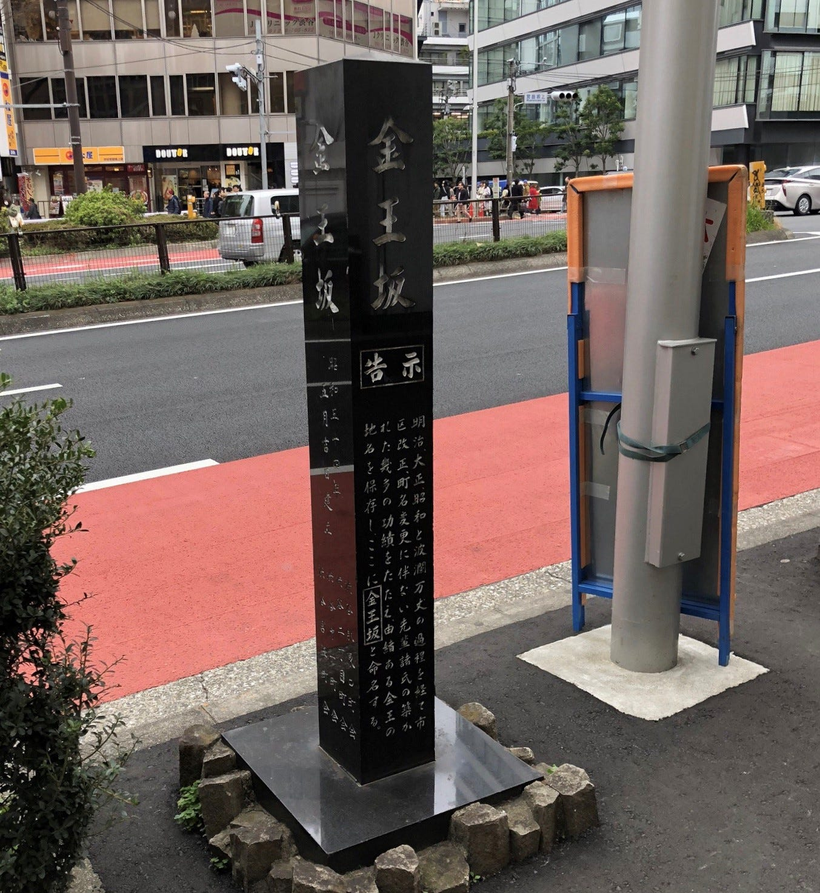

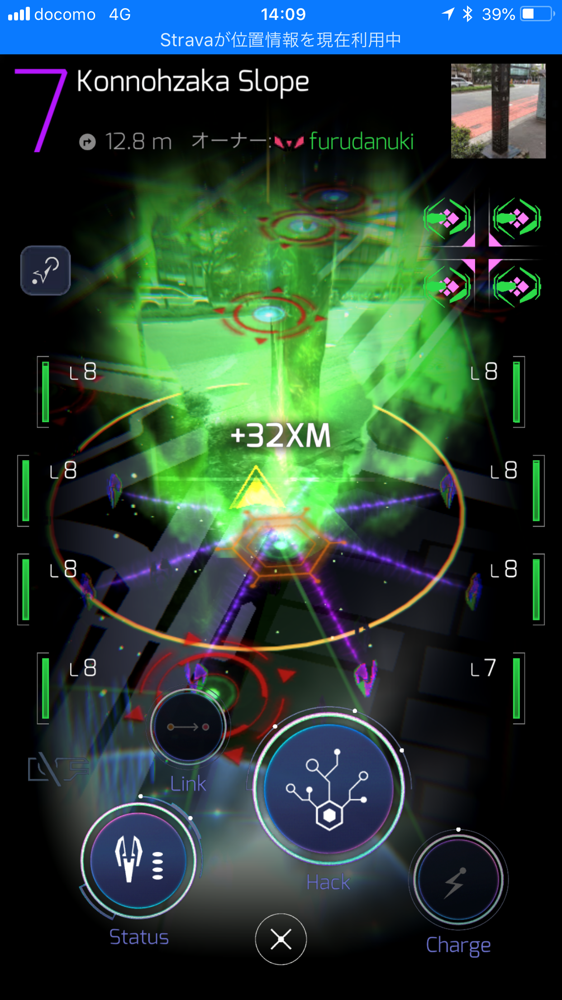

次に見つけたのは金王坂と呼ばれる場所のポータルです。ここのオレンジの六角形は Volatileと呼ばれるポータルです。さきほどの赤のポータルと比べると数は一気に少なくなりました。そのため点数も先ほどより多く設定されています。

先ほどよりは人数は増えたように感じましたがそれほど多くはありませんでした。

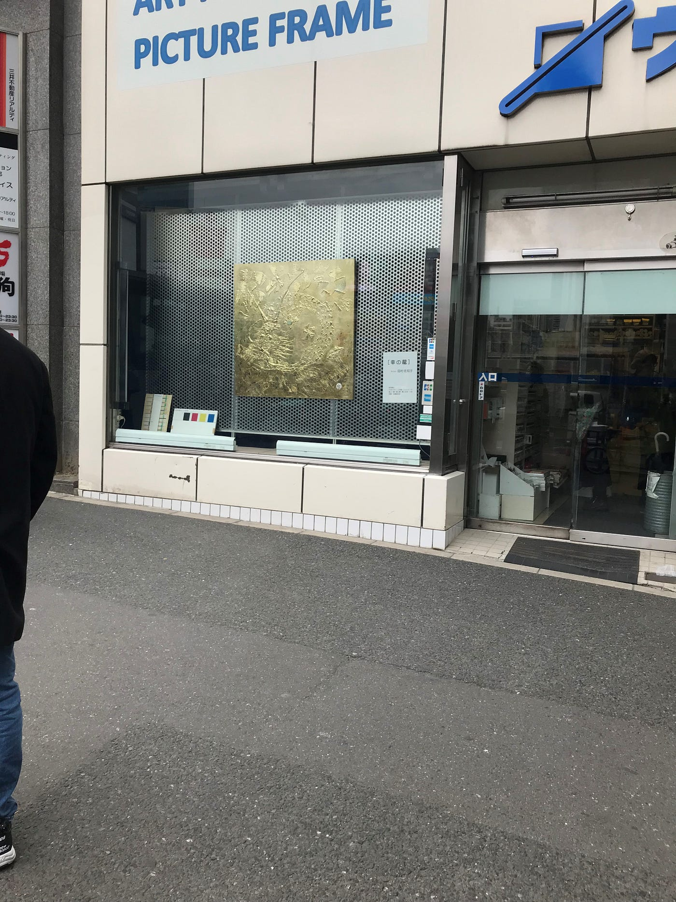

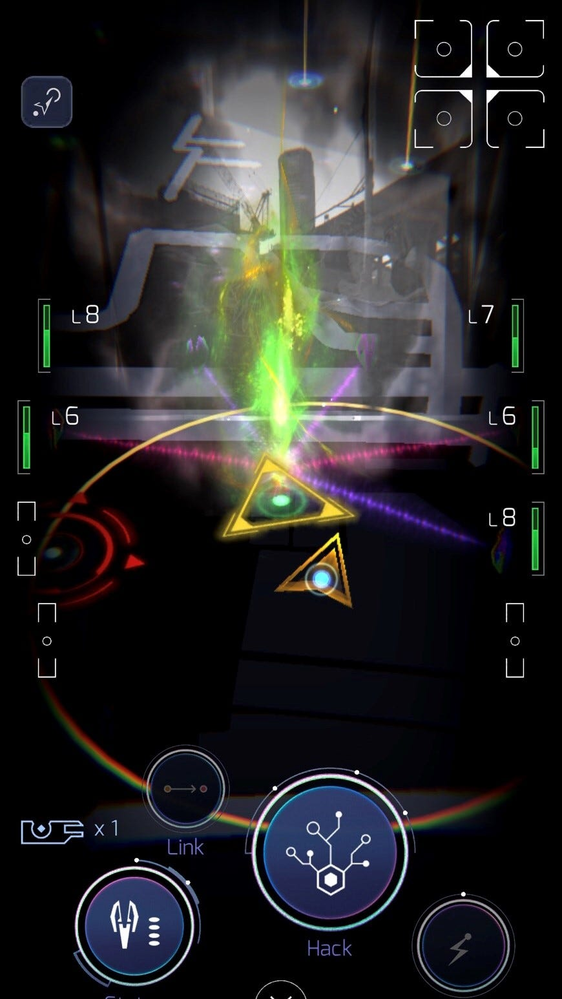

次に見つけたのは黄鶴と呼ばれる場所のポータルです。場所はここで間違いないのですが鶴は見つからず龍がおり、恐らく張り替えられたのではないかと考えています。この黄色の三角形はStart(ENL)と呼ばれるポータルです。これは緑側の陣営のロングリンクの起点であること示しているポータルです。ここを破壊されると緑側にポイントが入りません。

勝負における重要ポータルであるためか多くのプレイヤーが入れ代わり立ち代わりしている様子でした。

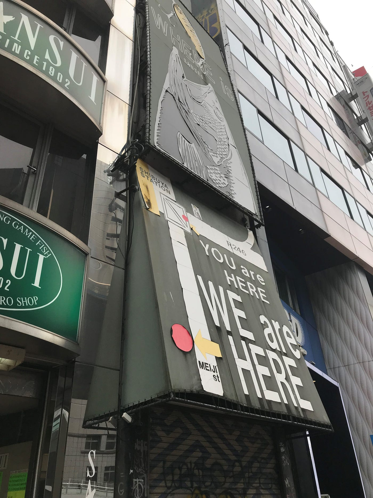

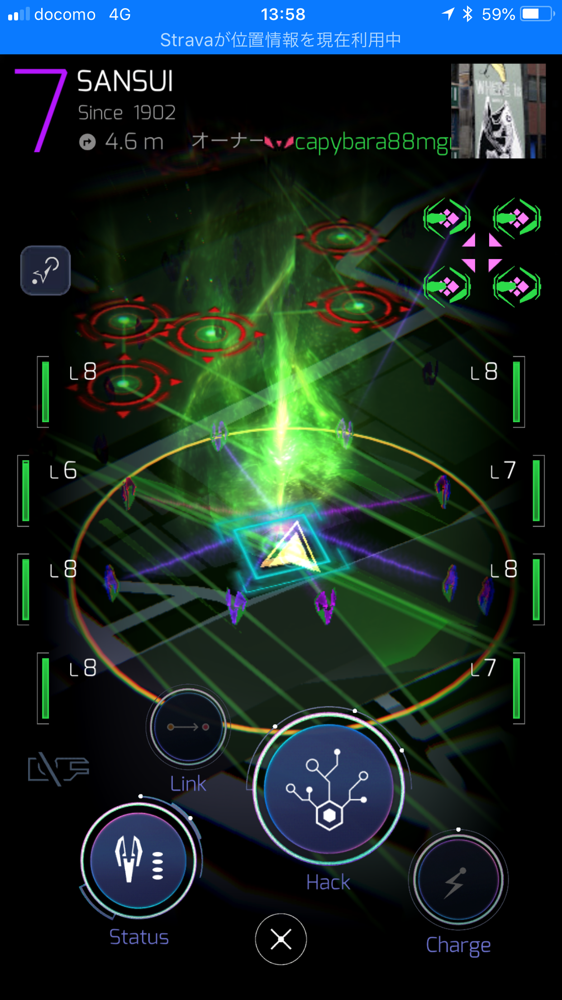

4つ目に見つけたのはサンスイと呼ばれる釣具店のポータルです。この水色の四角はArtifact Dropと呼ばれるポータルで、 このポータルをハックすると特殊なメディアが出現し、そのメディアを集めることでポイントとなります。

この辺りは最初のポイントと同じくらい参加者が見られないという状況でした。

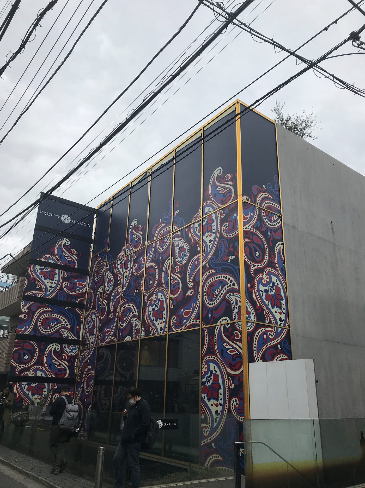

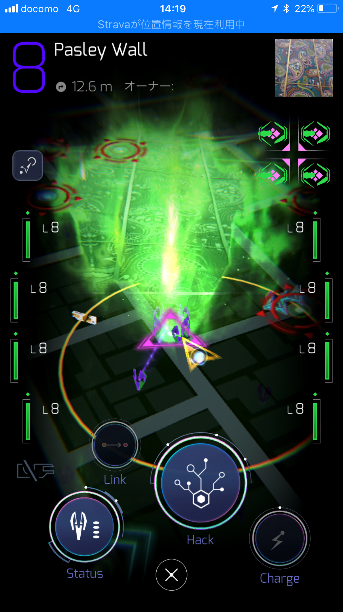

最後はBailey Wallと呼ばれる場所です。この紫の三角は Start(RES)というものでこれは青側の陣営のロングリンクの起点であること示しているポータルです。陣営の違い以外は黄色の三角と同じです。

こちらも重要ポイント故か人はかなり集まっていました。

概算人数の話なのですが話を聞く限りだとかなりの人数が参加していたそうですが個人的にはそれほど多くは感じられませんでした。攻め方の違いなどで少ない場所ばかりに当たってしまった可能性もありますが300人程度といったところでしょうか。

今回のイベントでは警察の方が目についたり、公式のフォトグラファーや外国人の方などがいたりと大きなイベントであることを身をもって体感することができました。こういったイベントに参加した経験はほとんどなかったのでとても新鮮でした。

最後に参加証明の画像とStravaを貼っておきます

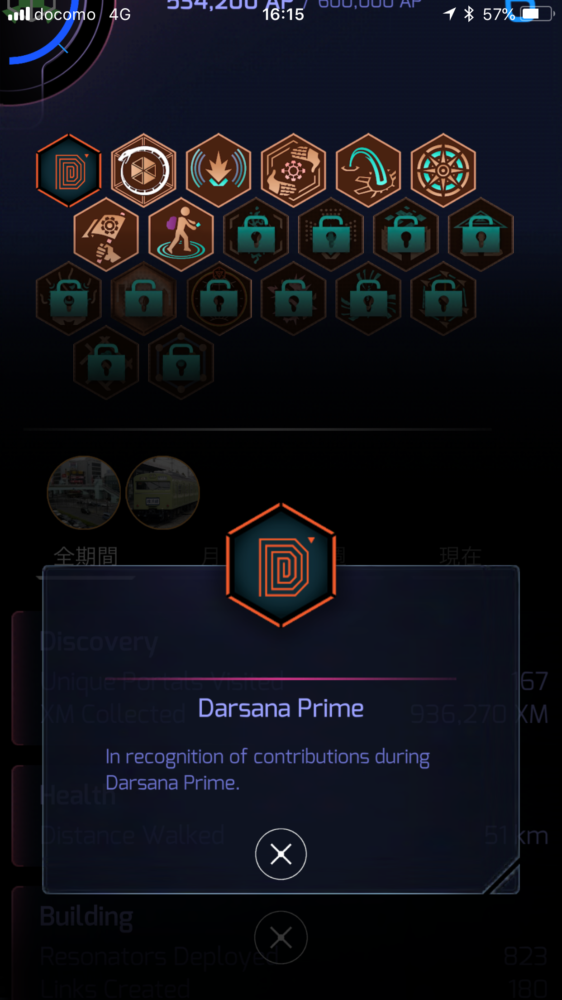

[https://www.strava.com/activities/2233074402](https://www.strava.com/activities/2233074402)
