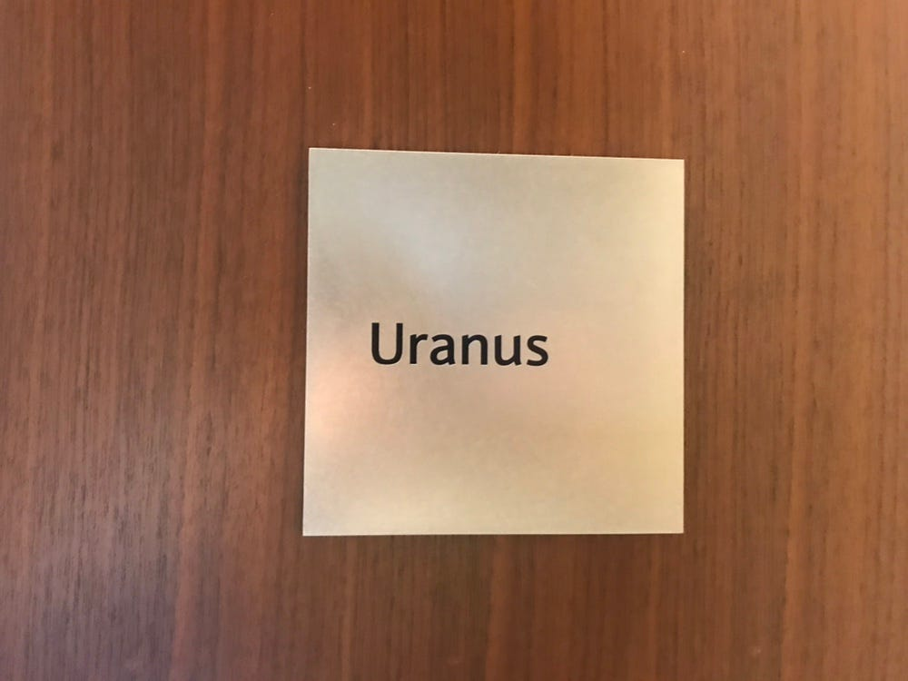
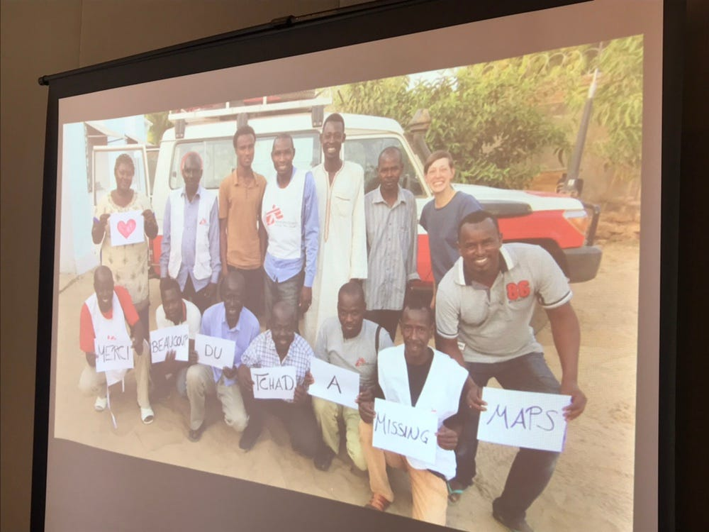
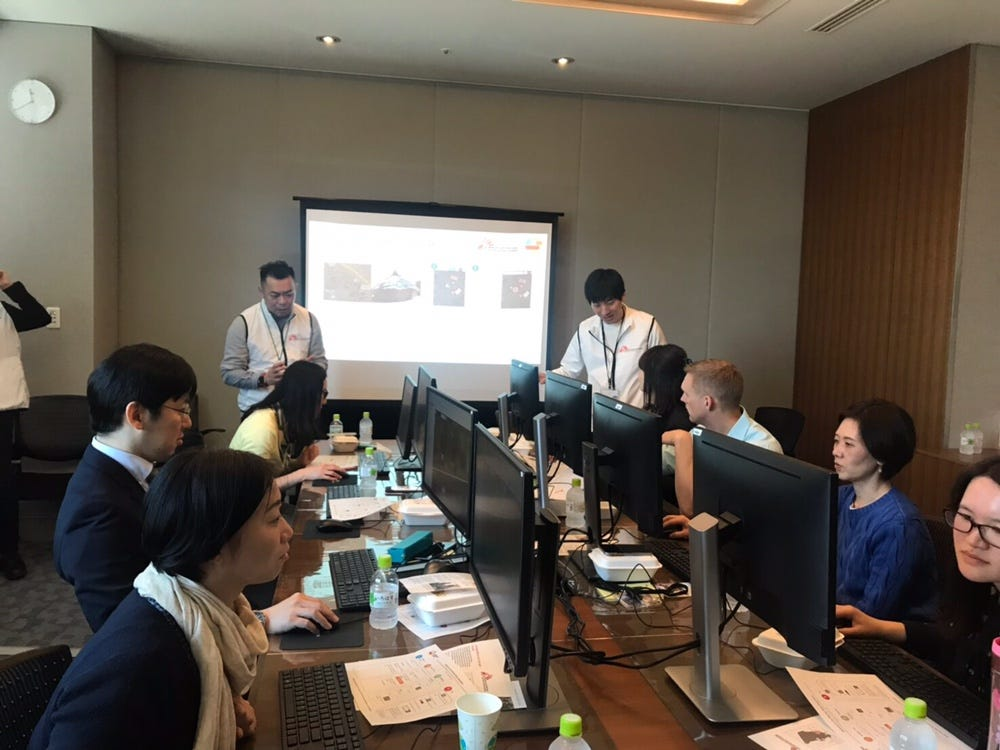
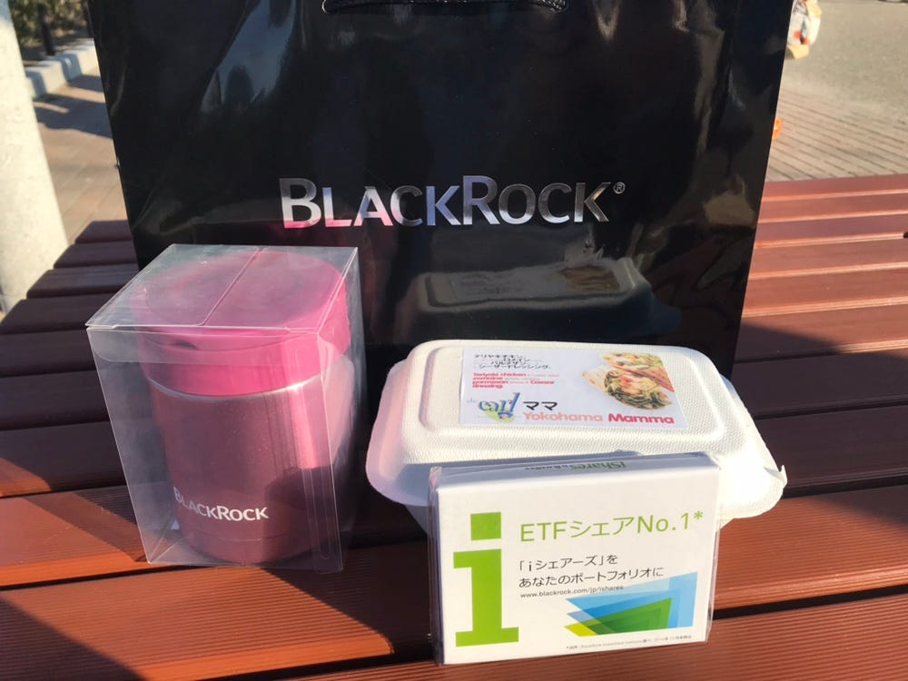

### BlackRock×国境なき医師団×古橋研究室

どうも、古橋研究室4年の末光です。

4月4日(木)に国境なき医師団と一緒に大手の外資系投資会社BlackRockさんにてMissing Mapsのワークショップを行ってきました！！

### BlackRockって？

正直私もこのイベントをやるまで知らなかったのですが、めちゃめちゃすごい会社でした。

BlackRockは世界最大の資産運用会社でアメリカをはじめヨーロッパ、アジア、オーストラリアなど世界中にオフィスが構えられています。

クライアントは世界各地の年金基金・政府・公的機関・保険会社・銀行などもいるそう。

### なんで会社でマッピング？

今回前半と後半の2部でワークショップを行いました。それぞれ10人程のBlackRock の社員さんが参加して1時間ほどチャドという国をマッピングするというものです。

このワークショップはCSR(Corporate Social Responsibility)となっています。

日本では企業の社会的責任と訳され、ボランティアや社会貢献と思われる方が多いです。

しかし、グローバル企業としてビジネスを行うには、国・地域・NGOなどと信頼関係を築き協調することが重要であり、実際EUではCSRの重要性を高める政策などがあるみたいです。

なので！

#### 社員さんが参加した時間のお給料は発生しません。

この分に発生するだったお金を国境なき医師団に寄付され、チャドにいる現地職員たちの活動資金になるという仕組みになっているのです。

世界中のBlackRock のオフィスで開催するプロジェクトのため マッピング時に、

### #blackrocktokyo19

というハッシュタグを付けてマッピング数を競うそうです。

英語で会話する場面も見られ、英語が苦手な私はどきどきが止まらない。笑

でもBlackRock の社員さん方もとても優しく熱心で、学生なのに先生と呼んでくれたり和やかな雰囲気で行うことができました。

マッピングもチャドの性質上トゥクルという建物が多く、上から見ると丸ばかりの場所が多いため途中からみんなでトゥクルトゥクル言ってました。笑

ランチもいただき最後には手土産まで…！

ありがとうございます。

普段自分達がやっていることを他の人たちがやって「楽しい！」と言ってもらえるのはすごく嬉しいですね。

気づけば私ももう4年生。後輩にもこれからいろんな場所に足を運んでもらいたいです^ ^

strava↓

[https://www.strava.com/activities/2263722275](https://www.strava.com/activities/2263722275)
