### GWゼミ合宿@千年の森自然学校

どうも、4年の福王です。GW中(4/27〜4/29)に長野県大町市にある千年の森自然学校でのゼミ合宿に参加しました。キャンプ生活にはまだまだ慣れていない自分にとって、今回のキャンプは山あり谷ありでした!!

と言うのも今回のゼミ合宿はGWなのに…

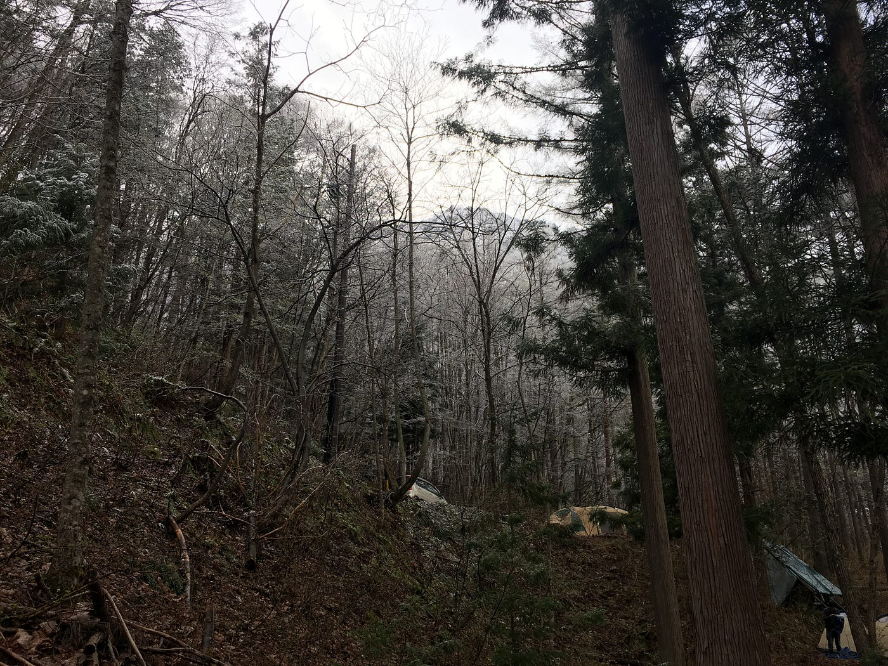

初日から雪が降っていました!!

いや〜さすがに、この時期に雪が降るなんて思ってもいませんでした。長野県の寒さをなめていました。自分としては、長野県って普段生活している東京より少し涼しい程度だろうな〜っていう感覚でしたが、到着してみたら、涼しいどころか寒すぎってなりました。事前に天候に着いてもう少し調べておくべきでした…。

#### 初日の活動

キャンプ地に着いて最初に行ったのは、ベースキャンプのテント張りでした。ベースキャンプは、ミーティング・食事・憩いの場として重要な共有スペースであり、絶えず火が焚かれているため、あの寒さにおいては聖域のようでした。

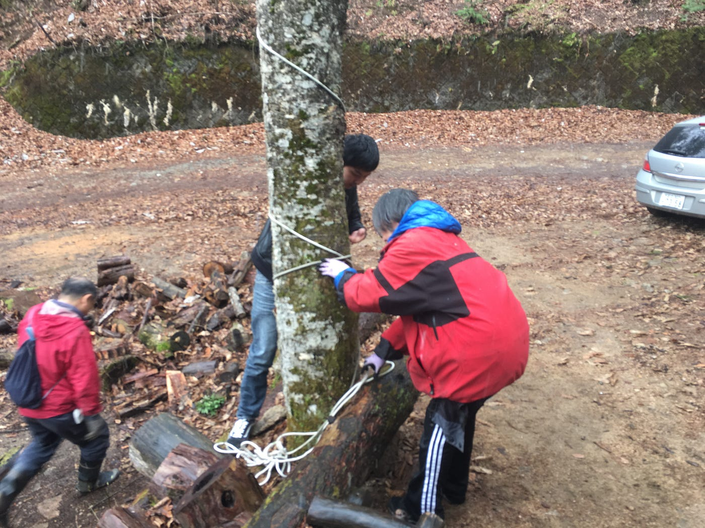

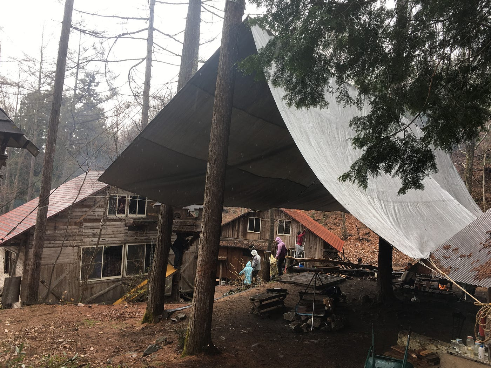

ベースキャンプが完成した後、自分たちの拠点作りが始まりました。今回テントを張る場所が斜面でしたので、最初にシャベルで地面をなるべく平面になるように石をどけたり、土を掘ったり埋めたりしました。去年のゼミ合宿で行ったテント張りを覚えていたので、テント張りはスムーズに作業を終えました。この後、古橋先生から寒さ・積雪対策にタープ(テントの屋根)をお借りし、後輩たちに協力してもらいながら組み立てました。また、地面からの浸水・冷たさを軽減するために、テントの床にダンボールを敷くという知恵も教えてもらいました。

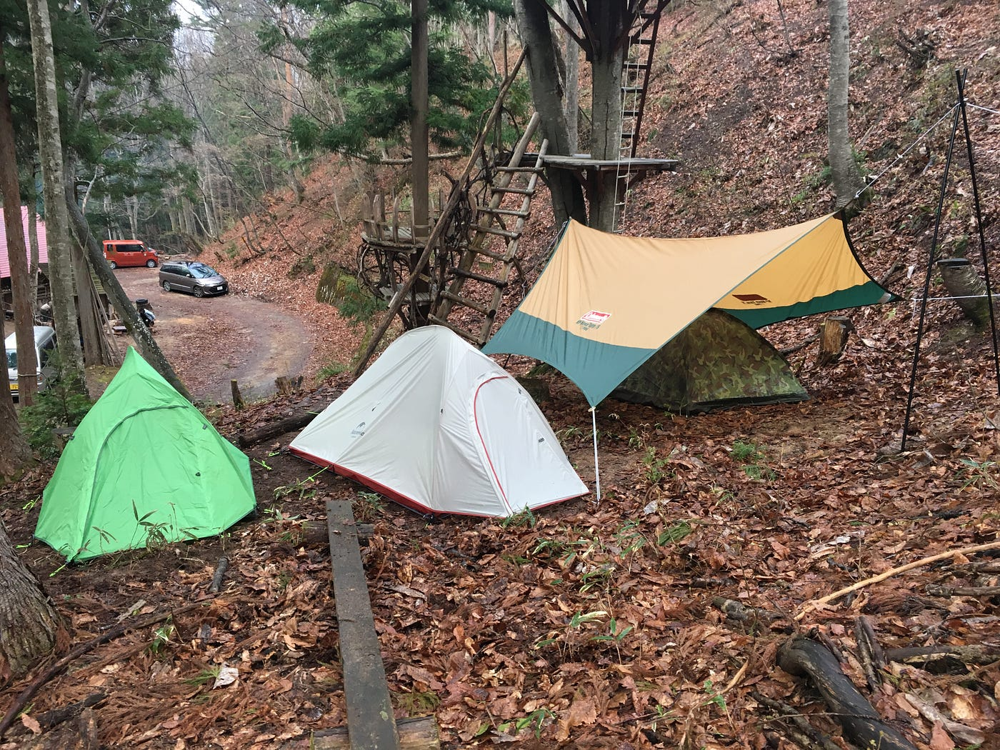

その後は、薪集めや水汲み、火起こしなどをしていました。薪集めでは、乾いた針葉樹(着火しやすいとのこと)が使いやすいこと、火起こしでは、木材の組み方として並列型(一本の太い木材の上に並列に木材を並べる型)を教えていただきました。

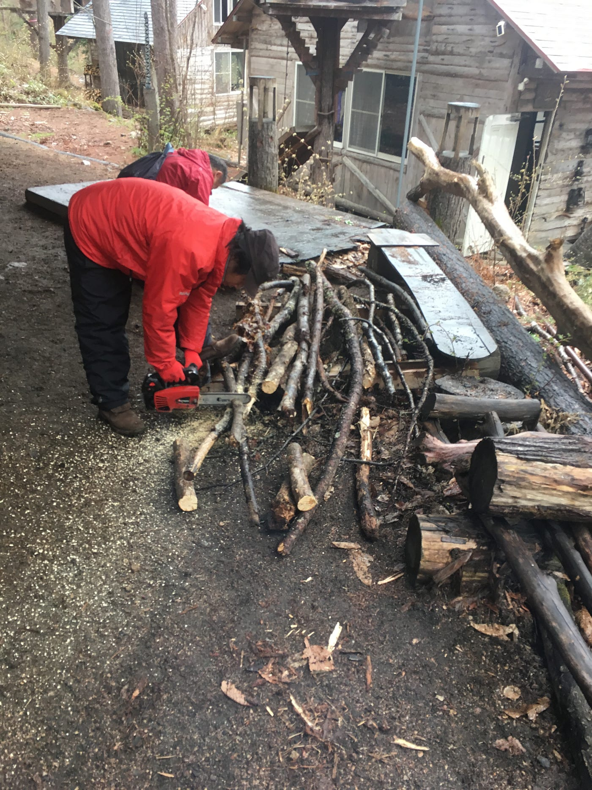

#### 二日目の活動

初日の夜は、あまりの寒さ故にほとんど寝られませんでしたが、二日目は慣れなのか気温なのかわかりませんが、少し暖かく感じました!!

午前中は、山菜ツアーに参加しました。キャンプ地の周辺に生息している植物や地形について解説していただきました。ツアーを通して、私たちの食事では当たり前のように野菜を食べているが、それらの野菜は過去の人々の未知への挑戦の積み重ねであることを思い出させてくれました。また、味の是非を問わず、生の植物を実食する姿がとても面白かったです!!

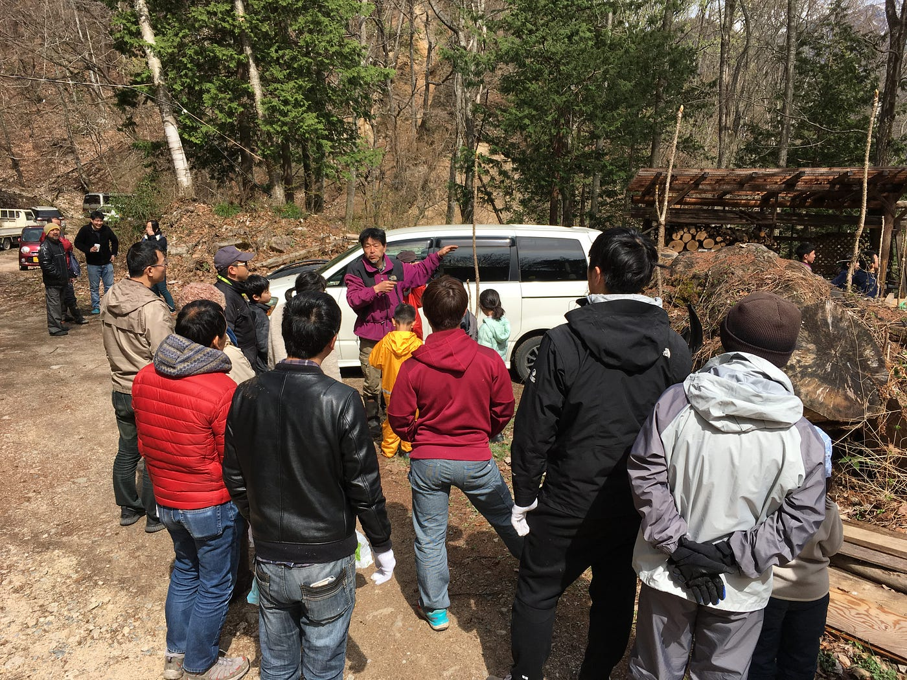

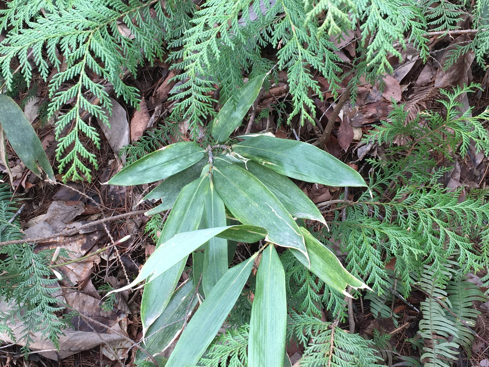

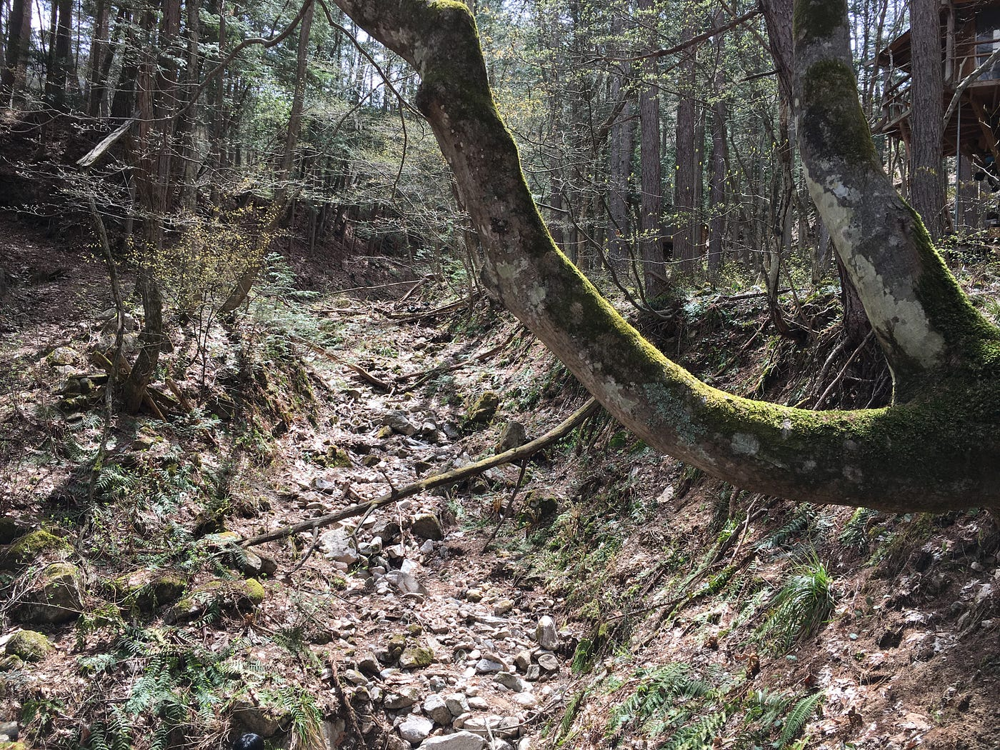

午後は、ドローン体験会に参加しました。去年の夏合宿以来久々に 、MAVIC AIR を飛ばしました。今回は、八の字での離陸や上空100mからの空撮、離陸高度が高い場合のコントローラーの持ち方など教えていただきました。P.S コントローラーのステッィクの結合部分は右ネジの法則であること、忘れないように気をつけます。

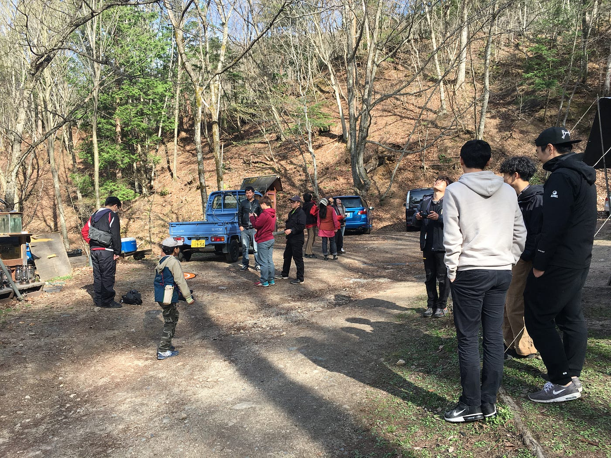

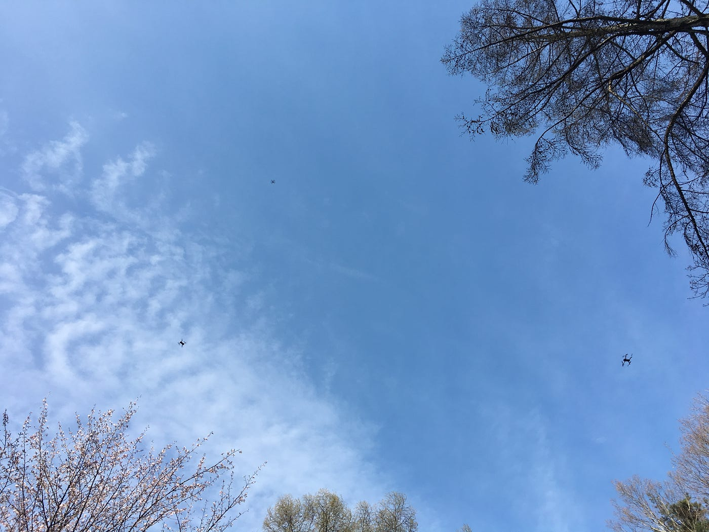

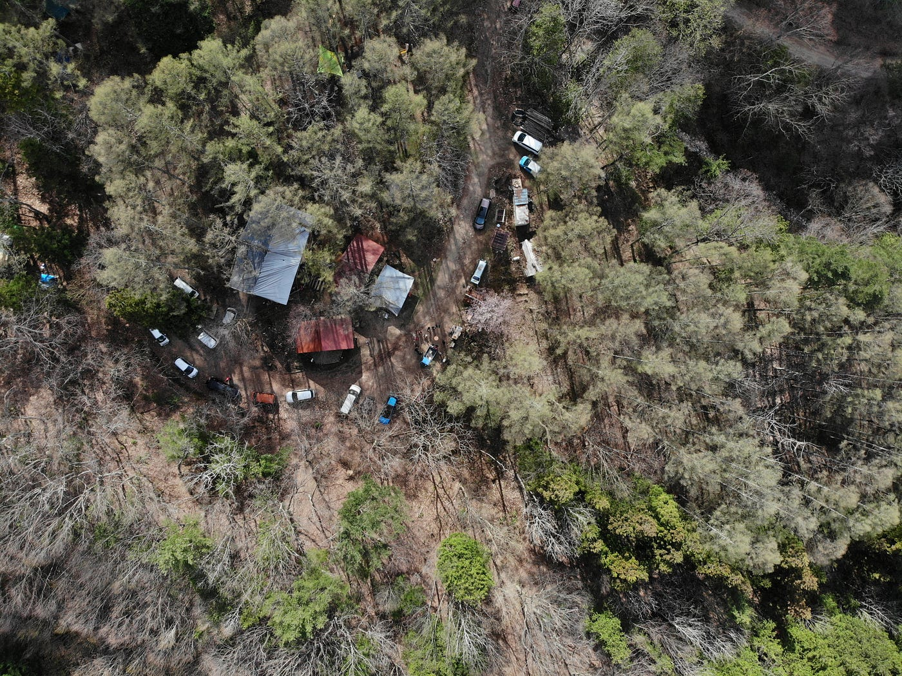

#### 三日目の活動

二日目の夜は靴下を3枚重ねて履いたおかげか、とてもよく寝れました!!

午前中はキャンプ地の道路の舗装工事をしました。キャンプ地の道路は凹凸が激しく、参加者の中にはタイヤが故障してしまう人がいるそうです。毎年、舗装工事をしているそうですが、台風や土砂崩れなどの自然災害のため、鼬ごっこ状態だそうです。作業内容としては、軽トラックで運んだ土砂から大きな石を除いて、斜面に土を被せ、その上をシャベルや車で均して行きました。

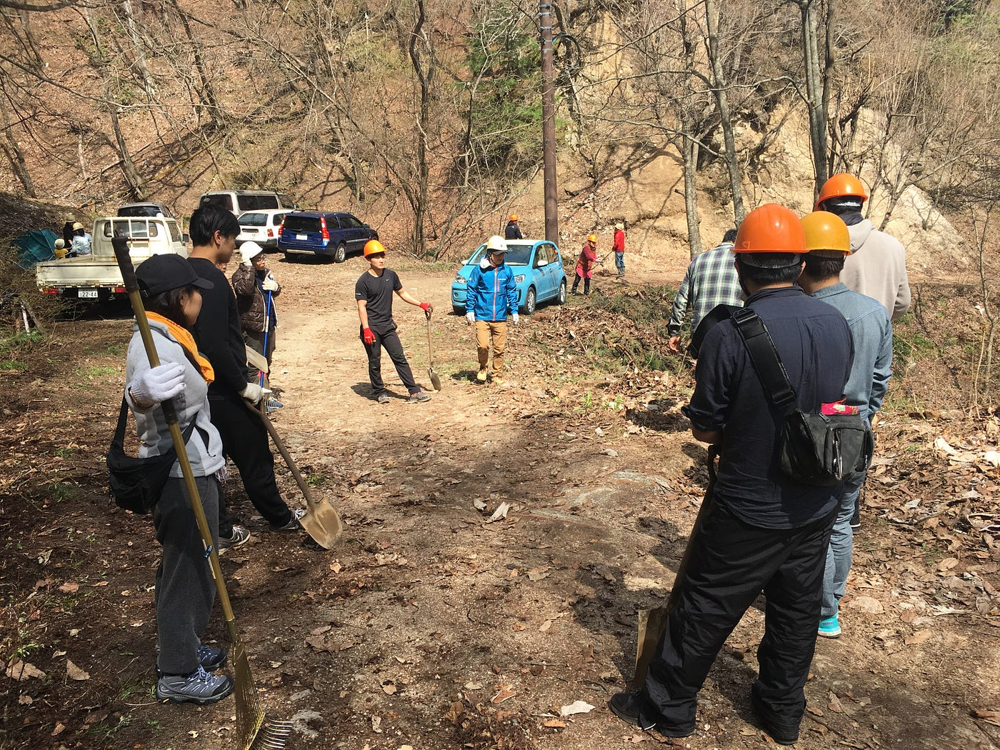

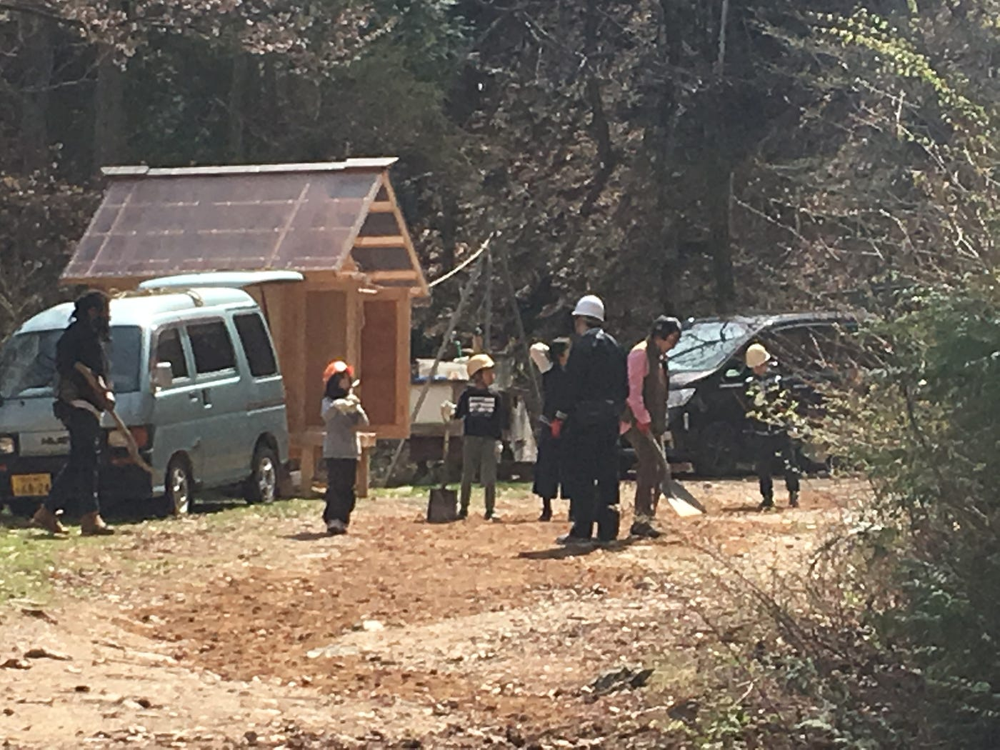

#### 最後に

今回のゼミ合宿では、雪・寒さと言う自然の厳しさと、その環境下での焚き火のぬくもり・ありがたみを痛感しました。普段の生活環境を離れて、少し原始的な生活の中で、物事の仕組みを改めて考え、自ら手作業で生活を向上させていく経験は貴重でした。最後に、お世話になりました方々、充実した自然体験をさせていただき、ありがとうございました。

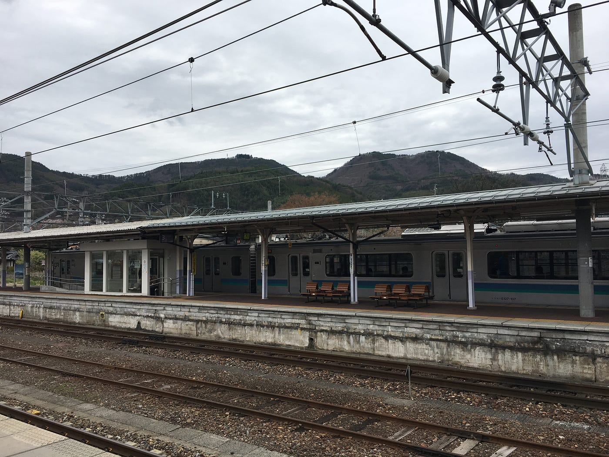

Strava

[午後のランニング - 福王 光剛's 10.8 km run
福王 光. ran 10.8 km on Apr 27, 2019.www.strava.com](https://www.strava.com/activities/2325127878)
