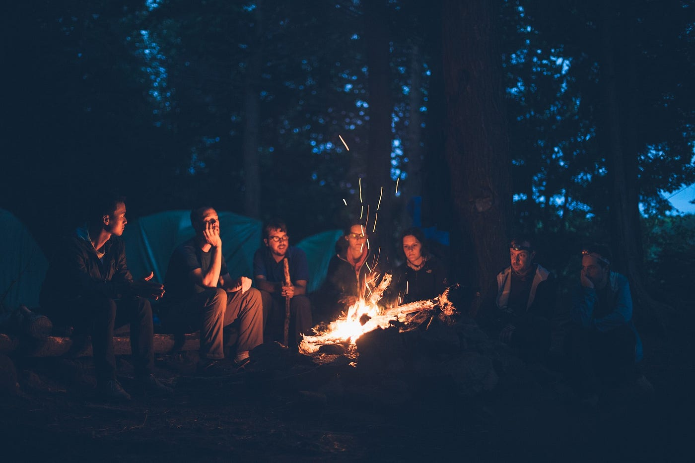

### 失敗談から学ぶゼミ合宿攻略法

〜失敗を失敗で終わらせないために〜

こんにちは、古橋ゼミ3年の大庭啓太です。ゼミ合宿の参加レポートなのに「なぜこのタイトル？」と思った方が大半でしょう。普通、ゼミ合宿の参加レポートといえば活動内容などを記録するものが大半です。しかし、今回、私はあえてこのタイトルで書いていきたいと思います。

### まず、自己紹介から

本名は大庭啓太ですが、おおばけい太で通してます！古橋先生との出会いは、2年の基礎ゼミで、なんとその授業が先生と2人だけでした！（今考えれば、なんと贅沢な時間でしょう！古橋先生に15回家庭教師をしてもらことなんてこの私以外いないでしょう！！！）その授業で古橋先生の活動に興味をもちゼミ選択は古橋ゼミの一択でした。プライベートはここで掘り下げると今後ネタがなくなりそうなので、今後のブログで小出しにしていきたいと思います。古橋ゼミの皆さん２年間よろしくお願いします！

あ、言い忘れておりましたが、古橋ゼミ３期生のゼミ長に就任しました！頑張ります！

### なぜこの場で失敗談を書くのか

その理由は２つあります。１つ目は、今回のゼミ合宿に反省点がたくさんあったからです。そして、もう一つの理由はその失敗を失敗で終わらせないために改善策を考える必要があると考えたからです。

そして、その改善点をここでシェアすることで、ちょっとでも他のメンバーに役立てばなと思っています！！

### 本ゼミ合宿の詳細

今回私が参加したゼミ合宿は長野県大町市にある千年の森自然学校で行われた「春のツリーハウス合宿」です。私は4月28日より二泊三日で参加してきました！！

合宿の詳細やか活動内容を知りたい方は真面目な先輩が書いてくださったブログがございますのでご覧ください！！

[GWゼミ合宿@千年の森自然学校
どうも、4年の福王です。GW中(4/27〜4/29)に長野県大町市にある千年の森自然学校でのゼミ合宿に参加しました。キャンプ生活にはまだまだ慣れていない自分にとって、今回のキャンプは山あり谷ありでした!!medium.com](https://medium.com/furuhashilab/gw%E3%82%BC%E3%83%9F%E5%90%88%E5%AE%BF-%E5%8D%83%E5%B9%B4%E3%81%AE%E6%A3%AE%E8%87%AA%E7%84%B6%E5%AD%A6%E6%A0%A1-22d503550d01)

### 本題へ

さて、前置きが長くなりましたが、本題に移りたいと思います。今回の合宿で私が自分なりに失敗し反省する点は２つです。早速紹介したいともいます！！

### メソッド１：食事はみんなで作って食べよう

え、当たり前のことじゃん！っと思った皆様、すみません。その当たり前のことが私一度もできませんでした。できなかったというより、しなかったが正解になると思います。

こんかい私は自分のキッチン（ガスコンロ）と大量の食材を持参し、３食全て自炊しました。こうした理由は、団体行動が苦手ということと好きなものを食べたかったということです。

今考えても、自分勝手ですね。でも、当時は自分で作った方が効率的じゃん！といういつもの合理主義な考えだけしか頭になかったわけです…

でも、合宿後に思いました。やってはいけなかったと…

【このメソッドを提案する理由】

ズバリ、その理由は…

・先輩との交流

・チーム意識工場

・社会を学ぶ機会

以上の三つです。食事を一緒に作ることで自然に会話が生まれるはずです。それにより芽生える協力や自分の立ち位置を考える時間により、上記の三つをえることができると三日間で学びました。

ぜひ、次回から参加される方は他の参加者と一緒に食事を作り、同じテーブルを囲んでみてください。

【参考記事】

同じ釜の飯を食べる効果が紹介されている記事がありましたので参考までにのっけておきます！！

[「同じ釜の飯を食べる」と社員の絆が深まる？ 古くて新しい福利厚生が若手社員にウケる理由
パソコンやモバイルガジェットの普及で、メールやチャットでのやり取りが激増する一方、対面での会話が減ってきた。これでは社員の連帯感が生まれない。そんな危機感を打破する取り組みとして「同じ釜の飯を食う」取り組みが広がっている。diamond.jp](http://diamond.jp/articles/-/59297?page=3)

### メソッド2：思ったことは口にしよう

もう一つ反省点としてあげられるのは、自分の感じたこと、思ったことを口にできなかったということです。

これに気づいたきっかけは、29日に行った土木作業中のことです。

千住の森に繋がる道をみんなで修繕することになったのですが、ほとんどの参加者が初めての経験ということもあり作業はなかなか順調には進みませんでした。

具体的には、土砂を運ぶトラックがなかなか来ず、私たちがすることがない時間が多かったなどです。この時に私は「トラックは土砂を埋めてる間に一緒に待っているのではなく、バックで入ってきて先に土砂を取りにいけばい良いじゃないか」と思いました。しかし、それを口にできませんでした。

あの時に、私がしっかりと自分の口からみんなに提案できていれば、もっと多くの修繕を行うことができたでしょう。

【このメソッドを提案する理由】

理由は作業効率の工場はもちろんですが他にもあります。それは、合宿はたった数日間かも知れませんが、自分の思ったことを口にしないということは自分にとってもストレスになりますし、周りの意見を引き出せるきっかけも失ってしまいます。一人が意見をいうことでさらに活発な議論が生まれ、より良い環境や雰囲気が出来上がると今回感じました。次回からはその1人になりたいですし、他のメンバーもぜひ実践してみてください！

### まとめ

今回は反省ばかりが残るゼミ合宿でしたが、この経験を活かして次回からは積極的にゼミ合宿に臨みたいと思います！

また、今回のように失敗しても自分でフィードバックを行い改善策を考えるというプロセスはゼミに関わらずずっと続けていきたいと思います。

最後に。土木作業中の私の足跡をストラバ経由で掲載します。次回からより効率的に作業できるように活用していただければ幸いです！！

[https://www.strava.com/activities/2329354313](https://www.strava.com/activities/2329354313)
