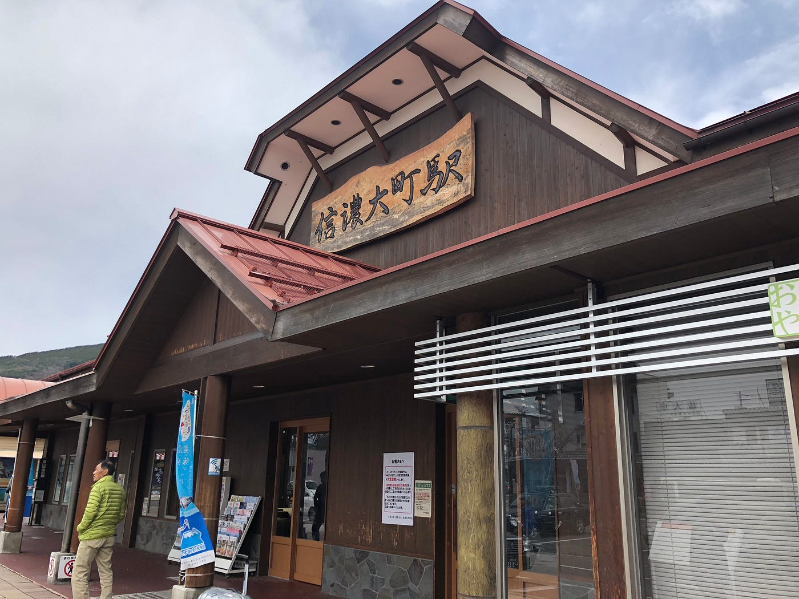
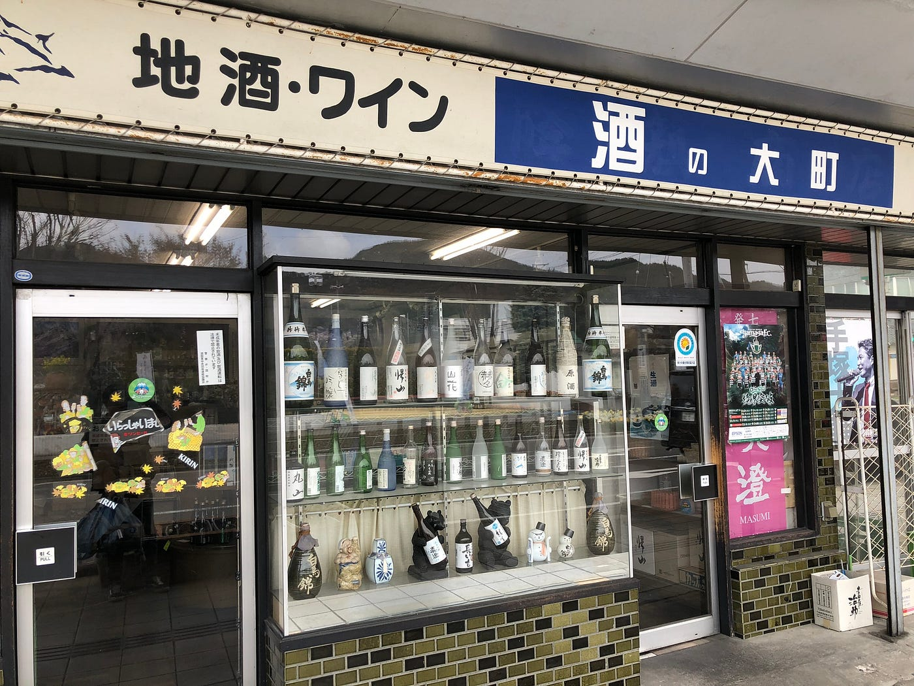
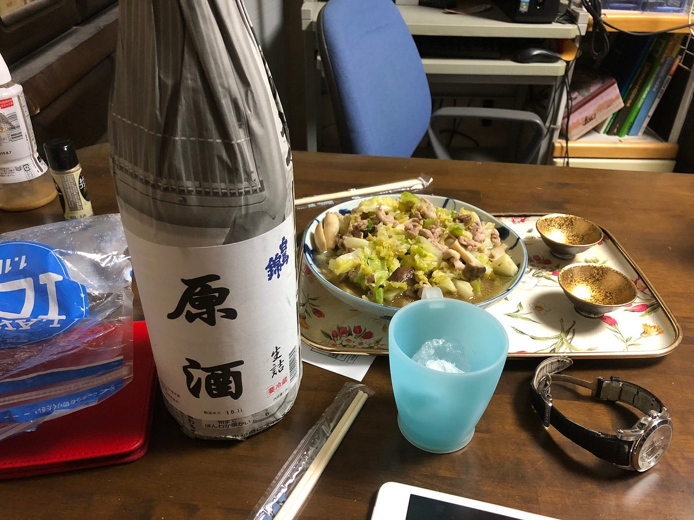
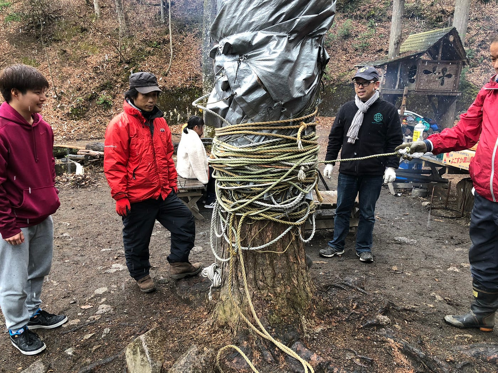
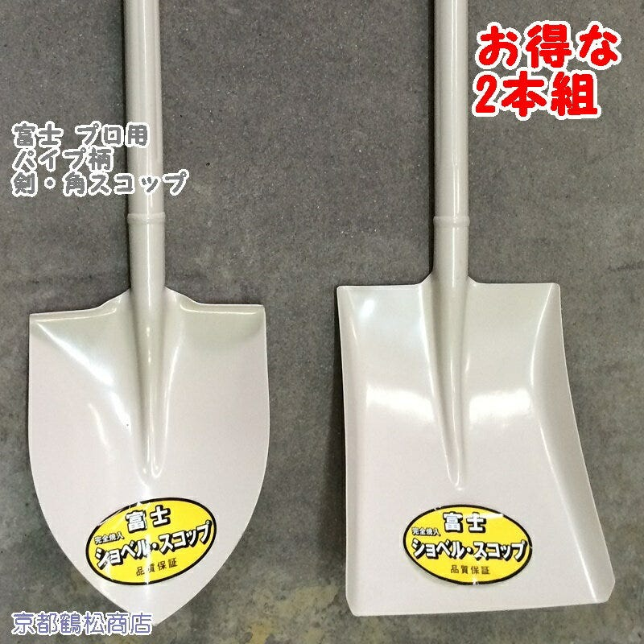

### 春合宿参加レポート

学びの四日間、完結。

### １．はじめに

就活と卒論に追われ、なんとなく大学生らしくなってきたなと実感しています、4年の武末です。

4日間に渡るゼミ合宿お疲れ様でした。雪あり雨ありと天候的にはかなり厳しいものとなりましたが、皆さんのお陰で無事風邪もひかず終えることが出来ました。参加された方全員にまずはお礼申し上げます。

さて、参加したとなれば次に参加するゼミ生達へ情報を共有することが、私の最後の仕事になります。

個人的に今回の合宿は、心の持ちようと装備不足が目立ったなと感じています。自分の健康を守るだけでなく、同じく参加されている方々へのご迷惑にならないよう次へ活かして頂ければ幸いです。

### ２．Strava報告

[午後のランニング - Kouki Takesue's 11.9 mi run
Kouki T. ran 11.9 mi on Apr 27, 2019.www.strava.com](https://www.strava.com/activities/2325027143)

[朝のランニング - Kouki Takesue's 6.1 mi run
Kouki T. ran 6.1 mi on Apr 28, 2019.www.strava.com](https://www.strava.com/activities/2325027212)

[朝のランニング - Kouki Takesue's 44.5 mi run
Kouki T. ran 44.5 mi on Apr 29–30, 2019.www.strava.com](https://www.strava.com/activities/2329763435)

### ３．今回準備した物とその評価

今回の合宿は4月後半というのもあり、いつも使用しているスリーシーズン用の装備で行きました。

#### テント

[キャプテンスタッグ(CAPTAIN STAG) テント リベロ ツーリングテントUV M-3119 ドーム型 2人用 防水 バイク・自転車積載 軽量・コンパクト設計 バッグ付き
キャプテンスタッグ(CAPTAIN STAG) テント リベロ ツーリングテントUV M-3119 ドーム型 2人用 防水 バイク・自転車積載 軽量・コンパクト設計 バッグ付きwww.amazon.co.jp](https://www.amazon.co.jp/dp/B000AR4SVA/ref=cm_sw_r_cp_awdb_c_Mgo0CbE42G4PQ)

これいいです、小さく袋に全部収まるので持って行きやすいし、ペグ打つハンマーもタープも付いてます。何より安い。6000円で一人用としては最適な大きさでした。ただし、スリーシーズン用なので雪風、特に地面の冷たさには要注意です。今回マットを持って行かなかったので、地面に熱を奪われて凍死寸前までいきました（言い過ぎか）。雨は入ってきませんが、内外の温度差で水滴が発生するのでブルーシートを敷くと尚よし。

#### 寝袋

自衛隊である父のお下がり。小さく収納できて便利なのですが、薄いので保温性はあまりありませんでした。私は上からブランケット（しまむら）を掛けることでこの問題を解決しましたが、最初からマイナス対応の寝袋買った方がいいです。

#### ライト

当初からヘッドライト持ってこいと言われていましたが、（謎の反抗心から）家にあった百均のライト持っていきましたが、結果から言うと微妙です。もちろん食器洗いや片付けなどで両手が塞がるタイミングがあるのでヘッドだと便利なタイミングはありました。じゃあヘッドライト必須か？というとそうでもなく、友達にライト持ってもらえばいいし、胸ポケにスマホ入れて光らせればいいし..。ここはお好みでしょう。

#### 食器

重要。現地でビジター用の食器が相当数用意されてますが、ご迷惑かけないためにもきちんと自分で準備しましょう。百均で買ったプレートと、折りたためるスプーンは大活躍でした。作りやすさ的にスープ類やカレーなどが提供されやすいのでボウルタイプを1個持つと良い。紙系もすぐ燃やせる環境なので便利だが、割と食事のタイミングがあるので数は必要。

#### 軍手

重要。山菜採りや薪拾い、火を起こしなど何をするにしても軍手が必要です。今回は二日間土いじりをするタイミングがあったので、四枚持って行ってもすぐ無くなってしまいました。（洗う所はないので基本使い捨て）百均でいいので少し多めに持っていくべきでしょう。

#### 椅子

今回は必要なし。基本的に食事は一か所で行い、そこはある程度人が座れるスペースがある。立って食べている人もいるし。私も500円で買った折り畳みの椅子を持っていきましたが、邪魔にはならなかったけど使う機会はなかったです。テントは基本寝るとき以外戻らないし。

#### 着替え

重要度は低いです。なんといっても入浴施設が現地にないので基本的には山を下りて温泉施設へ向かうことになります。しかしその時間はほとんど作ることができず、三日目の昼にようやく一回行けた感じです。現場でも寒すぎて着替えるという選択肢はほとんどないです。

#### 雨具

使いどころがあれば重要。傘ではなくレインコートがおすすめです。風も吹きますし、雨の中で作業を行うことが多いので手が空くのはすごく便利です。百均なら使い終わったら捨てられるので精神衛生的にもおすすめです。（百均すごい）

### ４．今回学んだ知識、知恵。

#### ・お酒

[Node: ‪酒の大町‬ (‪2162704305‬) | OpenStreetMap
OpenStreetMap is a map of the world, created by people like you and free to use under an open license.www.openstreetmap.org](https://www.openstreetmap.org/node/2162704305#map=19/36.50063/137.86079)

駅前にある酒屋、酒の大町。ここは白馬錦を基本とした日本酒と焼酎を扱っているお店。店主も優しく、扱っているお酒もすごく旨い。

特にこの白馬錦の原酒は、ここでしか買えない貴重品。加水する前の生詰めで度数は20度だが、それを感じさせないさらっとした味わい。信濃大町で採れる湧き水のおいしさを直で感じることができます。絶対買おう。

#### ・拠点のタープの張り方

[Way: ‪三棟の小屋キッチン‬ (‪149082511‬) | OpenStreetMap
OpenStreetMap is a map of the world, created by people like you and free to use under an open license.www.openstreetmap.org](https://www.openstreetmap.org/way/149082511#map=19/36.50752/137.79852)

ここが拠点。ここのタープはこんな感じに真ん中の樹に巻き付けてあるので、始点の紐を見つけてぐるぐる回って解きます。順番にぐるぐる回らないと結構絡まってしまうので気を付けて。

#### ・剣スコ、角スコの違い

[【楽天市場】特価 ２本組 富士 剣スコ角スコ パイプ柄【プロ用 完全焼入 シャベル】：京都鶴松商店
◆◇特選 品質保証 SHOVELS SCOOPS◇◆。特価 ２本組 富士 剣スコ角スコ パイプ柄【プロ用 完全焼入 シャベル】item.rakuten.co.jp](https://item.rakuten.co.jp/turumatu/2-fuji-2set/)

剣スコ（左）と角スコ（右）よく使いますので名前を覚えましょう。剣スコは土を崩すのに適していて、角スコは薄く土を削ったり、運ぶのに適しています。

### ５．感想

自分自身今までお遊びのようなキャンプしかしたことがなく、まぁ最悪お金で解決できるだろうという考えがありました。しかし本当に外界から離れた土地に来た時、大きな危機感を感じたのを覚えています。寒さに負けず、労働に負けず…。成し遂げて帰ってきたとき、都会に生きるありがたみを感じることができました。

斜面に生きる。というテーマで、土を切り出し、盛って住む場所を作る。平坦な土地というものがいかに作られているのかを体で学ぶことができるいい機会でした。ありがとうございました。
