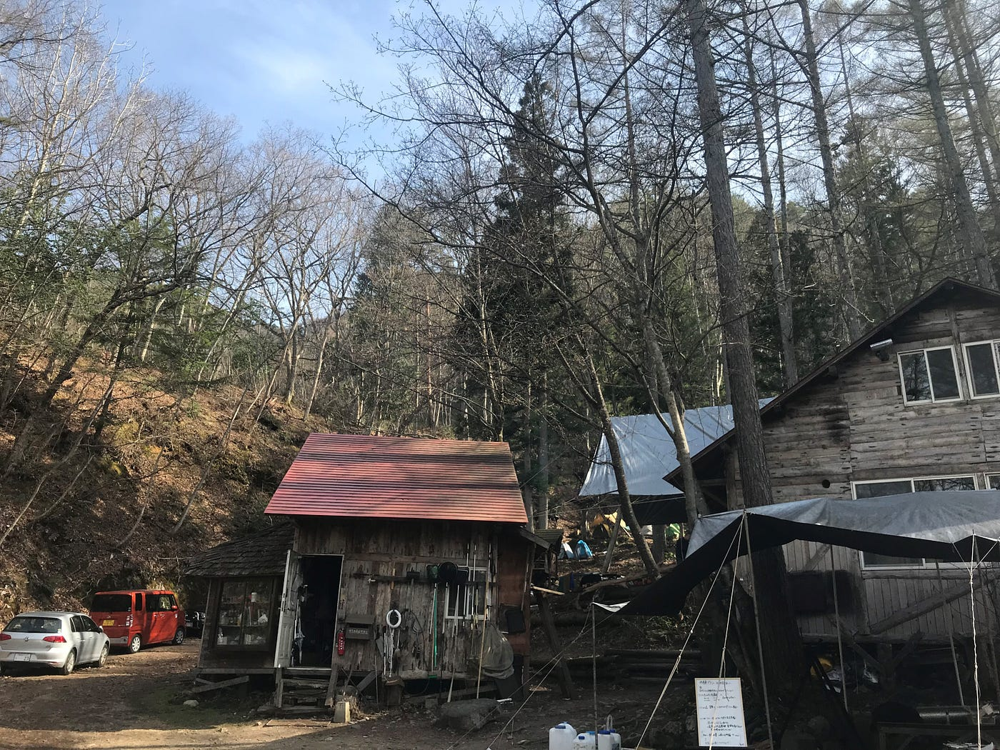
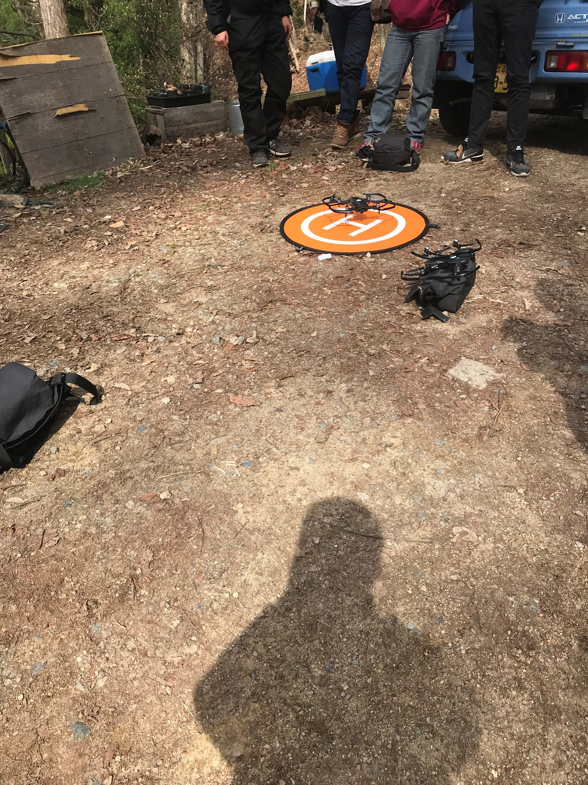
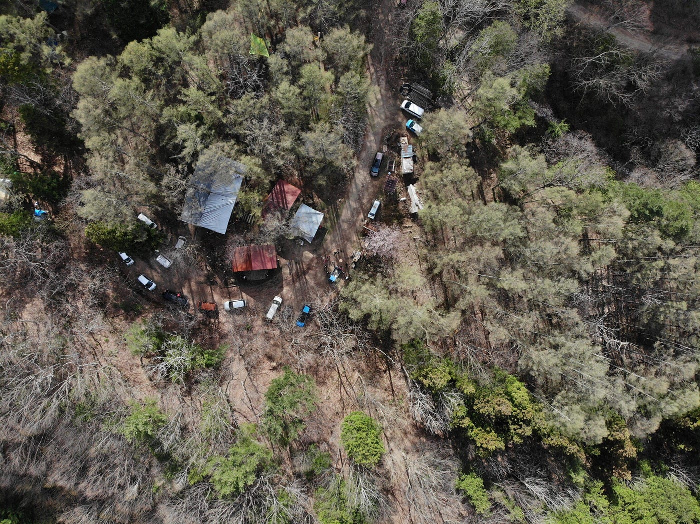

### 春季ツリーハウス合宿へ行ってきた！

4月27日から30日までの3泊4日で長野にツリーハウス合宿いってきました！初日はなんと5月前だというのに雪が降りとても寒かったです。初日は駅に14時集合から行動開始というのもあってキャンプ場の上にシートを張る、薪用の材木を集める、テントを立てるといった活動で終了しました。夜は暖炉の傍に集まって夕食をとりました。こういった感じで大勢で食事をとるのはかなり久しぶりなので新鮮でした。

さて問題は就寝時です。僕は寝袋を忘れていたのですが春に入っているうえ持ってきている服を着こめば何とかなると思っていました。しかし現実はそう甘くありませんでした。服をすべて着込んでも体の芯から凍えるような寒さはまるで治まらず結局朝まで一睡もできませんでした。さすがの僕もこのときばかりは熱中症で倒れかけた時と同じような死の予感を感じました。今回の件で自然の恐ろしさを実感することになりました。

二日目は朝からそんな調子で体調が悪く古橋教授に温泉に連れて行ってもらい身体を休めることにしました。おかげで午後からは活動ができるぐらいに回復しました。その後は薪集めや取ってきた山菜を使った天ぷらなどでお昼をとりその後ドローンワークショップをしました。

二枚目の写真はドローンで空撮した写真です。僕が今まで触っていたドローンよりランクの高い物のようで触るのにも少し緊張しました。その後も夕飯の昨日と似たような作業をしつつ夕飯を食べて解散しました。この日は古橋教授の寝袋と運営側からの寝袋を貸していただけたので温かくして眠ることができました。

三日目の大きな作業は朝食の用意と土木的な作業でした。僕は水くみと焼きおにぎりを担当したのですが網の上で焼いてたこともあり、時間がかかり効率が悪くなったのが反省点です。土木作業においては去年の台風の影響で道路の土が流れてしまいその補修が必要になったそうです。主にえぐれた地面を土で埋めて平らにする作業をしました。大学に入ってから重労働をほとんどしてこなかったんのもあり、大変でしたが貴重な経験になったと思います。

最終日は昨日に続き朝食の用意をし、帰りのバス停に向かう前の時間で土木作業の続きと昨日までの場所とは違う場所の温泉に入りました。総じて疲労感もありましたが貴重な経験ができたと思います。

[春合宿初日 - 恭一朗 北野's 7.7 mi run
恭一朗 北. ran 7.7 mi on Apr 27, 2019.www.strava.com](https://www.strava.com/activities/2322533511)

[春合宿 2日目 - 恭一朗 北野's 1.5 mi run
恭一朗 北. ran 1.5 mi on Apr 28, 2019.www.strava.com](https://www.strava.com/activities/2329142273)

[春合宿 3日目 - 恭一朗 北野's 13.5 mi run
恭一朗 北. ran 13.5 mi on Apr 28, 2019.www.strava.com](https://www.strava.com/activities/2329143533)

stravaの記録ですが最終日のが取れていなかったので3日目までのを掲載しておきます。
