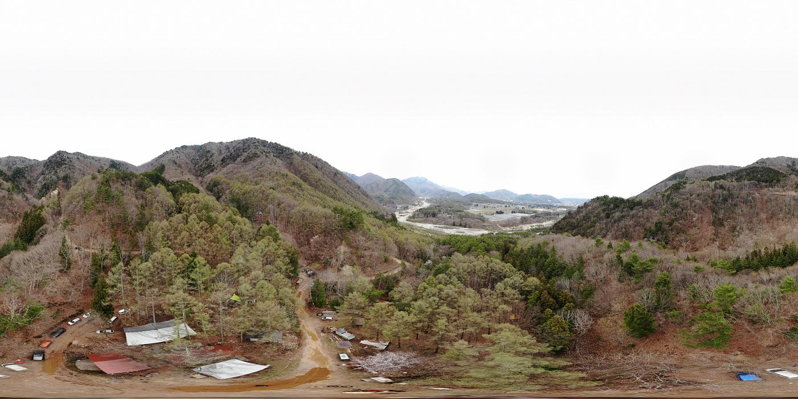
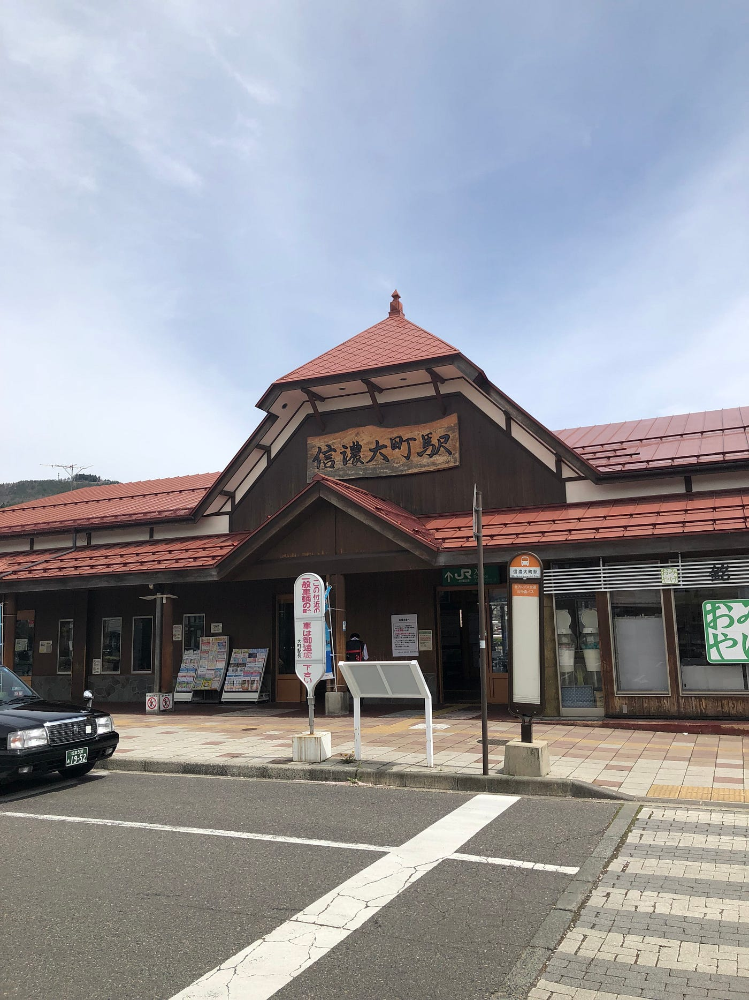
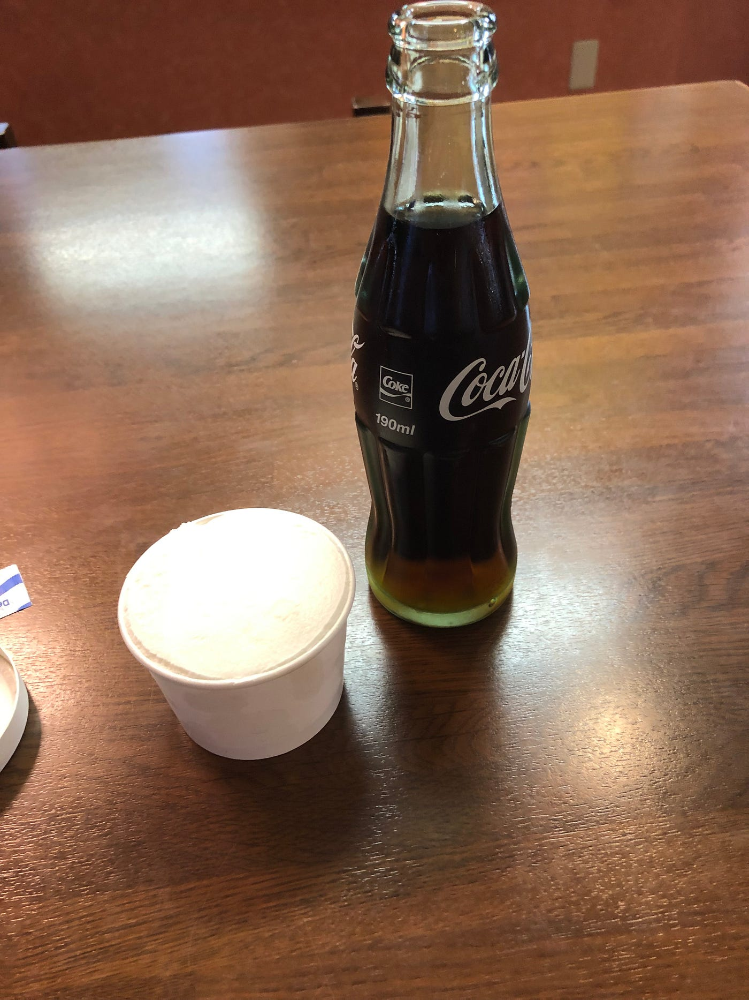

### 次回！増田力尽きる…

みなさんお久しぶりです。

古橋研究室 4年の増田将馬です。
就職活動が無事終わり、ルンルンな気分で4/27〜30のツリー合宿に参加して来ました！
ゼミ、部活に全力投球する一年にするぞ！
さーてそんなことばかり書いていると怒られてしまうので本題の今回の合宿で感じたこと、学んだことを書いていきたいと思います。

### 1日目

私は部活の関係で合宿二日目（4/28）から参加しました。
初日は到着してからテントを建てた後、地面の凸凹を直すための土木作業を手伝いました。
トラクターで土、砂を大量に運ばれてくるので凸凹な地面にスコップ片手に慣らしていきました。
これがとても大変ですぐに腕が痛くなりました。普段部活で体を動かしてはいるんですが普段使わない筋肉を使ったのですぐにバテました…orz
なんだかんだ土木作業を行なっていると夜になり、食事をしたらすぐ寝てしまいました。
【アドバイス】
時期によりますが、この時期に森クラは夜とても冷えます。寝袋あれば余裕でしょ！と思っていましたが夜中なんども起きてしまうほど寒かったです。顔面が寒いのでフェイスマスクなどを持って行くと良いかと思います。

### 二日目

二日目は古橋研究生が朝ごはん担当だったので朝６時に起きました。
しかし、さらに早く起きている方がおり、完全に出遅れてしまいました。
僕は全力で焼きおにぎりを作っていました。
二日目の具体的な作業は土木作業&ドローンの操作練習でした。
土木作業は1日目と同様体が悲鳴をあげていただけなので割愛します。
ドローンの操作ですが、自分の操作技術を高めることではなく、後輩や一般の方々に操作方法を教えることがメインでした。
子供に対してはドローンのスピード、高度などを制限することで安全を確保していました！
二日目に温泉にいき、泥だらけになってしまった体を綺麗さっぱり洗い流して来ました。
やはり温泉は足が伸ばせて良いですねぇ

### 最終日

最終日も土木作業を行いました。
土木作業は三日目になるので全員お手の物でしたね。
何も言わずとも自分のやるべきことをやっていましたね。
帰りのバスに行くまでにもう一回温泉にいきました。
卓球台を借りてみんなで遊んでました。

### 総括

総括として土木してた思い出ばかりですね…
ていうのは冗談で人生の先輩からお話を伺いました。
結婚するのはいつが良いか、子供は何人がベストか就活について働いて活躍するためにはどんな勉強をした方が良いのかなどなど自分が気になってた疑問をぶつけることができた良い機会でした！
お話させていただいた話以外に、持ち物は最低限で良いなと今回で再確認しました。抵抗があるかもしれませんが、服装は下着以外は1日、二日分で十分、パジャマなんていらないなどなど感じました。
僕は今回スーツケースで参加しましたが、無駄すぎて途中で捨てようか迷ったぐらいです笑
次行く時はドローンのヘリポートを作りましょう！
森クラの方々、古橋教授、ゼミ生のみなさんに大変お世話になりました！
次回の合宿では体力作りをしてバテないように頑張ります。

STRAVA

[午後のランニング - Shoma Masuda's 14.3 mi run
Shoma M. ran 14.3 mi on Apr 30, 2019.www.strava.com](https://www.strava.com/activities/2330550511?share_sig=9A9B0ECE1557220908&utm_medium=social&utm_source=ios_share)

[昼のランニング - Shoma Masuda's 4.9 mi run
Shoma M. ran 4.9 mi on Apr 28, 2019.www.strava.com](https://www.strava.com/activities/2324277017?share_sig=AD8E9DC91557221613&utm_medium=social&utm_source=ios_share)
