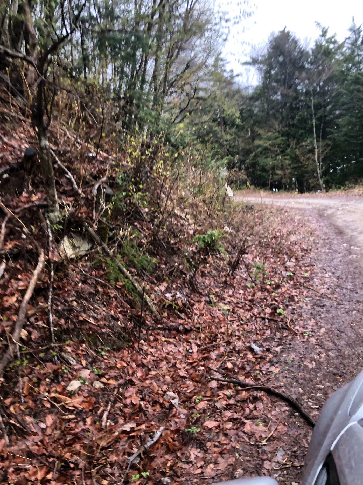
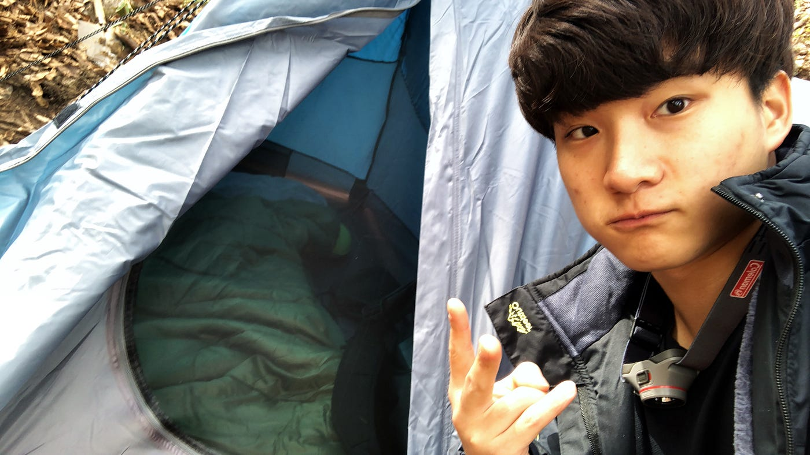
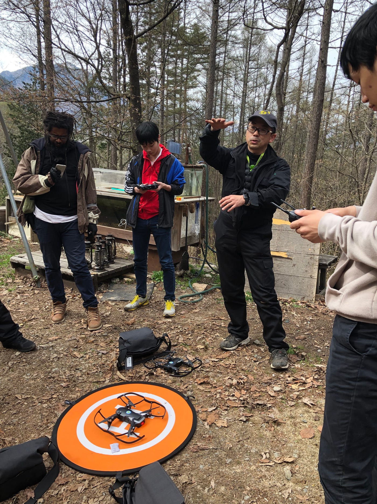
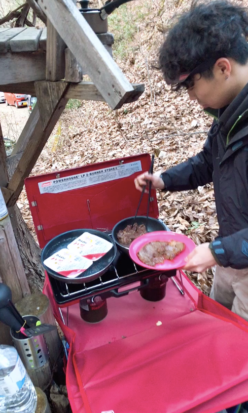
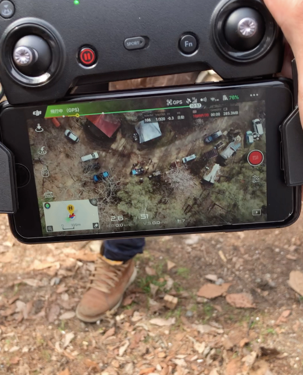
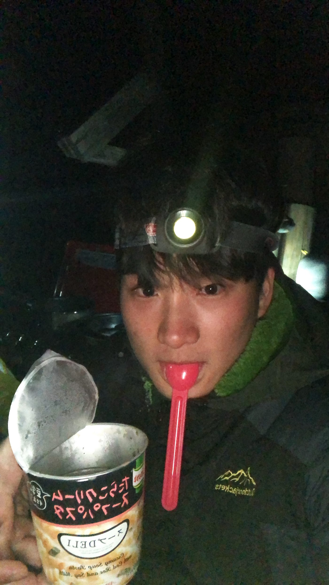
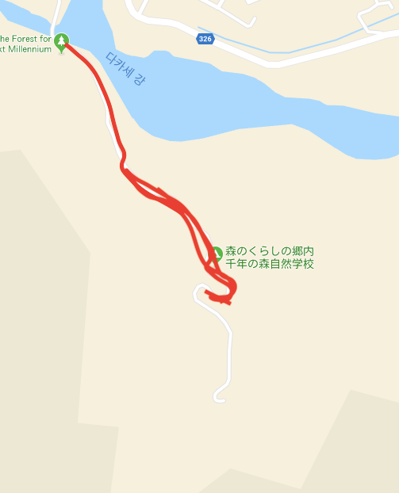

### 2019年初ゼミ合宿 inツリーハウス

こんにちは、3年のイジユルです。タイ留学を終わらせて、3年生になって学校が始まり、初めてのゼミ合宿に参加しました。GW開けの4月28日から30日三日間の短い期間だったが、うるさい都市から離れて、静かな山の中に囲まれ、疲れていた体と頭を休ませるいい機会となったと思います！！

### 1日目

同じゼミ生の大葉君と二日目から車で移動して参加しましたが、、

想像よりガチすぎる山が出てきて、”あー終わった”と思いました。

キャンピングが韓国で兵役をやっている時、散々したので、割と慣れている方だったが、4年〜5年ぶりに見たこの景色は”また、険しい生活が始まるな〜”という感覚を思い出せるに十分でした。

車が登れるかなと思うレベルの道を通って到着したどころは山の中に囲まれている小屋棟でした。木で作られたおしゃれな家が三つ並んで真ん中に焚火が置いてある雰囲気いい場所で少し盛り上がりました。

最初に古橋先生からもらった指示はスコップを利用して自分たちが寝るテントの場所を作ることでした。結構傾斜がある地面だったので、平地にするに時間が少しかかったが、軍隊での経験を活かしてうまくできました。まさか軍隊でやったことがこう時役に立つとは、、

そのあと焚火のところでみんなと挨拶し、昼ごはん出たうどんと山菜天ぷらを食べました。山の水がうまいか山で食べたからかわからないけど、やっぱりキャンプのご飯は最高でした！

そのあと古橋先生のドローン講座！

まだ一般の人には難しいドローンについてわかりやすく説明している古橋先生の話を聞いてから、山だからこそできるドローン飛ばし放題に！

まだドローンを飛ばした経験が少なかったので、この機会を利用して満足できるぐらいドローンを飛ばしながら、ドローンの操作に自信を持つようになったと思います。

そのあとは念願のクッキングタイム！山の中で自分たちでご飯を作って食べるために来たぐらい期待した時間です。

大葉君が持ってきたキャンピングセットでテントの近くにキッチンを作り、自炊開始！山の中で食べるステーキはなんとも言えないぐらい美味しかったです！うまい山の空気とステーキの絶妙なコラボがファンタスティックでした！

### 二日目

寒すぎる山の天気のせいで６時に起き、暖かいコーヒを飲みながら、体を溶かし昼間からの土木作業へ！

ツリーハウスに来るまでの道が雨や風などの影響できちんと整備されていなかったため、全員が集まって道路を整備しました。これもまた、、軍隊で散々やったことなので、軍隊時の辛い思い出が思い出す作業だったが、ゼミ生とことも達と一緒に協力しながら、作業をやったので、そこまできつくはなかったです！逆に自分たちが使う道だったので、自分たちで整備してがいがある作業でした！

その後、２回目のドローン飛ばしでドローン操作をもっと極める時間をもちました。前プロゲーマとして活動した経験を活かして、ゲーム感覚で飛ばしたら、すぐ慣れて自由にドローンを操作できるようになりました。今回のゼミではドローンを飛ばしてドローンに馴染むのが目的だったので、目的達成したので、自分なりには大成功だったと思います！

### まとめ

今回の合宿ではいいことより反省することが多かったと思います。まず、参加者全員と馴染めなかったことと自分から何かをしようとするやる気が少し足りなかったと思います。しかし、山の中での三日間の生活はすごくいい経験であり、都市で感じれなかったことが沢山感じるきっかけになりました！なので上記の反省点を踏まえ次の合宿はもっと主導的にやっていきたいと思いました。

