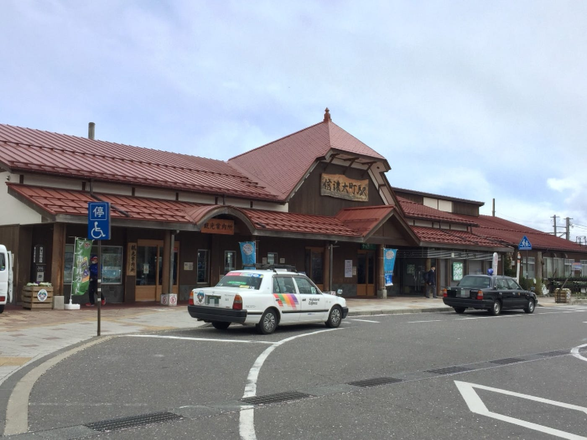
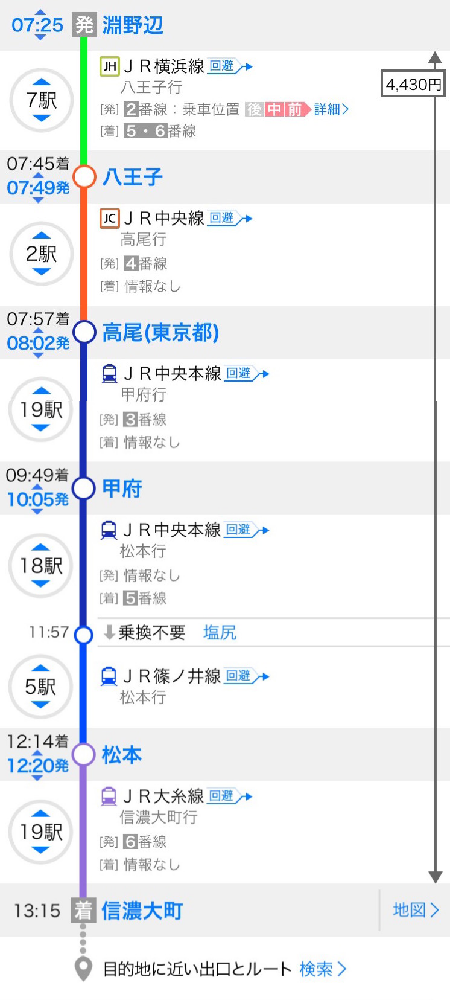
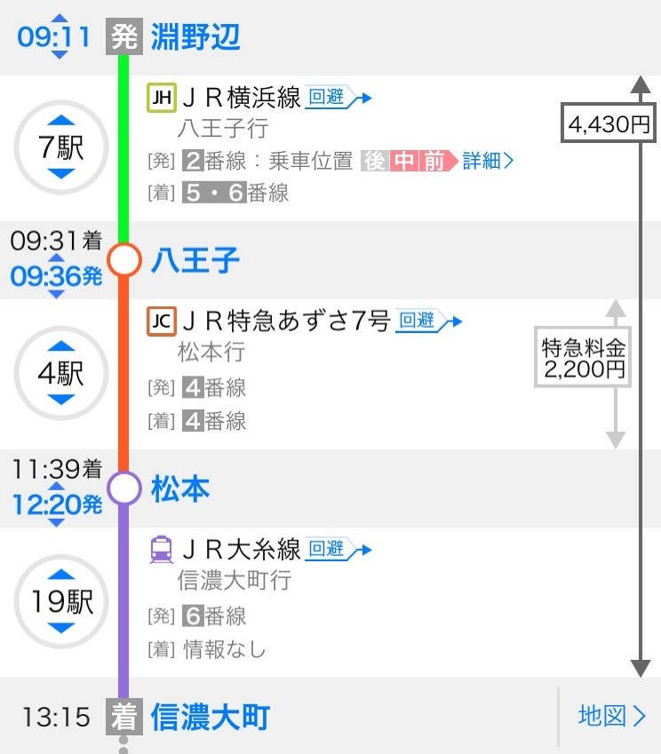
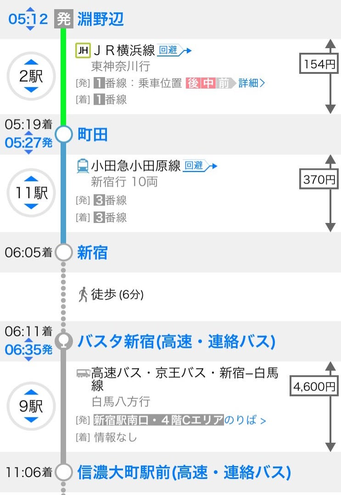
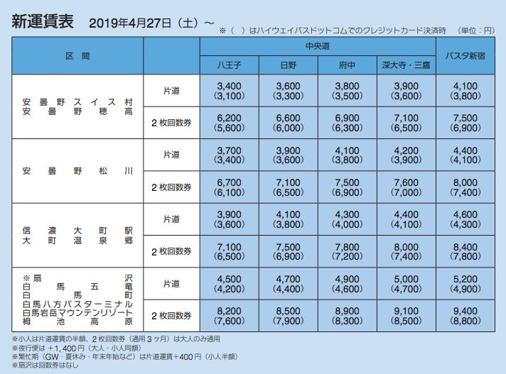
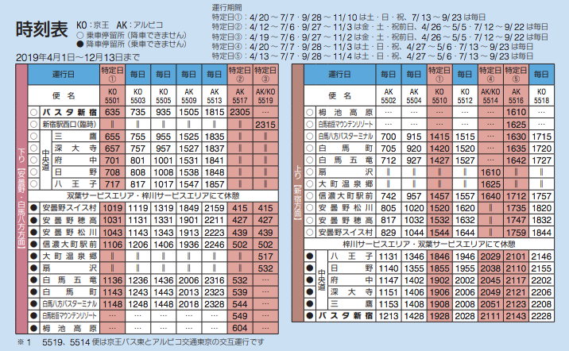
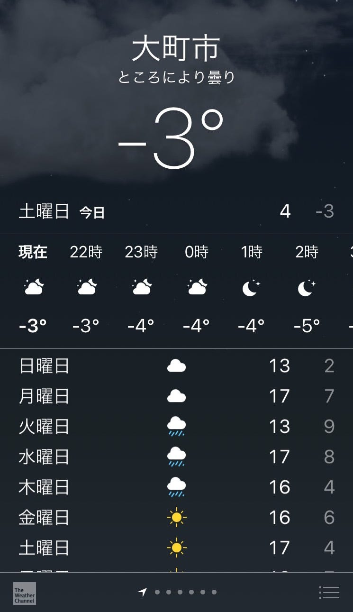

### オラも来たぞ！千年の森で修行開始だ！

#### 4/27~4/30 @信濃大町

#### **おっす！オラ森田！！よろしくな！！！**

みなさま、はじめまして！ ３年の森田浩徳と申します。よろしくお願い致します！
今回は長野県大町市の千年の森自然学校に行ってまいりました。ゼミに入って間も無くの合宿となり、右も左もわからぬままの参加となりました。特に初日は３年生は僕一人で、参加しなかった友人を末代まで呪ってやろうかと思うのもつかの間、なんと現地では雪が降っておりました。
そして時間は過ぎ、サバイバル生活に終止符を打ち、やっとの思いで帰京。平成最終日であったため家族でご飯を食べましたが、合流した瞬間に放たれた一言「あんた煙臭いよ」。

#### （ΩДΩ）

あんな過酷の世界で頑張ったのに… 
ということで、今回の合宿について軽くまとめていきたいと思います。また初めての参加であったため、今後初めて参加する方向けにわかりやすいように書いていきます！



[Relation: ‪Omachi‬ (‪4759380‬) | OpenStreetMap
OpenStreetMap is a map of the world, created by people like you and free to use under an open license.www.openstreetmap.org](https://www.openstreetmap.org/relation/4759380#map=11/36.5008/137.7775)

#### ＃持ち物

・テント
・寝袋
・エアマット
・ヘッドランプ
・トイレットペーパー×日数分
・食器類（皿、お椀、箸、スプーン、コップ）
・雨具
・軍手
・洋服
・下着
・携帯用充電器

＊あると便利なもの
・タオル
・冬用靴下
・湯たんぽ
・救急用具（絆創膏、薬など）

#### ＃行き方

行き方の情報がなかった僕は一から調べ上げました（詳しくは後述を）。集合時間は信濃大町駅に14時。高速バスの方が楽だよなと思いつつ調べてみると、14時6分着。遅刻はできないと思い、高速バスは諦めました。電車ならいい時間に着くかなと思い調べると13:15分着。若干早いから出発時間を遅らせてみると14:15分着。ん？一瞬目を疑いましたが、JR大糸線 糸魚川行きはお昼時だと1時間に1本しか運行しておりませんでした。東京の利便さを感じつつ、行きは電車、帰りは高速バスという手段にしました。

当日の朝大荷物を抱えたまま7:25分の電車に乗って行きましたが、中央線が安定の遅延（5分間）。高尾駅では登山バッグを持った方々が猛ダッシュで乗り換えを行っておりました。時間には余裕を持って行動しましょう！その後は乗り換えを重ねつつ、なんやかんだで信濃大町駅に着きました。しかしそこで一件の問題が発生。改札でSuicaが使えないのです。仕方がなく駅員さんに声をかけることにしました。駅員さんは「入場取り消しに致しますので〜、現金での清算をお願いしま〜す。」と言いながら、Suicaを機械の中へ。入場取り消しにできる機械があるならSuicaで清算をしてくれと思いつつも、しぶしぶ現金で支払いをしました。

公共機関での行き方は大きく分けて2通り。”電車”か”高速バス”。
出発地点は相模原キャンパスの最寄りJR淵野辺駅からJR信濃大町駅まで。

1. **電車**

電車での移動も２パターンあります。”時間をかけて安く”か”お金をかけて早く”。
※信濃大町駅ではSuicaで改札を出ることができません。

・時間をかけて安く行くパターン
所要時間：5時間50分
金額:4,430円
乗り換え：4回



・お金をかけて早く行くパターン
所要時間：4時間4分
金額：6,630円
乗り換え：2回



**2.高速バス**

高速バスはバスタ新宿から白馬線・安曇野まで京王バスから出ています。バスで行く場合事前予約して、クレジットカード決済にすれば若干の割引もあります。またバスの中はFree-WiFiとコンセントがあります。

所要時間：5時間54分
金額：5,124円
乗り換え：2回







京王バス ホームページ

#### ＃行動記録

**初日
**・タープ張り
・火おこし
・材木集め
・サイト作り
・テント張り

**2日目
**・火おこし
・水汲み
・山菜採り
・薪割り
 ・ドローン
・夜食準備

**3日目
**・朝食作り
・火おこし
・道路整備
・うどん作り
・水汲み
・土木運び
・薪割り
・ドローン
・温泉
・ゼミ論報告会

**最終日
**・朝食作り
・火おこし
・サイト作り
・テント片付け
・温泉

行動記録の詳細は、他のゼミ生と被るのでここでは割愛させていただきます。

```
参考までに
```

[GWゼミ合宿@千年の森自然学校
どうも、4年の福王です。GW中(4/27〜4/29)に長野県大町市にある千年の森自然学校でのゼミ合宿に参加しました。キャンプ生活にはまだまだ慣れていない自分にとって、今回のキャンプは山あり谷ありでした!!medium.com](https://medium.com/furuhashilab/gw%E3%82%BC%E3%83%9F%E5%90%88%E5%AE%BF-%E5%8D%83%E5%B9%B4%E3%81%AE%E6%A3%AE%E8%87%AA%E7%84%B6%E5%AD%A6%E6%A0%A1-22d503550d01)

[春合宿参加レポート
学びの四日間、完結。medium.com](https://medium.com/furuhashilab/%E6%98%A5%E5%90%88%E5%AE%BF%E5%8F%82%E5%8A%A0%E3%83%AC%E3%83%9D%E3%83%BC%E3%83%88-d431c15d2ff8)

[次回！増田力尽きる…
みなさんお久しぶりです。medium.com](https://medium.com/furuhashilab/%E6%AC%A1%E5%9B%9E-%E5%A2%97%E7%94%B0%E5%8A%9B%E5%B0%BD%E3%81%8D%E3%82%8B-f49865968616)

#### ＃快適な睡眠をとるために

テントを設置するにあたり、指定された場所が斜面でした。快適に睡眠を行うにはどのようにしていけばいいのかをまとめていきます。

1. **サイト作り**

斜面でテントを張るときには、まずサイト作りを行います。サイト作りとは、寝心地がよくなるように斜面を平らにすることです。

・スコップで高いところから低いところに盛り土をすること
・低いところには板や石を利用して高さを稼ぐこと
・木の枝や石を排除・上に土を盛って柔らかくすること

僕は高いところを頑張って掘りましたが、そのときに木の根っこに穴を開けてしまいました。おかげで一面が水浸しになってしまい、盛り土をし直したので掘る際には木の根っこにお気をつけください。

**2.テント張り**

サイト作りを終えた後はいよいよテント張り。頑張ってテントサイトを作ったとしても、やはり素人には限界があり地面は斜めになっております。そこで注意すべき点は、テントの入り口が斜面に対して上側になるように設置することです。それだけで出入りがとても楽になります。

・グランドシートを敷くこと
・入り口の方向は斜面に対して上側になること
・ペグをしっかり打つこと

※オススメのテント

```
Naturehike Cloud-Upシリーズ2人用テントのアップグレード版
```

[https://amzn.to/2xXPWCQ](https://amzn.to/2xXPWCQ)

中国製は不安との意見が多数ありましたが、このテント最強です。5分あれば組み立て可能。コンパクトで軽いのでバックパックへの収納もOK。中は広々していて荷物も置くことができます。

・コスト
・グランドシート付き
・二重構造
・耐水性
・通気性
・軽量
・コンパクト

**3.睡眠準備**

睡眠は今回の一番のサバイバルポイントでした。その理由は、



とにかく寒かったです。全く寝れず、ゼミ生全員がドロップアウトを考えるくらいでした。GWですよ？この気温考えられないでしょ？しかし現実に起こるんです。そんな寒い中でも耐えるための物をあげていきます。

・寝袋
・マット
・冬用靴下
・湯たんぽ
・防寒着

**寝袋**

今回の合宿の必須アイテム№1であった寝袋はメジャーなものとして、２種類あります。

**・マミー型**

マミー型の寝袋は、みのむしみたいに体全体を包んでくれる形状になっています。そのため身体への密着性が高く、保温性に優れています。また顔の周りにあるゴムで顔の露出範囲を調節することもできます。しかしその密着性がゆえに、身体の動く範囲が狭くなるのが難点。

**・レクタングラー型**

レクタングラー型は、折りたたんだ布団みたいになっており、別名封筒型と呼ばれています。ファスナーが側面を覆っているため開閉しての温度調節が可能。また緩やかに作られているため、寝返りなどがしやすくなっています。しかし使用範囲が広いがために、マミー型に比べ保温性は落ちます。

今回の合宿に向けて揃えた道具の中で、一番こだわったのが寝袋でした。いくらテントにこだわっても、外は外なので温度の調節はできないのです。そこでいい睡眠を確保するためにも、寝袋はしっかりした物を買うべきだと思います。

※オススメの寝袋

```
mont-bell ダウンハガー800 #3
```

[【モンベル】ダウンハガー800 #3
抜群の快適性と軽量性を備え、コンパクト収納も実現した高品質モデルです。夏の高山から冬の低山キャンプまで一年を通して使えるトータルバランスに優れたモデルです。webshop.montbell.jp](https://webshop.montbell.jp/goods/disp.php?product_id=1121291)

モンベルのダウンハガーはとにかく軽いです。また伸縮性が135%とマミー型の欠点である使用範囲を超克しています。またこのダウンハガー800#3はコンフォート温度（リラックスした体勢で寒さを感じないで睡眠できる温度）が3度で、3シーズンでの使用が可能であると思います。さらにリミット温度（身体を丸めた状態で寒さを感じずに寝ることができる温度）が-2度であり、冬の低山でも利用できます。

**マット**

寒さ対策に欠かせないアイテムの一つが、寝袋の下に引くマットになります。冷たい土壌は想像以上に身体の体温を奪っていき、5分経てば寒さで凍えるほどです。マットの発揮する効果としては、

・断熱効果
・寝心地の向上

になります。マットには、銀マットのような簡易的な物から空気を入れて膨らますエアマットなど種類は様々です。

※オススメのマット

```
KOOLSEN エアーベッド
```

[エア-マット キャンピングマット テントマット KOOLSEN エアーベッド 超軽量型 耐水加工 アウトドア 寝袋 キャンプ キャンプマット 枕が付き 防災用品 山登り テント泊 車中泊
エア-マット キャンピングマット テントマット KOOLSEN エアーベッド 超軽量型 耐水加工 アウトドア 寝袋 キャンプ キャンプマット 枕が付き 防災用品 山登り テント泊 車中泊…amzn.to](https://amzn.to/2WfMhtb)

このエアマットの良さは、とにかくコンパクトなのです。しっかり空気を抜いて片付ければ、500mLのペットボトル1本ほどになります。また膨らますのも簡単で、13回吹き込めばしっかりと広がりました。防水加工にも優れており、頭の部分の膨らみは枕の代わりになります。

**冬用靴下**

寝袋を使ったとしても、とにかく足元は冷めます。体温が足元から奪われるというのを、今回の合宿を通じ痛感しました。そこで靴下を重ね履きすることになるとは思いますが、普通の靴下ですと足を締め付けることになり、より血行を悪化させます。したがって冬用靴下の締め付けない具合がとても心地よい睡眠を作ります。

**湯たんぽ**

合宿を振り返ってあればよかったなーと思うアイテム。上記にもあるように、足元は本当冷えます。睡眠中に何回も足を攣りました。そこで足元を温めるための道具を探しました。ペットボトルがあるやん！！試みましたがすぐに諦めました。耐熱性に優れていないペットボトルは変形します。危険なのでペットボトルに入れるのはやめた方が良いと思います。ちなみに合宿場にペットボトルのゴミはほとんどありません。「湯たんぽ欲しい〜」と思い続けた三夜でありました。

**防寒着**

とにかく今回の合宿の猛省ポイント第1位。GW初日は東京も若干冷え込みましたが、日中の気温は15度前後。夜は暖かい寝袋あるからと思っていたため、必要最低限の防寒対策で臨みました。パーカーとスウェット履いて寝れば快眠出来ると舐めていました。はい、そんなでは凍え死にます。荷物を増やしてまでも薄いダウンジャケット一枚持っていくことを強くオススメします。

以上、千年の森自然学校での合宿のまとめとなります！ 移動の時点で東京の利便さを感じることからスタートした今回の合宿でしたが、普段は経験することのないことだらけでたくさん学ばさせていただきました。普段は衣食住が差し支えなく行えていることを再認識することができ、特に住の大切さなんて森クラで生活しない限り理解することはなかったのではないかと思います。貴重な経験をさせていただき、ありがとうございました。そしてこのブログが今後初めて行く方に少しでも役に立つことを願っております。また次回の投稿も見てくださいねー、じゃんけんぽん（パー）！ うふふふふふっ

```
STRAVA記録
```

[信濃大町4/27 - Hironori Morita's 6.6 mi bike ride
Hironori M. rode 6.6 mi on Apr 27, 2019.www.strava.com](https://www.strava.com/activities/2322478718)

[信濃大町4/28 - Hironori Morita's 5.4 mi bike ride
Hironori M. rode 5.4 mi on Apr 27, 2019.www.strava.com](https://www.strava.com/activities/2325587099)

[信濃大町4/29 - Hironori Morita's 13.9 mi bike ride
Hironori M. rode 13.9 mi on Apr 28, 2019.www.strava.com](https://www.strava.com/activities/2328028634)

[信濃大町4/30 - Hironori Morita's 14.7 mi bike ride
Hironori M. rode 14.7 mi on Apr 30, 2019.www.strava.com](https://www.strava.com/activities/2329767111)
