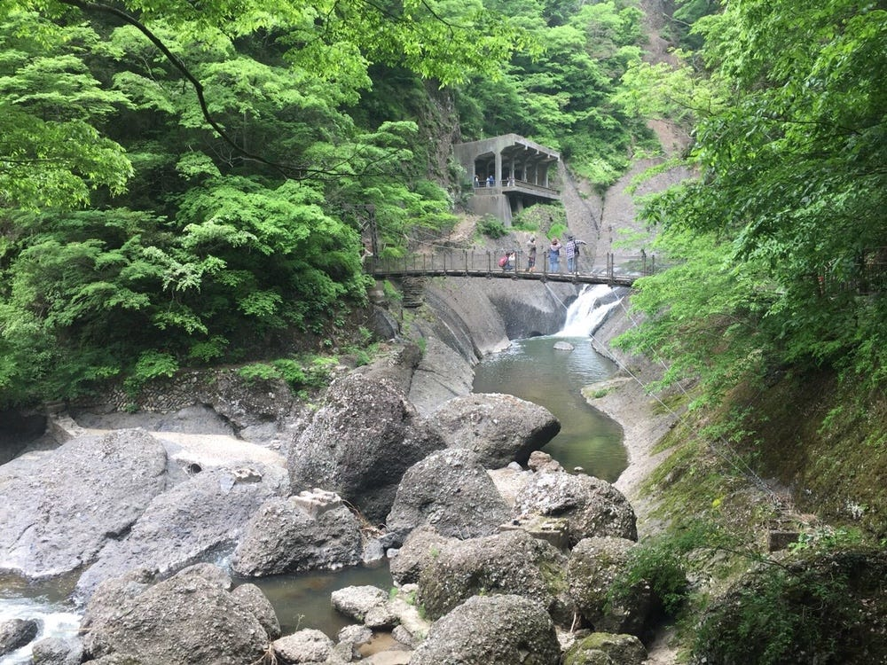

### よりクリーンでステキな日本を未来に残す🇯🇵

こんにちは。四年の多賀谷美里です

恥ずかしながら、こんなざっくりとしたタイトルで、卒論ブログ1個目とさせていただきます🙇‍♂️

まず、今回は私の研究の計画を主に述べて、次回のゼミ(明日やん)で滅多斬りにしてもらうということです。

### 1 計画

まず研究に必要なこと

- 研究の定義？目的？範囲？

- 先行研究 １ヶ月

- 文献調査 その都度

- フィールドワーク ２ヶ月

- 追加研究 ２ヶ月

### 2 先行研究に入る前に。。

先行研究にこのままでは入れません。

なぜなら、今掲げいているのがざっくりとしすぎているからです！

何がやりたいのか、というと、

- 災害の多い日本に危機感を覚えた

- もっと日本いい街にできるんじゃないか

- 日本をもっといい国にしよう

こんなざっくりとした流れになってしまいました。

まず、私が外せないなと思ったのが地震に強い街ってどんな街なのか、どういう条件が必要なのか、ってとこから情報を集めて、実際にそのあと、その街の研究をするor自分の好きな街に当てはめて研究しようかな、って考えております。

ほんの少しだけになってしまうのですが、少しずつ先行研究の前段階、を進めているものも出来上がり次第載せていきます🙇‍♂️

これが、私がやりたいな、と思っていることです！

ただ、このブログを書いている最中から、本当にこんなことができるのだろうか、とか、辛辣なコメント降ってくるだろうという感じなのですが、ひとまずはこの方針で進めていき、何かしらのものを残したいと思っています。
