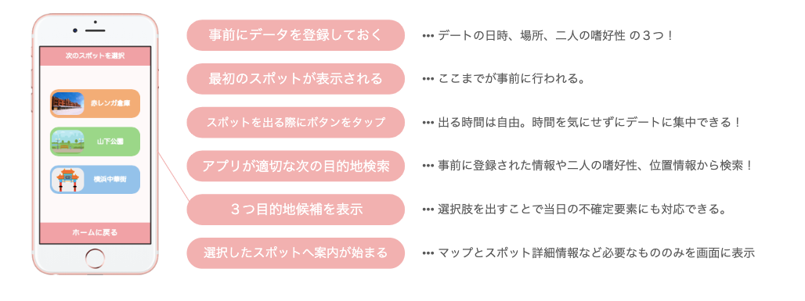

### デートをアップデートせよ！

こんにちは😃
青山学院大学古橋研究室所属、4年の板垣勇渡です！

今回から、毎週、ゼミ論の進捗報告をしていこうと思います💪

> **何をするか？**

僕が、ゼミ論で取り組むものは、一言で言うと、
**その人にあった、現在地周辺でもっとも適切なスポットを提案してくれるサービスです！**

少しわかりづらいですよね、、！💧 詳しく説明します！

**今回解決したい課題 → スポットの検索＆デートコースを作るのが面倒
**デートコースは何度も作っていると面倒になったり、Web上で検索をかけてもおすすめスポット〇選みたいな記事ばかりで、結局どれが良いのかわからなかったりしませんか？それならば、もういっそのことデートコースを自動で作成されるようにすればいいんじゃないかと思い、今回のサービスを作成しようと考えました。

↑ これがサービスの利用の流れです！
「現在地周辺でもっとも適切なスポットを提案する」が基本機能になりますが、これに追加して天気やメンタルを感知し、それに合わせた道を案内する機能も追加できればと思います。

> 現状

これに取り組むにあたり、Google APIに慣れる為、簡単なWebサービスを開発しています。主に僕は設計やデザインを行なっていて、プログラミング部分は、一緒に行なっている友人に大部分を任せてしまっています。もっと勉強し、ゴリゴリ開発を進めていきたいです。

[Recotto
Edit descriptionitayu.github.io](https://itayu.github.io/DATE/)

↑ これは去年作成した、デートコースをランダムで生成してくれるサービスになります。

[Recotto
Edit description35.247.120.126](http://35.247.120.126/)

↑ これが現在開発しているもので、一つ目の物に、地図上でスポットの位置を示してくれる機能を追加しました。しかし、レスポンシブ対応しておらず、ブラウザもChrome出ないと正常に表示がされず、デート長さも1日でないとルート表示がされない為、もしご覧になる際は、PC＆Chrome＆デート長さは一日で見ていただけると幸いです！（もしそれでもルートが表示されなかったら、何度か試してみてください…！）

> **参考サービス**

今回このサービスを開発するにあたり、bitemojoというイスラエルのスタートアップが運用しているサービスを参考にしています。合わせてご覧になってみてください。

[bitemojo | Food tours with nothing but your smartphone
Self-guided food tours at your own time and pace with nothing but your smartphone. bitemojo Berlin, Rome, Barcelona…bitemojo.com](https://bitemojo.com/)

> **今後の課題**

今後の課題としては、

１. 半日（２スポット）でもルートを表示できるようになる。

２. 距離の近い順にA.B.C.D….と表示されるようにする。

この二つに取り組みたいと思います！

また、来週も進捗報告をしますので、よければ見てくださると嬉しいです！😌
