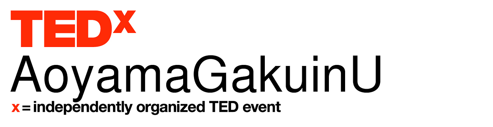
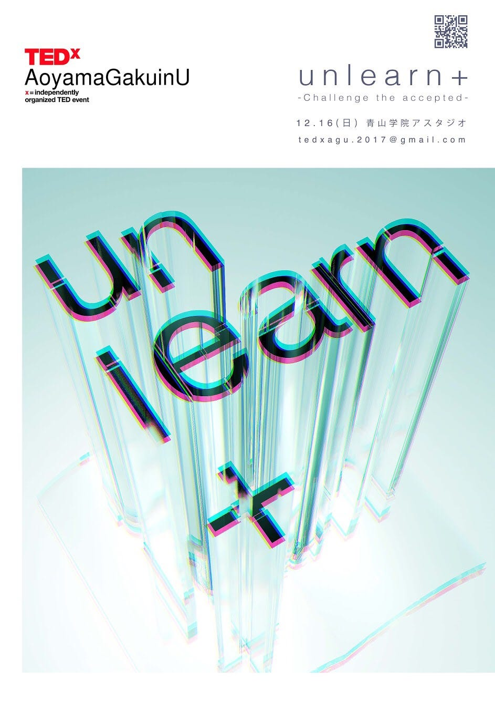
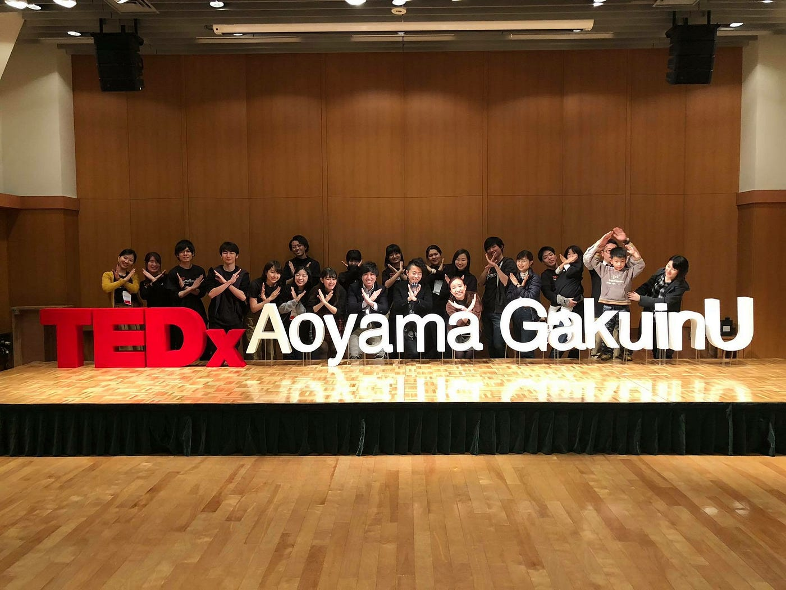

### 次に続け！TEDxAoyamaGakuinU

どうも、青山学院大学古橋研究室4年の末光香織です。

昨年先輩たち頑張っているなあとみていた卒論進捗ブログを始める日が来てしまいました。頑張ります。

### 卒論の舞台

さて、タイトルにもあるように私末光の卒論のベースは…

私自身オーガナイザーとして活動している団体でもあります。

昨年のオーガナイザー、私の大好きな先輩かとゆかさんの卒論に続きTEDxをテーマにしたいと思います。

### TED・TEDxって？

↑こんな風に思われた方、いらっしゃいますか？

さあ、こちらをご覧ください！かとゆかさんが以前のブログで語ってくれているので私の方では省略させていただきます。笑

[TEDxAoyamaGakuinUって名前長くない？
青山学院大学で開催しようとしているTEDxカンファレンスの名称です。
なんで長くないかなど題名で問うているのかという説明は後ほど。
まずは前回ブログで予告下通り、このTEDxがそもそもなんなのかお話します。medium.com](https://medium.com/furuhashilab/tedxaoyamagakuinu%E3%81%A3%E3%81%A6%E5%90%8D%E5%89%8D%E9%95%B7%E3%81%8F%E3%81%AA%E3%81%84-540186cc2a10)

### TEDxAoyamaGakuinU2018

昨年12月16日アスタジオにて初めてのイベントを行いました。

#### TEDxAoyamaGakuinU2018のテーマは「unlearn+」

**“UNLEARN”とは、「学びほぐすこと」。**

今ある情報・知識、持っている考え・価値観、に疑問を持ちまっさらな視点に立ってみてください。新しい考えや視点に気づきやすく、さらに受け入れやすくなると思います。

**“+”（プルス）**

今まで自分の中になかった新たな視点（他の人が持つ視点・アイデア）をそこに加えます。

そうして、自分がそれまで持っていた考え方と新たな視点を互いにすり合わせて、昇華していく。それぞれの価値観を広げていく。新たな考え、多様な考えを作りだす。あなただけのグラデーション（色）を創ってほしい。

そんな想いでこのテーマをつけました。

#### 結果は無事成功！

2015年のTEDxAGU以来の2年越しの開催となりましたが、

青山学院大学の学生、他大学の学生、OBOGの皆様、また一般社会人の皆様など約100名のオーディエ ンスにお越しいただき、ホールはほぼ満席となりました。

古橋先生をはじめ多くの方が協力してくださったおかげで

無事成功を収めることができました！

### さて次はどうする？

かとゆかさんはレセプ難民についてテーマにしていましたが、

私の具体的なテーマが決まっておりません。

今後活動していきながら決めたいと思います。

また昨年のメンバーが4年生が多かったというのもあり、

先輩が卒業してからコアメンバーで残ったのが私を含めたったの4人！

現在は新メンバー集めをしながら次回イベントのテーマ決めについて話し合いをしているところです。

なんと20190513の段階で新メンバーが10人まで増えました！！！

今後も増えていく予定です。

次回のブログでは

- 今年度のTEDxAoyamaGakuinU開催に向けてのスケジュール

- テーマ

についてお話したいと思います。

TEDxAoyamaGakuinUが気になった古橋研究室のみんな！！

ご連絡お待ちしております。笑（宣伝）
