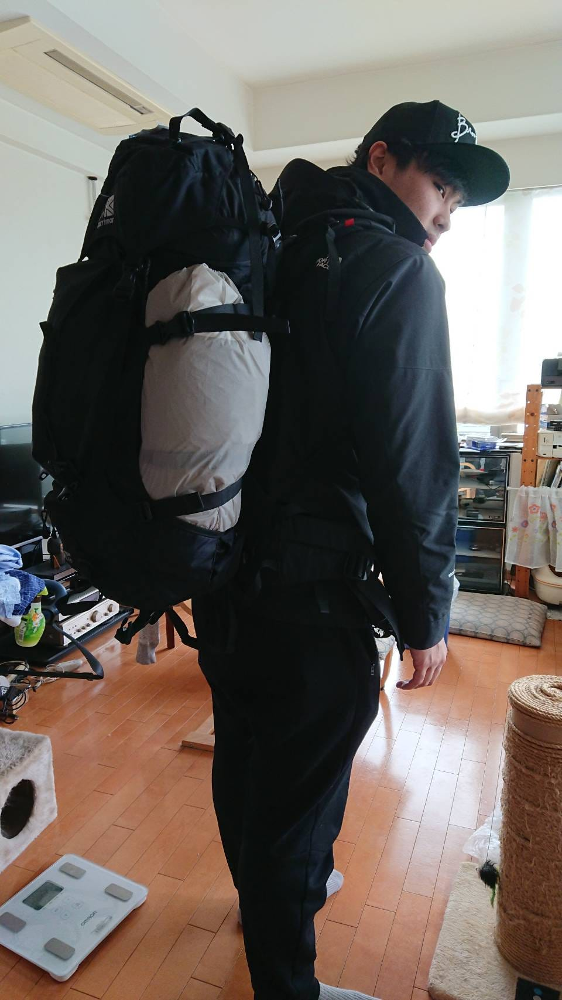
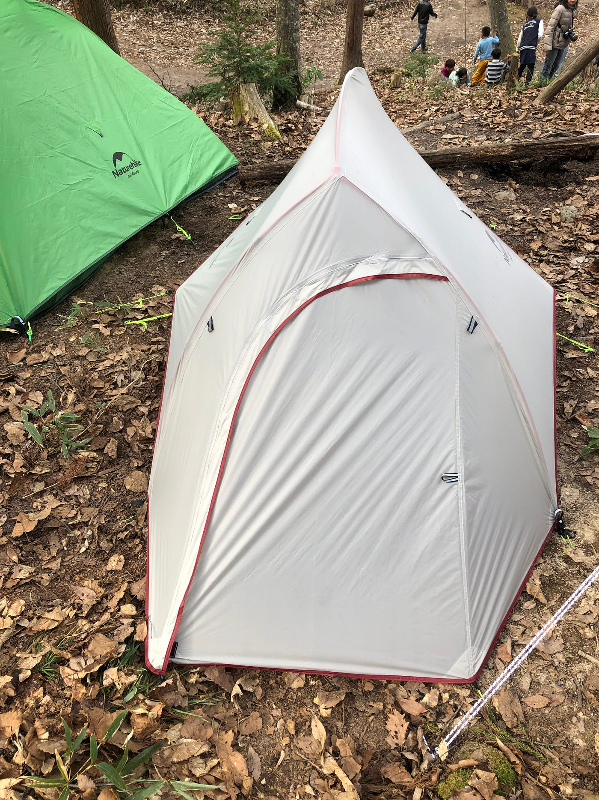
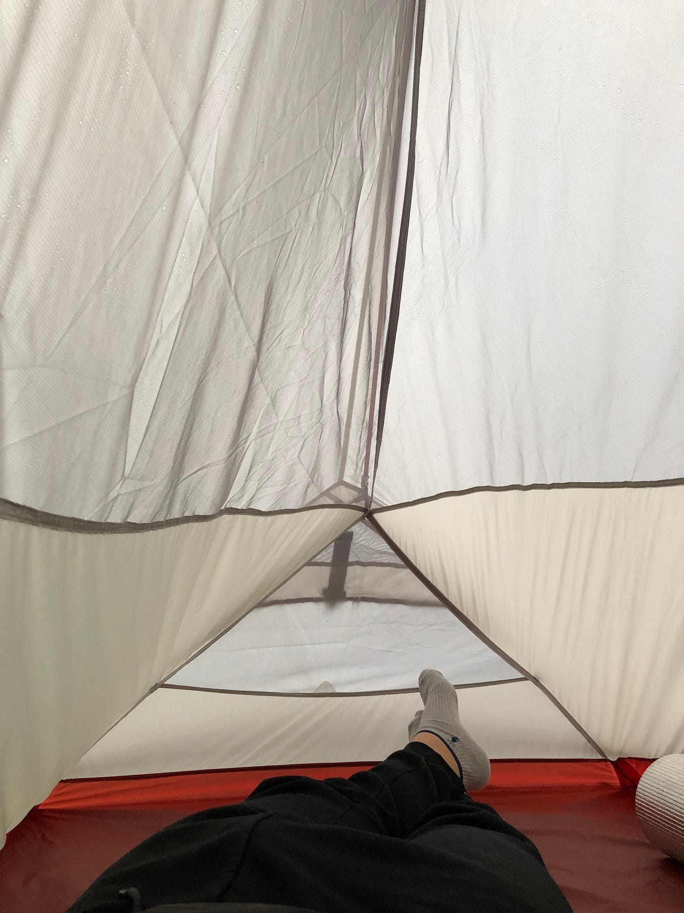
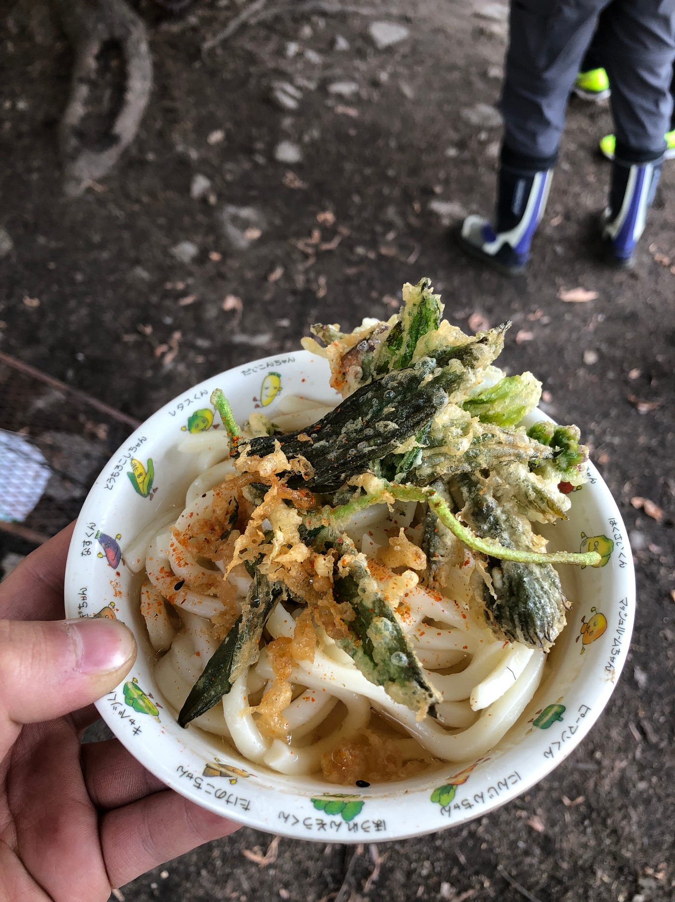
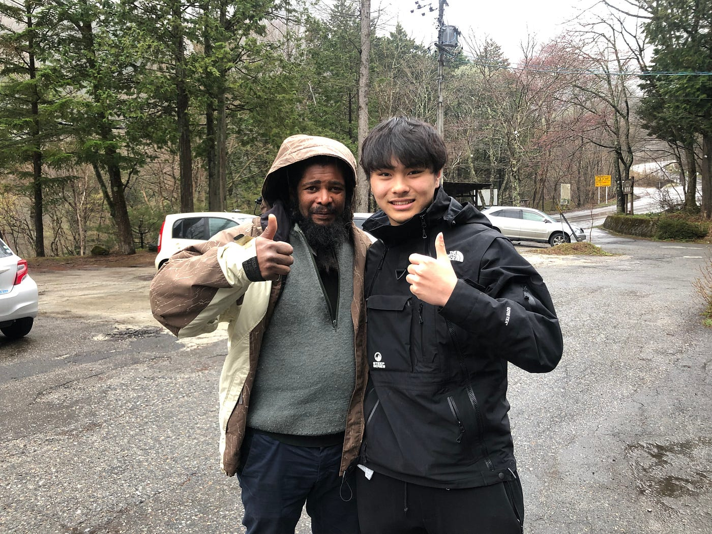

### ゼミ合宿初参戦!!

衝撃的体験！！

2年の日向野邦春です。今回、2年生で古橋ゼミの合宿に参加させていただきました！！今回行ったのは長野県の大町市にある「もりくら」というツリーハウスキャンプ場です。

率直に、、、

**ハード！！**

めちゃくちゃハードな合宿でした。

まず合宿に参加するまでに心配なことが１つありました。それは、、

**先輩はいい人たちなのか！？**

これがすごく心配でした。古橋ゼミの学生の皆さんは志が高い方ばかりで私のような未熟ものが踏み入れてはいけないゼミだと予想してました。 この大きな心配を抱えながら私は家を出発しました。

### 主な持ち物

・テント Naturehike 2人用 このテントは中国ブランドで登山用です。中国ブランドと聞いて買うときは超不安でした。結果としては**最高の使い心地**です。水は1滴も入らず雨にも負けず風にも負けずでした。もう一つの利点は軽いことです。コールマンの2人用は５kgするのに対してNaturehikeはわずか**2kg**です。これからも愛用していこうと思います。

**・寝袋 4シーズン？**

寝袋は兄が持っていたものを借りました。兄からは4シーズン対応と聞いていたのですが、後ほどそれを疑うような出来事があります

**・North Face Gore-Texジャケット**

やはりGore-Texはすごかったです。耐久性にしても耐水性も他の防水規格を寄せ付けないものだと思います。

**・寝袋の下に敷く銀マット**

これは本当に重要です。あると無いとでは眠りの質が大きく変わります。お金に余裕があればエアークッション型の方がいいと思います。

### 1日目

大きな荷物と不安を抱えて信濃大町駅に着きました。正直、先生が迎えに来てくれるかも不安でした。(笑) 私よりも早く先生は駅に迎えに来てくれました。古橋先生と娘さんと三人でキャンプ場に向かいました。すると先生が**「雪って何度で雪になるか知ってる？」**と出題されました。知りませんでした。雪って雲からそのまま落ちてくるんです。雪の状態を保てるのが2度なんです。雨は途中で溶けてるから水になっているそうです。

もりくらに着いてまずテントの設営をしました。**「ただテントを組み立てればいいだけでしょ、、」**と思ったそこのあなた。

**地面整えました？**

そうテントを建てる前にスコップで地面の石や落ち葉を取り除かなければなりません。この作業をすることで最高のテント生活を送れるのです。

テントの設営を終えて一度横になってみました。大きな石は全て取り除いたので寝心地は良かったです。

テントの設営を終えて次は夕食です。１日目はもりくらの他の方々にカレーを作っていただきました。ものすごく美味しかったです。

夕食を終えて１日目は早く寝ることにして、テントに入って兄から借りた4シーズンの寝袋に入って寝ようと、アンダーアーマーの裏起毛インナーとパーカーと冬用ソックスを履いて寝袋にくるまりました。

**睡眠開始から２時間、、**突然、目が覚めました。眠り姫と言われてる僕が途中で起きるのは珍しいことです。原因は、**異常な寒さ**です。この時点でなんとマイナス3度ありました。私の隣にあった先輩のテントもガサガサと物音を立てていました。Discovery channelのサバイバル番組に出演している気分でした。それからは１時間おきに目を覚ましながら何とか眠り続けました。

### ２日目

何とか寒さに耐えて朝の６時を迎えました。このままテントにいるのも退屈だったので起きました。下では火が焚かれていて久しぶりに生きた心地を感じました。

先輩方が次々と起きてきて**「死ぬかと思った」「リタイアも考えた」**などと皆さん私と同じだったようです。それから朝食を頂いて、山菜取りに出かけました。

山菜採りでは食べられる山菜と食べてはいけない山菜の見分け方などを教わりました。私は今まで食べて死ぬのはキノコくらいだと思っていたのですが山菜でも死に至らしめるものもあるそうです。

お昼はその山菜を天ぷらにして山菜うどんでした。私は野菜が結構嫌いなのですが、これは本当に美味しかったです。私的にはフキノトウ一推しです。

そのあとは、念願のドローンを飛ばしました。１機10万円はするドローンだったので木にぶつけないか心配でした。私が一番驚いたのが機体安定性です。今までにラジコンなどは飛ばしたことがあるのですが、それとは比べ物にならない程、機体が安定していました。私もお金を貯めて買おうと思います。

そのあとは夕食を済ませて眠りにつきました。

### 3日目

この日は朝食を青学チームが作ることになったので５時半に起きました。メニューはフレンチトーストです。50人分のフレンチトーストなので卵も25個使いました。少し焦がしてしまいましたが皆さんたくさん食べてくれたので作ったこちらもうれしかったです。

朝食後は道路整備です。これが一番ハードでした。もりくらまでの道は超が付くほどの悪路です。そこを人力のスコップを使って2時間ほどかけて整備しました。やはり人力であってもやるとやらないでは大きく違うようで先生の車で道を通った時は揺れが少なくなっていました。

午後は２日ぶりの風呂です。毎日寒くて凍えそうだったのでお湯に浸かった時は解凍された気分でした。お風呂から出た後には先輩方のゼミ論＆卒論発表に参加させていただきました。私はプログラミングもドローンもまだまだ未熟です。先輩方の発表を聞いて、私も4年生になった時に先輩方のような専門性を持った存在になりたいと思いました。

### 最終日

楽しい思いも寒い思いもした合宿もついに最終日！！この日も50人分のホットケーキを作って、皆さんに「美味しかった」と言っていただきました。やっぱり美味しいと言っていただくとうれしかったです。

### まとめ

今回の合宿で収穫も反省もありました。

反省はもう少し主体的に動いて全ての行動において自己完結できるようにしたかったということです。自分で何か仕事を見つけて行動していくことが他人を助けることにも繋がるし何より、**自分は行動している**と自己肯定することにも繋がると思います。

そして、自然界で生活していく上で「たぶん大丈夫だろう」は致命傷となることに気づき、完璧な防寒や装備をしていくことでやっと普通に生きていけるのだと実感しました。

私は正式なゼミ参加は来年からとなりますが、その前の１年間で古橋ゼミの活動にさらに参加して行きたいと思います。

[朝のハイキング - 日向野 邦春's 4.7 km hike
日向野 邦. completed 4.7 km on Apr 30, 2019.www.strava.com](https://www.strava.com/activities/2330713260?share_sig=51629BB71557812575&utm_medium=social&utm_source=ios_share)

[朝のハイキング - 日向野 邦春's 17.1 km hike
日向野 邦. completed 17.1 km on Apr 29, 2019.www.strava.com](https://www.strava.com/activities/2330713771?share_sig=66C772041557812491&utm_medium=social&utm_source=ios_share)

[https://www.strava.com/activities/2330713654?share_sig=BA16A6B11557813125&utm_medium=social&utm_source=ios_share](https://www.strava.com/activities/2330713654?share_sig=BA16A6B11557813125&utm_medium=social&utm_source=ios_share)
