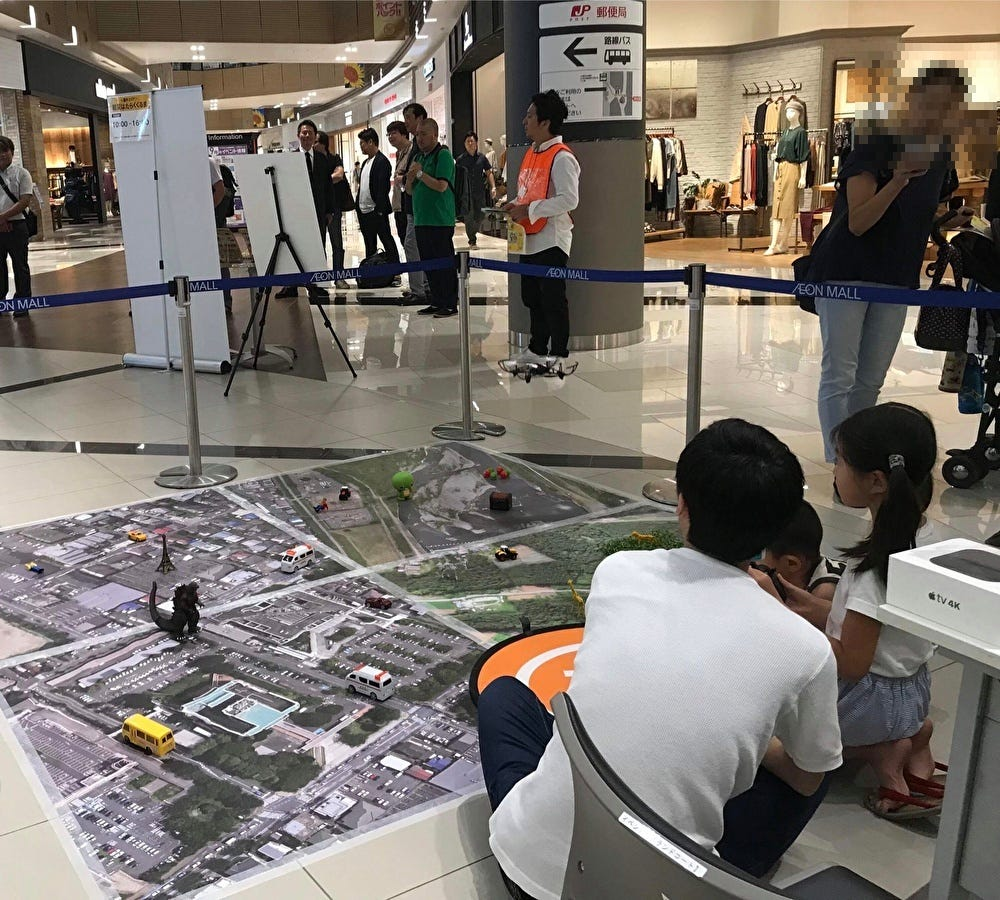

### ゼミ論進捗報告#1

> 始めに…

こんにちは、4年の福王です。今回から、毎週ゼミ論の進捗報告のブログを更新していきます。

第一回は、先日行った研究テーマについて書いていきます。研究テーマと言っても、ざっくりとこんな感じのことを研究してみたいな〜ぐらいの感覚なので、読者の皆さんもさらっと流し読みしてください。

> 研究テーマに関して

ドローンと物流に関して、実験を基に、何をどこにどのように運ぶのか研究していきたいと考えているが現状報告です。これだけでは物足りないので、現在の日本国内のドローンによる物流に関して少し触れておきます。国内のドローンによる物流は、人口が密集していない地域(過疎地・離島など)を中心に、軽量な物から目視外の距離まで自律飛行による配送実験を行うようになりました。参考までに、2019年1月に楽天が秩父市で行ったドローン配送の新聞記事(日本経済新聞)を載せておきます。

[楽天、国内初のドローン配送 19年度中に過疎地で
楽天は25日、ドローンを使った定期配送サービスを2019年度中に過疎地で始めることを明らかにした。消費者がドローンで荷物を受け取れる国内初のサービスになる見込みだ。ドローンを巡っては目が届かない遠隔www.nikkei.com](https://www.nikkei.com/article/DGXMZO40460160V20C19A1000000/)

これまでのドローン配送に関しても、ドローン情報サイト(viva DRONE)にまとめてあるので、載せておきます。

[ドローン配送の事例：日本郵便、Amazon、Googleなどの取り組みを10本の動画で紹介
ドローン配送とは、ドローンの機体に専用のボックスを装着するなどして空路で輸送を行なうことです。離島や山間部、海岸線が入り組んだ場所など陸路での輸送が困難な場所で活用されるほか、医薬品や輸血用の血液を素早く届けるための方法としても期待されてい…viva-drone.com](https://viva-drone.com/delivery-drones/)

> 次回以降について

正直、今のところ研究テーマがあまりに漠然としており、自分の中で具体的に何を研究しようか決まっていません。今後については、他に研究テーマになりそうなものを少し考えたので、次回以降のどこかで触れていけたらなと思っています。 第一回はこの辺りで終わらせていただきます。次回は、マクロな視点から考えるドローンの物流について紹介しょうと思います。
