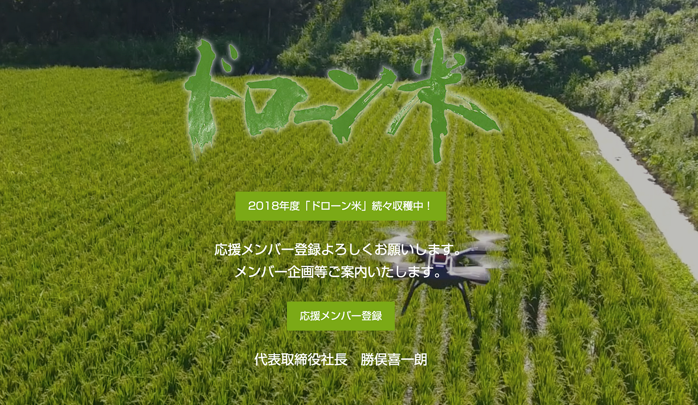

### ゼミ論進捗報告①

こんにちは。

古橋研究室４年の牧利亮です。

突然ですが、最近面白かった出来事を一つ。

先日、隣で新聞を読みながらラーメンを食べている人が、新聞にフーフーしていたのを見て笑ってしましました。

最近は就活やインターン、バイトと色んなことに追われる日常なので、一つ一つ物事をこなして行きたいと思わされました（笑）

それでは、ゼミ論進捗報告を始めます。

先週、ゼミに参加し、テーマの大枠を古橋先生に共有させていただき、いくつか提案をいただいたので、それを元に方針を定めて行きたいとおもます。

> テーマの大枠とその背景

私が、提案させていただいたことは、**農業**についてです。

祖父母が農業をしている関係から、農業の現状とテクノロジーの導入について考える機会がリアルに身近に存在するので、このテーマに取り組んで行きたいと思いました。

> 提案していただいた内容

１.[ドローン米](https://drone-rice.jp/)

ドローン米とは生態系を守り、農薬・化学肥料に頼らない自然調和を心がけた田んぼづくりを**ドローンが「見える化」して お手伝い**し創られるお米のことです。（HPより引用）

古橋先生が、ドローン米の農家の方と繋がりがあるそうなので、研究を兼ねたインターンという形で携わることも可能であるとお聞きしました。

２.[筆ポリゴン](http://www.maff.go.jp/j/tokei/porigon/index.html)

農林水産省が、農地の区画情報を筆ポリゴンと呼び、オープンデータとして提供をしているので、このオープンデータをOSMに反映させるのも、継承性に当てはまるとのことでした。

> 今後の方針

いただいた提案をもとに、具体性を高くしていくこと。また、古橋先生とのコミュニケーションを取りながら進めていくことが大事だなと思いました。

卒論ゼミ論で大事なことは、

・既往研究、先行研究

・新規性

・チャレンジしたこと

・次につながる引き継ぎ事項（継承性）

とあるので、これらに絡めて具体性を高くして行きたいと思います。

今回は以上です。
