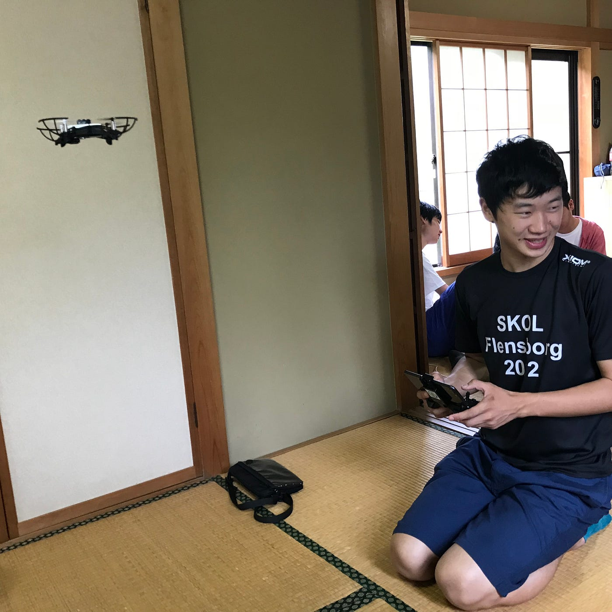

### 卒論ブログ ① ドローン

こんにちは
青山学院大学 古橋研究室４年の増田将馬です。

今回はゼミ論の進捗状況、今後の予定について書いていこうと思います。

まず、進捗状況ですがあまり進んでいません。
就職活動はひと段落しましたが、部活のリーグまで１ヶ月きっており週５で練習をしています。
そのため資格の勉強と部活の両立も難しい状況でなかなか忙しい日々を送っています。
とりあえず今現在行なっている活動としてはドローンの操作技術向上をしています。研究室にあるドローンを使用させてもらいまっすぐ飛ばすだけではなく、上下左右に自分の思い通りに飛ばせるように練習しています。

今後の予定ですが、４つあります。
１つ目にドローンの先行研究をまとめる
２つ目にドローン操作技術の向上
３つ目に外部の方に協力してもらうかもしれないのでドローンのイベントへ積極的に参加する
４つ目に今までのドローン撮影方法とどんな違いにするか決める
です。

まだまだゼミ以外の予定が多くありますが少しづつ頑張ります！
