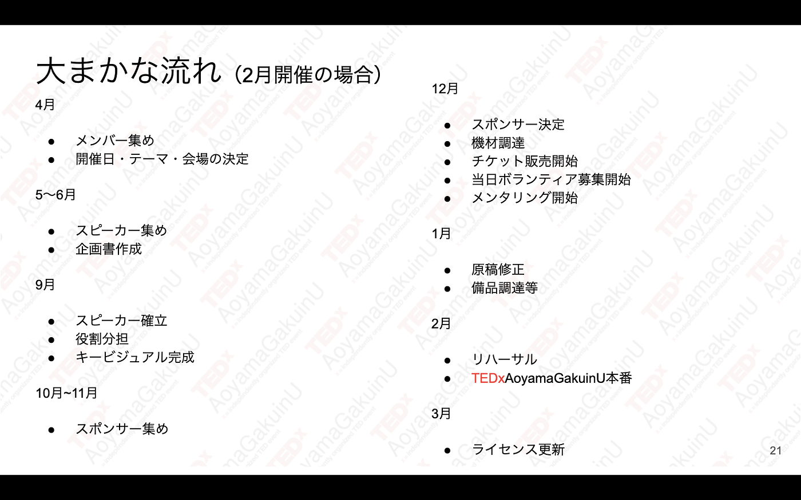
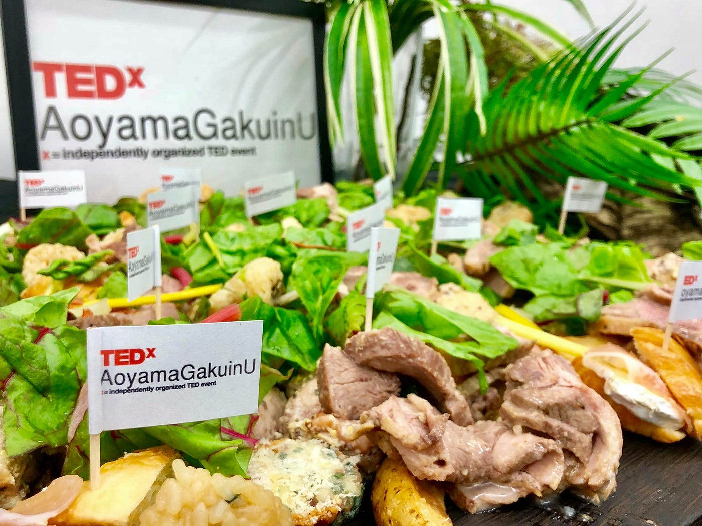

### TEDxイベント開催へのプロセス

どうも、青山学院大学古橋研究室4年の末光香織です。

今回はTEDxイベントを開催するためにどのような準備をしているのかをご紹介します。

### 2019年度のスケジュール

昨年のTEDxAoyamaGakuinUは12月開催でしたが、

今年度は、メンバーの一人が12月まで留学してしまうこともあり、2月中旬の開催を目指すことになりました！

前回は本番3ヶ月前にやるべき仕事が終わっていないものが多すぎたことが原因で、毎日オンラインで話し合ったりパソコンに向き合う日々が続いて大変でした…。

現在1年生メンバーが多いこともあり、その反省を生かして開催までの約10ヶ月間、勉強に支障がない様ゆっくり着実に進めていく予定です。

### 現在の進捗

↑こちらが現在考えている1年の流れになります。

しかし5月の段階でまだテーマが決まっていない！！

すでに遅れが生じております。笑 これから挽回していきます。

#### テーマ決めって難しい泣

昨年私がTEDxAoyamaGakuinUに参加した時はすでにテーマが決まっていたので、0からテーマを決めるのは初めてになります。

今年度最初のミーティングでも「テーマ決めなきゃね。どうしよ〜どうしよ〜。」という意味のない会話で終わってしまうこともありました。笑

スポンサー集めや協力をお願いするのに、自分たちが納得したテーマでなければ熱意が伝わらないと思うので時間をかけてでもしっかり決めたいところです。

今は新入生が入り、フレッシュな意見ももらえるのでなんとか前に進めそうです。

### ゼミ論・卒論の先行研究

論文についても考えなきゃ、ということで

最初にやるべきことは先行研究。

健在私はTEDxTokyoにも微力ではありますが参加させてもらってます。

日本で一番大きいTEDx団体でもあるので、まずは知識を深めるためにも調べていこうかなと思います。

### とりあえず！

現在、就活だったりTEDxの新歓で多くの新入生に会いに行ったり忙しくゼミにも顔出せずすみません。でも自分の将来のために就活に専念させていただきたく存じます。

次回は歴史あるTEDxTokyoについて書いていきます。（仮）
