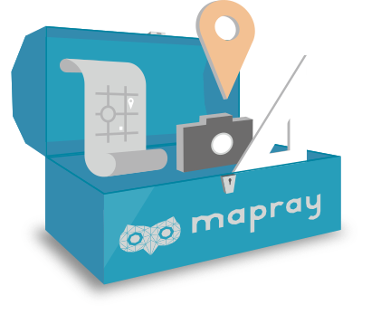
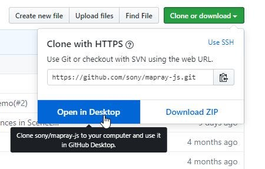
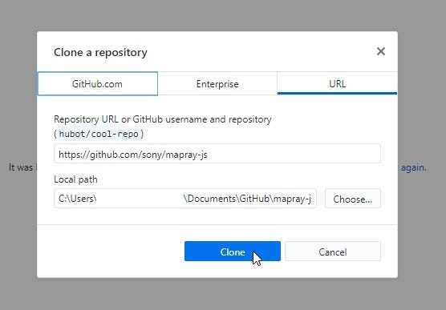
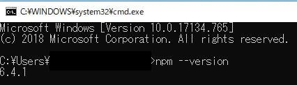
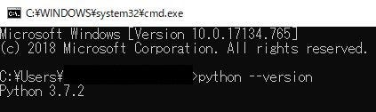

### Maprayを使ってみよう！（前篇）

_ハイクオリティな3Dレンダリングライブラリを使ってみよう！_

### 1.はじめに

みなさまお世話になっております、４年の武末です。おや？卒論レポートじゃないぞ？と思った方、鋭い。そうなんです、違うんです。今回は先日お忙しい中貴重なお時間を頂き、[ソニーネットワークコミュニケーションズ](https://www.sonynetwork.co.jp/)の松本さまとお会いできたということで、今回は！松本様が開発されているMaprayの紹介をしていこうと思います！

松本さまにはこの場で恐縮ですが、もう一度お礼申し上げます。

### 2.そもそもMaprayとは？

[3Dウェブ地図開発者向けクラウドサービス Mapray
ウェブで３D地図アプリを開発可能！クラウドで用意している３D地理空間情報とユーザーのデータを組み合わせてカスタム３Dウェブマップを使ったコンテンツ・アプリを開発できます。mapray.com](https://mapray.com/)

> Mapray(マップレイ)を使えばクラウドで用意している３次元の地理空間情報とユーザーのデータを組み合わせてカスタム３次元ウェブマップを作成できます。オープンソースのJavaScriptライブラリmaprayJSを使ってアプリケーションとして配布したり、ウェブサイトに埋め込んで配信できます。

Maprayとは地図タイル画像を、特殊なエンジンによって三次元化することができる3D地図製作ライブラリのこと。国土地理院地図やBing地図など様々なサービスが提供している画像タイルは勿論、今後は自分がドローンで撮影した写真なども使うことができるようになる予定だ。

同様のライブラリにCesiumというものがあるが、かなり前にリリースされたライブラリということもあり、グラフィック性能がやや低い。更に利用するまでに多くのプロセスが必要で、導入難易度が高い。

[CesiumJS - Geospatial 3D Mapping and Virtual Globe Platform
CesiumJS is an open-source JavaScript library for world-class 3D mapping of geospatial data.cesiumjs.org](https://cesiumjs.org/)

その点Maprayは、データ処理周りをMaprayJSが自動で行ってくれるし、しかもグラフィックも最適化されていて美しい。この辺りは元グラフィック系エンジニアであった松本さんのこだわりの点だそう。確かに手元はくっきりと、遠方はほどよく読み込まれていて非常に見やすい。この点が既存サービスとの差別点だろう。

今回はそんなMaprayの公開サンプルである、nextRamblerを実際に使うところまでを説明していこうと思う。なお、一部のサービスにアルファテスト参加が前提となっている箇所があるため（2019年05月19日現在）その点に関して、方法は紹介するが申請に関しては各自で行っていただきたい。

### 3.Maprayをはじめてみよう！（準備編）

まずは使用環境から。今回はWin環境での説明になるが、基本的に流れはWin、Mac、Linux等で変わらない。ただCUI操作を要求される場面や使用するソフトのリンクもWin版となるため、その点に関しては各自読み替えながら進めていってほしい。

今回はnode.js環境を初めて構築する超、超初心者を対象とした解説になるため、説明に冗長性が感じられた場合はそのまま[公式のリファレンス](https://github.com/sony/mapray-js/blob/master/doc/public/GettingStarted.md)を読み始めてほしい。

それではまず、使用するソフトやライブラリを紹介しよう。

#### ・MaprayJS

[sony/mapray-js
JavaScript library for Interactive high quality 3D globes and maps in the browser - sony/mapray-jsgithub.com](https://github.com/sony/mapray-js)

今回の主役。このファイル構造をそのまま利用したいのでローカルにクローンすることをお勧めする。その際にGitHub Desktopがあるとすごく便利なのでこの機会にインストールしておくとよい。

[GitHub Desktop
Simple collaboration from your desktopdesktop.github.com](https://desktop.github.com/)

#### ・node.js

簡単に言うとサーバー上で計算処理を動的に行ってくれるスクリプト。Maprayはこれを利用して高速かつ軽い処理を実現している。

[Node.js
Node.js® is a JavaScript runtime built on Chrome's V8 JavaScript engine.nodejs.org](https://nodejs.org/ja/)

上記のリンクからダウンロードしてインストールする。今回はLTS版を使用して説明していく。

#### ・Pythonなどサーバーを立てられるクライアントソフト

今回はテスト起動ということでローカルサーバーを建てる。できるソフトは色々あるがPythonが一番わかりやすい（独自調べ）ので今回はPythin3.72を使って解説していく。

[Pythonのインストール方法をOS別にわかりやすく解説！ | 侍エンジニア塾ブログ（Samurai Blog） - プログラミング入門者向けサイト
Pythonを自分のPCにインストールしたいけどどうやったらいいの？ と疑問を持たれている方もいるのではないでしょうか？言語を本格的に学ぶためには環境を構築する必要があります。…www.sejuku.net](https://www.sejuku.net/blog/33294)

まだPythonのインストールもしてない・・・という方は上記のサイトが非常にわかりやすくまとまっているので参考にされたし。

以上が使用するソフト、ライブラリだ。ほんとに簡単、かつ基本的な環境なので準備できていなかった方はこの機会にそろえてしまおう。

### 4.Maprayの準備をしよう（確認編）

さて、上記の説明がすべて終わっているとこうなっているはずだ。

#### 1.ローカル上にMaprayJSのクローン環境ができている。

[sony/mapray-js
JavaScript library for Interactive high quality 3D globes and maps in the browser - sony/mapray-jsgithub.com](https://github.com/sony/mapray-js)

上記リンクより、右上のClone or downloadから以下のように操作。

これでマイドキュメント下、GitHubフォルダにクローンが作成される（既存設定の場合）

#### 2.Node.jsがインストールされている

今回使うのはnode.jsのパッケージ管理ツールであるnpm。node.jsがきちんとインストールされていれば一緒にインストールされている。cmdで、上記のコマンドを実行すればバージョンが表示されるはずだ。

#### 3.Pythonが実行可能環境になっている

同じくcmdで、上記のコマンドを実行してバージョン表示が行われることを確認する。すでに構築されてる方で、2.x系を使用されてる方は後述するがローカルサーバーのコマンドが変わるので注意。

以上の確認が無事済んだら、さっそく動かしていこう。

### 5.Maprayサービスを触ってみよう！（実践編）

さてここからは本格的なMaprayサービスの紹介に入っていく。

・・・とここまででかなり長くなってしまったのでここでいったん区切りを入れていきたい。ここからは実際にMaprayのサービスを動かしていくが、前述したとおりMapray cloudへの登録が必要になる。現在クローズドアルファテスト中なので、使用する方はぜひ、お問い合わせフォームから参加申請して頂きたい。

[お問い合わせの入力 | Mapray お問い合わせフォーム
Edit descriptionwebform.secure.force.com](https://webform.secure.force.com/form/mapray1)

後半へ続く。

[Maprayを使ってみよう！（後編）
使ってみてわかる、高い技術力。medium.com](https://medium.com/furuhashilab/mapray%E3%82%92%E4%BD%BF%E3%81%A3%E3%81%A6%E3%81%BF%E3%82%88%E3%81%86-%E5%BE%8C%E7%B7%A8-ed2a76371b1b)
